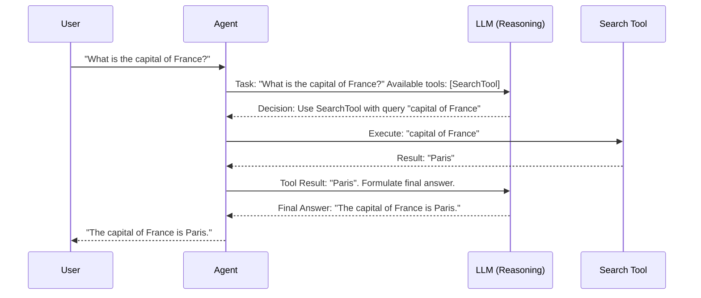

# Chapter 1: Agent

Welcome to the AIQToolkit! This toolkit is designed to help you build powerful AI applications. We'll start our journey by understanding one of the most fundamental concepts: the **Agent**.

## What's an Agent and Why Do We Need One?

Imagine you want to build a smart assistant. Not just one that can tell you the time, but one that can answer complex questions like, "What's the weather like in Paris right now, and can you suggest some good outdoor activities there if it's sunny?"

A simple program might struggle with this. It needs to:
1.  Figure out you're asking about "Paris".
2.  Find a way to get the current weather for Paris.
3.  Understand what "sunny" means.
4.  If it's sunny, find outdoor activities in Paris.
5.  Combine all this information into a helpful answer.

This is where an `Agent` comes in! An `Agent` is like the **intelligent orchestrator** or the "brain" of your AI application. It's the component that figures out the steps needed to complete a task and then takes action.

Think of an `Agent` as a resourceful detective.
*   **The Task:** The detective is given a case to solve (e.g., "Who stole the cookies?").
*   **Reasoning:** The detective thinks about the case, analyzes clues, and decides what to do next. This reasoning is often powered by a Large Language Model (LLM), which you'll learn more about in [Chapter 3: LLM/Embedder Client & Provider](03_llm_embedder_client___provider_.md).
*   **Tools:** The detective has a set of tools and experts they can consult. For example, they might use a magnifying glass (a tool to examine clues) or consult a forensics expert (another kind of tool). In AIQToolkit, these are called [Function / Tool](02_function___tool_.md)s.
*   **Workflow:** The detective operates within a general procedure or [Workflow](04_workflow_.md) for solving cases.

So, an `Agent` is responsible for:
1.  Understanding the given task.
2.  Breaking it down into smaller, manageable steps (if needed).
3.  Deciding which [Function / Tool](02_function___tool_.md)s to use for each step.
4.  Using those tools.
5.  Putting the results together to accomplish the overall task.

## How Does an Agent Work? A Simple Example

Let's go back to our Paris example: "What's the weather like in Paris right now, and can you suggest some good outdoor activities there if it's sunny?"

Here's how an `Agent` might handle this:

1.  **Agent receives the task:** "What's the weather like in Paris right now, and can you suggest some good outdoor activities there if it's sunny?"
2.  **Agent's reasoning (using an LLM):** "Okay, this is a two-part question. First, I need the weather in Paris. Then, if it's sunny, I need to suggest activities."
3.  **Agent decides to use a tool:** "I have a 'get_weather' [Function / Tool](02_function___tool_.md). I should use that for 'Paris'."
4.  **Agent uses the tool:** Calls `get_weather(city="Paris")`.
5.  **Tool returns information:** The `get_weather` tool might return: "Sunny, 22°C".
6.  **Agent's reasoning:** "Great, the weather is 'Sunny, 22°C'. Since it's sunny, I need to find outdoor activities."
7.  **Agent decides to use another tool:** "I have a 'find_activities' [Function / Tool](02_function___tool_.md). I should use that for 'Paris' with the category 'outdoor'."
8.  **Agent uses the tool:** Calls `find_activities(city="Paris", category="outdoor")`.
9.  **Tool returns information:** The `find_activities` tool might return: "Visit the Eiffel Tower, Stroll along the Seine, Picnic at Luxembourg Gardens."
10. **Agent's reasoning:** "I have all the pieces."
11. **Agent formulates the final answer:** "The weather in Paris is sunny and 22°C. Some good outdoor activities would be visiting the Eiffel Tower, strolling along the Seine, or having a picnic at Luxembourg Gardens."

This step-by-step process of thinking, deciding, and acting is what makes an `Agent` so powerful!

## Under the Hood: A Glimpse into an Agent's Mind

Let's visualize the flow of information with a simple diagram. Imagine you ask the `Agent` to find the capital of France.



In this diagram:
*   The **User** gives a task.
*   The **Agent** (our orchestrator) receives it.
*   The **Agent** consults an **LLM** (its brain) to decide what to do. The LLM knows what [Function / Tool](02_function___tool_.md)s are available.
*   Based on the LLM's decision, the **Agent** uses a **Search Tool**.
*   The tool returns information to the **Agent**.
*   The **Agent** might consult the **LLM** again to formulate a nice, human-readable answer.
*   Finally, the **Agent** gives the answer back to the **User**.

### Core Building Block: `BaseAgent`

In AIQToolkit, all specific types of agents are built upon a fundamental class called `BaseAgent`. You can find its definition in `src/aiq/agent/base.py`.

```python
# File: src/aiq/agent/base.py
# This is a simplified view of BaseAgent

from abc import ABC, abstractmethod
# ... other imports ...
from langchain_core.language_models import BaseChatModel # Represents the LLM
from langchain_core.tools import BaseTool # Represents a tool

class BaseAgent(ABC):
    def __init__(self,
                 llm: BaseChatModel,         # The LLM for reasoning
                 tools: list[BaseTool],      # List of available tools
                 # ... other parameters ...
                ):
        self.llm = llm
        self.tools = tools
        self.graph = None # This will hold the agent's operational logic
        # ... more initialization ...

    @abstractmethod
    async def _build_graph(self, state_schema) -> CompiledGraph:
        # Each specific agent type must define how it structures its "thinking" process
        pass
```
This `BaseAgent` class ensures that every agent we create will have:
*   An `llm`: This is the [LLM/Embedder Client & Provider](03_llm_embedder_client___provider_.md) that provides the reasoning capability.
*   `tools`: A list of [Function / Tool](02_function___tool_.md)s that the agent can use.
*   A `_build_graph` method: This is where the specific logic of how an agent operates (its internal [Workflow](04_workflow_.md)) is defined. We'll touch on LangGraph (which uses these graphs) later, but for now, think of it as the agent's internal plan or flowchart.

### Types of Agents in AIQToolkit

AIQToolkit comes with several pre-built agent types, each with a slightly different way of thinking and operating. You don't usually create a `BaseAgent` directly. Instead, you'll use one of these specialized agents. Some examples include:

*   **`ToolCallAgentGraph`**: This agent is designed to work well with newer LLMs that have built-in "tool calling" features. The LLM itself can suggest which tool to use and what inputs to give it.
*   **`ReActAgentGraph`**: This agent follows a "Reason-Act" cycle. It reasons about the problem, decides on an action (like using a tool), takes the action, observes the result, and then reasons again.
*   **`ReWOOAgentGraph`**: This agent uses a Planner-Executor-Solver model. A "Planner" decides the steps and tools, an "Executor" runs the tools, and a "Solver" puts it all together.

Let's peek at a snippet from `ToolCallAgentGraph` (found in `src/aiq/agent/tool_calling_agent/agent.py`):

```python
# File: src/aiq/agent/tool_calling_agent/agent.py (Simplified)
# ... other imports ...
from aiq.agent.base import DualNodeAgent # A specialized base agent
from langgraph.prebuilt import ToolNode # Helps in calling tools

class ToolCallAgentGraph(DualNodeAgent):
    def __init__(self,
                 llm: BaseChatModel,
                 tools: list[BaseTool],
                 # ... other parameters ...
                ):
        super().__init__(llm=llm, tools=tools, ...) # Initialize the base parts
        self.tool_caller = ToolNode(tools) # Sets up how tools are called
        # ...
```
This `ToolCallAgentGraph` takes an `llm` and `tools`, just like the `BaseAgent`. It then sets up a `tool_caller` to manage how it interacts with its [Function / Tool](02_function___tool_.md)s.

Inside these agent classes, you'll often find methods that define different stages of its operation, like:
*   `agent_node`: A step where the agent uses the LLM to think or decide.
*   `tool_node`: A step where the agent executes a chosen tool.
*   `conditional_edge`: A step where the agent decides what to do next based on the current situation (e.g., "Should I use another tool or am I done?").

Here's a tiny look at how `ToolCallAgentGraph` might decide its next move:
```python
# File: src/aiq/agent/tool_calling_agent/agent.py (Simplified conditional_edge)
from aiq.agent.base import AgentDecision

class ToolCallAgentGraph(DualNodeAgent):
    # ... (init and other methods) ...

    async def conditional_edge(self, state: ToolCallAgentGraphState):
        # Get the last message from the LLM
        last_message = state.messages[-1]

        if last_message.tool_calls:
            # If the LLM said to use a tool
            return AgentDecision.TOOL # Decision: Call a tool
        else:
            # Otherwise, the LLM probably has the final answer
            return AgentDecision.END # Decision: We're finished
```
This `conditional_edge` function checks the LLM's last output. If the LLM specified `tool_calls`, the agent knows it needs to use a [Function / Tool](02_function___tool_.md). Otherwise, it assumes it's time to provide the final answer.

Finally, `AIQToolkit` needs to know about all these different agent types. This is handled in `src/aiq/agent/register.py`:

```python
# File: src/aiq/agent/register.py

# Import the registration functions for different agent types
from .react_agent import register as react_agent
from .reasoning_agent import reasoning_agent # Another type
from .rewoo_agent import register as rewoo_agent
from .tool_calling_agent import register as tool_calling_agent

# When AIQToolkit starts, it can use these imported functions
# to make these agent types available for use in your applications.
```
This file essentially creates a catalog of available agents, so when you configure your AI application using an [AIQ Configuration (`AIQConfig`)](05_aiq_configuration___aiqconfig__.md), the toolkit can find and set up the specific agent you've chosen.

## Conclusion

You've now taken your first step into understanding `Agent`s in AIQToolkit! You've learned that an `Agent` is the intelligent orchestrator that:
*   Receives a task.
*   Uses reasoning (often an LLM) to make decisions.
*   Selects and utilizes available [Function / Tool](02_function___tool_.md)s.
*   Works within a [Workflow](04_workflow_.md) to achieve the task's goal.

Agents are the heart of making your AI applications dynamic and capable of solving complex problems. They are the "brains" that connect thought to action.

In the next chapter, we'll dive deeper into the "tools of the trade" for our detective agent. We'll explore [Chapter 2: Function / Tool](02_function___tool_.md), which are the specific capabilities an Agent can use to interact with the world and gather information.

---

Generated by [AI Codebase Knowledge Builder](https://github.com/The-Pocket/Tutorial-Codebase-Knowledge)