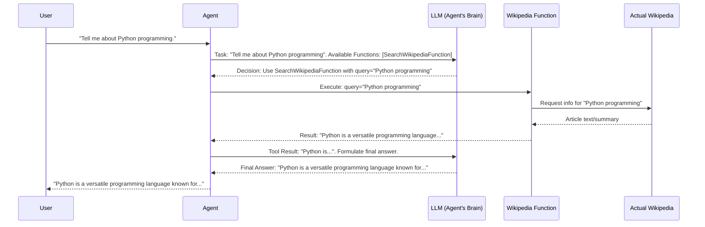

# Chapter 2: Function / Tool

Welcome back! In [Chapter 1: Agent](01_agent_.md), we learned that an `Agent` is like an intelligent orchestrator or detective that figures out how to accomplish a task. But how does this detective actually *do* things? If it needs to look something up on Wikipedia or get the current weather, what does it use? That's where `Function`s (often called `Tool`s) come in!

## What's a Function/Tool and Why Do We Need It?

Imagine our `Agent` is like a very smart manager on an assembly line. This manager knows what needs to be built (the task), but they don't screw in the bolts or paint the parts themselves. Instead, they have a team of specialized robots.
*   One robot is an expert at welding.
*   Another is an expert at tightening screws.
*   A third is an expert at painting.

Each of these robots has a **specific, well-defined skill**. In AIQToolkit, these specialized "robots" are called `Function`s or `Tool`s.

A `Function` in AIQToolkit represents a **specific, reusable skill or tool** that an [Agent](01_agent_.md) can utilize.
*   Want to search Wikipedia? There's a `Function` for that.
*   Need to call a specific company API to get product prices? That's another `Function`.
*   Have to perform a complex mathematical calculation? You guessed it – a `Function`!

These `Function`s are the fundamental building blocks that enable an [Agent](01_agent_.md) to interact with the external world (like websites or databases) or process information in a specific way.

A key characteristic of a `Function` is that it has **clearly defined inputs and outputs**.
*   **Input:** What information does the `Function` need to do its job? (e.g., a "Search Wikipedia" function needs a `search_query` as input).
*   **Output:** What information does the `Function` produce after doing its job? (e.g., the "Search Wikipedia" function outputs the `search_results`).

This clarity is crucial because it allows the [Agent](01_agent_.md) to know exactly how to use a `Function` and what to expect back. These `Function`s are then used within a [Workflow](04_workflow_.md), which we'll discuss in a later chapter.

## How an Agent Uses a Function: A Simple Example

Let's revisit the Paris weather example from [Chapter 1: Agent](01_agent_.md). The [Agent](01_agent_.md) needed to get the weather for Paris.

1.  **Agent's thought:** "I need the current weather for Paris."
2.  **Agent identifies a tool:** "Aha! I have a `get_weather` `Function` available."
3.  **Agent prepares input:** "The `get_weather` `Function` needs a `city_name`. I'll use 'Paris'."
4.  **Agent calls the `Function`:** `get_weather(city_name="Paris")`
5.  **`Function` does its work:** (Internally, this function might call an actual weather API).
6.  **`Function` returns output:** The `Function` might return: `"Sunny, 22°C"`.
7.  **Agent receives output:** The `Agent` now has the weather information and can continue its task.

Conceptually, in your code, this might look very simple (though the actual AIQToolkit setup involves a bit more to make it robust):

```python
# This is a simplified, conceptual view!
# Imagine 'agent' is our AIQToolkit Agent
# And 'get_weather_tool' is an AIQToolkit Function

city_to_check = "Paris"

# Agent decides to use the get_weather_tool
# It knows the tool needs a 'city' input
weather_result = agent.call_tool(get_weather_tool, city=city_to_check)

# weather_result might be something like: "Sunny, 22°C"
print(f"The weather in {city_to_check} is: {weather_result}")
```
This snippet shows the core idea: the `Agent` uses a `Function` (or `Tool`) by providing the necessary input and gets a result back.

## Under the Hood: How Functions Work

When an [Agent](01_agent_.md) decides to use a `Function`, a few things happen:

1.  **Identification:** The [Agent](01_agent_.md) (often guided by an [LLM/Embedder Client & Provider](03_llm_embedder_client___provider_.md)) identifies which `Function` is appropriate for the current step.
2.  **Input Preparation:** The [Agent](01_agent_.md) structures the necessary input data for that `Function`.
3.  **Execution:** The [Agent](01_agent_.md) "calls" or "invokes" the `Function` with the prepared input.
4.  **Internal Logic:** The `Function` executes its specific code. This might involve:
    *   Calling an external API (e.g., a weather service, a search engine).
    *   Accessing a database.
    *   Performing calculations.
    *   Manipulating text.
5.  **Output Generation:** The `Function` produces an output.
6.  **Return to Agent:** The output is returned to the [Agent](01_agent_.md), which then uses this information to decide the next step or formulate a final answer.

Let's visualize this with a sequence diagram for an `Agent` using a hypothetical `SearchWikipediaFunction`:


In this diagram, the `SearchWikipediaFunction` is the specialized tool. The `Agent` decides to use it, gives it the search query, and gets back the information.

### Defining Functions in AIQToolkit

AIQToolkit provides building blocks to create and register your own functions.

**1. Function Configuration (`FunctionBaseConfig`)**

Often, your functions might need some configuration (like an API key or a specific URL). AIQToolkit uses Pydantic models for configuration. The base for this is `FunctionBaseConfig`.

```python
# File: src/aiq/data_models/function.py (Simplified)
from aiq.data_models.common import TypedBaseModel, BaseModelRegistryTag

class FunctionBaseConfig(TypedBaseModel, BaseModelRegistryTag):
    # This class itself is often empty, acting as a placeholder.
    # Specific functions will create their own configs inheriting from this.
    pass

class EmptyFunctionConfig(FunctionBaseConfig, name="EmptyFunctionConfig"):
    # A config for functions that don't need any special parameters.
    pass
```
If you had a weather function needing an API key, you might define:
```python
# Your custom config for a weather function
class MyWeatherFunctionConfig(FunctionBaseConfig, name="MyWeatherFunctionConfig"):
    api_key: str
    default_units: str = "celsius"
```
This `MyWeatherFunctionConfig` tells AIQToolkit that your weather function expects an `api_key` and has an optional `default_units`.

**2. The `Function` Class (`FunctionBase` and `Function`)**

The core logic of your tool is often implemented in a class that inherits from `Function` (which itself builds upon `FunctionBase`). These classes handle input/output types and the actual execution.

```python
# File: src/aiq/builder/function.py (Highly Simplified Concept)
from aiq.builder.function_base import FunctionBase, InputT, SingleOutputT
from aiq.data_models.function import FunctionBaseConfig
from pydantic import BaseModel # Used for defining input/output structures

# Define what our function expects as input
class CityInput(BaseModel):
    city_name: str

# Define what our function will output
class WeatherOutput(BaseModel):
    forecast: str

class MySimpleWeatherTool(FunctionBase[CityInput, WeatherOutput, WeatherOutput]):
    # InputT is CityInput, StreamingOutputT is WeatherOutput, SingleOutputT is WeatherOutput

    def __init__(self, config: FunctionBaseConfig): # Takes a config
        super().__init__(input_schema=CityInput, single_output_schema=WeatherOutput)
        # self.config = config # Store config if needed

    async def _ainvoke(self, value: CityInput) -> WeatherOutput:
        # This is where your function's main logic goes for a single response
        # 'value' will be an instance of CityInput
        city = value.city_name
        # --- Pretend API call ---
        if city.lower() == "london":
            return WeatherOutput(forecast="Cloudy, 15°C")
        elif city.lower() == "paris":
            return WeatherOutput(forecast="Sunny, 22°C")
        else:
            return WeatherOutput(forecast="Weather data not available.")
```
*   `InputT`, `StreamingOutputT`, `SingleOutputT`: These are generic type hints. `InputT` is the type of input the function expects. `SingleOutputT` is for functions that return a single, complete response. `StreamingOutputT` is for functions that might yield multiple pieces of an answer over time (like a live news feed). For many simple tools, `StreamingOutputT` and `SingleOutputT` might be the same.
*   `_ainvoke`: This asynchronous method is where you put the core logic for a function that returns a single result. It receives the input (already validated against `input_schema`) and should return the output (which will be validated against `single_output_schema`).
*   `input_schema` and `single_output_schema`: These tell AIQToolkit (and other developers, and even LLMs!) what kind of data your function expects and produces. They are typically Pydantic models.

**3. Lambda Functions: Simpler Tools from Python Functions**

For very simple tools, you don't always need to write a full class. AIQToolkit can often wrap a regular Python asynchronous function into a `Function` using `LambdaFunction` and `FunctionInfo`.

`FunctionInfo` (from `src/aiq/builder/function_info.py`) helps AIQToolkit understand your Python function's arguments and return types.

```python
# A simple Python async function
async def add_numbers(a: int, b: int) -> int:
    """Adds two numbers together."""
    print(f"Function called: Adding {a} and {b}")
    return a + b

# How AIQToolkit might turn this into a usable tool (conceptual):
# (In practice, this is often handled by a builder or registration process)

from aiq.builder.function_info import FunctionInfo
from aiq.builder.function import LambdaFunction
from aiq.data_models.function import EmptyFunctionConfig # For functions with no special config

# 1. Create FunctionInfo: AIQToolkit introspects 'add_numbers'
#    to understand its inputs (a: int, b: int) and output (int).
#    It also figures out the Pydantic schemas for these.
info = FunctionInfo.from_fn(add_numbers, description="A simple adder tool.")

# 2. Create a LambdaFunction instance:
#    We need a basic configuration, giving our function a 'type' name.
config = EmptyFunctionConfig(type="my_company/my_tools/adder_v1")
adder_tool = LambdaFunction.from_info(config=config, info=info)

# Now 'adder_tool' is an AIQToolkit Function!
# An Agent could call it:
# result_output = await adder_tool.ainvoke(value={"a": 5, "b": 7})
# print(result_output.value) # Pydantic models often wrap the raw value
```
In the example above:
1.  `FunctionInfo.from_fn(add_numbers, ...)` analyzes `add_numbers`. It figures out that `a` and `b` are inputs and that the function returns an `int`. It will automatically create Pydantic schemas like `InputArgsSchema(BaseModel): a: int; b: int` and an output schema for the integer.
2.  `LambdaFunction.from_info(...)` then uses this `FunctionInfo` to create a fully-fledged AIQToolkit `Function` that can be used by an [Agent](01_agent_.md).
3.  When `adder_tool.ainvoke(value={"a": 5, "b": 7})` is called, AIQToolkit uses the input schema to understand that `{"a": 5, "b": 7}` should be passed as `a=5, b=7` to the original `add_numbers` function. The result (`12`) is then wrapped according to the output schema.

**4. Registering Your Function**

For AIQToolkit to know about your custom function (whether it's a class or a `LambdaFunction`), it needs to be "registered." This is often done using a decorator like `@register_function` from `src/aiq/cli/register_workflow.py`.

```python
# File: src/aiq/cli/register_workflow.py (Conceptual Snippet)
from aiq.data_models.function import FunctionConfigT # For function configurations
# ... other imports ...

# The decorator that makes your function known to AIQToolkit
def register_function(config_type: type[FunctionConfigT], ...):
    def register_function_inner(build_fn): # build_fn is a function that creates your tool
        # ... logic to add this function to a global registry ...
        # GlobalTypeRegistry.get().register_function(...)
        print(f"Function with config {config_type} registered!")
        return build_fn
    return register_function_inner

# --- Example of how you might use it in your project ---
# from aiq.data_models.function import EmptyFunctionConfig

# @register_function(config_type=EmptyFunctionConfig)
# async def build_my_adder_tool(config: EmptyFunctionConfig):
#     """This function 'builds' and yields our adder tool."""
#     info = FunctionInfo.from_fn(add_numbers, description="A simple adder tool.")
#     # Give it a unique type name in the config
#     config.type = "my_adder_tool_unique_name"
#     yield LambdaFunction.from_info(config=config, info=info)
```
When AIQToolkit starts, it looks for these registered functions. The `build_fn` (like `build_my_adder_tool` above) is responsible for creating an instance of your function, often using its specific configuration. This registration process is key to making your tool discoverable and usable within the larger AIQToolkit ecosystem, especially when configuring complex applications using an [AIQ Configuration (`AIQConfig`)](05_aiq_configuration___aiqconfig__.md).

AIQToolkit also comes with a set of pre-built tools. You can see many of them being registered in files like `src/aiq/tool/register.py`. This file imports various tool modules (e.g., for searching documents, interacting with GitHub), and those modules typically use the `register_function` mechanism.

## Conclusion

You've now learned about `Function`s / `Tool`s in AIQToolkit! These are the workhorses that allow an [Agent](01_agent_.md) to perform specific actions.
Key takeaways:
*   **Specific Skills:** Each `Function` has a single, well-defined purpose.
*   **Defined Inputs/Outputs:** They take specific inputs and produce predictable outputs, often defined using Pydantic schemas.
*   **Building Blocks:** They are essential components of an [Agent's](01_agent_.md) capabilities and are used within a [Workflow](04_workflow_.md).
*   **Implementation:** You can create them by subclassing `Function` or by letting AIQToolkit wrap your simple Python async functions using `LambdaFunction` and `FunctionInfo`.
*   **Registration:** They need to be registered so AIQToolkit can find and use them.

An [Agent](01_agent_.md) is smart, but its `Function`s give it power. The `Agent` decides *what* to do, and the `Function`s are *how* it gets done.

But how does the `Agent` make those smart decisions about which `Function` to use and when? That's often the job of a Large Language Model (LLM). In our next chapter, we'll explore [Chapter 3: LLM/Embedder Client & Provider](03_llm_embedder_client___provider_.md) to understand how these powerful models integrate into AIQToolkit.

---

Generated by [AI Codebase Knowledge Builder](https://github.com/The-Pocket/Tutorial-Codebase-Knowledge)