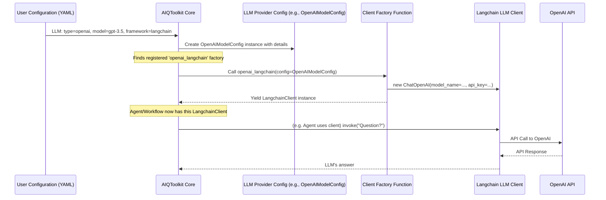

# Chapter 3: LLM/Embedder Client & Provider

In the previous chapters, we met the [Agent](01_agent_.md), our intelligent orchestrator, and the [Function / Tool](02_function___tool_.md)s it uses to get things done. But a critical piece is missing: how does the `Agent` "think"? How does it understand language and make decisions? And when dealing with lots of text (like in a document search), how does it grasp the *meaning* of that text? This is where Large Language Models (LLMs) and Embedding Models come in, and AIQToolkit has a clever way to manage them using **Clients and Providers**.

## The "Brain" and the "Translator": Why We Need LLMs and Embedders

Imagine our [Agent](01_agent_.md) is trying to answer the question: "Summarize the main points of the latest company earnings report and tell me if the sentiment is positive."

To do this, the `Agent` needs:
1.  **A "Brain" (LLM):** Something to read the report, understand the language, extract key points, and determine the sentiment. This is the job of a **Large Language Model (LLM)**. LLMs are complex AI models trained on vast amounts of text, capable of understanding, generating, and reasoning about human language.
2.  **A "Meaning Translator" (Embedder - sometimes):** If the earnings report was one of many documents, and we first needed to find the *most relevant* report, we'd use an **Embedding Model**. These models turn text into a list of numbers (called an "embedding" or "vector") that captures its semantic meaning. Similar texts will have similar embeddings. This is super useful for search and retrieval.

The world of LLMs and embedding models is diverse. There's OpenAI's GPT series, NVIDIA's NIMs (NVIDIA Inference Microservices), models from Hugging Face, Anthropic's Claude, and many more. Each might have different ways to connect to them (APIs) and different strengths.

**The Problem:** How can we build applications with AIQToolkit that can easily use *any* of these models without rewriting our core logic every time we want to switch? What if we prefer using a specific AI framework like Langchain for one task and LlamaIndex for another, but want them to use the same underlying LLM?

**The Solution: The Client & Provider Abstraction**

AIQToolkit solves this with a smart separation:
*   **Providers:** These are like **configuration blueprints** for a specific model service. They define *what* model you want to use (e.g., "gpt-3.5-turbo" from OpenAI, or a specific NVIDIA NIM) and the details needed to connect to it (like API keys, server addresses, model parameters like `temperature`).
*   **Clients:** These are the **actual workers** that take a Provider's configuration and make the calls to the model. Clients are often specific to an AI framework (like Langchain or LlamaIndex). For example, you might have a Langchain client that knows how to talk to an OpenAI model using the details from an `OpenAIModelConfig` (a Provider).

This two-part system makes AIQToolkit incredibly flexible and "framework-agnostic."

## Breaking it Down: Provider and Client

Let's look at these two parts more closely.

### 1. Providers: The Configuration Blueprints

Think of a `Provider` as a detailed order form for a specific AI model service. It doesn't *do* the work itself, but it tells the `Client` everything it needs to know.

**For LLMs:**
An LLM Provider configuration (like `OpenAIModelConfig` or `NIMModelConfig`) will specify:
*   The type of service (e.g., "openai", "nim").
*   The specific model name (e.g., "gpt-4", "meta/llama3-8b-instruct").
*   Connection details (e.g., API key, base URL for the service).
*   Model parameters (e.g., `temperature` for creativity, `max_tokens` for response length).

Here's a conceptual look at what an `OpenAIModelConfig` might hold (you'd typically define this in a YAML configuration file for AIQToolkit):

```yaml
# This is how you might specify an OpenAI LLM Provider in a config file
llm:
  type: openai         # Tells AIQToolkit to use the OpenAI provider
  model_name: gpt-3.5-turbo
  api_key: "sk-your_secret_openai_api_key_here" # Your secret key
  temperature: 0.1
```
This YAML tells AIQToolkit: "I want to use an OpenAI LLM, specifically `gpt-3.5-turbo`, here's my API key, and please use a temperature of 0.1."

**For Embedders:**
Similarly, an Embedder Provider configuration (like `OpenAIEmbedderModelConfig` or `NIMEmbedderModelConfig`) will specify:
*   The type of embedding service.
*   The specific embedding model name (e.g., "text-embedding-ada-002").
*   Connection details.

```yaml
# Conceptual YAML for an NVIDIA NIM Embedder Provider
embedder:
  type: nim            # Tells AIQToolkit to use the NIM provider
  model_name: "nvidia/nv-embed-qa-e5-v5" # Example NIM embedding model
  base_url: "https://integrate.api.nvidia.com/v1" # Example NIM endpoint
  api_key: "nvapi-your_nvidia_api_key_here"
```

These `Provider` configurations are Python classes in AIQToolkit, typically inheriting from `LLMBaseConfig` (from `src/aiq/data_models/llm.py`) or `EmbedderBaseConfig` (from `src/aiq/data_models/embedder.py`).

```python
# File: src/aiq/data_models/llm.py (Simplified)
from .common import TypedBaseModel, BaseModelRegistryTag

class LLMBaseConfig(TypedBaseModel, BaseModelRegistryTag):
    # Base class for all LLM provider configurations.
    # Specific providers will add their fields here.
    pass
```
This `LLMBaseConfig` is a foundation. Real configurations like `OpenAIModelConfig` add the specific fields they need.

```python
# File: src/aiq/llm/openai_llm.py (Simplified OpenAIModelConfig)
from aiq.data_models.llm import LLMBaseConfig
from pydantic import Field

class OpenAIModelConfig(LLMBaseConfig, name="openai"): # "openai" is key!
    api_key: str | None = Field(default=None)
    model_name: str = Field(description="The OpenAI hosted model name.")
    temperature: float = Field(default=0.0)
    # ... other fields like base_url, top_p, etc.
```
Notice `name="openai"`? This string is how AIQToolkit matches the `type: openai` from your YAML config to this specific Python class.

### 2. Clients: The Workers

If the `Provider` is the recipe, the `Client` is the chef. The `Client` takes the `Provider`'s configuration and actually interacts with the LLM or embedding service.

Crucially, `Client`s are often tied to a specific AI framework.
*   You might have a **Langchain Client** that uses an `OpenAIModelConfig` to make calls to OpenAI's API using Langchain's methods.
*   You might have a **LlamaIndex Client** that uses the *same* `OpenAIModelConfig` but interacts with OpenAI using LlamaIndex's methods.

This allows you to use your preferred AI framework while still benefiting from AIQToolkit's consistent configuration management.

**Example:** Let's say our [Agent](01_agent_.md) needs to ask an LLM a question.
1.  **You define a Provider:** In your [AIQ Configuration (`AIQConfig`)](05_aiq_configuration___aiqconfig__.md) (often a YAML file), you specify you want to use an OpenAI LLM:
    ```yaml
    llm:
      type: openai
      model_name: "gpt-3.5-turbo"
      api_key: "YOUR_API_KEY"
      # You also specify which framework's client to use (e.g. Langchain)
      framework: langchain # This tells AIQToolkit to find a Langchain client
    ```

2.  **AIQToolkit sets up:**
    *   It sees `type: openai` and creates an `OpenAIModelConfig` instance, filling it with `model_name` and `api_key`.
    *   It sees `framework: langchain` and looks for a registered Langchain client that can work with `OpenAIModelConfig`.

3.  **The Client is created:** AIQToolkit finds a function (like `openai_langchain` in `packages/aiqtoolkit_langchain/src/aiq/plugins/langchain/llm.py`) that knows how to create a Langchain `ChatOpenAI` object using the `OpenAIModelConfig`.

    ```python
    # File: packages/aiqtoolkit_langchain/src/aiq/plugins/langchain/llm.py (Simplified)
    # ... imports ...
    from aiq.llm.openai_llm import OpenAIModelConfig
    from langchain_openai import ChatOpenAI # Langchain's OpenAI client

    # This function is registered with AIQToolkit
    # It says: "If you have an OpenAIModelConfig and need a Langchain client, use me!"
    # @register_llm_client(config_type=OpenAIModelConfig, wrapper_type=LLMFrameworkEnum.LANGCHAIN)
    async def openai_langchain(llm_config: OpenAIModelConfig, builder: Builder):
        # Creates the actual Langchain client object
        langchain_chat_client = ChatOpenAI(
            model_name=llm_config.model_name,
            api_key=llm_config.api_key,
            temperature=llm_config.temperature
            # ... other parameters from llm_config ...
        )
        yield langchain_chat_client # Provides the client to AIQToolkit
    ```

4.  **Interaction:** Your [Agent](01_agent_.md) (which is likely built using Langchain components in this case) can now use this `langchain_chat_client` to talk to the LLM.
    ```python
    # Conceptual use within an Agent that has the client
    # agent_llm_client = # ... (this would be the langchain_chat_client from above)
    # response = await agent_llm_client.ainvoke("What is the capital of France?")
    # print(response.content) # Might output: "The capital of France is Paris."
    ```

The beauty is, if you wanted to switch to an NVIDIA NIM LLM using Langchain:
1.  Change your YAML:
    ```yaml
    llm:
      type: nim  # Changed from openai
      model_name: "meta/llama3-8b-instruct" # Changed model
      api_key: "YOUR_NIM_API_KEY"
      framework: langchain # Still Langchain
    ```
2.  AIQToolkit would then:
    *   Create a `NIMModelConfig`.
    *   Find a registered Langchain client for `NIMModelConfig` (like `nim_langchain` in the same `llm.py` file).
    *   Your [Agent](01_agent_.md)'s code that uses the LLM client doesn't need to change, as it's still interacting with a standard Langchain LLM object!

## Under the Hood: How It All Connects

Let's visualize the setup process when you tell AIQToolkit you want to use, for instance, an OpenAI LLM with a Langchain client.



**Key Registration Steps:**

1.  **Provider Registration:**
    Each specific provider configuration (like `OpenAIModelConfig` or `NIMEmbedderModelConfig`) is made known to AIQToolkit. This happens via functions decorated with `@register_llm_provider` or `@register_embedder_provider`.

    ```python
    # File: src/aiq/llm/openai_llm.py (Simplified)
    from aiq.cli.register_workflow import register_llm_provider
    from aiq.builder.llm import LLMProviderInfo
    # class OpenAIModelConfig defined earlier...

    @register_llm_provider(config_type=OpenAIModelConfig) # Tells AIQ about OpenAIModelConfig
    async def openai_llm_provider_builder(config: OpenAIModelConfig, builder: Builder):
        # This function just confirms and describes the provider.
        # The actual client creation happens in the client factory.
        yield LLMProviderInfo(config=config, description="OpenAI model provider.")
    ```
    This registration tells AIQToolkit: "Hey, there's something called `OpenAIModelConfig`, and it's for LLMs. If a user specifies `type: openai` in their LLM config, this is the class to use for its settings."
    The `LLMProviderInfo` (from `src/aiq/builder/llm.py`) is a small wrapper holding the configuration and description. A similar `EmbedderProviderInfo` (from `src/aiq/builder/embedder.py`) exists for embedders.

2.  **Client Registration:**
    Similarly, functions that know how to create framework-specific clients are registered using `@register_llm_client` or `@register_embedder_client`.

    ```python
    # File: packages/aiqtoolkit_langchain/src/aiq/plugins/langchain/llm.py (Simplified)
    from aiq.cli.register_workflow import register_llm_client
    from aiq.builder.framework_enum import LLMFrameworkEnum
    from aiq.llm.openai_llm import OpenAIModelConfig # The provider config
    from langchain_openai import ChatOpenAI # The Langchain-specific client

    @register_llm_client(config_type=OpenAIModelConfig, wrapper_type=LLMFrameworkEnum.LANGCHAIN)
    async def openai_langchain_client_builder(llm_config: OpenAIModelConfig, builder: Builder):
        # This function *creates* the Langchain client instance
        client = ChatOpenAI(**llm_config.model_dump(exclude={"type"}, by_alias=True))
        yield client
    ```
    This tells AIQToolkit: "If you have an `OpenAIModelConfig` and the user wants a `LANGCHAIN` framework client, call *this* function (`openai_langchain_client_builder`) to get the actual client object."

The same pattern applies to embedders:
*   `NIMEmbedderModelConfig` in `src/aiq/embedder/nim_embedder.py` defines settings for NIM embedders.
*   `@register_embedder_provider` makes this configuration known.
*   `@register_embedder_client` in `src/aiq/embedder/langchain_client.py` (for Langchain) or other framework-specific files registers functions to create embedder clients (e.g., `NVIDIAEmbeddings` for Langchain, `NVIDIAEmbedding` for LlamaIndex).

This registration mechanism, managed by AIQToolkit's [Type Registry (`GlobalTypeRegistry`)](10_type_registry___globaltyperegistry__.md) (which we'll explore later), is what allows the system to dynamically find and connect the right pieces based on your high-level [AIQ Configuration (`AIQConfig`)](05_aiq_configuration___aiqconfig__.md).

## Conclusion

The LLM/Embedder Client & Provider abstraction is a cornerstone of AIQToolkit's flexibility. It allows you to:
*   **Easily switch LLM/Embedder backends:** Move from OpenAI to NVIDIA NIM to a local model by simply changing your configuration, not your core application code.
*   **Use different AI frameworks:** Employ Langchain, LlamaIndex, or other supported frameworks seamlessly, letting AIQToolkit handle the creation of the appropriate client for your chosen model provider.
*   **Keep configurations clean:** Define your model connections and parameters in a structured way.

By separating the "what and how to connect" (Provider) from the "actual doing the work with a specific framework" (Client), AIQToolkit empowers you to build robust and adaptable AI applications. These LLMs and Embedders, configured through Clients and Providers, form the reasoning and understanding capabilities that your [Agent](01_agent_.md)s will leverage within a defined [Workflow](04_workflow_.md).

Next, we'll explore how all these components—Agents, Functions, and LLMs—come together to perform complex tasks in [Chapter 4: Workflow](04_workflow_.md).

---

Generated by [AI Codebase Knowledge Builder](https://github.com/The-Pocket/Tutorial-Codebase-Knowledge)