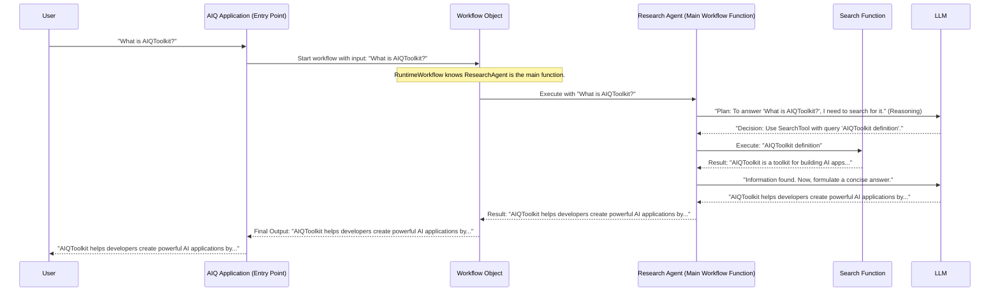

# Chapter 4: Workflow

Welcome back! In [Chapter 3: LLM/Embedder Client & Provider](03_llm_embedder_client___provider_.md), we learned how AIQToolkit manages the "brains" (LLMs) and "meaning translators" (Embedders) that our AI applications use. Now, how do we put all these pieces – Agents, Functions, LLMs – together to accomplish a complete task? We need a plan, a recipe, or an itinerary. In AIQToolkit, this is called a **Workflow**.

## What's a Workflow? The Big Picture Plan

Imagine you're planning a complicated trip. Your itinerary might look like this:
1.  **Goal:** Travel from City A to City C.
2.  **Step 1:** Take a taxi (Tool 1) from your home to the airport in City A.
3.  **Step 2:** Fly (Tool 2) from City A to City B.
4.  **Step 3:** Take a train (Tool 3) from City B to City C.
5.  **Step 4:** Check into your hotel (Tool 4) in City C.

This detailed itinerary, outlining the sequence of operations, decisions, and resources (tools) to be used, is exactly what a **Workflow** is in AIQToolkit.

A `Workflow` defines the **overall plan or sequence of operations** an AI application performs to achieve a goal. It's like the master script for your AI. This script is primarily composed by linking together various [Function / Tool](02_function___tool_.md) components. Remember, an [Agent](01_agent_.md) itself can be a powerful type of [Function / Tool](02_function___tool_.md) that has its own internal decision-making logic.

For example, if you're building a customer support bot:
*   **Goal:** Answer customer questions accurately.
*   **Workflow might be:**
    1.  Receive customer's question (this is the input to the workflow).
    2.  Use an [Agent](01_agent_.md) (which is a specialized [Function / Tool](02_function___tool_.md)) to understand the question.
    3.  The [Agent](01_agent_.md) might use a `search_faq` [Function / Tool](02_function___tool_.md) if it's a common question.
    4.  Or, the [Agent](01_agent_.md) might use an `escalate_to_human` [Function / Tool](02_function___tool_.md) if the question is too complex.
    5.  Finally, the [Agent](01_agent_.md) (and thus the workflow) provides an answer or confirmation.

The main workflow for your entire application is typically specified in the [AIQ Configuration (`AIQConfig`)](05_aiq_configuration___aiqconfig__.md), which we'll cover in the next chapter. This means you define one primary [Function / Tool](02_function___tool_.md) (which could be an [Agent](01_agent_.md) or a custom function you create) as the starting point and main logic of your application.

## How an AIQToolkit Application Uses a Workflow

Think of your AIQToolkit application as having one main "entry point" or "main function." This is your primary workflow.

Let's consider a very simple AI application: a "Greeting Bot."
1.  The bot receives a user's name as input.
2.  It uses a [Function / Tool](02_function___tool_.md) called `generate_greeting` that takes the name and creates a personalized greeting message using an [LLM/Embedder Client & Provider](03_llm_embedder_client___provider_.md).
3.  It outputs the greeting.

Here, the `generate_greeting` function *is* the main workflow.

In AIQToolkit:
1.  You define `generate_greeting` (perhaps as a Python function that AIQToolkit turns into a [Function / Tool](02_function___tool_.md), or as a more complex [Agent](01_agent_.md)).
2.  You tell AIQToolkit (in the [AIQ Configuration (`AIQConfig`)](05_aiq_configuration___aiqconfig__.md)) that `generate_greeting` is your main `workflow` function.
3.  When your application runs and receives a name (e.g., "Alex"), AIQToolkit invokes your `generate_greeting` function with "Alex".
4.  `generate_greeting` does its job (maybe calls an LLM to be creative) and returns "Hello Alex! So glad to see you today!"
5.  This result is the final output of your application's run.

The key idea is that the "workflow" isn't just an abstract concept; it's tied to a specific [Function / Tool](02_function___tool_.md) that acts as the main orchestrator for your application's logic. This orchestrator can, of course, call other [Function / Tool](02_function___tool_.md)s, including other [Agent](01_agent_.md)s.

## Under the Hood: The `Workflow` Object in Action

When your AIQToolkit application starts, it sets up a special `Workflow` object. This object is like the conductor of an orchestra. It knows what the main piece of music is (your main workflow function) and has access to all the musicians (other [Function / Tool](02_function___tool_.md)s, [LLM/Embedder Client & Provider](03_llm_embedder_client___provider_.md)s, etc.).

Let's trace a request for a slightly more complex application, perhaps a simple research assistant:



In this diagram:
*   The **User** makes a request.
*   The **AIQ Application** (your running program) receives it.
*   The **Workflow Object** is the AIQToolkit component that manages the overall execution. It's configured with your main workflow function (in this case, `ResearchAgent`).
*   The `ResearchAgent` (which is a [Function / Tool](02_function___tool_.md), and likely an [Agent](01_agent_.md)) executes its logic, using other tools like `SearchTool` and an `LLM`.
*   The final result is passed back up the chain.

## Diving into the Code: How Workflows are Defined and Run

Let's see how this looks in AIQToolkit's structure.

**1. `AIQConfig`: Specifying Your Main Workflow**

As mentioned, the main plan for your application is defined in the [AIQ Configuration (`AIQConfig`)](05_aiq_configuration___aiqconfig__.md). This configuration object has a specific field for your workflow.

```python
# File: src/aiq/data_models/config.py (Simplified)
from aiq.data_models.common import HashableBaseModel
from aiq.data_models.function import FunctionBaseConfig, EmptyFunctionConfig
# ... other imports for LLMBaseConfig, EmbedderBaseConfig etc. ...

class AIQConfig(HashableBaseModel):
    # ... general settings, functions, llms, embedders ...
    functions: dict[str, FunctionBaseConfig] = {}
    llms: dict[str, LLMBaseConfig] = {}
    # ...

    # This is where you define your application's main plan!
    workflow: FunctionBaseConfig = EmptyFunctionConfig() # Defaults to an empty plan

    # ... eval settings ...
```
The `workflow: FunctionBaseConfig` line is key. `FunctionBaseConfig` is the base configuration class for *any* [Function / Tool](02_function___tool_.md). So, you'll provide the configuration for *your chosen main function* here. This main function could be a complex [Agent](01_agent_.md) or a simpler custom Python function that AIQToolkit wraps.

For example, if you have an agent called `MyResearchAgent` that needs an LLM named `my_llm`, its configuration in your YAML might point to this:
```yaml
# In your main config.yaml (conceptually)
llms:
  my_llm:
    type: openai
    model_name: gpt-3.5-turbo
    # ... api_key etc ...

functions:
  # Configurations for other tools your agent might use
  search_tool:
    type: web_search_tool
    # ... any config for search_tool ...

workflow: # This is AIQConfig.workflow
  type: MyResearchAgentConfig # The type of your main agent/function
  llm_name: "my_llm"          # Parameter for MyResearchAgent
  available_tools: ["search_tool"] # Another parameter
```
AIQToolkit will read this and know that the function configured under `workflow` is the main entry point.

**2. The `Workflow` Class: The Runtime Orchestrator**

AIQToolkit has a Python class named `Workflow` that takes your main function and manages its execution.

```python
# File: src/aiq/builder/workflow.py (Simplified)
from aiq.builder.function_base import FunctionBase, InputT, SingleOutputT, StreamingOutputT
from aiq.builder.function import Function # Represents a usable function instance
from aiq.data_models.config import AIQConfig
# ... other imports ...

class Workflow(FunctionBase[InputT, StreamingOutputT, SingleOutputT]):
    def __init__(self,
                 *,
                 config: AIQConfig, # The full application configuration
                 entry_fn: Function[InputT, StreamingOutputT, SingleOutputT], # Your main function!
                 functions: dict[str, Function] | None = None, # All other available functions
                 llms: dict # ... and llms, embedders etc.
                 # ...
                ):
        # A Workflow itself behaves like a Function
        super().__init__(input_schema=entry_fn.input_schema,
                         streaming_output_schema=entry_fn.streaming_output_schema,
                         single_output_schema=entry_fn.single_output_schema)
        
        self.config = config
        self._entry_fn = entry_fn # This is your main application logic
        self.functions = functions or {} # Access to other tools
        # ... stores llms, embedders ...

    async def run(self, message: InputT):
        # When the workflow runs, it primarily invokes the _entry_fn
        # (Simplified representation of AIQRunner usage)
        # It sets up context and then calls:
        # result = await self._entry_fn.ainvoke(message)
        # ...
        # For a more complete picture, it uses AIQRunner:
        # async with AIQRunner(input_message=message, entry_fn=self._entry_fn, ...) as runner:
        #    yield runner # Allowing getting result or result_stream
        pass # Actual implementation involves AIQRunner
```
Key things to note:
*   `Workflow` inherits from `FunctionBase`: This means a `Workflow` object itself *is* a type of [Function / Tool](02_function___tool_.md). It has defined inputs and outputs, determined by its `_entry_fn`.
*   `_entry_fn`: This is the actual [Function / Tool](02_function___tool_.md) instance (e.g., your `ResearchAgent`) that you specified in the `AIQConfig`'s `workflow` section. The `Workflow` object wraps around it.
*   `run()`: This method (or similar invocation methods) is what executes your `_entry_fn` with the given input, managing the context and making all other configured components (other functions, LLMs) available to it.

**3. `WorkflowBuilder`: Assembling the Workflow**

How does this `Workflow` object get created with your specific `_entry_fn`? That's the job of the `WorkflowBuilder`.

```python
# File: src/aiq/builder/workflow_builder.py (Simplified)
from aiq.data_models.config import AIQConfig
from aiq.data_models.function import FunctionBaseConfig
from aiq.builder.function import Function
from aiq.builder.workflow import Workflow # The class we just saw

class WorkflowBuilder:
    def __init__(self, ...):
        self._workflow_function_instance: Function | None = None # To store the built entry_fn
        self._functions: dict[str, Function] = {} # Stores all other functions
        # ... stores llms, embedders configurations etc. ...
        self._full_aiq_config: AIQConfig | None = None

    async def _build_function(self, name: str, config: FunctionBaseConfig) -> Function:
        # Simplified: This method takes a function's config,
        # finds its builder/constructor, and returns the function instance.
        # ...
        pass

    async def set_workflow(self, config: FunctionBaseConfig) -> Function:
        # 'config' here is the FunctionBaseConfig from AIQConfig.workflow
        # It builds the actual function object that will be our main workflow logic
        built_workflow_function = await self._build_function(name="<workflow_entry>", config=config)
        self._workflow_function_instance = built_workflow_function
        return built_workflow_function

    async def populate_builder(self, config: AIQConfig):
        # This method is called with your entire application's AIQConfig
        self._full_aiq_config = config
        
        # 1. Build all regular functions defined in config.functions
        for name, func_config in config.functions.items():
            self._functions[name] = await self._build_function(name, func_config)
            
        # 2. Build LLMs, Embedders, etc. (simplified)
        # ...
            
        # 3. Specifically set up the main workflow function
        if config.workflow: # config.workflow is a FunctionBaseConfig
            await self.set_workflow(config.workflow)

    def build(self) -> Workflow:
        if self._workflow_function_instance is None:
            raise ValueError("Main workflow function not set. Did you configure AIQConfig.workflow?")
        
        # Create the runtime Workflow object
        workflow_obj = Workflow.from_entry_fn(
            config=self._full_aiq_config,
            entry_fn=self._workflow_function_instance, # Pass the main function here!
            functions=self._functions, # Pass all other available functions
            # ... pass llms, embedders, etc. ...
        )
        return workflow_obj
```
Here's the flow:
1.  You provide an [AIQ Configuration (`AIQConfig`)](05_aiq_configuration___aiqconfig__.md).
2.  The `WorkflowBuilder`'s `populate_builder` method reads this config.
    *   It iterates through all defined `functions`, `llms`, `embedders`, etc., and prepares them.
    *   Crucially, it calls `set_workflow` using the configuration found in `AIQConfig.workflow`. This builds/retrieves the specific [Function / Tool](02_function___tool_.md) instance that will serve as your application's main logic (your `_entry_fn`).
3.  Finally, `WorkflowBuilder.build()` creates the `Workflow` object, injecting the `_entry_fn` (your main workflow function) and all other necessary components into it.

This `Workflow` object is then what your application uses to process incoming requests.

## Conclusion

You've now seen that a **Workflow** in AIQToolkit is the grand plan for your AI application. It's:
*   A **sequence of operations**, often involving multiple [Function / Tool](02_function___tool_.md)s (which can include intelligent [Agent](01_agent_.md)s).
*   Defined by a **main entry function** (your primary application logic).
*   This main entry function's configuration is specified in the `workflow` section of your [AIQ Configuration (`AIQConfig`)](05_aiq_configuration___aiqconfig__.md).
*   At runtime, an AIQToolkit `Workflow` object (created by `WorkflowBuilder`) orchestrates the execution of this main entry function, providing it with all necessary resources.

Essentially, the `Workflow` concept ties everything together, turning your collection of configured components into a runnable, goal-oriented AI application.

In the next chapter, we'll dive deep into the heart of your application's setup: [Chapter 5: AIQ Configuration (`AIQConfig`)](05_aiq_configuration___aiqconfig__.md). You'll learn how to write the configuration files that define your workflow, functions, LLMs, and all other aspects of your AIQToolkit application.

---

Generated by [AI Codebase Knowledge Builder](https://github.com/The-Pocket/Tutorial-Codebase-Knowledge)