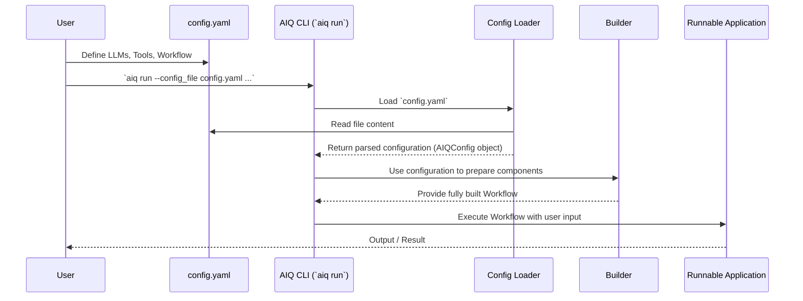

# Chapter 5: AIQ Configuration (`AIQConfig`)

In [Chapter 4: Workflow](04_workflow_.md), we saw how an AIQToolkit application follows a master plan, or `Workflow`, to get things done. But how do we actually tell AIQToolkit what that plan is? How do we specify which [LLM/Embedder Client & Provider](03_llm_embedder_client___provider_.md) to use as the "brain," which [Function / Tool](02_function___tool_.md)s our [Agent](01_agent_.md) should have, and how the main [Workflow](04_workflow_.md) should operate?

This is where the **AIQ Configuration (`AIQConfig`)** comes in. It's the master blueprint for any AIQToolkit application!

## What is `AIQConfig` and Why Do We Need It?

Imagine you're a chef about to cook a complex dish. You wouldn't just start throwing ingredients together, would you? You'd have a detailed recipe! This recipe would list:
*   **Ingredients:** What you need (e.g., 1 large language model, 2 specific tools, a connection to a database).
*   **Instructions:** How to combine them and in what order (e.g., the main steps of your application's logic).
*   **Special Notes:** Any specific settings for your ingredients or steps (e.g., the "temperature" setting for your LLM, or the API key for a tool).

The `AIQConfig` is precisely this recipe book for your AIQToolkit application. It's typically defined in a **YAML file** (a human-readable text format) and tells the toolkit *exactly* how everything should connect and operate.

**Why is this so important?**
1.  **Clarity:** It gives you a single place to see and understand the entire structure of your AI application.
2.  **Reproducibility:** If you share your `AIQConfig` file with someone else, they can set up the exact same application.
3.  **Easy Modification:** Want to try a different LLM? Or add a new tool? You can often just change a few lines in the YAML file without rewriting your core Python code.

Let's say we want to build a simple "Document Q&A Bot". This bot needs:
*   An LLM to understand questions and generate answers.
*   A tool to search through a collection of documents.
*   An agent to orchestrate the process: get the question, use the tool, use the LLM to answer.

The `AIQConfig` is where we'd define all of these components and how they fit together.

## The Anatomy of an `AIQConfig` YAML File

An `AIQConfig` file is usually named something like `config.yaml` or `workflow.yaml`. It's structured with different sections (top-level keys in YAML) that define various parts of your application.

Here are the most common sections you'll encounter:

*   `llms`: Defines the Large Language Models your application will use. (See [Chapter 3: LLM/Embedder Client & Provider](03_llm_embedder_client___provider_.md))
*   `embedders`: Defines any embedding models for tasks like semantic search. (Also in [Chapter 3: LLM/Embedder Client & Provider](03_llm_embedder_client___provider_.md))
*   `functions`: Defines the [Function / Tool](02_function___tool_.md)s that your agents or workflow can use.
*   `workflow`: Defines the main [Workflow](04_workflow_.md) or entry point of your application. This is often an [Agent](01_agent_.md).
*   `general`: Contains general application settings (like which user interface to use).
*   `eval`: Contains settings for evaluating your application's performance (See [Chapter 8: Profiler & Evaluator](08_profiler___evaluator_.md)).

Let's look at a simplified example of what a `config.yaml` for our "Document Q&A Bot" might look like.

```yaml
# This is a simplified example config.yaml

# Section for defining LLMs
llms:
  my_main_llm: # You give your LLM a name, e.g., "my_main_llm"
    _type: nim # Specifies the type of LLM provider (e.g., NVIDIA NIM)
    model_name: meta/llama-3.1-8b-instruct # The specific model to use
    # api_key: "YOUR_NIM_API_KEY" # Often set as an environment variable

# Section for defining Functions/Tools
functions:
  document_search_tool: # You give your tool a name
    _type: my_custom_doc_search # Specifies the type of tool
    # Parameters specific to this tool:
    knowledge_base_path: "./my_documents"

# Section defining the main Workflow
workflow:
  _type: react_agent # Use a ReAct Agent as the main workflow logic
  llm_name: "my_main_llm" # Tell the agent to use the LLM defined above
  tool_names: ["document_search_tool"] # Give the agent access to the tool defined above
  verbose: true # Make the agent tell us what it's thinking
```

Let's break this down:

1.  **`llms` section:**
    *   We define an LLM named `my_main_llm`.
    *   `_type: nim` tells AIQToolkit to use its NVIDIA NIM provider.
    *   `model_name: meta/llama-3.1-8b-instruct` specifies the exact model.
    *   API keys are often handled via environment variables for security, but can sometimes be specified here.

2.  **`functions` section:**
    *   We define a tool named `document_search_tool`.
    *   `_type: my_custom_doc_search` would be a unique identifier for a custom tool you (or AIQToolkit) have registered. (We'll see how tools are made in more detail later, but for now, imagine it's a pre-built tool type).
    *   `knowledge_base_path: "./my_documents"` is a setting specific to this search tool, telling it where to find the documents.

3.  **`workflow` section:**
    *   This is the heart of our application's logic.
    *   `_type: react_agent` tells AIQToolkit to use one of its built-in [Agent](01_agent_.md) types, the "ReAct" agent (which stands for Reason+Act).
    *   `llm_name: "my_main_llm"` connects this agent to the LLM we defined in the `llms` section.
    *   `tool_names: ["document_search_tool"]` gives this agent access to the tool we defined in the `functions` section.
    *   `verbose: true` is a setting for the `react_agent` to make it print out its thought process.

The `_type` field is very important! It's how AIQToolkit knows which specific implementation (e.g., which LLM provider, which agent type, which tool logic) to load for that component.

## How AIQToolkit Uses Your `AIQConfig`

So you've written your `config.yaml`. What happens next?

1.  **You tell AIQToolkit to run:** You'll typically use a command like `aiq run --config_file config.yaml --input "What is AIQToolkit?"`.
2.  **AIQToolkit loads the config:** The first thing AIQToolkit does is read and parse your `config.yaml` file.
3.  **Components are built:** Using the information in your `config.yaml`, AIQToolkit, with the help of a [Builder (`WorkflowBuilder`, `EvalBuilder`)](06_builder___workflowbuilder____evalbuilder__.md) (which we'll cover in the next chapter), starts creating and connecting all the necessary pieces:
    *   It sets up the `my_main_llm` based on the `nim` provider and `meta/llama-3.1-8b-instruct` model.
    *   It sets up the `document_search_tool`.
    *   It creates the `react_agent`, giving it the configured LLM and tool.
4.  **The workflow runs:** The fully assembled `react_agent` (which is our main `workflow`) is then executed with your input (e.g., "What is AIQToolkit?").

Here’s a simplified diagram showing this flow:



## Under the Hood: The `AIQConfig` Python Class

Internally, when AIQToolkit reads your YAML file, it converts it into a Python object. This object is an instance of a class called `AIQConfig`, which is defined using Pydantic (a data validation library).

Let's peek at a very simplified version of what the `AIQConfig` class might look like in Python:

```python
# File: src/aiq/data_models/config.py (Highly Simplified)
from pydantic import BaseModel
# Import base configurations for LLMs, Functions, etc.
from aiq.data_models.llm import LLMBaseConfig
from aiq.data_models.function import FunctionBaseConfig, EmptyFunctionConfig

class AIQConfig(BaseModel): # Using Pydantic's BaseModel
    # These fields correspond to the top-level keys in your YAML
    
    # A dictionary to hold LLM configurations
    # The key is the name you give (e.g., "my_main_llm")
    # The value is an object holding that LLM's settings
    llms: dict[str, LLMBaseConfig] = {} 

    # A dictionary for function/tool configurations
    functions: dict[str, FunctionBaseConfig] = {}

    # The configuration for your main workflow
    # This will be an object holding your workflow's settings
    workflow: FunctionBaseConfig = EmptyFunctionConfig() # Defaults to an empty workflow

    # ... other sections like embedders, general, eval ...

    # This method tells Pydantic that other fields beyond these are not allowed,
    # helping catch typos in your YAML.
    # model_config = ConfigDict(extra="forbid")
```
*   Each top-level key in your YAML (like `llms`, `functions`, `workflow`) corresponds to an attribute in this `AIQConfig` class.
*   `LLMBaseConfig` and `FunctionBaseConfig` are base classes for specific LLM and function configurations. When you write `_type: nim` in your YAML under an LLM definition, AIQToolkit uses this `_type` to know that the settings for that LLM should be validated against a more specific class like `NIMModelConfig` (which inherits from `LLMBaseConfig`). The [Type Registry (`GlobalTypeRegistry`)](10_type_registry___globaltyperegistry__.md) plays a crucial role here, which we'll explore in a later chapter.

The process of loading your YAML into this `AIQConfig` object happens in a function called `load_config` found in `src/aiq/runtime/loader.py`:

```python
# File: src/aiq/runtime/loader.py (Simplified Concept)
from aiq.data_models.config import AIQConfig
from aiq.utils.io.yaml_tools import yaml_load # Helper to read YAML
from aiq.utils.data_models.schema_validator import validate_schema # Validates against AIQConfig

def load_config(config_file_path: str) -> AIQConfig:
    # 1. Discover and register all available plugins (tools, LLMs, etc.)
    # This makes sure AIQToolkit knows about all possible '_type' values.
    # discover_and_register_plugins(...) 

    # 2. Load the raw YAML content from the file
    raw_yaml_data = yaml_load(config_file_path)

    # 3. Validate and convert the raw data into an AIQConfig Python object
    # This step checks if your YAML structure is correct and if all
    # '_type' values are recognized.
    aiq_config_object = validate_schema(raw_yaml_data, AIQConfig)
    
    return aiq_config_object
```
This `load_config` function is the gateway. It reads your YAML, ensures it's valid, and transforms it into the structured `AIQConfig` Python object that the rest of AIQToolkit can then use to build your application.

## Benefits of Using `AIQConfig`

Using an `AIQConfig` file offers several advantages, especially for beginners:

*   **No Need to Recompile Code for Configuration Changes:** Want to try a different LLM model? Just change `model_name` in your YAML. Want to adjust the `temperature` (creativity) of your LLM? Add it to the LLM's configuration in the YAML. You don't need to dig into Python code for many common adjustments.
*   **Easy to Share and Version Control:** Since it's a simple text file, you can easily share your `config.yaml` with teammates or save different versions of your application's setup using tools like Git.
*   **Separation of Concerns:** Your Python code can focus on the *logic* of custom tools or agents, while the `AIQConfig` handles the *assembly and configuration* of these pieces.
*   **Discoverability:** By looking at the `AIQConfig`, anyone can quickly understand the main components of your AI application and how they are intended to work together.

## Conclusion

The `AIQConfig` is your application's master blueprint, typically written in a YAML file. It's where you define all the "ingredients" (like [LLM/Embedder Client & Provider](03_llm_embedder_client___provider_.md)s and [Function / Tool](02_function___tool_.md)s) and the main "recipe" (your [Workflow](04_workflow_.md), often an [Agent](01_agent_.md)). This approach makes your AIQToolkit applications reproducible, easy to modify, and clear to understand.

By simply changing this configuration file, you can often swap out LLMs, add or remove tools, or tweak parameters without needing to change your underlying Python code.

Now that we know *how* to specify the blueprint of our application using `AIQConfig`, how does AIQToolkit actually take this blueprint and bring the application to life? That's the job of the builders! In the next chapter, we'll explore [Chapter 6: Builder (`WorkflowBuilder`, `EvalBuilder`)](06_builder___workflowbuilder____evalbuilder__.md) to see how these components read your `AIQConfig` and construct your running application.

---

Generated by [AI Codebase Knowledge Builder](https://github.com/The-Pocket/Tutorial-Codebase-Knowledge)