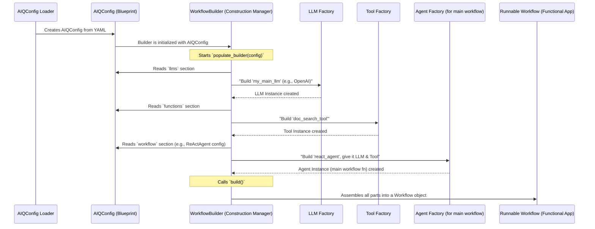

# Chapter 6: Builder (`WorkflowBuilder`, `EvalBuilder`)

In [Chapter 5: AIQ Configuration (`AIQConfig`)](05_aiq_configuration___aiqconfig__.md), we learned how to create a detailed blueprint (`AIQConfig`) for our AI application using a YAML file. This blueprint lists all the parts we need—like [LLM/Embedder Client & Provider](03_llm_embedder_client___provider__.md)s, [Function / Tool](02_function___tool__.md)s, and the main [Workflow](04_workflow_.md).

But a blueprint isn't a finished product. How does AIQToolkit take that `AIQConfig` blueprint and actually construct a live, runnable AI application? That's where the **Builder** classes come in!

## What's a Builder? The Construction Manager

Imagine you have the architectural plans for a beautiful new house (`AIQConfig`). These plans show where the rooms go, what materials to use, and how everything connects. But you need someone to actually build the house: a **construction manager**.

In AIQToolkit, the `Builder` classes (primarily `WorkflowBuilder` and `EvalBuilder`) are like this construction manager. They:
1.  Read the blueprint (your `AIQConfig`).
2.  Gather all the necessary "materials" and "workers" (instantiate LLMs, Tools, memory systems, etc., based on your configuration).
3.  Assemble them into a functional "structure" (the AI system, like a runnable [Workflow](04_workflow_.md) or an [Profiler & Evaluator](08_profiler___evaluator_.md)).
4.  Make this structure ready for operation.

So, the **`Builder` translates your static configuration into a dynamic, working application.**

Let's take our "Document Q&A Bot" example from the previous chapter. Its `AIQConfig` might specify:
*   An NVIDIA NIM LLM.
*   A custom `document_search_tool`.
*   A `ReActAgentGraph` as the main workflow.

The `WorkflowBuilder` would:
1.  Look at the `AIQConfig`.
2.  Create an instance of the NVIDIA NIM LLM client.
3.  Create an instance of the `document_search_tool`.
4.  Create an instance of the `ReActAgentGraph`, providing it with the LLM and tool instances it needs.
5.  Package this fully assembled agent into a runnable `Workflow` object.

Now your Document Q&A Bot is ready to answer questions!

## The Main Builders: `WorkflowBuilder` and `EvalBuilder`

AIQToolkit has a couple of specialized builders:

1.  **`WorkflowBuilder`**:
    *   This is the most common builder you'll encounter implicitly.
    *   Its main job is to construct the primary [Workflow](04_workflow_.md) of your application—the part that handles user requests and generates responses.
    *   It builds all the components defined in your `AIQConfig` (LLMs, functions/tools, memory, etc.) and the main workflow logic (often an [Agent](01_agent_.md)).

2.  **`EvalBuilder`** (often `WorkflowEvalBuilder` which combines both):
    *   This builder is used when you want to evaluate your AI application's performance.
    *   It also builds the main workflow (just like `WorkflowBuilder`) because to evaluate an application, you first need the application itself.
    *   Additionally, it constructs [Profiler & Evaluator](08_profiler___evaluator_.md) components, which are special tools and processes for testing how well your AI application is doing.

For most of this chapter, we'll focus on the `WorkflowBuilder` as it's fundamental to getting any AIQToolkit application up and running. The principles for `EvalBuilder` are very similar.

## How the Builder Works: From Config to Application

You usually don't call the `WorkflowBuilder` methods directly when you just want to run your application using a command like `aiq run`. AIQToolkit does this for you under the hood. However, understanding its process is key to understanding how AIQToolkit brings your `AIQConfig` to life.

Here's a step-by-step, high-level view of what the `WorkflowBuilder` does:

1.  **Gets the Blueprint:** The builder receives the `AIQConfig` object (which was loaded from your YAML file).
2.  **Gathers Materials (Builds Components):**
    *   It looks at the `llms` section of the `AIQConfig`. For each LLM defined, it finds the correct "factory" (a registered builder function for that LLM type) and creates an LLM client instance.
    *   It does the same for `embedders`, creating embedder client instances.
    *   It looks at the `functions` section. For each tool/function defined, it finds its factory and creates an instance. If a tool needs an LLM (e.g., an Agent tool), the builder ensures the already-created LLM instance is provided.
    *   It handles other components like `memory` and `retrievers` similarly.
3.  **Assembles the Main Structure (Builds the Workflow Entry Point):**
    *   It looks at the `workflow` section of your `AIQConfig`. This defines your application's main [Function / Tool](02_function___tool_.md) (often an [Agent](01_agent_.md)).
    *   It finds the factory for this main workflow function and creates an instance, providing it with any LLMs, tools, or other components it requires (which were built in the previous step).
4.  **Delivers the Final Product:**
    *   The `WorkflowBuilder` then packages the main workflow function instance and all other constructed components into a single, runnable `Workflow` object. This `Workflow` object is what AIQToolkit then uses to process user inputs.

Let's visualize this "construction process":


This `RunnableWorkflow` is then ready to be used by the application, for example, through a [Front End (`FrontEndBase`)](07_front_end___frontendbase__.md).

## Under the Hood: A Peek into `WorkflowBuilder`

Let's look at some simplified concepts from the `WorkflowBuilder` class, found in `src/aiq/builder/workflow_builder.py`.

When AIQToolkit starts, it typically does something like this (conceptually):
```python
# Conceptual: How AIQToolkit might use WorkflowBuilder
from aiq.data_models.config import AIQConfig
from aiq.builder.workflow_builder import WorkflowBuilder
# Assume 'my_aiq_config_object' is loaded from your YAML

async def setup_and_run_app(config_obj: AIQConfig):
    # 1. WorkflowBuilder is often used as an "async context manager"
    #    This helps manage resources that components might need (like network connections)
    async with WorkflowBuilder.from_config(config_obj) as builder:
        # The WorkflowBuilder.from_config class method does a few things:
        # a. Creates a WorkflowBuilder instance.
        # b. Calls builder.populate_builder(config_obj) to build all components.

        # 2. Get the fully assembled, runnable Workflow object
        runnable_app_workflow = builder.build() 

        # Now, runnable_app_workflow can be used to process inputs
        # For example: result = await runnable_app_workflow.ainvoke({"input": "Hello!"})
        # print(result)
    # When 'async with' block exits, resources are cleaned up.
```
This shows the typical pattern: `WorkflowBuilder.from_config(config)` is a handy way to create a builder and have it automatically build everything from your `AIQConfig`. Then, `builder.build()` gives you the final, runnable `Workflow` object.

Let's break down key parts of `WorkflowBuilder`:

**1. Initialization and Populating (`__init__`, `populate_builder`)**

```python
# File: src/aiq/builder/workflow_builder.py (Highly Simplified)
from aiq.data_models.config import AIQConfig, GeneralConfig
from aiq.cli.type_registry import GlobalTypeRegistry, TypeRegistry # See Chapter 10
# ... other imports for Function, LLMProviderInfo etc. ...

class WorkflowBuilder: # Base class is Builder, AbstractAsyncContextManager
    def __init__(self, general_config: GeneralConfig, registry: TypeRegistry):
        self.general_config = general_config
        self._registry = registry # This knows how to build component types!
        
        self._functions: dict[str, ConfiguredFunction] = {} # Stores built tools
        self._llms: dict[str, ConfiguredLLM] = {}           # Stores built LLMs
        self._workflow: ConfiguredFunction | None = None    # Stores the main workflow function
        # ... dictionaries for embedders, memory, etc. ...
        self._exit_stack = AsyncExitStack() # Manages resources

    async def populate_builder(self, config: AIQConfig):
        # This method reads the AIQConfig and builds all components.
        # It often uses a dependency sorter to build things in the right order.
        # Example: build LLMs first, then tools that might use those LLMs.
        
        # Simplified loop for LLMs:
        for name, llm_conf in config.llms.items():
            await self.add_llm(name, llm_conf) # Builds and stores one LLM
            
        # Simplified loop for Functions (Tools):
        for name, func_conf in config.functions.items():
            await self.add_function(name, func_conf) # Builds and stores one tool
            
        # Build the main workflow function:
        if config.workflow:
            await self.set_workflow(config.workflow)
```
*   `__init__`: Sets up storage for built components and gets a `TypeRegistry`. The [Type Registry (`GlobalTypeRegistry`)](10_type_registry___globaltyperegistry__.md) is crucial; it's like a phonebook where the builder looks up *how* to construct a specific type of component (e.g., an "openai" LLM or a "my_custom_tool").
*   `populate_builder`: This is the workhorse. It goes through your `AIQConfig`, section by section (llms, functions, etc.), and calls methods like `add_llm` or `add_function` to build each component. It's smart enough to try and build components in an order that satisfies dependencies (e.g., if Tool A needs LLM B, LLM B is built first).

**2. Building a Component (e.g., `add_llm`, `_build_function`)**

How does `add_llm` or `add_function` actually create an instance? They use the [Type Registry (`GlobalTypeRegistry`)](10_type_registry___globaltyperegistry__.md).

```python
# File: src/aiq/builder/workflow_builder.py (Highly Simplified `add_llm`)
from aiq.data_models.llm import LLMBaseConfig
from aiq.builder.llm import LLMProviderInfo # Wrapper for built LLM provider

class WorkflowBuilder:
    # ... (init, populate_builder) ...

    async def add_llm(self, name: str, config: LLMBaseConfig):
        if name in self._llms:
            raise ValueError(f"LLM '{name}' already exists.")
        
        # 1. Find the registered 'builder function' for this LLM config type
        #    For example, if config is OpenAIModelConfig, it finds the builder for OpenAI LLMs.
        llm_provider_factory = self._registry.get_llm_provider(type(config))
        
        # 2. Call that factory function. It returns an LLMProviderInfo object.
        #    The factory function itself creates the actual LLM client (e.g., Langchain's ChatOpenAI).
        #    The 'self' (the builder instance) is passed so the factory can, if needed,
        #    get other components from the builder (though less common for basic LLMs).
        llm_info_obj = await self._exit_stack.enter_async_context(
            llm_provider_factory.build_fn(config, self)
        )
        
        self._llms[name] = ConfiguredLLM(config=config, instance=llm_info_obj)

    async def _build_function(self, name: str, config: FunctionBaseConfig) -> ConfiguredFunction:
        # Similar logic for functions/tools:
        function_factory = self._registry.get_function(type(config))
        
        # A 'ChildBuilder' is often passed to the function_factory.build_fn.
        # This allows the function being built to request its own dependencies (like other tools or LLMs)
        # from the main builder in a controlled way.
        child_builder = ChildBuilder(self) 
        
        tool_instance = await self._exit_stack.enter_async_context(
            function_factory.build_fn(config, child_builder)
        )

        # If factory returns a raw Python function, wrap it (e.g. LambdaFunction)
        if inspect.isfunction(tool_instance):
            tool_instance = LambdaFunction.from_info(
                config=config, 
                info=FunctionInfo.from_fn(tool_instance)
            )
        # ... store and return as ConfiguredFunction ...
        return ConfiguredFunction(config=config, instance=tool_instance)

    async def add_function(self, name: str, config: FunctionBaseConfig) -> Function:
        # ... calls _build_function and stores in self._functions ...
        pass

    async def set_workflow(self, config: FunctionBaseConfig) -> Function:
        # ... calls _build_function for the main workflow and stores in self._workflow ...
        pass
```
*   The key is `self._registry.get_llm_provider(type(config))` or `self._registry.get_function(type(config))`. This fetches a "recipe" (a builder function registered for that component type) from the [Type Registry (`GlobalTypeRegistry`)](10_type_registry___globaltyperegistry__.md).
*   `llm_provider_factory.build_fn(config, self)` then executes this recipe, passing the component's specific configuration and a reference to the builder itself (or a `ChildBuilder`).
*   The `ChildBuilder` is an interesting detail: if a complex tool's own building process needs to, for example, get an LLM client, it can use the `ChildBuilder` to request it from the main `WorkflowBuilder`. This also helps track dependencies.

**3. Finalizing the Build (`build`)**

Once all components are individually built and stored (e.g., in `self._llms`, `self._functions`), the `build()` method assembles them into the final `Workflow` object.

```python
# File: src/aiq/builder/workflow_builder.py (Highly Simplified `build`)
from aiq.builder.workflow import Workflow # The runnable workflow class (Chapter 4)

class WorkflowBuilder:
    # ... (init, populate_builder, add_llm, _build_function) ...

    def build(self) -> Workflow:
        if self._workflow is None:
            raise ValueError("Must set a workflow (e.g., via AIQConfig.workflow) before building.")

        # Create a new AIQConfig reflecting the *actual* built components
        # (useful for introspection later)
        final_config = AIQConfig(
            general=self.general_config,
            functions={k: v.config for k, v in self._functions.items()},
            workflow=self._workflow.config, # The config of the main workflow function
            llms={k: v.config for k, v in self._llms.items()},
            # ... embedders, memory, etc. ...
        )

        # Create the runnable Workflow object
        runnable_workflow_obj = Workflow.from_entry_fn(
            config=final_config,
            entry_fn=self._workflow.instance, # The main workflow function instance!
            functions={k: v.instance for k, v in self._functions.items()}, # All tools
            llms={k: v.instance for k, v in self._llms.items()},           # All LLMs
            # ... passing other built components like embeddings, memory ...
        )
        return runnable_workflow_obj
```
*   `self._workflow.instance` is the actual, callable instance of your main workflow function (e.g., your `ReActAgentGraph` instance).
*   The `Workflow.from_entry_fn(...)` constructor (from `src/aiq/builder/workflow.py`) takes this main function and all other built components and packages them into a `Workflow` object, which is then ready to be run.

**And `EvalBuilder`?**

The `EvalBuilder` (often `WorkflowEvalBuilder` in `src/aiq/builder/eval_builder.py`) extends `WorkflowBuilder`.
```python
# File: src/aiq/builder/eval_builder.py (Conceptual)
from aiq.builder.workflow_builder import WorkflowBuilder 
# ... imports for EvaluatorBaseConfig, EvaluatorInfo ...

class WorkflowEvalBuilder(WorkflowBuilder, EvalBuilder): # Implements EvalBuilder interface
    def __init__(self, ..., eval_general_config, ...):
        super().__init__(...) # Initialize WorkflowBuilder parts
        self.eval_general_config = eval_general_config
        self._evaluators: dict[str, ConfiguredEvaluator] = {}

    async def add_evaluator(self, name: str, config: EvaluatorBaseConfig):
        # Similar to add_llm or add_function:
        # 1. Get evaluator factory from self._registry
        evaluator_factory = self._registry.get_evaluator(type(config))
        # 2. Call factory.build_fn(config, self) to get EvaluatorInfo
        evaluator_instance = await self._get_exit_stack().enter_async_context(
            evaluator_factory.build_fn(config, self)
        )
        # 3. Store it
        self._evaluators[name] = ConfiguredEvaluator(config=config, instance=evaluator_instance)
    
    # It will also have methods like get_evaluator, get_evaluator_config

    # Its populate_builder would also call add_evaluator for items in config.eval.evaluators
    async def populate_builder(self, config: AIQConfig):
        await super().populate_builder(config) # Builds workflow components
        for name, eval_conf in config.eval.evaluators.items():
            await self.add_evaluator(name, eval_conf)
```
It does everything `WorkflowBuilder` does, plus it has additional methods like `add_evaluator` and `get_evaluator` to build and manage the components needed for evaluation, as defined in the `eval` section of your `AIQConfig`.

## Conclusion

The `Builder` classes (`WorkflowBuilder`, `EvalBuilder`) are the diligent construction managers of AIQToolkit. They take your `AIQConfig` blueprint and:
*   Use the [Type Registry (`GlobalTypeRegistry`)](10_type_registry___globaltyperegistry__.md) to find out *how* to build each type of component (LLM, Tool, Agent).
*   Instantiate and configure all these components.
*   Wire them together correctly, respecting dependencies.
*   Produce a fully assembled, runnable [Workflow](04_workflow_.md) (for application execution) or a set of [Profiler & Evaluator](08_profiler___evaluator_.md)s (for testing).

You don't usually interact with the `Builder` directly for simple application runs, but knowing it's there working behind the scenes helps you understand how your YAML configuration magically turns into a working AI application.

Now that we have a blueprint (`AIQConfig`) and a construction manager (`Builder`) that assembles our AI application, how do users actually interact with this application? That's where the front end comes in. In the next chapter, we'll explore [Chapter 7: Front End (`FrontEndBase`)](07_front_end___frontendbase__.md).

---

Generated by [AI Codebase Knowledge Builder](https://github.com/The-Pocket/Tutorial-Codebase-Knowledge)