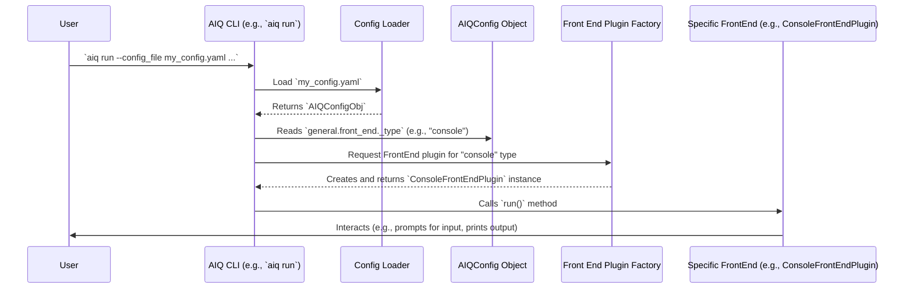

# Chapter 7: Front End (`FrontEndBase`)

In [Chapter 6: Builder (`WorkflowBuilder`, `EvalBuilder`)](06_builder___workflowbuilder____evalbuilder__.md), we saw how AIQToolkit uses "Builders" to take our `AIQConfig` blueprint and construct a fully working AI application. That's great! Our AI is assembled and ready to go. But... how do we actually *talk* to it? How does a user send it a question, or how does another computer system make a request?

This is where the **Front End (`FrontEndBase`)** comes in. It's the "door" or "window" to your AI application.

## What is a Front End? Your Application's "User Interface"

Imagine you've built an amazing "Story Writing Assistant" using AIQToolkit. It can take a simple idea and write a whole story.
*   The [Agent](01_agent_.md) is the creative writer.
*   The [Function / Tool](02_function___tool_.md)s are its research assistants.
*   The [LLM/Embedder Client & Provider](03_llm_embedder_client___provider_.md) is its language brain.
*   The [Workflow](04_workflow_.md) is its process for writing a story.
*   The [AIQ Configuration (`AIQConfig`)](05_aiq_configuration___aiqconfig__.md) was the plan.
*   The [Builder (`WorkflowBuilder`, `EvalBuilder`)](06_builder___workflowbuilder____evalbuilder__.md) put it all together.

Now, how does someone *use* this Story Writing Assistant?
*   Do they type commands into a terminal?
*   Do they interact with it through a web page?
*   Does another program send it requests over the internet?

The **Front End** defines this interface. It's essentially the "user interface" or "entry point" to your AI agent, dictating how requests are made and responses are delivered.

Think of it like a restaurant:
*   Your AI application is the kitchen, preparing delicious "AI dishes" (answers, stories, etc.).
*   The **Front End** is how customers interact with the restaurant:
    *   Is it a **walk-in counter** where you talk directly to the staff? (Like a Command-Line Interface)
    *   Is it a **website** where you place orders online? (Like a Web API)
    *   Is it a **drive-through window**?

AIQToolkit provides different types of Front Ends to suit various needs.

## Types of Front Ends in AIQToolkit

AIQToolkit comes with a few common ways to interact with your application:

1.  **Console Front End (`console`):**
    *   **What it is:** This allows you to interact with your AI application directly through your computer's command line or terminal. You type your input, hit Enter, and see the AI's response printed back.
    *   **Use case:** Great for testing, simple interactions, or running your AI as a script.
    *   **Example:** You run `aiq run ... --input "Write a story about a brave cat"` and the story appears in your terminal.

2.  **FastAPI Front End (`fastapi`):**
    *   **What it is:** This turns your AI application into a web server using the FastAPI framework. Other programs (or web pages) can then send requests to this server (like an API call) and get responses.
    *   **Use case:** Perfect for building web applications, making your AI accessible to other services, or creating a more polished user interface that a separate web development team might build.
    *   **Example:** You run `aiq serve ...`, and now a web developer can make an HTTP POST request to `http://localhost:8000/invoke` with a JSON payload `{"input": "Write a story..."}` and get the story back as JSON.

3.  **MCP Front End (`mcp`):**
    *   **What it is:** MCP (Multi-Agent Collaboration Protocol) is for more advanced scenarios where you want to expose the individual [Function / Tool](02_function___tool_.md)s within your AIQToolkit application so that other AI agents (potentially outside AIQToolkit) can discover and use them.
    *   **Use case:** Building complex, multi-agent systems where different AI components need to collaborate.
    *   **For beginners:** You'll likely start with `console` or `fastapi`. MCP is more advanced.

## How Do You Choose a Front End? The `AIQConfig`!

Just like most other settings, you choose your Front End in your [AIQ Configuration (`AIQConfig`)](05_aiq_configuration___aiqconfig__.md) file (e.g., `config.yaml`). This is done in the `general` section, under `front_end`.

**Example 1: Using the Console Front End**

If you want to run your Story Writing Assistant from the command line, your `config.yaml` might include:

```yaml
# In your config.yaml

# ... (llms, functions, workflow sections as before) ...

general:
  front_end:
    _type: console # This tells AIQToolkit to use the console interface
    # input_query: "Tell me a joke" # Optional: provide input directly in config
```
With this configuration:
*   You'd typically use the `aiq run` command.
*   For example: `aiq run --config_file config.yaml --input_query "Write a short story about a dragon who loves tea."`
*   Or, if `input_query` is not in the config, it might prompt you in the terminal.
*   The AI's response (the story) will be printed directly to your console.

**Example 2: Using the FastAPI Front End**

If you want to make your Story Writing Assistant available as a web service:

```yaml
# In your config.yaml

# ... (llms, functions, workflow sections as before) ...

general:
  front_end:
    _type: fastapi # This tells AIQToolkit to use the FastAPI web server
    host: "0.0.0.0"  # Makes the server accessible on your network
    port: 8000       # The port number the server will listen on
    # workers: 1       # Number of server worker processes
    # reload: false    # Auto-reload server on code changes (for development)
```
With this configuration:
*   You'd typically use the `aiq serve` command: `aiq serve --config_file config.yaml`
*   This will start a web server (usually Uvicorn or Gunicorn).
*   You'll see messages in your terminal like "Uvicorn running on http://0.0.0.0:8000".
*   Now, another application (or a tool like `curl`, or a web browser pointing to an API testing UI if enabled) can send HTTP requests to this address to interact with your AI.

It's that simple to switch! The core logic of your AI (defined in `workflow`, `functions`, `llms`) remains the same. Only the "doorway" changes.

## Under the Hood: `FrontEndBase` and Plugins

How does AIQToolkit manage these different Front Ends? It uses a plugin system built around an abstract base class called `FrontEndBase`.

1.  **`FrontEndBaseConfig` (The Blueprint for Front End Settings)**
    Just like other components, each front end type can have its own configuration settings. These settings inherit from a common base.

    ```python
    # File: src/aiq/data_models/front_end.py (Simplified)
    from .common import TypedBaseModel, BaseModelRegistryTag

    class FrontEndBaseConfig(TypedBaseModel, BaseModelRegistryTag):
        # This base class is often empty.
        # Specific front end configs (like ConsoleFrontEndConfig or FastApiFrontEndConfig)
        # will inherit from this and add their own specific fields (_type, host, port, etc.).
        pass
    ```
    This `FrontEndBaseConfig` ensures all front end configurations have a common structure that AIQToolkit recognizes. When you set `_type: console` in your YAML, AIQToolkit knows to load the specific settings for the `ConsoleFrontEndConfig`.

2.  **`FrontEndBase` (The Abstract Contract for a Front End)**
    This is an abstract Python class that defines what any Front End in AIQToolkit must be able to do.

    ```python
    # File: src/aiq/builder/front_end.py (Simplified)
    import typing
    from abc import ABC, abstractmethod
    # Import FrontEndConfigT for typing
    from aiq.data_models.front_end import FrontEndConfigT
    
    if (typing.TYPE_CHECKING): # Avoids circular import for type hints
        from aiq.data_models.config import AIQConfig

    class FrontEndBase(typing.Generic[FrontEndConfigT], ABC):
        def __init__(self, full_config: "AIQConfig"):
            self._full_config: "AIQConfig" = full_config # The entire app config
            # Get the specific front_end config part (e.g., ConsoleFrontEndConfig instance)
            self._front_end_config: FrontEndConfigT = full_config.general.front_end

        @property
        def front_end_config(self) -> FrontEndConfigT:
            return self._front_end_config

        @property
        def full_config(self) -> "AIQConfig":
            return self._full_config

        @abstractmethod
        async def run(self):
            # Every specific Front End (Console, FastAPI, etc.)
            # MUST implement this 'run' method. This is where
            # it starts listening for input or processing requests.
            pass
    ```
    *   It takes the full [AIQ Configuration (`AIQConfig`)](05_aiq_configuration___aiqconfig__.md) when initialized.
    *   The key part is the `async def run(self)` method. Each concrete Front End (like `ConsoleFrontEndPlugin` or `FastApiFrontEndPlugin`) must provide its own version of `run()`. This `run` method contains the logic for starting that specific interface (e.g., starting a command-line loop or a web server).

3.  **Specific Front End Plugins (The Concrete Implementations)**
    For each `_type` of front end (like `console` or `fastapi`), there's a corresponding Python class that inherits from `FrontEndBase` and implements the `run` method.

    *   **Registration:** These plugins are made known to AIQToolkit via a registration mechanism, often in a file like `src/aiq/front_ends/register.py`:
        ```python
        # File: src/aiq/front_ends/register.py (Simplified)
        # These imports make the console, fastapi, and mcp front ends
        # available to AIQToolkit.
        from .console import register as console_register
        from .fastapi import register as fastapi_register
        from .mcp import register as mcp_register
        ```
        When AIQToolkit starts, it "discovers" these registered front ends.

    *   **Example: `ConsoleFrontEndPlugin`**
        This plugin handles command-line interaction. Its `run` method will typically:
        a.  Use the [WorkflowBuilder](06_builder___workflowbuilder____evalbuilder__.md) to build the main AIQ [Workflow](04_workflow_.md) from `self.full_config`.
        b.  Get input from the command line (either from arguments or by prompting the user).
        c.  Send this input to the built workflow.
        d.  Print the workflow's output back to the console.

        ```python
        # File: src/aiq/front_ends/console/console_front_end_plugin.py (Conceptual Snippet)
        # from aiq.builder.workflow_builder import WorkflowBuilder # To build the app
        # from aiq.front_ends.simple_base.simple_front_end_plugin_base import SimpleFrontEndPluginBase
        # from aiq.front_ends.console.console_front_end_config import ConsoleFrontEndConfig

        class ConsoleFrontEndPlugin(SimpleFrontEndPluginBase[ConsoleFrontEndConfig]):
            async def run(self):
                # 1. Build the actual AI application/workflow
                async with WorkflowBuilder.from_config(config=self.full_config) as builder:
                    workflow = builder.build() # Get the runnable workflow
                    # ... (setup session manager with the workflow) ...

                    # 2. Get input (simplified - actual code handles files/queries)
                    user_query = self.front_end_config.input_query # Or prompt user

                    if user_query:
                        # 3. Run the workflow with the input
                        #    Conceptual: result = await workflow.ainvoke({"input": user_query})
                        #    Actual code uses AIQSessionManager to run the workflow
                        # ... (run workflow with session_manager.run(user_query)) ...
                        
                        # 4. Print the output
                        #    print(f"AI Response: {result}")
                        pass # Actual code logs the output
                # Resource cleanup happens when 'async with' exits
        ```

    *   **Example: `FastApiFrontEndPlugin`**
        This plugin starts a web server. Its `run` method will:
        a.  Configure and start a web server like Uvicorn (which runs FastAPI applications).
        b.  The FastAPI application itself will have endpoints (e.g., `/invoke`). When these endpoints receive requests, they will typically use a [WorkflowBuilder](06_builder___workflowbuilder____evalbuilder__.md) (often reloaded from the config file passed via environment variable) to get the AIQ [Workflow](04_workflow_.md) and process the request.

        ```python
        # File: src/aiq/front_ends/fastapi/fastapi_front_end_plugin.py (Conceptual Snippet)
        # import uvicorn # The web server
        # from aiq.builder.front_end import FrontEndBase
        # from aiq.front_ends.fastapi.fastapi_front_end_config import FastApiFrontEndConfig

        class FastApiFrontEndPlugin(FrontEndBase[FastApiFrontEndConfig]):
            async def run(self):
                # ... (some setup to pass config to the FastAPI app, often via temp file/env var) ...
                
                # Get host and port from its specific config
                host = self.front_end_config.host
                port = self.front_end_config.port
                
                # Start the Uvicorn web server, telling it where to find the FastAPI app
                # "aiq.front_ends.fastapi.main:get_app" points to the FastAPI app factory
                uvicorn.run("aiq.front_ends.fastapi.main:get_app",
                            host=host,
                            port=port,
                            # ... other uvicorn settings from config ...
                            factory=True) # Means get_app is a function that returns the app
        ```

4.  **How AIQToolkit Chooses and Runs the Front End**

When you execute an `aiq` command (like `aiq run` or `aiq serve`):


1.  The AIQ Command-Line Interface (CLI) loads your [AIQ Configuration (`AIQConfig`)](05_aiq_configuration___aiqconfig__.md).
2.  It looks at `config.general.front_end._type` to see which front end you've chosen (e.g., "console" or "fastapi").
3.  It uses a factory (part of the [Type Registry (`GlobalTypeRegistry`)](10_type_registry___globaltyperegistry__.md) system) to get an instance of the corresponding Front End plugin (e.g., `ConsoleFrontEndPlugin(full_config)`).
4.  It then calls the `run()` method on this plugin instance.
5.  The plugin's `run()` method takes over, setting up the chosen interface and typically using the [Builder (`WorkflowBuilder`, `EvalBuilder`)](06_builder___workflowbuilder____evalbuilder__.md) to prepare and run the core AI logic.

## Conclusion

The **Front End (`FrontEndBase`)** is your AI application's "face" to the world. It determines how users or other systems interact with it.
*   You choose your Front End in the `general.front_end` section of your [AIQ Configuration (`AIQConfig`)](05_aiq_configuration___aiqconfig__.md).
*   Common choices are `console` (for command-line interaction) and `fastapi` (for creating a web API).
*   AIQToolkit uses a plugin system based on `FrontEndBase` to provide these different interaction modes without you needing to change your core AI logic.

With your AI application built and a Front End chosen, you can now interact with it! But how do you know if your AI is performing well? How do you measure its speed or accuracy? That's what we'll explore next.

Get ready to dive into [Chapter 8: Profiler & Evaluator](08_profiler___evaluator_.md) to learn how to test and measure your AIQToolkit applications!

---

Generated by [AI Codebase Knowledge Builder](https://github.com/The-Pocket/Tutorial-Codebase-Knowledge)