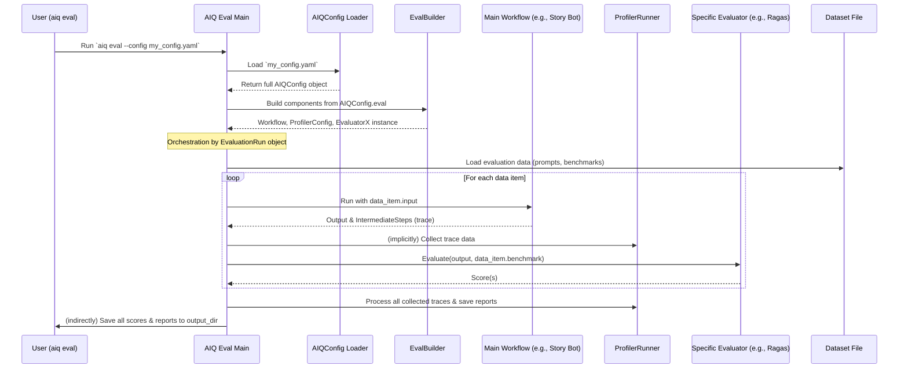

# Chapter 8: Profiler & Evaluator

Welcome back! In [Chapter 7: Front End (`FrontEndBase`)](07_front_end___frontendbase__.md), we saw how users or other systems can interact with our AIQToolkit application through different interfaces like a command line or a web API. Our AI is up and running, and we can talk to it!

But now, some important questions arise:
*   Is our AI application any good?
*   Is it fast? Does it use resources efficiently?
*   How does it compare to a set of correct answers or expected behaviors?

This is where the **Profiler & Evaluator** components shine. They are your tools for checking and improving the "health" and "skill" of your AI workflows.

## Why Do We Need to Profile and Evaluate?

Imagine you've built our "Story Writing Assistant" AI using AIQToolkit. It takes a prompt and writes a story.
*   **How do you know if it's writing *good* stories?** Maybe the stories are too short, or they don't make sense, or they aren't very creative.
*   **How do you know if it's writing stories *efficiently*?** Maybe it takes too long to generate a story, or it uses too many LLM tokens (which can cost money).

Simply building an AI isn't enough. We need to **measure its performance and quality** to understand its strengths and weaknesses, and to guide improvements.

*   A **Profiler** is like the mechanics and engineers for a race car. It measures things like lap times (execution speed), fuel consumption (token usage), and how different parts of the engine (workflow steps) are performing.
*   An **Evaluator** is like the panel of judges at a competition. It compares the AI's output (e.g., the story) against some standard or expected result (e.g., a benchmark story, or a set of quality criteria) and gives it a score.

Together, Profilers and Evaluators help you optimize your AIQ workflows for both **speed (performance)** and **correctness (quality)**.

## Breaking it Down: Profiler vs. Evaluator

Let's look at these two types of components:

### 1. The Profiler (e.g., `ProfilerRunner`)

The `Profiler` focuses on **how** your AI workflow runs. It collects detailed performance metrics. Key things a `Profiler` might track:

*   **Execution Time:** How long does the entire workflow take? How long does each individual step or [Function / Tool](02_function___tool_.md) call take? This helps identify bottlenecks.
*   **Token Usage:** For workflows using [LLM/Embedder Client & Provider](03_llm_embedder_client___provider_.md)s, how many input tokens and output tokens are being used? This is crucial for cost management and understanding model limits.
*   **LLM Latency:** How long does it take to get a response from the LLM?
*   Other metrics like throughput (how many requests can be handled over time).

The `ProfilerRunner` in AIQToolkit is a key component that gathers these statistics, often by looking at the detailed [Intermediate Step (`IntermediateStep`)](09_intermediate_step___intermediatestep__.md)s generated during a workflow execution.

### 2. The Evaluator (e.g., `RagasEvaluator`, `TrajectoryEvaluator`)

The `Evaluator` focuses on **what** your AI workflow produces – its quality and accuracy. It measures the "goodness" of the output. Evaluators typically work by:

*   Taking the output from your AI workflow.
*   Comparing it against a "ground truth" or a set of benchmarks (e.g., a list of questions with ideal answers).
*   Using predefined metrics or even other LLMs to score the output.

Examples of Evaluators in AIQToolkit:
*   **`RagasEvaluator`**: Often used for Retrieval Augmented Generation (RAG) systems (like Q&A bots). It can measure things like how faithful the answer is to the retrieved documents, or how relevant the retrieved documents were.
*   **`TrajectoryEvaluator`**: This can evaluate the sequence of decisions and tool uses an [Agent](01_agent_.md) makes. For example, did the agent use the correct tool for a given sub-task?

## How to Use Profiler & Evaluator in AIQToolkit

You typically use Profilers and Evaluators by running a special "evaluation" mode of your AIQToolkit application, often triggered by a command like `aiq eval`. This process involves:

1.  **Configuration:** You define settings for profiling and evaluation in the `eval` section of your [AIQ Configuration (`AIQConfig`)](05_aiq_configuration___aiqconfig__.md) file.
2.  **Dataset:** You provide a dataset. This dataset contains inputs for your workflow and, for evaluators, often the "expected" or "benchmark" outputs.
3.  **Execution:** AIQToolkit runs your main workflow for each item in the dataset.
    *   The `Profiler` collects performance metrics during these runs.
    *   The `Evaluator(s)` take the workflow's output for each item and score it against the dataset's benchmarks or criteria.
4.  **Reporting:** The results from both the Profiler and Evaluators are saved, usually as JSON files or other report formats, in an output directory you specify.

### Example: Configuring Evaluation in `config.yaml`

Let's imagine we want to evaluate our "Story Writing Assistant". Our `config.yaml` might have an `eval` section like this:

```yaml
# In your config.yaml

# ... (llms, functions, workflow sections for the Story Writing Assistant) ...

eval:
  general:
    # Where to save all evaluation outputs
    output_dir: "./story_assistant_evaluation_results"
    
    # Dataset of story prompts and maybe ideal story characteristics
    dataset:
      _type: jsonl # Assuming our dataset is a JSON Lines file
      path: "./evaluation_data/story_prompts_and_benchmarks.jsonl"
      # Define which fields in the dataset are input and ground_truth
      input_key: "prompt"        # The field in jsonl to use as input to workflow
      ground_truth_key: "ideal_summary" # Field with expected characteristics

    # Profiler settings
    profiler:
      compute_llm_metrics: true
      workflow_runtime_forecast: true # Enable certain performance analyses
      # ... other profiler options from ProfilerConfig ...

  # Define one or more evaluators
  evaluators:
    story_coherence_eval: # A name for this evaluator instance
      _type: ragas_evaluator # Example: using RagasEvaluator (conceptually for coherence)
      # Config specific to RagasEvaluator, e.g., which metrics to compute
      metrics: ["answer_relevancy", "faithfulness"] # Example RAGAS metrics
      # Evaluators might also need an LLM (e.g., to act as a judge)
      llm_name: "my_main_llm" # Reuse an LLM defined in the 'llms' section
```
Let's break this `eval` section down:
*   **`general.output_dir`**: Tells AIQToolkit where to save the results.
*   **`general.dataset`**: Specifies the dataset for evaluation.
    *   `_type: jsonl` indicates the format.
    *   `path` points to the file.
    *   `input_key` tells the system which field in each dataset entry should be fed as input to our Story Writing Assistant.
    *   `ground_truth_key` tells evaluators where to find the reference information (e.g., what a good story summary for that prompt might look like).
*   **`general.profiler`**: Contains settings for the `ProfilerRunner`.
    *   `compute_llm_metrics: true` enables detailed LLM performance tracking.
    *   (See `ProfilerConfig` in `src/aiq/data_models/profiler.py` for all options).
*   **`evaluators`**: A dictionary where you define each evaluator you want to use.
    *   `story_coherence_eval` is a custom name we give to this specific evaluation task.
    *   `_type: ragas_evaluator` tells AIQToolkit to use the `RagasEvaluator`. The specific `_type` string is linked to a registered evaluator plugin via the [Type Registry (`GlobalTypeRegistry`)](10_type_registry___globaltyperegistry__.md).
    *   Evaluators have their own specific configurations (like `metrics` or which `llm_name` to use if the evaluator itself needs an LLM).

### Running the Evaluation

Once your `config.yaml` is set up, you'd typically run the evaluation from your terminal:

```bash
aiq eval --config_file config.yaml
```

AIQToolkit will then:
1.  Load your `config.yaml`.
2.  Use the [Builder (`WorkflowBuilder`, `EvalBuilder`)](06_builder___workflowbuilder____evalbuilder__.md) (specifically an `EvalBuilder` like `WorkflowEvalBuilder`) to set up:
    *   Your main "Story Writing Assistant" workflow.
    *   The configured `ProfilerRunner`.
    *   The `story_coherence_eval` (our `RagasEvaluator` instance).
3.  Read the dataset from `./evaluation_data/story_prompts_and_benchmarks.jsonl`.
4.  For each entry in the dataset:
    *   Run the Story Writing Assistant with the `prompt`.
    *   The `ProfilerRunner` collects performance data.
    *   The `RagasEvaluator` compares the generated story with the `ideal_summary` from the dataset and calculates scores.
5.  Save all results (profiler metrics, evaluator scores) into the `./story_assistant_evaluation_results` directory.

You would then inspect these output files to understand how well and how fast your Story Writing Assistant is performing.

## Under the Hood: How Profiling and Evaluation Work

Let's look at the key pieces involved in making this happen.

### 1. Configuration Models

AIQToolkit uses Pydantic models for configuration.
*   **`EvalConfig`**: Defined in `src/aiq/data_models/evaluate.py`, this model represents the entire `eval` section of your YAML.
    ```python
    # File: src/aiq/data_models/evaluate.py (Simplified)
    from pydantic import BaseModel
    from aiq.data_models.dataset_handler import EvalDatasetConfig
    from aiq.data_models.evaluator import EvaluatorBaseConfig
    from aiq.data_models.profiler import ProfilerConfig

    class EvalGeneralConfig(BaseModel):
        output_dir: Path = Path("/tmp/aiq/examples/default/")
        dataset: EvalDatasetConfig | None = None
        profiler: ProfilerConfig | None = None
        # ... other general eval settings ...

    class EvalConfig(BaseModel):
        general: EvalGeneralConfig = EvalGeneralConfig()
        evaluators: dict[str, EvaluatorBaseConfig] = {}
        # ... (rebuild_annotations method for dynamic type handling) ...
    ```
    This structure directly maps to your YAML. `EvaluatorBaseConfig` is the base for specific evaluator configurations.

*   **`ProfilerConfig`**: Defined in `src/aiq/data_models/profiler.py`.
    ```python
    # File: src/aiq/data_models/profiler.py (Simplified)
    from pydantic import BaseModel

    class ProfilerConfig(BaseModel):
        token_usage_forecast: bool = False
        compute_llm_metrics: bool = False
        csv_exclude_io_text: bool = False
        # ... many other detailed profiler options ...
    ```
    This defines all the knobs and switches for the `ProfilerRunner`.

### 2. The `EvaluationRun` Orchestrator

The core logic for an evaluation pass is managed by the `EvaluationRun` class (from `src/aiq/eval/evaluate.py`).

```python
# File: src/aiq/eval/evaluate.py (Highly Simplified Concept of EvaluationRun)
# ... (imports for AIQConfig, EvalConfig, DatasetHandler, AIQSessionManager, etc.)

class EvaluationRun:
    def __init__(self, config: EvaluationRunConfig): # EvaluationRunConfig holds command-line args
        self.config = config # Stores command-line options like config_file path
        self.eval_config: EvalConfig | None = None # Will hold the parsed eval section from AIQConfig
        self.eval_input: EvalInput | None = None # Data loaded from dataset
        self.evaluation_results: list = [] # Stores (evaluator_name, scores)

    async def run_and_evaluate(self, session_manager: AIQSessionManager | None = None, ...):
        # 1. Load AIQConfig and get the 'eval' section
        aiq_full_config = load_config(self.config.config_file) # Simplified
        self.eval_config = aiq_full_config.eval

        # 2. Setup output directories
        # ... self.eval_config.general.output_dir ...

        # 3. Load dataset using DatasetHandler
        dataset_handler = DatasetHandler(dataset_config=self.eval_config.general.dataset, ...)
        self.eval_input = dataset_handler.get_eval_input_from_dataset(...) # Gets EvalInput object

        # 4. Build workflow and evaluators using EvalBuilder
        #    (WorkflowEvalBuilder.from_config implicitly handles ProfilerRunner setup too)
        async with WorkflowEvalBuilder.from_config(config=aiq_full_config) as eval_builder:
            workflow_to_evaluate = eval_builder.build() # This is your main application workflow
            
            if not session_manager: # Create a session manager to run the workflow
                 session_manager = AIQSessionManager(workflow_to_evaluate, ...)

            # 5. Run workflow for each dataset item (Simplified loop)
            for item in self.eval_input.eval_input_items:
                # Run the workflow (e.g., Story Assistant)
                # This will also trigger ProfilerRunner via IntermediateSteps
                async with session_manager.run(item.input_obj) as runner: # item.input_obj is like {"prompt": "..."}
                    output_obj = await runner.result()
                    item.output_obj = output_obj # Store actual output
                    item.trajectory = await runner.intermediate_steps() # Store performance trace

            # 6. Run Evaluators
            evaluators_to_run = {name: eval_builder.get_evaluator(name) 
                                 for name in self.eval_config.evaluators}
            for name, evaluator_instance in evaluators_to_run.items():
                # evaluator_instance.evaluate_fn takes self.eval_input (which now has actual outputs)
                # and produces scores.
                scores = await evaluator_instance.evaluate_fn(self.eval_input)
                self.evaluation_results.append((name, scores))

        # 7. Run Profiler post-processing
        if self.eval_config.general.profiler:
            profiler_runner = ProfilerRunner(self.eval_config.general.profiler, 
                                             self.eval_config.general.output_dir)
            # Collect all trajectories (intermediate steps) from eval_input
            all_trajectories = [item.trajectory for item in self.eval_input.eval_input_items]
            await profiler_runner.run(all_trajectories) # Process and save profiler reports

        # 8. Write all outputs (evaluator scores, links to profiler reports)
        self.write_output(dataset_handler) # Saves results to files
```
This simplified view shows:
*   Loading configurations.
*   Loading the dataset.
*   Using an [EvalBuilder](06_builder___workflowbuilder____evalbuilder__.md) to get the workflow and evaluators.
*   Looping through the dataset to run the workflow and collect its outputs and trajectories (which contain detailed [Intermediate Step (`IntermediateStep`)](09_intermediate_step___intermediatestep__.md) data used by the profiler).
*   Running the evaluators on these outputs.
*   Explicitly running the `ProfilerRunner`'s analysis step with all collected trajectories.
*   Saving all the results.

### 3. `ProfilerRunner` in Action

The `ProfilerRunner` (from `src/aiq/profiler/profile_runner.py`) is responsible for processing the execution traces ([Intermediate Step (`IntermediateStep`)](09_intermediate_step___intermediatestep__.md) lists) and generating performance reports.

```python
# File: src/aiq/profiler/profile_runner.py (Simplified Concept)
# ... (imports for ProfilerConfig, IntermediateStep, logging, json, Path) ...

class ProfilerRunner:
    def __init__(self, profiler_config: ProfilerConfig, output_dir: Path):
        self.profile_config = profiler_config
        self.output_dir = output_dir
        self.all_requests_data: list[dict] = [] # To store processed trace data

    async def run(self, all_step_lists: list[list[IntermediateStep]]):
        # 'all_step_lists' is a list, where each element is a list of IntermediateSteps
        # for one run of the workflow (i.e., for one dataset item).

        # 1. Process each list of IntermediateSteps
        #    Extract relevant info like timestamps, token counts, event types.
        #    Store it in self.all_requests_data.
        for i, steps_for_one_run in enumerate(all_step_lists):
            processed_data_for_run = []
            for step in steps_for_one_run:
                # Convert step to a dictionary or specific adapter format
                processed_data_for_run.append(step.model_dump()) 
            self.all_requests_data.append({
                "request_number": i, 
                "intermediate_steps": processed_data_for_run
            })
        
        # 2. Save the raw/processed trace data
        #    This is often a large JSON file with all step details.
        final_path = self.output_dir / "all_requests_profiler_traces.json"
        with open(final_path, 'w') as f:
            json.dump(self.all_requests_data, f, indent=2, default=str)

        # 3. Compute aggregate metrics based on self.profile_config
        if self.profile_config.compute_llm_metrics:
            # Calculate LLM-specific metrics (e.g., average tokens, latency)
            # llm_metrics = self._compute_llm_latency_confidence_intervals()
            # ... save llm_metrics to a file ...
            pass

        if self.profile_config.workflow_runtime_forecast:
            # Calculate overall workflow runtime metrics
            # workflow_runtime_metrics = self._compute_workflow_run_time_confidence_intervals()
            # ... save workflow_runtime_metrics to a file ...
            pass
        
        # It can also create CSVs for easier analysis in spreadsheets
        # merged_df = create_standardized_dataframe(all_step_lists)
        # merged_df.to_csv(self.output_dir / "standardized_data_all.csv")

        logger.info(f"Profiler reports saved to: {self.output_dir}")

    # Helper methods (simplified) like:
    # def _compute_workflow_run_time_confidence_intervals(self) -> InferenceMetricsModel: ...
    # def _compute_llm_latency_confidence_intervals(self) -> InferenceMetricsModel: ...
```
The `ProfilerRunner` uses the detailed timing and event data from the [Intermediate Step (`IntermediateStep`)](09_intermediate_step___intermediatestep__.md)s to calculate various statistics.

### 4. Evaluator Plugins

Each `_type` of evaluator (like `ragas_evaluator` or `trajectory_evaluator`) corresponds to a plugin class that knows how to perform its specific kind of evaluation.
*   These plugins typically inherit from a base like `EvaluatorBase` (conceptual) and implement an `evaluate_fn` method.
*   Their configurations inherit from `EvaluatorBaseConfig` (from `src/aiq/data_models/evaluator.py`).
*   They are registered with AIQToolkit, for instance, in `src/aiq/eval/register.py`, so the `EvalBuilder` can find and instantiate them based on the `_type` in your `AIQConfig`.

```python
# File: src/aiq/eval/register.py (Snippet)
# These imports make specific evaluators available.
from .rag_evaluator.register import register_ragas_evaluator
from .trajectory_evaluator.register import register_trajectory_evaluator
# ... other evaluator registrations ...
```

### Sequence Diagram of an Evaluation Run



This diagram illustrates the flow: loading config, building components, running the main workflow over a dataset, collecting profiler data, running evaluators, and finally saving all results.

## Conclusion

Profilers and Evaluators are essential for understanding and improving your AIQToolkit applications.
*   **Profilers** (like `ProfilerRunner`) help you measure and optimize **performance** aspects like speed and token usage, using detailed data from [Intermediate Step (`IntermediateStep`)](09_intermediate_step___intermediatestep__.md)s.
*   **Evaluators** (like `RagasEvaluator` or custom ones) help you measure and improve the **quality and accuracy** of your workflow's outputs against benchmarks.
*   Both are configured within the `eval` section of your [AIQ Configuration (`AIQConfig`)](05_aiq_configuration___aiqconfig__.md) and orchestrated by the `EvaluationRun` process, using an [EvalBuilder](06_builder___workflowbuilder____evalbuilder__.md) to set up the necessary components.

By regularly profiling and evaluating your workflows, you can iteratively enhance them, ensuring they are both effective and efficient.

But what exactly are these "Intermediate Steps" that the Profiler relies on so heavily for its detailed analysis? In the next chapter, we'll take a closer look at [Chapter 9: Intermediate Step (`IntermediateStep`)](09_intermediate_step___intermediatestep__.md) to understand how AIQToolkit captures the fine-grained details of a workflow's execution.

---

Generated by [AI Codebase Knowledge Builder](https://github.com/The-Pocket/Tutorial-Codebase-Knowledge)