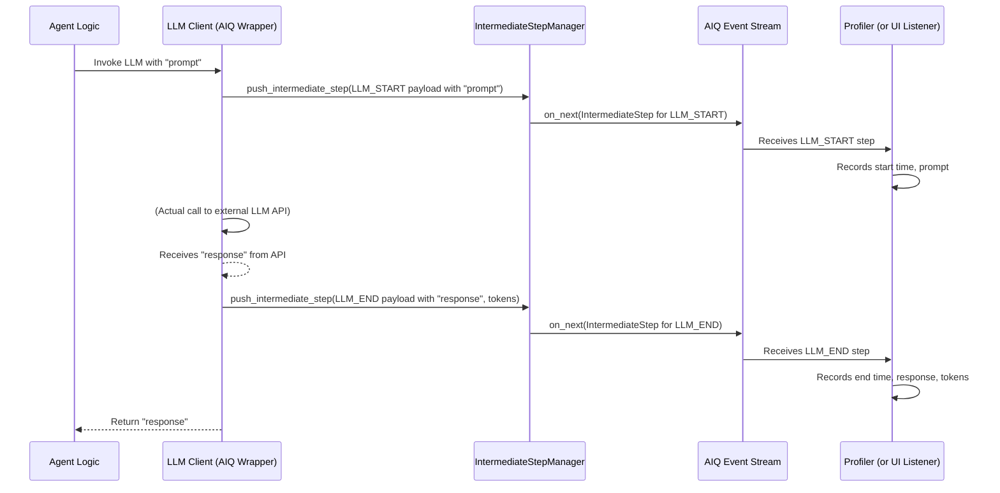

# Chapter 9: Intermediate Step (`IntermediateStep`)

In [Chapter 8: Profiler & Evaluator](08_profiler___evaluator_.md), we learned how to measure our AI application's performance and quality. You might have noticed that the `ProfilerRunner` relies on a detailed trace of what happened during a workflow run. How does it get this fine-grained information? The answer lies in a crucial concept: the **`IntermediateStep`**.

## What is an `IntermediateStep` and Why Do We Need It?

Imagine your AI [Agent](01_agent_.md) is like a skilled detective solving a complex case. As the detective works, they might:
1.  Receive the initial case file (input).
2.  Decide to consult a Large Language Model (LLM) to brainstorm theories.
3.  The LLM provides some ideas.
4.  The detective then decides to use a specific tool, like a "database search" [Function / Tool](02_function___tool_.md).
5.  The tool runs and returns some information.
6.  The detective uses the LLM again to synthesize the findings.
7.  Finally, the detective presents the solution.

If something goes wrong, or if the detective takes too long, how would you figure out what happened? You'd want to look at their detailed notes or logbook!

An **`IntermediateStep`** in AIQToolkit is exactly that: **an entry in a detailed logbook or a flight data recorder for your AI workflow.** It captures a snapshot of an agent's internal processing at a specific moment, such as:
*   An LLM call starting or ending.
*   A tool being executed.
*   A specific function within your agent completing.
*   The overall workflow beginning or finishing.

**Why is this information so valuable?**
*   **Observability:** You can "see inside" the agent's mind and watch its process unfold step-by-step.
*   **Debugging:** If your agent isn't behaving as expected, these steps are crucial clues to find out where things went off track. Did it call the wrong tool? Did the LLM misunderstand the prompt?
*   **Profiling Performance:** As we saw in the previous chapter, these steps provide the raw data (like timestamps and token counts) that the [Profiler & Evaluator](08_profiler___evaluator_.md) uses to analyze speed and resource usage.
*   **Understanding Decision-Making:** By examining the sequence of steps, you can better understand *why* an agent made certain choices.
*   **Live Feedback:** These steps can be streamed to a [Front End (`FrontEndBase`)](07_front_end___frontendbase__.md) to show users what the AI is currently doing (e.g., "Thinking...", "Searching database...").

Think of `IntermediateStep`s as the breadcrumbs your AI leaves behind as it navigates a complex task.

## What's Inside an `IntermediateStep`?

Each `IntermediateStep` is a structured piece of data containing key information about a single event. Here are some of the important details you'll find, primarily within its `payload` attribute:

*   **`event_type`**: What kind of event was this?
    *   Examples: `LLM_START`, `LLM_END`, `LLM_NEW_TOKEN` (for streaming LLM responses), `TOOL_START`, `TOOL_END`, `WORKFLOW_START`, `WORKFLOW_END`, `FUNCTION_START`, `FUNCTION_END`.
*   **`event_timestamp`**: When did this event occur? (A precise timestamp).
*   **`name`**: The name of the component involved (e.g., the name of the LLM model used, the name of the tool executed, or the name of the function).
*   **`data`**: The actual data associated with the event.
    *   For an `LLM_START`, this might include the input prompt.
    *   For an `LLM_END`, this might include the final generated response.
    *   For a `TOOL_START`, this might include the input given to the tool.
    *   For a `TOOL_END`, this might include the output from the tool.
*   **`usage_info`**: For LLM-related steps, this can contain token counts (e.g., `prompt_tokens`, `completion_tokens`, `total_tokens`).
*   **`UUID`**: A unique identifier for this specific step, useful for tracking.
*   **`event_category`**: A broader category for the event (e.g., `LLM`, `TOOL`, `WORKFLOW`).
*   **`event_state`**: Whether this step represents the `START`, `CHUNK` (for streaming data), or `END` of an operation.

Additionally, an `IntermediateStep` itself contains:
*   **`function_ancestry`**: Information about where in the call stack this step occurred, helping to understand nested operations. For example, an LLM call might happen *inside* a tool, which happens *inside* an agent's main function.

Let's imagine a simple LLM call. You might see two `IntermediateStep`s:
1.  **LLM_START:**
    *   `event_type`: `LLM_START`
    *   `name`: "gpt-3.5-turbo"
    *   `data`: `{"input": "What is AIQToolkit?"}`
    *   `timestamp`: ...
2.  **LLM_END:**
    *   `event_type`: `LLM_END`
    *   `name`: "gpt-3.5-turbo"
    *   `data`: `{"output": "AIQToolkit is a toolkit for..."}`
    *   `usage_info`: `{"prompt_tokens": 10, "completion_tokens": 50, "total_tokens": 60}`
    *   `timestamp`: ... (slightly later)

These detailed snapshots allow for rich analysis and insight.

## How are `IntermediateStep`s Generated and Used?

You typically don't create `IntermediateStep`s manually. AIQToolkit's core components are instrumented to generate them automatically as they execute.
*   When an [Agent](01_agent_.md) calls an [LLM/Embedder Client & Provider](03_llm_embedder_client___provider_.md), the client will emit `LLM_START` and `LLM_END` steps.
*   When a [Function / Tool](02_function___tool_.md) is invoked, `TOOL_START` and `TOOL_END` steps are generated.

These steps are managed and broadcast by a central component called the **`IntermediateStepManager`**, which uses the `AIQContext` (a way to share information throughout a request).

**Primary ways to use `IntermediateStep`s:**

1.  **Automatic Profiling:** The [Profiler & Evaluator](08_profiler___evaluator_.md) system (specifically, `ProfilerRunner`) automatically subscribes to these steps. It collects them, analyzes timestamps, token counts, etc., and generates performance reports. This is the most common way beginners will benefit from them, often without directly interacting with the steps themselves.

2.  **Streaming to a User Interface:** If you're using a [Front End (`FrontEndBase`)](07_front_end___frontendbase__.md) like `fastapi`, you can set up a WebSocket connection that streams these `IntermediateStep`s to a web UI. This allows you to show users in real-time what the AI is doing (e.g., "Calling LLM...", "Fetching documents..."). The file `src/aiq/front_ends/fastapi/intermediate_steps_subscriber.py` contains logic for this:
    ```python
    # File: src/aiq/front_ends/fastapi/intermediate_steps_subscriber.py (Simplified Concept)
    import asyncio
    from aiq.builder.context import AIQContext
    from aiq.data_models.intermediate_step import IntermediateStep
    # ... other imports ...

    async def pull_intermediate(_q, adapter): # _q is an asyncio.Queue
        # ... (setup) ...
        context = AIQContext.get()

        def on_next_cb(item: IntermediateStep):
            # This function is called every time a new IntermediateStep is generated
            # 'item' is the IntermediateStep object
            # Adapt it if needed, then put it on the queue for the UI to consume
            adapted_item = adapter.process(item) # Or just use item directly
            if adapted_item is not None:
                asyncio.create_task(_q.put(adapted_item))
        
        # Subscribe to the stream of IntermediateSteps
        context.intermediate_step_manager.subscribe(on_next=on_next_cb, ...)
        # ... (wait for completion) ...
    ```
    This snippet shows how a component can `subscribe` to the `intermediate_step_manager` and receive each `IntermediateStep` as it's created.

3.  **Custom Debugging and Logging:** Advanced users can write their own subscribers to log steps to a file, send them to a custom dashboard, or perform specific checks during development.

4.  **Observability with OpenTelemetry:** AIQToolkit includes an `AsyncOtelSpanListener` (in `src/aiq/observability/async_otel_listener.py`). This listener subscribes to `IntermediateStep`s and converts them into OpenTelemetry "spans." This allows you to integrate AIQToolkit's traces into larger observability platforms that support OpenTelemetry, giving you a unified view of your entire application stack.

## Under the Hood: A Closer Look

Let's peek at the structure of an `IntermediateStep` and how it's managed.

### The `IntermediateStep` Data Model

The definition of `IntermediateStep` and its `payload` can be found in `src/aiq/data_models/intermediate_step.py`.

```python
# File: src/aiq/data_models/intermediate_step.py (Simplified)
import time
import typing
import uuid
from enum import Enum
from pydantic import BaseModel, Field

# --- Enums for categorizing steps ---
class IntermediateStepCategory(str, Enum):
    LLM = "LLM"
    TOOL = "TOOL"
    # ... other categories like WORKFLOW, FUNCTION, SPAN ...

class IntermediateStepType(str, Enum):
    LLM_START = "LLM_START"
    LLM_END = "LLM_END"
    TOOL_START = "TOOL_START"
    TOOL_END = "TOOL_END"
    # ... other types like FUNCTION_START, SPAN_END ...

class IntermediateStepState(str, Enum):
    START = "START"
    CHUNK = "CHUNK" # For parts of a streaming response
    END = "END"

# --- Data and Usage Info ---
class StreamEventData(BaseModel): # Holds input/output/chunk
    input: typing.Any | None = None
    output: typing.Any | None = None
    chunk: typing.Any | None = None
    # model_config = ConfigDict(extra="allow") # Allows extra fields

class TokenUsageBaseModel(BaseModel): # Placeholder for token counts
    prompt_tokens: int = 0
    completion_tokens: int = 0
    total_tokens: int = 0

class UsageInfo(BaseModel):
    token_usage: TokenUsageBaseModel = TokenUsageBaseModel()
    # ... other usage fields ...

# --- The Main Payload ---
class IntermediateStepPayload(BaseModel):
    event_type: IntermediateStepType
    event_timestamp: float = Field(default_factory=lambda: time.time())
    name: str | None = None # Name of tool, LLM model, function
    data: StreamEventData | None = None # Input/output data
    usage_info: UsageInfo | None = None # e.g., token counts
    UUID: str = Field(default_factory=lambda: str(uuid.uuid4()))
    # ... other fields like framework, tags, metadata ...

    # Properties to get category and state from event_type
    @property
    def event_category(self) -> IntermediateStepCategory: # ... logic ...
        pass
    @property
    def event_state(self) -> IntermediateStepState: # ... logic ...
        pass

# --- The Full IntermediateStep object ---
class InvocationNode(BaseModel): # Represents call stack info
    function_name: str
    function_id: str
    # ... parent_id, parent_name ...

class IntermediateStep(BaseModel):
    function_ancestry: InvocationNode | None = None # Where this step occurred
    payload: IntermediateStepPayload # The actual event details

    # ... (properties to easily access payload fields) ...
```
This Pydantic model defines the structure:
*   Enums like `IntermediateStepType`, `IntermediateStepCategory`, and `IntermediateStepState` provide standardized values.
*   `StreamEventData` holds the actual input/output or chunk data.
*   `UsageInfo` can carry token counts for LLM interactions.
*   `IntermediateStepPayload` groups most of the event's details.
*   The top-level `IntermediateStep` wraps the `payload` and adds `function_ancestry` to provide context about where in the execution flow this step happened.

### The `IntermediateStepManager`

The `IntermediateStepManager` (from `src/aiq/builder/intermediate_step_manager.py`) is the central nervous system for these steps.

```python
# File: src/aiq/builder/intermediate_step_manager.py (Simplified)
import logging
from aiq.data_models.intermediate_step import IntermediateStep, IntermediateStepPayload
from aiq.data_models.invocation_node import InvocationNode
# from aiq.builder.context import AIQContextState # Used internally

logger = logging.getLogger(__name__)

class IntermediateStepManager:
    def __init__(self, context_state: "AIQContextState"):
        self._context_state = context_state # Manages event stream & call stack
        # ... (stores outstanding_start_steps to match START/END pairs) ...

    def push_intermediate_step(self, payload: IntermediateStepPayload) -> None:
        # This is called by AIQToolkit components (LLM clients, tools)
        # when an event occurs.

        # 1. Determine function_ancestry from AIQContextState
        active_function = self._context_state.active_function.get()
        # ... (logic to handle active_span_id_stack for nesting) ...
        parent_step_id = "..." # Determined from the stack
        
        function_ancestry = InvocationNode(
            function_name=active_function.function_name,
            function_id=active_function.function_id,
            parent_id=parent_step_id
        )

        # 2. Create the full IntermediateStep object
        intermediate_step = IntermediateStep(
            function_ancestry=function_ancestry,
            payload=payload
        )

        # 3. Send it to the event stream (an "Observable")
        #    Anyone subscribed will receive this 'intermediate_step'.
        self._context_state.event_stream.get().on_next(intermediate_step)
        
        logger.debug(f"Pushed step: {payload.event_type} - {payload.name}")

    def subscribe(self, on_next, on_error=None, on_complete=None):
        # Allows other components (Profiler, UI streamer, OTel listener)
        # to listen for these steps.
        return self._context_state.event_stream.get().subscribe(
            on_next, on_error, on_complete
        )
```
Key roles of `IntermediateStepManager`:
1.  **Receives Payloads:** Core AIQToolkit components (like LLM wrappers or tool executors) create an `IntermediateStepPayload` when something happens (e.g., LLM call starts). They then call `intermediate_step_manager.push_intermediate_step(payload)`.
2.  **Adds Context:** The manager enriches the payload with `function_ancestry` information from the current `AIQContextState` (which tracks the active function call stack).
3.  **Publishes to Stream:** It then publishes the complete `IntermediateStep` object to an event stream (which is an "Observable" pattern – things can subscribe to it).
4.  **Allows Subscription:** Other parts of the system (Profilers, UI streamers, OTel listeners) can `subscribe` to this event stream to receive and process each `IntermediateStep` as it's generated.

### Sequence of Events

Let's visualize how an `IntermediateStep` is generated when an agent uses an LLM:


1.  The **Agent Logic** decides to use an LLM.
2.  It calls an **LLM Client** (which is an AIQToolkit wrapper around the actual LLM SDK).
3.  The **LLM Client** creates an `LLM_START` payload and sends it to the **IntermediateStepManager (`ISM`)**.
4.  The **ISM** adds context (like ancestry) and publishes the full `IntermediateStep` to the **AIQ Event Stream**.
5.  Any **ProfilerListener** (or UI streamer, OTel listener) subscribed to the stream receives this `LLM_START` step and can process it.
6.  The **LLM Client** then makes the actual call to the external LLM API.
7.  When the response comes back, the **LLM Client** creates an `LLM_END` payload (with the response and token usage) and sends it to the **ISM**.
8.  The **ISM** publishes the `LLM_END` step, which is again received by listeners.
9.  The **LLM Client** returns the final response to the **Agent Logic**.

This process happens for every significant operation within AIQToolkit, creating a rich, detailed trace of the entire workflow execution.

## Conclusion

`IntermediateStep`s are the backbone of observability, debugging, and profiling in AIQToolkit. They provide a detailed, real-time log of your AI workflow's internal operations.
*   They capture snapshots of key events like LLM calls, tool usage, and function executions.
*   They contain rich data including timestamps, inputs, outputs, and usage metrics.
*   Generated automatically by AIQToolkit components and managed by the `IntermediateStepManager`.
*   Consumed by systems like the [Profiler & Evaluator](08_profiler___evaluator_.md), UI streamers, and observability listeners (like OpenTelemetry).

By understanding `IntermediateStep`s, you gain deeper insight into how your AI agents think and operate, empowering you to build more robust, efficient, and understandable AI applications.

Now that we've seen how AIQToolkit logs its internal actions, you might be wondering how it knows about all the different types of components (LLMs, tools, agents, evaluators, etc.) that can be specified in your [AIQ Configuration (`AIQConfig`)](05_aiq_configuration___aiqconfig__.md). How does `_type: openai` in your YAML get translated into the correct OpenAI LLM client? That's the magic of the [Chapter 10: Type Registry (`GlobalTypeRegistry`)](10_type_registry___globaltyperegistry__.md).

---

Generated by [AI Codebase Knowledge Builder](https://github.com/The-Pocket/Tutorial-Codebase-Knowledge)