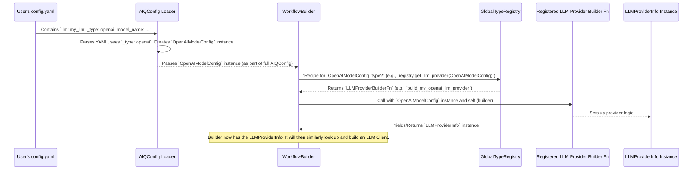

# Chapter 10: Type Registry (`GlobalTypeRegistry`)

Welcome to the final chapter on the core concepts of AIQToolkit! In [Chapter 9: Intermediate Step (`IntermediateStep`)](09_intermediate_step___intermediatestep__.md), we saw how AIQToolkit meticulously records its every move, giving us great observability. This detailed logging relies on knowing what each component is and does.

But this raises a fundamental question: when you write something like `_type: openai` in your [AIQ Configuration (`AIQConfig`)](05_aiq_configuration___aiqconfig__.md) YAML file, how does AIQToolkit magically know *what* "openai" means and *how* to set up an OpenAI [LLM/Embedder Client & Provider](03_llm_embedder_client___provider__.md)? How does it connect that simple string to the actual Python code that makes an OpenAI LLM work?

This is where the **Type Registry (`GlobalTypeRegistry`)** comes into play. It's like a master directory or a smart plugin manager for all the building blocks in AIQToolkit.

## The Big Question: How Does `_type` Work?

Imagine you're assembling a high-tech gadget. The instruction manual (`AIQConfig`) says: "Install Part #XJ-7." You look at your box of parts. How do you know which one is XJ-7, and how do you correctly install it? You'd need a parts list that describes each part and maybe even points to a mini-manual for installing it.

Similarly, in your `config.yaml`:
```yaml
# In your config.yaml
llms:
  my_openai_llm:
    _type: openai # How does AIQToolkit understand this?
    model_name: "gpt-3.5-turbo"
    # ... other settings
```
When AIQToolkit's [Builder (`WorkflowBuilder`, `EvalBuilder`)](06_builder___workflowbuilder____evalbuilder__.md) sees `_type: openai`, it needs to:
1.  Understand that "openai" refers to a specific kind of LLM provider.
2.  Know *how* to create and configure an OpenAI LLM client using the settings like `model_name`.

The `GlobalTypeRegistry` is the "parts list" and "installation guide" lookup system that makes this possible.

## Introducing the Type Registry (`GlobalTypeRegistry`)

The **`GlobalTypeRegistry`** is a central, application-wide directory. Think of it as a universal adapter or a dynamic plugin loader. Its main job is to keep track of all the different types of pluggable components available within AIQToolkit. These components can include:

*   Different [LLM/Embedder Client & Provider](03_llm_embedder_client___provider__.md)s (like OpenAI, NVIDIA NIMs, HuggingFace models)
*   Various [Function / Tool](02_function___tool_.md)s (like web search, database query, custom Python functions)
*   Different [Front End (`FrontEndBase`)](07_front_end___frontendbase__.md) types (like `console` or `fastapi`)
*   [Profiler & Evaluator](08_profiler___evaluator_.md) components
*   Memory systems, and more.

**Why is it "Global"?** Because it's a single, shared registry accessible from anywhere within the AIQToolkit application. This ensures consistency and allows different parts of the system to discover and use components in a standardized way.

The core benefit of this system is **extensibility**. New functionalities (like a new LLM provider or a custom tool) can be added to AIQToolkit by simply "registering" them with the `GlobalTypeRegistry`. The rest of the toolkit can then discover and use these new components without needing to be explicitly reprogrammed.

## The Two Key Actions: Registration and Lookup

The `GlobalTypeRegistry` performs two main actions:

1.  **Registration:** Components "announce" themselves and their "recipes" (how to build them) to the registry.
2.  **Lookup:** Other parts of AIQToolkit (especially Builders) "ask" the registry for the recipe to build a specific type of component.

### 1. Registration: Telling the Registry About Components

**When does registration happen?**
*   When AIQToolkit first starts up.
*   When external "plugin" packages are loaded.

**How does it happen?**
Developers who create new components (or integrate existing ones) use special Python functions called **decorators** to tell the `GlobalTypeRegistry` about their component. These decorators typically associate a component's configuration class (like `OpenAIModelConfig` for OpenAI LLMs) with a function that knows how to build an instance of that component.

Let's look at a simplified example of how an LLM provider might be registered. This kind of code is often in `register.py` files within component modules or plugins.

```python
# Conceptual example from a file like src/aiq/llm/openai_llm.py
# (Actual code uses @register_llm_provider from src/aiq/cli/register_workflow.py)

from aiq.cli.register_workflow import register_llm_provider # The decorator
from aiq.llm.openai_llm import OpenAIModelConfig # The config class for OpenAI LLMs
from aiq.builder.llm import LLMProviderInfo # What the builder function returns
from aiq.builder.builder import Builder # Type hint for the builder

# This is the "recipe" or "builder function"
async def build_my_openai_llm_provider(config: OpenAIModelConfig, builder: Builder):
    # Logic to set up the OpenAI LLM provider based on the config
    # ...
    print(f"Building OpenAI LLM provider for model: {config.model_name}")
    # This function yields/returns information about the provider
    yield LLMProviderInfo(config=config, description="OpenAI LLM Service")

# This line registers the 'build_my_openai_llm_provider' function
# with the GlobalTypeRegistry. It links OpenAIModelConfig to this builder function.
# The `name="openai"` within OpenAIModelConfig is what links `_type: openai` to it.
register_llm_provider(config_type=OpenAIModelConfig)(build_my_openai_llm_provider)
```
In this snippet:
*   `OpenAIModelConfig` is a Pydantic model that defines the settings for an OpenAI LLM (like `model_name`, `api_key`). It usually has a `name="openai"` attribute that links it to the `_type: openai` string in your YAML.
*   `build_my_openai_llm_provider` is a function that takes an `OpenAIModelConfig` instance and knows how to create the necessary `LLMProviderInfo`.
*   The `@register_llm_provider(config_type=OpenAIModelConfig)` decorator (or its functional equivalent above) tells the `GlobalTypeRegistry`: "Hey! If you ever encounter an `OpenAIModelConfig` (which happens when `_type: openai` is parsed from YAML for an LLM), you should use the `build_my_openai_llm_provider` function to get information about it."

Similar registration decorators exist for other component types:
*   `@register_function` for [Function / Tool](02_function___tool_.md)s
*   `@register_llm_client` for specific LLM framework clients
*   `@register_front_end` for [Front End (`FrontEndBase`)](07_front_end___frontendbase__.md)s
*   And so on. You can find these in `src/aiq/cli/register_workflow.py`.

### 2. Lookup: Asking the Registry for a Component's Recipe

**When does lookup happen?**
*   When a [Builder (`WorkflowBuilder`, `EvalBuilder`)](06_builder___workflowbuilder____evalbuilder__.md) is processing your [AIQ Configuration (`AIQConfig`)](05_aiq_configuration___aiqconfig__.md).

**How does it happen?**
1.  The Builder parses your `config.yaml`. When it sees `_type: openai` under an LLM definition, AIQToolkit (using Pydantic) creates an instance of `OpenAIModelConfig` filled with your settings.
2.  The Builder then takes this `OpenAIModelConfig` object and asks the `GlobalTypeRegistry`: "I have an `OpenAIModelConfig` object. What's the registered builder function (the 'recipe') for this type of configuration?"
3.  The `GlobalTypeRegistry` looks up `OpenAIModelConfig` in its internal records and finds the `build_my_openai_llm_provider` function that was registered earlier.
4.  It returns this builder function to the Builder.
5.  The Builder then calls `build_my_openai_llm_provider(config_instance, self)` to get the `LLMProviderInfo` (and subsequently, use another registered function to get the actual LLM client, like a Langchain `ChatOpenAI` instance).

This lookup mechanism allows the Builder to be generic. It doesn't need to know about every single LLM provider or tool in advance. It just needs to know how to ask the `GlobalTypeRegistry` for the right "recipe" based on the configuration type.

## A Visual Walkthrough: From YAML to Component

Let's trace how the `GlobalTypeRegistry` helps build an LLM component specified in your YAML:


This diagram shows the `GlobalTypeRegistry` acting as the crucial link between your declarative YAML configuration and the actual Python code that brings components to life.

## Under the Hood: Peeking into `GlobalTypeRegistry`

The `GlobalTypeRegistry` itself is a Python class that manages several dictionaries. Each dictionary holds registered information for a specific category of component (LLMs, functions, etc.).

### The Singleton: `GlobalTypeRegistry.get()`

AIQToolkit provides a single, global instance of the `TypeRegistry`. You can access it using a static method:
```python
from aiq.cli.type_registry import GlobalTypeRegistry

# Get the global instance of the TypeRegistry
registry_instance = GlobalTypeRegistry.get()
```
This `registry_instance` is what components use to register themselves and what builders use to look up components. You can find the `GlobalTypeRegistry` class and the underlying `TypeRegistry` class in `src/aiq/cli/type_registry.py`.

### What it Stores

The `TypeRegistry` class internally uses dictionaries. For example:
*   `_registered_llm_provider_infos`: Maps an LLM configuration class (e.g., `OpenAIModelConfig`) to a `RegisteredLLMProviderInfo` object.
*   `_registered_functions`: Maps a Function configuration class to a `RegisteredFunctionInfo` object.
*   And so on for embedders, evaluators, front ends, etc.

A simplified `RegisteredLLMProviderInfo` might look like this:
```python
# Simplified from src/aiq/cli/type_registry.py
from pydantic import BaseModel
from aiq.data_models.llm import LLMBaseConfig # Base for all LLM configs
# ... other imports for callable types, discovery metadata ...

class RegisteredLLMProviderInfo(BaseModel):
    full_type: str # e.g., "openai/openai" (module/name from config class)
    config_type: type[LLMBaseConfig] # The Python class of the config (e.g., OpenAIModelConfig)
    build_fn: callable # The "recipe" function to build this component
    discovery_metadata: dict # Information about where this component came from
    # ...
```
*   `config_type`: This is the key. It's the actual Python class of the component's configuration model (e.g., `OpenAIModelConfig`).
*   `build_fn`: This is the "recipe" – the function (like `build_my_openai_llm_provider`) that the builder will call to create an instance or get info about the component.

When you use a decorator like `@register_llm_provider(config_type=OpenAIModelConfig)`, it essentially creates a `RegisteredLLMProviderInfo` object (or similar) and adds it to the appropriate dictionary within the `GlobalTypeRegistry.get()` instance.

### Plugin Discovery: How External Components Get Registered

AIQToolkit is designed to be extensible. You or others can create separate Python packages with new components (tools, LLM connectors, etc.) that AIQToolkit can automatically discover and use. This is magic! How does it work?

It uses a standard Python feature called "entry points."
1.  An external package (a plugin) can declare in its setup files that it provides certain AIQToolkit entry points (e.g., under a group like `aiq.plugins` or `aiq.components`).
2.  When AIQToolkit starts, the `load_config` function in `src/aiq/runtime/loader.py` calls `discover_and_register_plugins`.
    ```python
    # File: src/aiq/runtime/loader.py (Simplified snippet)
    import importlib.metadata # For discovering entry points
    from aiq.cli.type_registry import GlobalTypeRegistry

    def discover_and_register_plugins(plugin_type_flags):
        # Finds entry points defined by installed packages
        entry_points = importlib.metadata.entry_points()
        aiq_component_entry_points = entry_points.select(group="aiq.components") # Example group

        for entry_point in aiq_component_entry_points:
            try:
                # Loading the module executes its top-level code,
                # which includes running any @register_... decorators.
                entry_point.load() 
                logger.debug(f"Loaded plugin: {entry_point.name}")
            except Exception as e:
                logger.warning(f"Failed to load plugin {entry_point.name}: {e}")
    ```
3.  `discover_and_register_plugins` uses `importlib.metadata.entry_points()` to find all modules registered under AIQToolkit's entry point groups.
4.  For each found entry point, it calls `entry_point.load()`. This imports the module from the plugin.
5.  When the plugin's module is imported, any `@register_...` decorators at the top level of that module's files (like `register.py`) are executed. This adds the plugin's components to the `GlobalTypeRegistry`.

**Analogy:** Imagine plugging a new USB mouse into your computer. The operating system (AIQToolkit) detects the new hardware (plugin via entry points) and automatically looks for and loads its drivers (the plugin's registration code). Now the mouse just works!

This powerful mechanism allows AIQToolkit to be extended with new capabilities without modifying its core code. If someone creates an `AIQToolkit-AmazingNewLLM` package and you install it, AIQToolkit can automatically find and allow you to use `_type: amazing_new_llm` in your `config.yaml`.

## Why is the Type Registry Important for You?

Even as a beginner, understanding the `GlobalTypeRegistry` (at a high level) is beneficial:

*   **Demystifies `_type`:** You now know that `_type` isn't just arbitrary text; it's linked to a specific configuration class and a registered builder function.
*   **Enables Extensibility:** If you advance and want to create your own custom [Function / Tool](02_function___tool_.md) or integrate a new LLM service, you'll interact with the registration system. You can write your component, register it, and then use it in your `AIQConfig` just like any built-in component.
*   **Powers the Ecosystem:** It's what allows the AIQToolkit community to build and share plugins that seamlessly integrate. If you find an open-source AIQToolkit plugin for a tool you need, you can install it, and it should just work via this registration mechanism.
*   **Clear and Consistent Configuration:** It ensures that the way you specify components in your `AIQConfig` is uniform, regardless of where those components come from (built-in or external plugin).

## Conclusion

The `GlobalTypeRegistry` is the unsung hero that makes AIQToolkit a dynamic, pluggable, and extensible platform. It acts as a central directory, mapping the `_type` identifiers from your [AIQ Configuration (`AIQConfig`)](05_aiq_configuration___aiqconfig__.md) to the actual Python code responsible for building and providing those components. Through its registration and lookup mechanisms, and its ability to discover plugins via entry points, the `GlobalTypeRegistry` ensures that AIQToolkit can adapt to new tools, models, and functionalities with ease.

You've now journeyed through the core concepts of AIQToolkit, from the intelligent [Agent](01_agent_.md) and its [Function / Tool](02_function___tool_.md)s, to the [LLM/Embedder Client & Provider](03_llm_embedder_client___provider__.md)s that power its "brain," the [Workflow](04_workflow_.md)s that define its plans, and the [AIQ Configuration (`AIQConfig`)](05_aiq_configuration___aiqconfig__.md) that blueprints it all. You've seen how [Builder (`WorkflowBuilder`, `EvalBuilder`)](06_builder___workflowbuilder____evalbuilder__.md)s construct the application, how [Front End (`FrontEndBase`)](07_front_end___frontendbase__.md)s provide interfaces, how [Profiler & Evaluator](08_profiler___evaluator_.md)s help measure it, and how [Intermediate Step (`IntermediateStep`)](09_intermediate_step___intermediatestep__.md)s offer deep observability. Finally, the `GlobalTypeRegistry` ties it all together by managing the components themselves.

With these foundational concepts, you're well-equipped to start building your own powerful and innovative AI applications with AIQToolkit! Congratulations on completing this conceptual overview!

---

Generated by [AI Codebase Knowledge Builder](https://github.com/The-Pocket/Tutorial-Codebase-Knowledge)