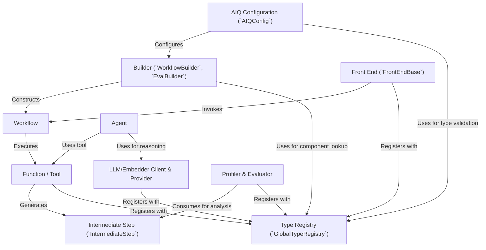

# Tutorial: AIQToolkit

NVIDIA Agent Intelligence (AIQ) Toolkit is a *flexible* and *lightweight* library designed to help you build, connect, and manage AI agents.
Think of it as a versatile toolbox that allows you to take your existing enterprise agents and easily link them to various data sources and tools, regardless of the specific AI framework you're already using (like LangChain or LlamaIndex).
It focuses on **reusability** by treating agents and tools as modular function calls, and provides powerful features for **profiling**, **observability**, and **evaluation** to help you develop and maintain robust AI-powered applications.

**Source Repository:** [None](None)

## Chapters

1. [Agent
](01_agent_.md)
2. [Function / Tool
](02_function___tool_.md)
3. [LLM/Embedder Client & Provider
](03_llm_embedder_client___provider_.md)
4. [Workflow
](04_workflow_.md)
5. [AIQ Configuration (`AIQConfig`)
](05_aiq_configuration___aiqconfig___.md)
6. [Builder (`WorkflowBuilder`, `EvalBuilder`)
](06_builder___workflowbuilder____evalbuilder___.md)
7. [Front End (`FrontEndBase`)
](07_front_end___frontendbase___.md)
8. [Profiler & Evaluator
](08_profiler___evaluator_.md)
9. [Intermediate Step (`IntermediateStep`)
](09_intermediate_step___intermediatestep___.md)
10. [Type Registry (`GlobalTypeRegistry`)
](10_type_registry___globaltyperegistry___.md)

---

Generated by [AI Codebase Knowledge Builder](https://github.com/The-Pocket/Tutorial-Codebase-Knowledge)