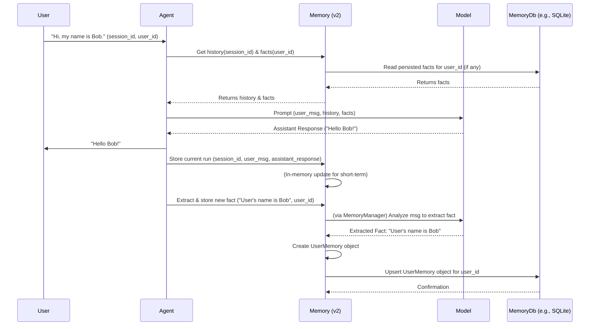

# Chapter 7: Memory

In [Chapter 6: Toolkit & Tools](06_toolkit___tools_.md), we saw how to give our [Agent](02_agent_.md)s special abilities to interact with the world. But what about remembering things? Imagine chatting with an assistant who forgets your name the moment you tell them, or can't recall what you were talking about just a few minutes ago. Frustrating, right? This is where `Memory` comes to the rescue!

## Why Do Agents Need Memory?

By default, AI [Agent](02_agent_.md)s can be quite forgetful. Each time you interact with a basic agent, it might feel like a brand-new conversation. `Memory` allows an [Agent](02_agent_.md) or a [Team](03_team_.md) to remember information across interactions. This is crucial for:

*   **Contextual Conversations**: Remembering what was said earlier in the *same* conversation (short-term memory).
*   **Personalization**: Remembering user preferences, facts about the user, or past interactions across *different* conversations or sessions (long-term memory).

Think of it like a person's memory. You remember the current flow of a chat, but you also recall your friend's birthday or their favorite coffee, even if they told you last week. `Memory` gives your `agno` agents this ability, making them more helpful and engaging.

## What is `Memory` in `agno`?

The `Memory` component in `agno` (specifically, `agno.memory.v2.memory.Memory`) is responsible for managing an agent's ability to recall information. It can handle:

1.  **Short-Term Memory (Conversation History)**:
    *   This is like remembering the last few sentences in a chat.
    *   It helps the agent understand the immediate context. For example, if you say "What about that idea?", the agent needs to remember what "that idea" refers to from earlier in the conversation.
    *   `Memory` can store the sequence of [RunResponse & Message](04_runresponse___message_.md) objects from the current session.

2.  **Long-Term Memory (Persistent Facts & Preferences)**:
    *   This is like an agent keeping a little notebook about you.
    *   It can store specific facts (e.g., "User's name is Bob," "User's favorite color is blue").
    *   This information can be recalled in future sessions to personalize the interaction.
    *   To make long-term memory persistent (so it's not lost when your program stops), `Memory` can use different database backends, called `MemoryDb`. Examples include SQLite (a simple file-based database) or Redis (a fast in-memory database). `agno` provides classes like `SqliteMemoryDb` (from `agno.memory.v2.db.sqlite`) and `RedisMemoryDb` (from `agno.memory.v2.db.redis`).

## Using `Memory`: A Simple Example

Let's create an [Agent](02_agent_.md) that can remember our name and the conversation history.

**Step 1: Setting up `Memory` with a Database**

For long-term memory, we need a database. `SqliteMemoryDb` is great for getting started because it stores data in a local file.

```python
# memory_example.py
from agno.agent import Agent
from agno.models.openai import OpenAIChat # Mock model
from agno.run.response import RunResponse, Message
from agno.memory.v2.memory import Memory # The main Memory class
from agno.memory.v2.db.sqlite import SqliteMemoryDb # For database persistence
from agno.memory.v2.schema import UserMemory # Structure for long-term facts

# --- Mock Model for Agent ---
# This mock model will try to use the user's name if it finds it in the messages
def mock_model_logic_for_memory(messages, **kwargs) -> Message:
    user_name = "there" # Default
    # Try to find user's name from "memory" or context
    for m in messages:
        if "User's name is" in m.content: # Simple check
            user_name = m.content.split("User's name is ")[1].split(".")[0]
            break
        if "my name is" in m.content.lower() and m.role == "user": # User telling name
            user_name = m.content.lower().split("my name is ")[1].split(".")[0].capitalize()
            
    last_user_message = ""
    for m in reversed(messages):
        if m.role == 'user':
            last_user_message = m.content
            break
            
    if "what's my name" in last_user_message.lower():
        return Message(role="assistant", content=f"Your name is {user_name}, I remember!")
    
    return Message(role="assistant", content=f"Hello {user_name}! You said: '{last_user_message}'.")

mock_llm = OpenAIChat(id="mock-gpt-memory")
mock_llm.invoke = mock_model_logic_for_memory
# --- End Mock Model Setup ---

# 1. Initialize a Memory Database (SQLite for this example)
# This will create a file named 'my_agent_memory.db'
memory_db = SqliteMemoryDb(db_file="my_agent_memory.db")
memory_db.create() # Creates the necessary table if it doesn't exist

# 2. Initialize the Memory component with the database
# We also pass our mock_llm because Memory can use a model for tasks like
# deciding what's important to remember long-term (using MemoryManager).
agent_memory = Memory(db=memory_db, model=mock_llm) 
agent_memory.initialize(user_id="user_alpha") # Initialize for a specific user

print("Memory component ready.")
```
In this snippet:
1.  We import necessary classes, including `Memory` and `SqliteMemoryDb`.
2.  We set up a `SqliteMemoryDb`. This tells `agno` to store long-term memories in a file named `my_agent_memory.db`.
3.  We create an `agent_memory` instance, passing it the `memory_db` and a `model`. The `model` can be used by sub-components of `Memory` (like `MemoryManager`) to intelligently extract facts to remember. `initialize(user_id=...)` prepares the memory for a specific user.

**Step 2: Creating an Agent That Uses This `Memory`**

When an `Agent` is created, you can pass this `agent_memory` object to it. (Note: The direct `memory` parameter on `Agent` typically expects the older `AgentMemory` type. For `v2.Memory`, integration might be more manual by passing it for use within the agent's logic, or the agent itself might instantiate it based on a config. For simplicity, we'll show how the `Memory` object is used directly in the flow.)

Let's imagine our agent's `run` logic uses this `agent_memory`.

**Step 3: Interacting with the Agent and Storing Memories**

A typical interaction flow:
1.  The agent receives a user message.
2.  **Recall**: It asks `agent_memory` for relevant past conversation messages and any known long-term facts about the user.
3.  These memories are provided to the [Model](05_model_.md) as context.
4.  The [Model](05_model_.md) generates a response.
5.  **Record**: The agent tells `agent_memory` to:
    *   Store the current interaction (user message + assistant response) using `agent_memory.add_run()`.
    *   Identify and store any new important long-term facts. For example, if the user says "My name is Chandra," `agent_memory.create_user_memories()` can be called to process this.

Let's simulate this:

```python
# memory_example.py (continued)

# --- Agent's simulated interaction logic ---
current_session_id = "session_001"
current_user_id = "user_alpha"

def agent_turn(user_input_text: str, agent_memory_obj: Memory, session_id: str, user_id: str):
    print(f"\nUser: {user_input_text}")

    # 1. RRECALL: Get conversation history for the Model
    # This gets messages from previous turns in this session
    history_messages = agent_memory_obj.get_messages_from_last_n_runs(session_id=session_id)
    
    # 2. RECALL: Get long-term memories for the Model (simplified: just add as text)
    user_specific_memories = agent_memory_obj.get_user_memories(user_id=user_id)
    long_term_memory_context = []
    if user_specific_memories:
        for mem in user_specific_memories:
            # Add it as a system message or user message to inform the LLM
            long_term_memory_context.append(Message(role="system", content=f"Fact: {mem.memory}"))
            
    # Prepare messages for the LLM
    messages_for_llm = history_messages + long_term_memory_context + [Message(role="user", content=user_input_text)]

    # 3. Agent's "brain" (Model) processes the input + memories
    assistant_response_message = mock_llm.invoke(messages=messages_for_llm)
    
    # 4. Construct RunResponse (as the agent would)
    full_run_response = RunResponse(
        content=assistant_response_message.content,
        messages=[Message(role="user", content=user_input_text), assistant_response_message]
    )
    print(f"Agent: {full_run_response.content}")

    # 5. RECORD: Store this interaction turn in Memory
    agent_memory_obj.add_run(session_id=session_id, run=full_run_response)

    # 6. RECORD: Potentially create/update long-term memories
    # If user said their name, let's try to store it.
    # MemoryManager (used by create_user_memories) helps decide what's important.
    if "my name is" in user_input_text.lower():
        print(f"DEBUG: Attempting to store name from '{user_input_text}' as long-term memory...")
        # Forcing a specific memory for simplicity in this example.
        # Normally, memory_manager would extract this.
        new_fact = UserMemory(memory=f"User's name is {user_input_text.split('my name is ')[1].strip('.')}.", topics=["name"])
        agent_memory_obj.add_user_memory(memory=new_fact, user_id=user_id)
        print(f"DEBUG: Stored fact: {new_fact.memory}")

    return full_run_response
# --- End Agent's simulated interaction logic ---

# Interaction 1: Tell the agent our name
agent_turn("Hi, my name is Chandra.", agent_memory, current_session_id, current_user_id)

# Interaction 2: Ask a follow-up question in the same session
agent_turn("What did I just tell you?", agent_memory, current_session_id, current_user_id)

# Interaction 3: Start a new "session" (or imagine it's much later)
# and ask the agent its name. It should remember from long-term memory.
print("\n--- Later, in a new conceptual session (or after reloading memory) ---")
# Re-initialize memory for the same user to simulate loading persisted data
new_memory_instance_for_same_user = Memory(db=memory_db, model=mock_llm)
new_memory_instance_for_same_user.initialize(user_id=current_user_id) # Loads from DB

agent_turn("Hello again! What's my name?", new_memory_instance_for_same_user, "session_002", current_user_id)
```

**Expected Output (will vary slightly due to mock logic details):**
```
Memory component ready.

User: Hi, my name is Chandra.
DEBUG: Attempting to store name from 'Hi, my name is Chandra.' as long-term memory...
DEBUG: Stored fact: User's name is Chandra.
Agent: Hello Chandra! You said: 'Hi, my name is Chandra.'.

User: What did I just tell you?
Agent: Hello Chandra! You said: 'What did I just tell you?'.

--- Later, in a new conceptual session (or after reloading memory) ---

User: Hello again! What's my name?
Agent: Your name is Chandra, I remember!
```
Observe:
*   In the first turn, the agent learns the name "Chandra" and our simple logic stores it.
*   In the second turn, within the same session, the agent still addresses the user as Chandra (due to conversation history and our mock model's behavior).
*   Crucially, in the third turn (simulating a new session by re-initializing `Memory` with the same `user_id` and `db`), the agent *still* remembers the name "Chandra"! This is because it was loaded from the `my_agent_memory.db` file.

This example simplifies how an `Agent` class would integrate `Memory`. A real `Agent` would have these recall/record steps built into its `run` method.

## How `Memory` Works Under the Hood

Let's break down the general flow when an [Agent](02_agent_.md) uses its `Memory` component (like `agno.memory.v2.memory.Memory`):

1.  **User Input**: The agent receives a message from the user for a specific `session_id` and `user_id`.
2.  **Recall Phase**:
    *   **Short-Term (Conversation History)**: The `Memory` object's `get_messages_from_last_n_runs(session_id)` method is called. This fetches recent [RunResponse & Message](04_runresponse___message_.md)s from the current `session_id`.
    *   **Long-Term (User Facts/Preferences)**:
        *   The `Memory` object's `get_user_memories(user_id)` method retrieves stored `UserMemory` objects for the given `user_id` (these were loaded from the `MemoryDb` during initialization or refresh).
        *   Alternatively, `search_user_memories(query=..., user_id=...)` can be used for a more targeted retrieval if the agent wants to find specific relevant facts.
3.  **Contextual Prompting**: The retrieved short-term history and relevant long-term facts are combined with the user's current message and the agent's instructions. This rich context is sent to the [Model](05_model_.md).
4.  **Model Response**: The [Model](05_model_.md) generates a response, benefiting from the provided context.
5.  **Record Phase**:
    *   **Short-Term**: The agent calls `memory.add_run(session_id, current_run_response)` to save the latest interaction turn (user input + assistant reply) to the current session's history.
    *   **Long-Term**: If new important information was revealed (e.g., user states a preference), the agent might use:
        *   `memory.create_user_memories(messages=[...], user_id=...)`: This typically involves the `MemoryManager` (configured within `Memory`) using the [Model](05_model_.md) to analyze the conversation and decide what facts (as `UserMemory` objects) to extract and save.
        *   `memory.add_user_memory(memory=UserMemory(...), user_id=...)`: To directly add a new fact.
        These new/updated `UserMemory` objects are then persisted to the `MemoryDb`.
    *   **Session Summary (Optional)**: For very long conversations, `memory.create_session_summary(session_id, user_id)` can be called. The `SessionSummarizer` (also part of `Memory`) uses the [Model](05_model_.md) to create a concise summary of the session, which can itself be stored and used as context later.

Here's a simplified sequence diagram:



### A Peek at the Code Structures

*   **`Memory` (`agno/memory/v2/memory.py`)**: This is the main orchestrator.
    ```python
    # Conceptual snippet from agno/memory/v2/memory.py
    from agno.memory.v2.db.base import MemoryDb
    from agno.memory.v2.db.schema import MemoryRow
    from agno.memory.v2.schema import UserMemory # Pydantic model for a fact
    from agno.run.response import RunResponse
    from agno.models.base import Model
    # from agno.memory.v2.manager import MemoryManager # Used internally
    # from agno.memory.v2.summarizer import SessionSummarizer # Used internally

    class Memory:
        def __init__(self, db: MemoryDb = None, model: Model = None, # ...
                    ):
            self.db = db # The database backend (e.g., SqliteMemoryDb instance)
            self.model = model # An LLM model, used by manager/summarizer
            self.memories: dict = {} # In-memory cache of UserMemory objects {user_id: {memory_id: UserMemory}}
            self.runs: dict = {} # In-memory store of session runs {session_id: [RunResponse]}
            # self.memory_manager = MemoryManager(model=model) if model else None
            # self.summary_manager = SessionSummarizer(model=model) if model else None
            # ... more fields and initialization ...

        def initialize(self, user_id: str = None):
            # Loads memories for the user_id from self.db into self.memories
            # self.refresh_from_db(user_id=user_id)
            pass # Simplified

        def add_run(self, session_id: str, run: RunResponse):
            self.runs.setdefault(session_id, []).append(run)
            # This keeps the conversation history for the current session

        def get_messages_from_last_n_runs(self, session_id: str, last_n: int = 5) -> list:
            # Retrieves messages from the last N runs for the given session_id
            # from self.runs
            # ... implementation details ...
            return [] # Placeholder

        def add_user_memory(self, memory: UserMemory, user_id: str):
            # Adds a UserMemory object to self.memories and persists it via self.db
            # memory_id = memory.memory_id or generate_uuid()
            # self.memories.setdefault(user_id, {})[memory_id] = memory
            if self.db:
                # memory_row = MemoryRow(id=memory_id, user_id=user_id, memory=memory.to_dict())
                # self.db.upsert_memory(memory_row)
                pass # Simplified
            # return memory_id
        
        def get_user_memories(self, user_id: str) -> list[UserMemory]:
            # Retrieves all UserMemory objects for a user_id from self.memories
            # (which should be populated from self.db on initialize/refresh)
            return list(self.memories.get(user_id, {}).values())

        # create_user_memories often uses MemoryManager to decide what to store.
        # search_user_memories can use different strategies (last_n, semantic).
        # create_session_summary uses SessionSummarizer.
    ```
    The `Memory` class uses helper classes like `MemoryManager` to intelligently process conversations and extract storable long-term memories, and `SessionSummarizer` to condense long chats. Both can use an AI [Model](05_model_.md) for their tasks.

*   **`MemoryDb` (e.g., `SqliteMemoryDb` from `agno/memory/v2/db/sqlite.py`)**: This handles the actual saving and loading to/from a database.
    ```python
    # Conceptual snippet for a MemoryDb implementation
    # from agno.memory.v2.db.base import MemoryDb
    # from agno.memory.v2.db.schema import MemoryRow

    class SomeMemoryDbImplementation: # e.g., SqliteMemoryDb
        def __init__(self, connection_details):
            # self.connection = ... connect to database ...
            pass

        def create(self):
            # Create tables if they don't exist
            # E.g., CREATE TABLE IF NOT EXISTS memories (id TEXT PRIMARY KEY, user_id TEXT, memory_data TEXT, ...)
            pass

        def upsert_memory(self, memory_row: MemoryRow) -> MemoryRow:
            # Insert or update a memory_row in the database.
            # memory_row.memory is a dict, so it's usually stored as JSON string.
            # E.g., INSERT OR REPLACE INTO memories VALUES (?, ?, json(?), ...)
            # ...
            return memory_row # Placeholder

        def read_memories(self, user_id: str, limit: int = 10) -> list[MemoryRow]:
            # Read memory_rows for a user_id from the database.
            # Parse JSON string back into dict for memory_row.memory.
            # E.g., SELECT * FROM memories WHERE user_id = ? LIMIT ?
            # ...
            return [] # Placeholder
        
        def delete_memory(self, memory_id: str):
            # E.g., DELETE FROM memories WHERE id = ?
            pass
            
        def clear(self): # Deletes all memories for its configured scope
            # E.g., DELETE FROM memories (or DROP TABLE if that's the desired effect)
            pass
    ```
    The `MemoryRow` object (from `agno/memory/v2/db/schema.py`) defines how a piece of memory (which itself is a `UserMemory` dictionary) is structured for database storage, including fields like `id`, `user_id`, and the `memory` content.

## Conclusion

`Memory` is what transforms your `agno` [Agent](02_agent_.md) from a stateless command-processor into a more human-like conversational partner. It allows agents to:
*   Remember the flow of current conversations (short-term).
*   Store and recall important facts and user preferences over time (long-term), using `MemoryDb` for persistence.

This enables more contextual, personalized, and ultimately more effective interactions. While we've touched on how an agent might remember facts about users, what if it needs to remember or access information from a large collection of documents, like product manuals or company policies? That's where a different kind of "memory" or knowledge source comes in.

Next up: [Chapter 8: KnowledgeBase & Reader](08_knowledgebase___reader_.md)

---

Generated by [AI Codebase Knowledge Builder](https://github.com/The-Pocket/Tutorial-Codebase-Knowledge)