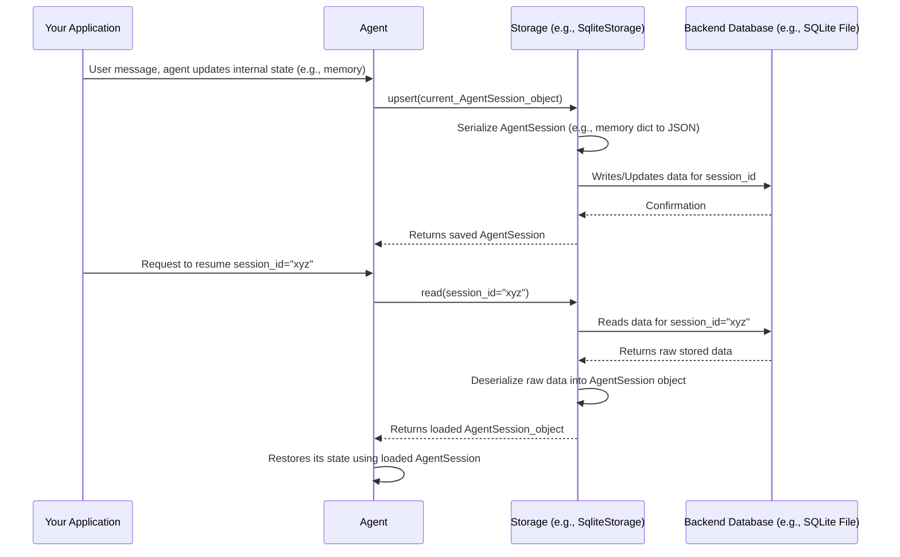

# Chapter 10: Storage

Welcome to the final chapter of our `agno` tutorial series! In [Chapter 9: VectorDb & Embedder](09_vectordb___embedder_.md), we explored how agents can intelligently search through large amounts of information using semantic understanding. Now, we'll address a fundamental need for any application that has ongoing interactions or needs to remember progress: how to save and load its state.

## Why Do We Need to Save Things? The "Save Game" for Your AI

Imagine you're chatting with an AI assistant, perhaps one built with `agno`. You've had a long conversation, the assistant has learned your preferences, and you're midway through a task. What happens if you accidentally close your browser, your computer crashes, or the server running the AI needs to restart? Without a way to save the state of your interaction, all that progress and context would be lost!

This is where the `Storage` abstraction in `agno` comes in. It's like the "save game" feature in video games. You save your progress so you can close the game and, when you come back, pick up exactly where you left off. `Storage` allows your `agno` [Agent](02_agent_.md)s and Workflows to persist their session states.

This means:
*   Conversations can be resumed later.
*   An agent's [Memory](07_memory_.md) can be saved and reloaded.
*   Workflow progress can be preserved across different runs or even different machines.

`Storage` in `agno` is designed to be flexible, supporting various "backends" (places where the data is actually stored), such as:
*   **SQLite**: A simple file-based database, great for getting started and local development.
*   **JSON files**: Storing each session as a separate JSON file in a directory.
*   **Redis**: A fast, in-memory database, often used for caching and session management in larger applications.
*   And potentially others!

## What Gets Stored? Meet Session Objects

When we talk about "saving the state," what information are we actually saving? `agno` uses specific data structures, often called "Session" objects, to hold this information. For an [Agent](02_agent_.md), this might be an `AgentSession` object (defined in `agno.storage.session.agent`).

An `AgentSession` typically includes:
*   `session_id`: A unique ID for this particular interaction session.
*   `user_id`: An ID for the user involved in the session.
*   `agent_id`: The ID of the agent.
*   `memory`: The agent's current [Memory](07_memory_.md) (e.g., conversation history, learned facts).
*   `agent_data`: Information about the agent itself (like its configuration).
*   `session_data`: Other data related to the current session (e.g., current step in a task).
*   Timestamps like `created_at` and `updated_at`.

Workflows would have a similar `WorkflowSession` object. These are the "game save files" that `Storage` manages.

## Using `Storage`: A Simple SQLite Example

Let's see how to use `SqliteStorage` to save and load an agent's session. `SqliteStorage` is a good starting point because it stores everything in a single file on your computer.

**Step 1: Initialize `SqliteStorage`**

First, we create an instance of `SqliteStorage`. We need to tell it a few things:
*   `table_name`: The name of the table within the SQLite database file where sessions will be stored.
*   `db_file`: The path to the SQLite database file. If it doesn't exist, it will be created.
*   `mode`: Specifies what kind of sessions are being stored (e.g., `"agent"`, `"team"`, `"workflow"`). This helps `Storage` use the correct session data structure.

```python
# storage_sqlite_example.py
from agno.storage.sqlite import SqliteStorage
from agno.storage.session.agent import AgentSession # What we'll save/load
import time

# 1. Initialize SqliteStorage for agent sessions
# This will create/use a file named 'my_agent_sessions.db'
agent_storage = SqliteStorage(
    table_name="my_chat_sessions",
    db_file="my_agent_sessions.db",
    mode="agent"  # We're storing AgentSession objects
)

# 2. Create the database table if it doesn't exist
agent_storage.create()

print("SqliteStorage initialized and table created (if it wasn't already).")
```
After this code runs, you'll have a file named `my_agent_sessions.db` in the same directory. The `agent_storage.create()` call ensures that the necessary table (e.g., `my_chat_sessions`) is set up inside this database file.

**Step 2: Saving a Session (Upsert)**

Now, let's simulate an agent having an interaction and then save its state. We'll create an `AgentSession` object manually for this example. The `upsert` method is used to "update or insert" a session. If a session with that ID already exists, it's updated; otherwise, a new one is inserted.

```python
# storage_sqlite_example.py (continued)

# Simulate some session data
current_session_id = "chat_session_123"
current_user_id = "user_jane_doe"
agent_conversation_memory = {
    "history": [
        {"role": "user", "content": "Hello!"},
        {"role": "assistant", "content": "Hi there! How can I help?"}
    ],
    "user_prefs": {"theme": "dark"}
}

# Create an AgentSession object
my_session_data = AgentSession(
    session_id=current_session_id,
    user_id=current_user_id,
    agent_id="helper_bot_v1",
    memory=agent_conversation_memory,
    agent_data={"model_name": "gpt-4o-mini"},
    session_data={"status": "active"},
    created_at=int(time.time()),
    updated_at=int(time.time())
)

# Save the session to the database
saved_session = agent_storage.upsert(my_session_data)

if saved_session:
    print(f"\nSession '{saved_session.session_id}' saved successfully.")
    print(f"It contains memory: {saved_session.memory}")
else:
    print("\nFailed to save session.")
```
When this code runs, the `my_session_data` (including its `memory`) is saved as a row in the `my_chat_sessions` table within the `my_agent_sessions.db` file. The `upsert` method handles the conversion of the `AgentSession` object into a format suitable for the database.

**Step 3: Loading a Session (Read)**

Imagine our application restarts, or we want to resume this chat later. We can load the session back using its `session_id`.

```python
# storage_sqlite_example.py (continued)

# Later... try to load the session we just saved
retrieved_session = agent_storage.read(session_id=current_session_id)

if retrieved_session:
    print(f"\nSuccessfully loaded session '{retrieved_session.session_id}'.")
    print(f"User ID: {retrieved_session.user_id}")
    print(f"Agent ID: {retrieved_session.agent_id}")
    print(f"Retrieved memory: {retrieved_session.memory}")
    # Now an Agent could use this 'retrieved_session.memory' to continue the conversation
else:
    print(f"\nCould not find session '{current_session_id}'.")
```
This `agent_storage.read()` call queries the `my_agent_sessions.db` file for the session with `session_id="chat_session_123"`. If found, it reconstructs the `AgentSession` object from the database data, including the `memory` we saved earlier. An [Agent](02_agent_.md) could then be initialized or updated with this loaded memory to seamlessly continue the conversation.

The `test_sqlite_storage_agent.py` integration test shows a more complete example where an actual `Agent` instance uses `SqliteStorage` to persist its conversation history across multiple `run` calls.

## Under the Hood: How `Storage` Works

The `Storage` abstraction provides a consistent interface, but the actual work happens within specific implementations like `SqliteStorage` or `RedisStorage`.

**General Flow for `upsert(session_object)`:**
1.  **Receive Session Object**: The `Storage` implementation (e.g., `SqliteStorage`) receives a session object (like `AgentSession`).
2.  **Serialization (if needed)**: The data within the session object, especially complex fields like `memory` (which is often a dictionary), might need to be "serialized" – converted into a format the backend database can store easily (e.g., a JSON string for SQLite, or native Redis data types).
3.  **Database Interaction**: The implementation communicates with its backend:
    *   For `SqliteStorage`: It constructs an SQL `INSERT OR REPLACE` (or similar upsert) command and executes it against the SQLite database file.
    *   For `RedisStorage`: It might serialize the session to a JSON string and store it in Redis using a key derived from the `session_id`.
4.  **Return**: It typically returns the saved session object, possibly updated with new timestamps.

**General Flow for `read(session_id)`:**
1.  **Receive Session ID**: The `Storage` implementation gets the `session_id` to look for.
2.  **Database Interaction**: It queries its backend:
    *   For `SqliteStorage`: It constructs an SQL `SELECT` command to fetch the row with the given `session_id`.
    *   For `RedisStorage`: It issues a `GET` command to Redis for the corresponding key.
3.  **Deserialization**: The raw data retrieved from the backend is "deserialized" – converted back from the stored format (e.g., JSON string) into the fields of an `AgentSession` (or `WorkflowSession`, etc.) object.
4.  **Return**: The reconstructed session object is returned.

Here's a simplified sequence diagram for an agent saving and then loading its session using `Storage`:



### A Peek at the Code Structure

*   **Base `Storage` Class (`agno/storage/base.py`)**:
    This is an abstract base class that defines the common interface all storage implementations must adhere to. It includes methods like `create()`, `read()`, `upsert()`, `delete_session()`, and `drop()`.
    ```python
    # Simplified from agno.storage.base.py
    from abc import ABC, abstractmethod
    from typing import List, Optional, Literal
    from agno.storage.session import Session # Union of AgentSession, TeamSession, etc.

    class Storage(ABC):
        def __init__(self, mode: Optional[Literal["agent", "team", "workflow"]] = "agent"):
            self._mode: Literal["agent", "team", "workflow"] = "agent" if mode is None else mode
            # ...

        @abstractmethod
        def upsert(self, session: Session) -> Optional[Session]:
            raise NotImplementedError

        @abstractmethod
        def read(self, session_id: str, user_id: Optional[str] = None) -> Optional[Session]:
            raise NotImplementedError
        # ... other abstract methods ...
    ```

*   **`SqliteStorage` (`agno/storage/sqlite.py`)**:
    This class implements the `Storage` interface using SQLAlchemy to interact with an SQLite database.
    ```python
    # Highly simplified conceptual snippet from agno.storage.sqlite.SqliteStorage
    # from sqlalchemy import create_engine, Table, Column, String, JSON as SQLJSON
    # from sqlalchemy.dialects import sqlite # For ON CONFLICT DO UPDATE
    # from agno.storage.session.agent import AgentSession

    class SqliteStorageConceptual: # Not the real class name or full implementation
        def __init__(self, table_name, db_file, mode="agent"):
            self.table_name = table_name
            self.db_file = db_file
            self.mode = mode
            # self.engine = create_engine(f"sqlite:///{db_file}")
            # self.table = self._define_table_schema() # Defines columns
            print(f"Conceptual SqliteStorage for {mode}s in {db_file}:{table_name}")

        def _define_table_schema(self):
            # In reality, this defines SQLAlchemy columns for AgentSession fields
            # (session_id, user_id, agent_id, memory (as JSON), etc.)
            print("Defining table schema...")
            return "mock_table_object" # Placeholder

        def upsert(self, session: AgentSession) -> Optional[AgentSession]:
            # Conceptual: convert AgentSession to a dictionary
            session_dict = session.to_dict() 
            
            # Use SQLAlchemy to build an INSERT ... ON CONFLICT DO UPDATE statement
            # stmt = sqlite.insert(self.table).values(**session_dict)
            # stmt = stmt.on_conflict_do_update(...)
            # with self.engine.connect() as conn:
            #     conn.execute(stmt)
            #     conn.commit()
            print(f"UPSERTING session {session.session_id} to SQLite (conceptual)")
            return session # In reality, might re-read or update timestamps

        def read(self, session_id: str) -> Optional[AgentSession]:
            # Conceptual: Use SQLAlchemy to build a SELECT statement
            # stmt = select(self.table).where(self.table.c.session_id == session_id)
            # with self.engine.connect() as conn:
            #     result_row = conn.execute(stmt).fetchone()
            # if result_row:
            #     return AgentSession.from_dict(result_row._mapping)
            print(f"READING session {session_id} from SQLite (conceptual)")
            # Simulating finding the session we 'saved' earlier for this example
            if session_id == "chat_session_123":
                return AgentSession(session_id="chat_session_123", memory={"status": "loaded"})
            return None
    ```
    The actual `SqliteStorage` handles dynamic table schema creation based on the `mode` ("agent", "team", "workflow") and uses SQLAlchemy for robust database operations. It stores complex fields like `memory` or `agent_data` as JSON strings in the SQLite table.

*   **Other Backends**:
    *   `JsonStorage` (`agno/storage/json.py`): Implements storage by saving each session as an individual JSON file in a specified directory.
    *   `RedisStorage` (`agno/storage/redis.py`): Implements storage using a Redis database, typically storing serialized session data against keys.

You can explore `test_sqlite_storage.py` and `test_redis_storage.py` to see these storage backends in action with different operations like filtering, deleting, and listing sessions.

## Conclusion

The `Storage` abstraction in `agno` is your key to building persistent and stateful AI applications. By allowing you to save and load the session states of your [Agent](02_agent_.md)s and Workflows, it ensures that conversations and progress are not lost, leading to a much more robust and user-friendly experience. With support for various backends like SQLite, JSON, and Redis, you can choose the storage solution that best fits your project's needs, from simple local persistence to scalable cloud-based solutions.

This concludes our 10-chapter journey through the core concepts of `agno`! We hope this tutorial has given you a solid foundation to start building your own powerful AI applications. Happy coding!

---

Generated by [AI Codebase Knowledge Builder](https://github.com/The-Pocket/Tutorial-Codebase-Knowledge)