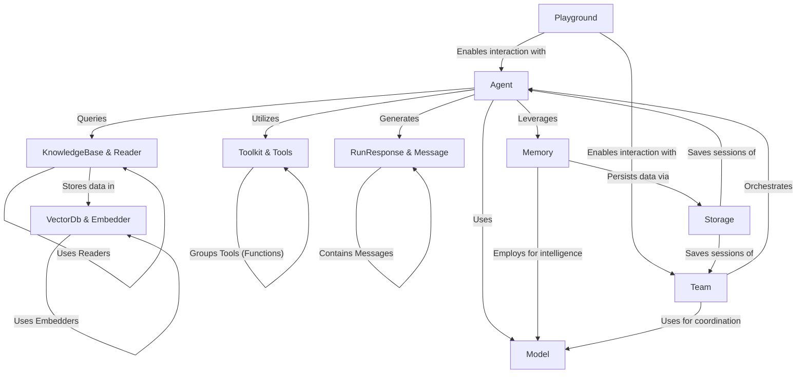

# Tutorial: agno

Agno is a **framework** for building and orchestrating *intelligent agents*.
These agents, powered by various **AI models** (like GPT or Claude), can perform tasks using **toolkits** and specific **tools** (e.g., web search).
They can maintain **memory** of past interactions, which can be persisted using **storage** solutions.
Agents can also access **knowledge bases**, which are populated by **readers** processing documents and storing them in **vector databases** with the help of **embedders**.
Multiple agents can collaborate as a **team**.
The framework provides a **Playground** for testing and interacting with these agents and teams, which communicate using standardized **RunResponse** and **Message** formats.

**Source Repository:** [None](None)

## Chapters

1. [Playground
](01_playground_.md)
2. [Agent
](02_agent_.md)
3. [Team
](03_team_.md)
4. [RunResponse & Message
](04_runresponse___message_.md)
5. [Model
](05_model_.md)
6. [Toolkit & Tools
](06_toolkit___tools_.md)
7. [Memory
](07_memory_.md)
8. [KnowledgeBase & Reader
](08_knowledgebase___reader_.md)
9. [VectorDb & Embedder
](09_vectordb___embedder_.md)
10. [Storage
](10_storage_.md)

---

Generated by [AI Codebase Knowledge Builder](https://github.com/The-Pocket/Tutorial-Codebase-Knowledge)