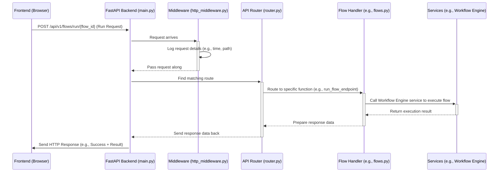

---
layout: default
title: "Backend API & Services"
parent: "Bisheng"
nav_order: 1
---

# Chapter 1: Backend API & Services

Welcome to the Bisheng tutorial series! We're excited to guide you through the inner workings of this powerful platform. Let's start with the very core: the Backend.

Imagine you're at a fancy restaurant. You (the user) sit at the table with a menu, interacting with the waiter (the Frontend or User Interface). But where does the food actually get made? In the kitchen, of course! The kitchen is the **Backend**.

In Bisheng, the **Backend API & Services** component acts like this central kitchen and control center. It's where all the important work happens behind the scenes.

**What Problem Does This Solve?**

Think about using Bisheng: you build a visual workflow, add your documents to a knowledge base, and chat with an AI assistant. How does the user interface (what you click and see) actually *do* these things? It needs to talk to a powerful engine in the background.

The Backend API & Services provides the necessary "brainpower" and communication channels for the user interface (and potentially other applications) to:

*   Create, save, and manage your workflows.
*   Handle user logins and permissions.
*   Manage your knowledge base documents.
*   Deploy AI models.
*   Actually *run* the workflows you build.
*   Manage chat sessions.

Without a backend, the frontend would just be a pretty picture with no functionality. The backend is the engine that makes everything work.

**Key Concepts**

Let's break down the name "Backend API & Services":

1.  **Backend:** As we discussed, this is the server-side part of the application – the "kitchen" that runs on a server, not directly in your web browser.
2.  **API (Application Programming Interface):** This is like the restaurant's menu and the waiter combined. It defines a list of specific requests (orders) that the frontend (customer) can make to the backend (kitchen). For example, the frontend might send an API request like "Please create a new workflow" or "Run this specific chat flow". The backend understands these predefined requests and knows how to act on them. Bisheng uses **FastAPI**, a modern Python framework, to build its efficient API.
3.  **Services:** Think of these as specialized staff within the kitchen. You might have a head chef (managing workflows), a pantry manager (managing knowledge bases), a security guard (handling user authentication), etc. In Bisheng, "Services" are internal modules responsible for specific tasks like managing chat sessions, handling background tasks, or interacting with the database.

**How It Works: A Simple Example**

Let's trace a common action: running a simple chat workflow you built.

1.  **Input (Your Action):** You open a workflow in the Bisheng interface and click the "Chat" or "Run" button.
2.  **Frontend Request:** Your web browser (the frontend) instantly sends a specific request over the internet to the Bisheng Backend API. This request might look something like: `POST /api/v1/chat/{flow_id}`. It includes the ID of the workflow you want to run and your chat message.
3.  **Backend Processing:** The Backend API receives this request.
    *   It first checks if you're allowed to run this workflow (authentication/authorization).
    *   It finds the correct internal "Service" or function responsible for handling chat requests.
    *   This service might load the workflow details from the [Database Models](09_database_models_.md).
    *   It then uses the [Workflow Engine](04_workflow_engine_.md) to execute the steps defined in your workflow, potentially interacting with AI models via [LLM & Embedding Wrappers](08_llm___embedding_wrappers_.md).
4.  **Backend Response:** Once the workflow finishes processing your message and gets a response (e.g., from an AI model), the backend packages this result.
5.  **Output (What You See):** The backend sends the result back to your browser (frontend) as an API response. The frontend then displays the chat message from the AI assistant on your screen.

This request-response cycle happens every time you interact with Bisheng in a meaningful way.

**Looking at the Code (High Level)**

You don't need to understand every line, but let's peek at where the magic starts.

*   **`src/backend/bisheng/main.py`**: This is the main entry point for the backend server.

```python
# src/backend/bisheng/main.py (Simplified)
from fastapi import FastAPI
from bisheng.api import router # Import the API routes
from bisheng.services.utils import initialize_services, teardown_services
from contextlib import asynccontextmanager

@asynccontextmanager
async def lifespan(app: FastAPI):
    initialize_services() # Start internal services
    # ... other setup ...
    yield
    teardown_services() # Stop internal services

def create_app():
    """Create the FastAPI app and include the router."""
    app = FastAPI(lifespan=lifespan) # Create the main app object

    # ... middleware setup (like logging requests) ...

    app.include_router(router) # Add all the API "menu items"
    return app

app = create_app() # Create the app instance

# ... code to run the server ...
```

This code sets up the FastAPI application (`app`), initializes the necessary background `Services` when the server starts (`initialize_services`), and tells the app where to find all the different API endpoints (commands) using `app.include_router(router)`.

*   **`src/backend/bisheng/api/router.py`**: This file acts like an index for our API "menu", organizing different types of requests.

```python
# src/backend/bisheng/api/router.py (Simplified)
from fastapi import APIRouter
from bisheng.api.v1 import (
    flows_router, # Handles requests related to flows (/flows)
    chat_router,  # Handles requests related to chat (/chat)
    knowledge_router, # Handles requests for knowledge bases (/knowledge)
    # ... other routers for users, models, etc.
)

# Router for version 1 of the API
router = APIRouter(prefix='/api/v1')
router.include_router(flows_router)
router.include_router(chat_router)
router.include_router(knowledge_router)
# ... include other routers ...

# (There might be other routers, like router_rpc for version 2)
```

This code defines different `APIRouter` objects (like sections in a menu) for flows, chat, knowledge bases, etc., and groups them under the main `router`. When a request comes in starting with `/api/v1/flows/...`, FastAPI knows to look inside `flows_router` for the specific command.

**Internal Implementation: The Journey of a Request**

Let's visualize the path of that "Run Workflow" request:



**Step-by-Step:**

1.  **Request:** The Frontend sends the HTTP request.
2.  **Entry:** FastAPI (`main.py`) receives the request.
3.  **Middleware:** Code like `CustomMiddleware` in `src/backend/bisheng/utils/http_middleware.py` might intercept the request first. This is often used for logging, adding request IDs, or checking general headers – like a doorman checking tickets before you enter the main hall.

    ```python
    # src/backend/bisheng/utils/http_middleware.py (Simplified)
    from fastapi import Request
    from loguru import logger
    from starlette.middleware.base import BaseHTTPMiddleware

    class CustomMiddleware(BaseHTTPMiddleware):
        async def dispatch(self, request: Request, call_next):
            # Log before handling the request
            logger.info(f'Request started: {request.method} {request.url.path}')
            response = await call_next(request) # Process the request
            # Log after handling the request
            logger.info(f'Request finished: {response.status_code}')
            return response
    ```
    This middleware simply logs information about incoming requests.

4.  **Routing:** FastAPI uses the included routers (`router.py`, `v1/__init__.py`) to match the URL path (`/api/v1/flows/run/{flow_id}`) to the specific Python function designed to handle it (e.g., a function within `src/backend/bisheng/api/v1/flows.py`).
5.  **Handling:** The matched function (the "handler") executes. This is where the main logic lives. It might:
    *   Parse incoming data (like the chat message).
    *   Validate permissions (using helpers from `api/utils.py`).
    *   Interact with internal **Services**. Services are managed by a `ServiceManager` (`services/manager.py`) and accessed via dependency injection (`services/deps.py`), ensuring they are properly initialized and available. For running a flow, it would call the [Workflow Engine](04_workflow_engine_.md). For saving data, it might interact with [Database Models](09_database_models_.md).
6.  **Response:** The handler function generates a result, which FastAPI packages into an HTTP response and sends back to the Frontend.

**Connecting to Other Parts**

The Backend API & Services layer is the central hub. It connects to almost every other major part of Bisheng:

*   It receives requests triggered by your actions in the **Frontend** (not covered in these chapters, but it's the visual interface).
*   For real-time communication like chat, it uses [WebSocket & Chat Management](02_websocket___chat_management_.md).
*   It orchestrates the execution of complex tasks using the [Workflow Engine](04_workflow_engine_.md) and [Graph Engine](05_graph_engine_.md).
*   It manages data storage and retrieval through [Database Models](09_database_models_.md).
*   It configures and uses AI models via [LLM & Embedding Wrappers](08_llm___embedding_wrappers_.md).
*   It uses underlying abstractions like the [Interface Layer](07_interface_layer_.md) to standardize interactions.
*   Its setup and behavior are controlled by [Configuration Management](10_configuration_management_.md).

**Conclusion**

You've now learned about the heart of Bisheng: the Backend API & Services. It's the powerful engine that listens for requests (like a kitchen taking orders via its menu/API) and uses specialized internal services (like chefs and staff) to perform tasks like managing workflows, handling chat, and interacting with data. It's built using FastAPI and acts as the central coordinator for the entire application.

While we've talked about the general request-response cycle, many modern applications need faster, real-time communication, especially for chat. In the next chapter, we'll dive into how Bisheng handles this.

Ready to learn more? Let's move on to [Chapter 2: WebSocket & Chat Management](02_websocket___chat_management_.md).

---

Generated by [AI Codebase Knowledge Builder](https://github.com/The-Pocket/Tutorial-Codebase-Knowledge)