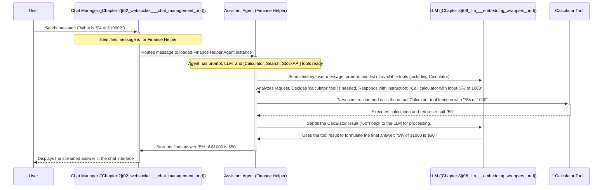

# Chapter 3: GPTS / Assistant Abstraction

Welcome back! In [Chapter 2: WebSocket & Chat Management](02_websocket___chat_management_.md), we saw how Bisheng handles the real-time "phone lines" (WebSockets) for chat conversations. We learned how messages travel back and forth instantly. Now, let's ask: who or what is actually _talking_ on the other end of that line? How do we create different AI personalities with specific skills?

This chapter introduces the **GPTS / Assistant Abstraction**. Think of it as Bisheng's way of letting you easily build and manage your own custom AI assistants, much like assembling specialized robots.

**What Problem Does This Solve?**

Imagine you want to create several different AI helpers:

1.  A **"Customer Support Bot"** that knows your product documentation and answers common questions politely.
2.  A **"Data Analyst Assistant"** that can perform calculations and maybe query databases.
3.  A **"Creative Writer Helper"** that suggests blog post ideas and helps draft content.

Each of these needs a different personality, different tools, and maybe access to different information. Writing the complex code to handle the AI logic, tool usage, and conversation flow for each one from scratch would be difficult and repetitive.

The **GPTS / Assistant Abstraction** solves this by providing a higher-level, configuration-based way to define an assistant. You specify _what_ the assistant should be like and _what_ it can do, and Bisheng handles the underlying complexity of making it work.

**Analogy: Building a Robot Chef**

Think of building a specialized robot chef:

- **Personality & Style (Prompt):** You define its cooking style (e.g., Italian cuisine specialist), its way of talking ("Chef's kiss!" or formal instructions), and its main goals (e.g., "Focus on healthy, quick meals").
- **Utensils & Appliances (Tools):** You give it specific tools like a whisk (calculator), an oven (search engine), or maybe a custom pasta maker (a specific API).
- **Recipe Books (Knowledge Bases):** You can grant it access to specific recipe books (your company's internal documents, specific websites).
- **Cooking AI (Underlying LLM):** You choose the core "brain" that determines how well it improvises and follows instructions.

The GPTS/Assistant Abstraction lets you define all these aspects for your AI assistant without needing to be an expert robot engineer.

**Key Concepts**

1.  **Assistant Configuration:** This is the "blueprint" or "recipe" for your AI assistant. It typically includes:

    - **Prompt:** A detailed instruction telling the AI _who_ it is, _what_ its goal is, _how_ it should behave, and any constraints. This is the most crucial part for defining personality and task focus.
    - **Tools:** A selection of capabilities the assistant can use. These aren't just passive information sources; they are _actions_ the AI can decide to take. Examples include:
      - `Calculator`: For math problems.
      - `Bing Search`: To find current information online.
      - `Code Interpreter`: To run Python code in a sandbox.
      - `Dall-E`: To generate images.
      - _Custom Tools:_ You can integrate your own APIs (like a stock checker or internal database query tool).
      - _Knowledge Base Tool:_ A special tool that lets the assistant search through documents you've provided (more on this in [Chapter 6: RAG Pipeline](06_rag_pipeline_.md)).
    - **LLM Selection:** Choosing the underlying Large Language Model (like GPT-4, Claude, etc.) that will power the assistant's reasoning and language generation. Different LLMs have different strengths ([Chapter 8: LLM & Embedding Wrappers](08_llm___embedding_wrappers_.md)).
    - **Other Settings:** Things like `temperature` (controlling randomness) or `max_tokens` (limiting response length).

2.  **Abstraction:** This concept hides the complex inner workings. You interact with a relatively simple configuration interface (either through the UI or code/config files), and Bisheng translates that into the necessary setup of prompts, tool integrations, and LLM calls. You don't need to manually manage the logic for deciding _when_ to use a tool or _how_ to format the tool's output for the LLM.

**How It Works: Configuring Our "Finance Helper"**

Let's imagine creating that "Finance Helper" assistant using Bisheng's interface (details in [Chapter 7: Interface Layer](07_interface_layer_.md)) or a configuration file.

1.  **Name & Description:** Give it a name ("Finance Helper") and a description ("Helps with stock info and financial calculations").
2.  **Prompt:** Write instructions like:
    ```
    You are a helpful and concise Finance Helper.
    Your goal is to provide accurate financial information and perform calculations.
    Use the available tools when necessary.
    If asked about current stock prices, use the 'Stock Price API'.
    If asked to perform calculations, use the 'calculator'.
    If you need recent news or general financial information, use 'Bing Search'.
    Be polite and informative. Cite sources if using search.
    ```
3.  **Tool Selection:** From a list of available tools, check the boxes for:
    - `Calculator`
    - `Bing Search`
    - `Stock Price API` (assuming this custom tool was added)
4.  **LLM Selection:** Choose an appropriate LLM, maybe "gpt-4-turbo".
5.  **Save:** Save the configuration.

That's it! Bisheng now knows how to run this "Finance Helper". When a user interacts with it, Bisheng will use this configuration to guide the conversation.

**Looking at the Code (Simplified Configuration & Usage)**

While you often configure assistants through the UI, the underlying system uses code and database models. Here's a conceptual Python representation of how an assistant might be configured and run:

**1. Defining the Assistant (Conceptual Code / Database Model)**

The configuration you set in the UI gets stored in the database. The [Database Models](09_database_models_.md) define how this information is structured.

```python
# Simplified view inspired by src/backend/bisheng/database/models/assistant.py

class AssistantModel:
    id: str = "assistant_finance_helper_123"
    name: str = "Finance Helper"
    prompt: str = "You are a helpful and concise Finance Helper..." # The prompt we wrote
    model_name: str = "gpt-4-turbo" # ID of the chosen LLM
    temperature: float = 0.5
    # ... other fields like description, logo ...

class AssistantLinkModel:
    assistant_id: str = "assistant_finance_helper_123"
    tool_id: int | None = 1 # ID representing the 'Calculator' tool
    flow_id: str | None = None
    knowledge_id: int | None = None
    # ... another entry for Bing Search tool (tool_id=2) ...
    # ... another entry for Stock Price API tool (tool_id=3) ...
```

- `AssistantModel`: Stores the core details like the prompt and chosen LLM.
- `AssistantLinkModel`: Connects the assistant to its tools (or potentially knowledge bases/flows). Each link represents one tool the assistant can use.

**2. Loading and Running the Assistant (Conceptual Code)**

When a chat starts, the backend loads this configuration and sets up the assistant logic, often using a class like `AssistantAgent`.

```python
# Simplified example inspired by src/backend/bisheng/api/services/assistant_agent.py
# and src/bisheng-langchain/bisheng_langchain/gpts/assistant.py

from bisheng_langchain.gpts.load_tools import load_tools # Tool loading function
from bisheng_langchain.gpts.assistant import ConfigurableAssistant # The core assistant class
from bisheng.api.services.llm import LLMService # Service to get the LLM instance

# --- Loading Phase (Happens when a chat starts) ---
assistant_config = load_assistant_config_from_db("assistant_finance_helper_123") # Fetch AssistantModel
linked_tool_ids = load_linked_tool_ids_from_db("assistant_finance_helper_123") # Fetch AssistantLinkModel tool IDs

# Get the actual LLM instance based on the configured model name
llm_instance = LLMService.get_bisheng_llm(model_id=assistant_config.model_name,
                                          temperature=assistant_config.temperature)

# Load the actual tool functions based on their IDs
# This uses logic from src/bisheng-langchain/bisheng_langchain/gpts/load_tools.py
# It maps IDs back to tool implementations (Calculator, Bing Search, etc.)
tools = LLMService.init_tools_by_toolid(tool_ids=linked_tool_ids, llm=llm_instance)

# Create the assistant agent instance
# This uses the specific agent executor type configured for the LLM (e.g., function calling)
agent = ConfigurableAssistant(
    agent_executor_type='get_openai_functions_agent_executor', # Or 'get_react_agent_executor', etc.
    tools=tools,
    llm=llm_instance,
    assistant_message=assistant_config.prompt # The core prompt
)

# --- Running Phase (Happens when a user sends a message) ---
user_message = "What is the stock price for AAPL?"
chat_history = [] # Previous messages, if any

# Invoke the agent to get a response
# This function handles the interaction with the LLM and tools
response_messages = await agent.run(user_message, chat_history)

# The last message in the list is the AI's final answer
final_answer = response_messages[-1].content
print(final_answer) # Output: (Example) AAPL is currently trading at $XXX.XX.
```

- **Loading:** The code fetches the assistant's saved configuration and linked tool IDs from the database ([Database Models](09_database_models_.md)).
- **Tool Loading:** It uses a function (like `init_tools_by_toolid` which relies on `load_tools` from `src/bisheng-langchain/bisheng_langchain/gpts/load_tools.py`) to get the actual executable tool objects based on the IDs.
- **LLM Loading:** It gets the appropriate LLM instance ([Chapter 8: LLM & Embedding Wrappers](08_llm___embedding_wrappers_.md)).
- **Agent Creation:** It creates the `ConfigurableAssistant` (defined in `src/bisheng-langchain/bisheng_langchain/gpts/assistant.py`), providing the prompt, the loaded tools, and the LLM. It also specifies the _type_ of agent logic to use (like function calling or ReAct, found in `src/bisheng-langchain/bisheng_langchain/gpts/agent_types/`).
- **Running:** When a message comes in, the `agent.run()` (or `ainvoke`, `astream`) method is called. This method orchestrates the conversation turn, potentially calling the LLM multiple times and invoking tools as needed, based on the chosen `agent_executor_type`.

**Internal Implementation: A Chat Turn with the Finance Helper**

Let's trace what happens _inside_ Bisheng when you ask the Finance Helper, "What is 5% of $1000?":



**Step-by-Step:**

1.  **Message Received:** Your message arrives via the WebSocket managed by the [WebSocket & Chat Management](02_websocket___chat_management_.md) system.
2.  **Agent Invoked:** The system identifies the correct `AssistantAgent` instance for your "Finance Helper" chat session.
3.  **LLM Call 1 (Planning):** The agent sends the current conversation (your message, history), its main prompt ("You are a Finance Helper..."), and a description of its available tools (Calculator, Search, Stock API) to the configured LLM ([Chapter 8: LLM & Embedding Wrappers](08_llm___embedding_wrappers_.md)).
4.  **Tool Decision:** The LLM analyzes the request and its tools. It decides that the "Calculator" tool is appropriate and determines the input should be "5% of 1000". It sends this decision back to the agent (often in a specific format like a "function call").
5.  **Tool Execution:** The `AssistantAgent` receives the LLM's decision. It finds the actual `Calculator` tool object (loaded via `load_tools.py`) and executes it with the specified input.
6.  **Tool Result:** The Calculator tool runs and returns the result ("50").
7.  **LLM Call 2 (Final Answer):** The agent sends the _result_ of the tool execution back to the LLM, essentially saying, "I ran the calculator with '5% of 1000' and got '50'. Now, please formulate the final answer for the user."
8.  **Answer Generation:** The LLM uses the tool's result and the conversation context to generate the natural language response: "5% of $1000 is $50."
9.  **Response Sent:** The agent sends this final answer back through the [WebSocket & Chat Management](02_websocket___chat_management_.md) system to your chat interface, often streaming it word by word.

This interaction loop (Agent -> LLM -> Agent -> Tool -> Agent -> LLM -> Agent -> User) is the core of how assistants with tools work, and the GPTS/Assistant Abstraction manages this loop based on your configuration.

**Connecting to Other Parts**

The GPTS / Assistant Abstraction relies heavily on other components:

- [Backend API & Services](01_backend_api___services_.md): Used to save/load assistant configurations via API calls.
- [WebSocket & Chat Management](02_websocket___chat_management_.md): Receives user messages for the assistant and sends back the generated responses in real-time.
- [LLM & Embedding Wrappers](08_llm___embedding_wrappers_.md): Provides the connection to the actual Large Language Models that power the assistant's brain.
- [Database Models](09_database_models_.md): Stores the assistant's configuration (prompt, tool links, LLM choice, etc.).
- [RAG Pipeline](06_rag_pipeline_.md): If a knowledge base is linked, the assistant uses a RAG tool (provided by this pipeline) to search documents.
- [Workflow Engine](04_workflow_engine_.md): While distinct, a complex workflow built visually could potentially be exposed _as a tool_ that an assistant can use.

**Conclusion**

You've now learned about the GPTS / Assistant Abstraction – Bisheng's powerful yet user-friendly way to create specialized AI assistants. By simply configuring an assistant's prompt (personality and goals), selecting its tools (capabilities), and choosing an underlying LLM (brain), you can build custom AI helpers without diving deep into complex agent coding. Bisheng handles the orchestration of LLM calls and tool usage behind the scenes, making AI assistant creation accessible.

While assistants are great for conversational tasks and using predefined tools, sometimes you need to build more complex, non-conversational AI processes with intricate logic and data flow. How can we build such processes visually?

Let's explore that in the next chapter: [Chapter 4: Workflow Engine](04_workflow_engine_.md).

---

Generated by [AI Codebase Knowledge Builder](https://github.com/The-Pocket/Tutorial-Codebase-Knowledge)
