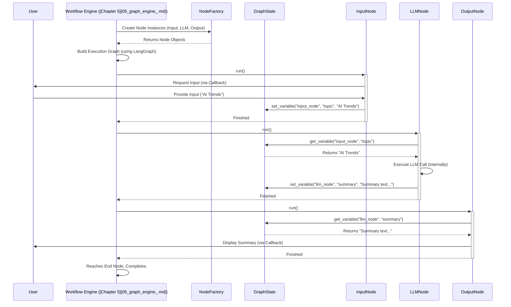

---
layout: default
title: "Workflow Engine"
parent: "Bisheng"
nav_order: 4
---

# Chapter 4: Workflow Engine

Welcome back! In [Chapter 3: GPTS / Assistant Abstraction](03_gpts___assistant_abstraction_.md), we learned how to create specialized AI assistants that can chat and use tools. Those assistants are great for conversational tasks. But what if you need to automate a more complex, multi-step process that isn't just a back-and-forth chat?

Imagine you want to build a system that automatically:
1.  Takes a topic from a user.
2.  Uses an AI (LLM) to brainstorm key points about the topic.
3.  Performs a web search for recent information on those points.
4.  Uses another AI call to synthesize the brainstormed points and search results into a short summary.
5.  Presents the final summary to the user.

This isn't a simple chat; it's a defined sequence of operations. Trying to make a single AI assistant handle all this reliably can be tricky. How do we define and execute such structured processes? That's where the **Workflow Engine** comes in!

**What Problem Does This Solve?**

The Workflow Engine allows you to define and automatically run multi-step processes, like an automated assembly line. Instead of just chatting with one assistant, you can visually design a flow where data moves through different processing stations (nodes) in a specific order.

This solves the problem of needing to orchestrate complex tasks involving:

*   Multiple AI calls ([LLM & Embedding Wrappers](08_llm___embedding_wrappers_.md)).
*   Using specific tools (like web search or calculators).
*   Running custom code snippets.
*   Making decisions based on data (conditional logic).
*   Getting input from a user at specific points.
*   Generating structured outputs.

**Analogy: The Automated Assembly Line Manager**

Think of the **Workflow Engine** as the manager of a sophisticated automated assembly line:

*   **The Blueprint (Workflow Definition):** You first design the blueprint of your assembly line using Bisheng's visual interface. This blueprint defines the sequence of stations.
*   **The Stations (Nodes):** Each station performs a specific task. You might have a "Brainstorming Station" (an LLM node), a "Research Station" (a Tool node like web search), a "Code Station" (running custom Python), a "Decision Station" (a Condition node that routes based on data), an "Input Station" (asking the user for info), and an "Output Station" (displaying the result).
*   **The Conveyor Belts (Edges):** These connect the stations, defining the path the product (your data) takes.
*   **The Product (Data/State):** As the product moves along the line, it changes. Data generated by one station is passed along to the next. The Workflow Engine keeps track of this data (the "state").
*   **The Manager (Workflow Engine):** The engine reads the blueprint and manages the whole process. It tells each station when to start working, ensures the product moves correctly between stations via the conveyor belts, handles any decisions, and collects the final result.

**Key Concepts**

1.  **Workflow:** The complete, defined process or "blueprint" you create, usually visually in Bisheng. It consists of nodes and edges.
2.  **Node:** A single step or "station" in the workflow. Each node has a specific type and function:
    *   `Start`: The entry point of the workflow.
    *   `End`: The exit point.
    *   `Input`: Pauses the workflow to ask the user for input.
    *   `Output`: Displays results or final outputs to the user.
    *   `LLM`: Calls a Large Language Model with a specific prompt.
    *   `Tool`: Uses a pre-defined tool (like Search, Calculator, or custom tools).
    *   `Code`: Executes a snippet of Python code.
    *   `Condition`: Makes a decision, directing the flow down different paths based on data.
    *   `Agent`: Runs a more complex agentic loop within the workflow.
    *   `RAG`: Performs Retrieval-Augmented Generation using a knowledge base ([Chapter 6: RAG Pipeline](06_rag_pipeline_.md)).
    *   *(And others like `Report`, `QA Retriever`)*
3.  **Edge:** A connection or "conveyor belt" between two nodes, showing the direction of data flow. Edges link the output of one node to the input of another.
4.  **State (Graph State):** The memory of the workflow during execution. It holds the data produced by each node, allowing later nodes to access results from earlier ones. Think of it as the current state of the "product" on the assembly line.
5.  **Execution:** The process of actually running the workflow, managed by the engine. The engine steps through the nodes according to the edges, passing data and managing the state.

**How It Works: Building a Simple "Topic Summarizer" Workflow**

Let's visualize how you might build our earlier example:

1.  **Drag & Drop:** In Bisheng's interface ([Chapter 7: Interface Layer](07_interface_layer_.md)), you'd drag nodes onto a canvas:
    *   `Start` node
    *   `Input` node (configured to ask "What topic do you want summarized?")
    *   `LLM` node (configured with a prompt like "Brainstorm 3 key points about {topic}.")
    *   `Tool` node (configured to use a "Web Search" tool, searching for "{key_point_1}", "{key_point_2}", etc.)
    *   `LLM` node (configured with a prompt like "Summarize these points: {brainstorm_results} and this research: {search_results}.")
    *   `Output` node (configured to display the final {summary}).
    *   `End` node
2.  **Connect Edges:** You'd draw arrows (edges) connecting the nodes in sequence: Start -> Input -> LLM1 -> Tool -> LLM2 -> Output -> End.
3.  **Configure Data Flow:** You'd specify how data passes. For example:
    *   The output of the `Input` node (the topic) is fed into the prompt of the first `LLM` node.
    *   The output of the first `LLM` node (key points) is fed into the `Tool` node.
    *   The outputs of the first `LLM` and the `Tool` node are fed into the second `LLM` node.
    *   The output of the second `LLM` node is fed into the `Output` node.
4.  **Run:** You click "Run". The Workflow Engine takes over:
    *   It starts at the `Start` node.
    *   Moves to the `Input` node, pausing and asking you for the topic.
    *   Once you provide the topic, it moves to the first `LLM` node, executes it, and stores the brainstormed points in the state.
    *   It moves to the `Tool` node, executes the searches using the points from the state, and stores the results.
    *   It moves to the second `LLM` node, executes it using data from the state, and stores the summary.
    *   It moves to the `Output` node, displaying the summary from the state.
    *   It finishes at the `End` node.

**Looking at the Code (Simplified Concepts)**

The visual workflow you build gets translated into a data structure (like JSON) that the engine understands. The engine then uses Python classes to represent and run the workflow.

**1. Workflow Structure (Conceptual JSON)**

The visual design is stored, often looking something like this conceptually (details managed by [Database Models](09_database_models_.md)):

```json
{
  "nodes": [
    { "id": "start_node", "data": { "type": "Start", "name": "Start" } },
    { "id": "input_topic", "data": { "type": "Input", "name": "Get Topic", "config": {"prompt": "Topic?"} } },
    { "id": "llm_brainstorm", "data": { "type": "LLM", "name": "Brainstorm", "config": {"prompt": "Points for {input_topic.output}"} } },
    // ... other nodes ...
    { "id": "output_summary", "data": { "type": "Output", "name": "Show Summary", "config": {"value": "{llm_summarize.output}"} } },
    { "id": "end_node", "data": { "type": "End", "name": "End" } }
  ],
  "edges": [
    { "source": "start_node", "target": "input_topic" },
    { "source": "input_topic", "target": "llm_brainstorm" },
    // ... other edges ...
    { "source": "llm_summarize", "target": "output_summary" },
    { "source": "output_summary", "target": "end_node" }
  ]
}
```

*   `nodes`: A list of all the "stations" with their unique IDs, types, names, and configurations.
*   `edges`: A list defining the "conveyor belts", connecting `source` node IDs to `target` node IDs.

**2. The Node Blueprint (`BaseNode`)**

Every node type (LLM, Tool, Input, etc.) is implemented as a Python class that inherits from a common `BaseNode`. This base class defines the essential structure.

```python
# Simplified from src/backend/bisheng/workflow/nodes/base.py
from abc import ABC, abstractmethod
from bisheng.workflow.graph.graph_state import GraphState # State management

class BaseNode(ABC):
    def __init__(self, node_data, graph_state: GraphState, **kwargs):
        self.id = node_data.id
        self.type = node_data.type
        self.name = node_data.name
        self.graph_state = graph_state # Access to the workflow's memory
        self.node_params = {} # Parameters for this specific node
        # ... other common properties ...

    @abstractmethod
    def _run(self, unique_id: str) -> dict:
        """The core logic of the node goes here. Must be implemented by subclasses."""
        # Example: An LLM node would call the LLM here.
        # Example: A Code node would execute Python code here.
        raise NotImplementedError

    def run(self, state: dict) -> dict:
        """Called by the engine to execute this node."""
        print(f"Running node: {self.name} ({self.id})")
        # ... pre-run setup, logging, callback calls ...
        result = self._run("some_unique_exec_id") # Execute the specific node logic
        # Store the result in the shared state
        if result:
            for key, value in result.items():
                self.graph_state.set_variable(self.id, key, value)
        # ... post-run cleanup, logging ...
        print(f"Finished node: {self.name}. Result keys: {list(result.keys()) if result else 'None'}")
        return state # LangGraph expects state to be returned
```

*   `__init__`: Sets up basic node properties and gets access to the shared `GraphState`.
*   `_run`: This is the *abstract* method where the unique logic for each node type (LLM, Tool, Code) lives. Subclasses *must* implement this.
*   `run`: The main method the engine calls. It handles common tasks like logging, calling `_run` to do the actual work, and storing the results in the `GraphState`.

**3. Node Factory (`NodeFactory`)**

How does the engine create the correct `BaseNode` subclass (like `LLMNode` or `ToolNode`) based on the workflow definition? It uses a factory.

```python
# Simplified from src/backend/bisheng/workflow/nodes/node_manage.py
from bisheng.workflow.nodes.base import BaseNode
from bisheng.workflow.nodes.llm.llm import LLMNode # Specific node class
from bisheng.workflow.nodes.tool.tool import ToolNode # Specific node class
# ... import other node types ...

NODE_CLASS_MAP = {
    "LLM": LLMNode,
    "Tool": ToolNode,
    "Input": InputNode,
    "Output": OutputNode,
    # ... map all node types to their classes ...
}

class NodeFactory:
    @classmethod
    def get_node_class(cls, node_type: str) -> type[BaseNode]:
        return NODE_CLASS_MAP.get(node_type)

    @classmethod
    def instance_node(cls, node_type: str, **kwargs) -> BaseNode:
        """Creates an instance of the correct node class."""
        node_class = cls.get_node_class(node_type)
        if node_class is None:
            raise ValueError(f"Unknown node type: {node_type}")
        # Create and return an object of the specific node class (e.g., LLMNode)
        return node_class(**kwargs)
```

*   `NODE_CLASS_MAP`: A dictionary mapping the type string (from the workflow definition) to the actual Python class.
*   `instance_node`: Takes the `node_type` string and uses the map to create an instance of the correct node class.

**4. Workflow Memory (`GraphState`)**

This class holds the data passed between nodes.

```python
# Simplified from src/backend/bisheng/workflow/graph/graph_state.py
from typing import Any, Dict

class GraphState:
    def __init__(self):
        # Stores results like: { "node_id": { "output_key": value } }
        self.variables_pool: Dict[str, Dict[str, Any]] = {}
        # ... potentially includes chat history management ...

    def set_variable(self, node_id: str, key: str, value: Any):
        """Stores the output 'value' with 'key' for the node 'node_id'."""
        if node_id not in self.variables_pool:
            self.variables_pool[node_id] = {}
        print(f"State: Storing '{key}' for node '{node_id}'")
        self.variables_pool[node_id][key] = value

    def get_variable(self, node_id: str, key: str) -> Any:
        """Retrieves the stored value for 'key' from node 'node_id'."""
        print(f"State: Getting '{key}' from node '{node_id}'")
        return self.variables_pool.get(node_id, {}).get(key)

    def get_variable_by_str(self, variable_key: str) -> Any:
        """Gets value using 'node_id.key' format (used in configurations)."""
        # Example: variable_key = "llm_brainstorm.output"
        node_id, key = variable_key.split('.', 1)
        # (Handles potential indexing like #0 for lists too)
        return self.get_variable(node_id, key)
```

*   `variables_pool`: The core dictionary holding all the data generated during the workflow run.
*   `set_variable`: Used by a node's `run` method after `_run` finishes to save its output.
*   `get_variable` / `get_variable_by_str`: Used by a node (usually during its `_run` method) to fetch the output from a previous node that it needs as input.

**Internal Implementation: Running the Assembly Line**

The Workflow Engine uses these components, often leveraging the underlying [Graph Engine](05_graph_engine_.md) (which is built on libraries like LangGraph), to execute the workflow.

**Walkthrough (Simple Flow: Input -> LLM -> Output):**

1.  **Load:** The engine receives the workflow definition (nodes and edges).
2.  **Build Graph:** It uses the `NodeFactory` to create instances of `InputNode`, `LLMNode`, and `OutputNode`. It also creates a `GraphState` object to hold the data. It tells the underlying graph library (LangGraph) about these nodes and how they are connected by edges.
3.  **Start:** Execution begins at the `Start` node, which immediately transitions to the `InputNode`.
4.  **Input Node:** The `InputNode.run()` method is called. Its `_run()` logic likely triggers a callback ([Chapter 2: WebSocket & Chat Management](02_websocket___chat_management_.md)) to ask the user for input and pauses execution.
5.  **User Provides Input:** You type in the topic. The callback sends this back.
6.  **Resume & Store:** The engine resumes. The `InputNode` finishes its `run` method, storing your input ("topic") into the `GraphState` using `graph_state.set_variable("input_node_id", "topic", user_input)`.
7.  **LLM Node:** The engine follows the edge to the `LLMNode`. Its `run()` method is called.
8.  **Fetch Input:** Inside `LLMNode._run()`, it needs the topic. It calls `graph_state.get_variable_by_str("input_node_id.topic")` to retrieve it from the state.
9.  **Execute Logic:** It formats the prompt using the topic and calls the actual LLM ([Chapter 8: LLM & Embedding Wrappers](08_llm___embedding_wrappers_.md)).
10. **Store Output:** The LLM returns a result (the summary). `LLMNode.run()` stores this in the state: `graph_state.set_variable("llm_node_id", "summary", llm_result)`.
11. **Output Node:** The engine follows the edge to the `OutputNode`. Its `run()` method is called.
12. **Fetch Input:** `OutputNode._run()` retrieves the summary using `graph_state.get_variable_by_str("llm_node_id.summary")`.
13. **Display:** It sends the summary back to the user interface, likely via another callback.
14. **End:** The engine follows the edge to the `End` node, and the workflow finishes.

**Sequence Diagram:**



**Code Deep Dive:**

*   **`GraphEngine` (`src/backend/bisheng/workflow/graph/graph_engine.py`):** This class orchestrates the workflow execution.
    *   `__init__`: Takes the workflow data, initializes `GraphState`, `NodeFactory`, `EdgeManage`.
    *   `build_nodes`: Iterates through the nodes in the workflow definition, uses `NodeFactory.instance_node` to create each node object, stores them in `self.nodes_map`, and adds them to the underlying LangGraph `StateGraph` (`self.graph_builder.add_node`). It also calls `add_node_edge` to connect them.
    *   `add_node_edge`: Connects nodes in the LangGraph builder based on the `edges` definition. Handles special cases like `Condition` nodes (using `add_conditional_edges`) and `Output` nodes (adding a hidden "fake" node for better control).
    *   `run`/`arun`: Starts the execution using LangGraph's `graph.stream()` or `graph.astream()`.
    *   `continue_run`/`acontinue_run`: Resumes the graph execution after receiving user input (called when an `InputNode` or `OutputNode` pauses).
*   **`Workflow` (`src/backend/bisheng/workflow/graph/workflow.py`):** A wrapper around `GraphEngine` that manages the overall lifecycle, including handling timeouts and coordinating `run`/`continue_run` calls based on input data.
*   **Celery Task (`src/backend/bisheng/worker/workflow/tasks.py`):** Workflows often run asynchronously in the background using Celery. The `execute_workflow` task initializes the `Workflow` object (with a `RedisCallback` for communication) and runs it, handling the loop for waiting for user input.
*   **Callbacks (`src/backend/bisheng/worker/workflow/redis_callback.py`):** When a node needs to interact (like `InputNode` asking for input or `OutputNode` displaying data), it uses a callback mechanism. The `RedisCallback` implementation sends events (like `on_user_input`, `on_output_msg`) via Redis pub/sub or lists, which the [Backend API & Services](01_backend_api___services_.md) or [WebSocket & Chat Management](02_websocket___chat_management_.md) can listen to and relay to the user.

**Connecting to Other Parts**

The Workflow Engine is a central orchestrator:

*   It's triggered via the [Backend API & Services](01_backend_api___services_.md) (e.g., `/workflow/run` endpoints).
*   It uses [WebSocket & Chat Management](02_websocket___chat_management_.md) (via callbacks like `RedisCallback`) to handle real-time user input and output steps within a workflow.
*   Its nodes (like `LLMNode`, `RAGNode`) leverage [LLM & Embedding Wrappers](08_llm___embedding_wrappers_.md) to interact with AI models.
*   The workflow definitions (nodes, edges, configurations) are stored and retrieved using [Database Models](09_database_models_.md).
*   It heavily relies on the underlying [Graph Engine](05_graph_engine_.md) (LangGraph) for the actual execution flow and state management.
*   Nodes like `RAGNode` utilize the [RAG Pipeline](06_rag_pipeline_.md).
*   The visual builder is part of the [Interface Layer](07_interface_layer_.md).

**Conclusion**

You've now learned about the Bisheng Workflow Engine – the "assembly line manager" that lets you define and automate complex, multi-step processes. By connecting different types of nodes (LLM, Tools, Code, Input/Output, Conditions) with edges, you can build sophisticated applications visually. The engine executes these workflows, manages the flow of data using a shared state (`GraphState`), and handles interactions like user input.

This engine provides the structure for defining *what* the steps are and *how* they connect. But how does the underlying execution engine actually manage the state transitions and potentially complex cycles or conditional paths within the graph?

Let's dive deeper into the mechanics in the next chapter: [Chapter 5: Graph Engine](05_graph_engine_.md).

---

Generated by [AI Codebase Knowledge Builder](https://github.com/The-Pocket/Tutorial-Codebase-Knowledge)