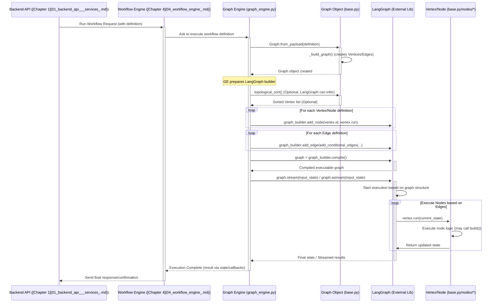

---
layout: default
title: "Graph Engine"
parent: "Bisheng"
nav_order: 5
---

# Chapter 5: Graph Engine

Welcome back! In [Chapter 4: Workflow Engine](04_workflow_engine_.md), we learned how Bisheng uses a Workflow Engine to let you visually design complex processes, like creating an "assembly line" blueprint with different stations (nodes) connected by conveyor belts (edges). We saw how you could define a "Topic Summarizer" workflow.

But who actually reads that blueprint and makes the assembly line *run*? Who ensures each station operates in the correct order and that the product (data) moves correctly between them? That's the job of the **Graph Engine**.

**What Problem Does This Solve?**

Imagine you have your assembly line blueprint (the workflow definition). It specifies:
1.  Get a topic (Input Station).
2.  Brainstorm points (LLM Station 1).
3.  Search the web (Tool Station).
4.  Summarize (LLM Station 2).
5.  Show the result (Output Station).

The blueprint also shows the connections: Input -> LLM1 -> Tool -> LLM2 -> Output.

Now, how does the system *actually* execute this? It needs an engine that can:

*   Understand the blueprint (nodes and edges).
*   Figure out the correct sequence (Input *before* LLM1, LLM1 *before* Tool, etc.). This is crucial because some stations need the output from previous ones.
*   Trigger each station (node) to perform its task at the right time.
*   Manage the overall flow of data.

The **Graph Engine** is the core component responsible for these tasks. It takes the workflow definition and turns it into a live, running process. Think of it as the central control system for the assembly line, ensuring everything happens efficiently and in the right order.

**Analogy: The Recipe Engine**

Let's use a cooking analogy. You have a recipe (the workflow definition):

1.  Chop onions (Node A).
2.  Brown onions (Node B - needs chopped onions from A).
3.  Add spices (Node C - needs browned onions from B).
4.  Simmer (Node D - needs spiced onions from C).

The **Graph Engine** is like the chef actually following the recipe:

*   It reads the steps (nodes) and dependencies (edges - "needs chopped onions").
*   It figures out the order: A -> B -> C -> D (this is called **Topological Sorting**).
*   It executes each step in that order: first chopping, then browning, then adding spices, then simmering.
*   It makes sure the output of one step (chopped onions) is ready for the next step that needs it.

**Key Concepts**

1.  **Graph Representation:** The engine internally represents the workflow as a mathematical graph. Nodes become "vertices," and edges remain "edges" connecting these vertices. This structure makes it easy to analyze dependencies.
2.  **Topological Sort:** This is a fancy term for figuring out the correct execution order. If Node B needs data from Node A, the engine knows it *must* run Node A before Node B. It sorts all the nodes into a valid sequence based on these dependencies. If there's a loop (e.g., Node A needs Node B, and Node B needs Node A), it can detect this problem.
3.  **Node Building/Execution:** Once the order is determined, the engine iterates through the sorted nodes. For each node, it "builds" or "runs" it. This involves:
    *   Gathering the necessary input data (often from the `GraphState` managed by the [Workflow Engine](04_workflow_engine_.md)).
    *   Creating the specific component instance (like an LLM object or a Tool object).
    *   Executing the node's core logic (calling the LLM, running the tool, executing code).
    *   Storing the output back into the `GraphState` for downstream nodes.
4.  **Parameter Handling:** The engine ensures that when a node is built, it receives the correct configuration parameters and data inputs defined in the workflow.

**How It Works: Running the "Topic Summarizer"**

Let's see how the Graph Engine runs the Topic Summarizer workflow defined in Chapter 4.

1.  **Input:** The [Workflow Engine](04_workflow_engine_.md) gives the Graph Engine the workflow definition (the JSON-like structure with nodes and edges).
2.  **Parsing:** The Graph Engine reads this definition and creates an internal graph structure using `Vertex` objects for nodes and `Edge` objects for connections.
    *   It creates `Vertex` instances for Input, LLM1, Tool, LLM2, and Output nodes.
    *   It creates `Edge` instances representing the flow: Input -> LLM1, LLM1 -> Tool, etc.
3.  **Topological Sort:** The engine analyzes the graph and determines the execution order: `[Input, LLM1, Tool, LLM2, Output]` (ignoring Start/End for simplicity).
4.  **Execution Loop:** The engine starts processing the nodes in the sorted order:
    *   **Run `Input` Node:** Executes the `Input` vertex. It might pause and wait for user input (as coordinated by the [Workflow Engine](04_workflow_engine_.md)). The topic provided by the user is stored.
    *   **Run `LLM1` Node:** Executes the `LLM1` vertex. It fetches the topic (from the shared state), calls the LLM to brainstorm points, and stores the points.
    *   **Run `Tool` Node:** Executes the `Tool` vertex. It fetches the brainstormed points, performs the web search, and stores the results.
    *   **Run `LLM2` Node:** Executes the `LLM2` vertex. It fetches the points and search results, calls the LLM to summarize, and stores the summary.
    *   **Run `Output` Node:** Executes the `Output` vertex. It fetches the final summary and displays it to the user (again, coordinated by the [Workflow Engine](04_workflow_engine_.md)).
5.  **Output:** The workflow completes, having followed the defined steps in the correct order.

**Looking at the Code (Simplified Concepts)**

Let's peek at the core classes involved.

**1. The `Graph` Class (The Blueprint Reader)**

This class takes the raw workflow definition and builds the internal graph representation.

```python
# Simplified from src/backend/bisheng/graph/graph/base.py
from bisheng.graph.vertex.base import Vertex
from bisheng.graph.edge.base import Edge
from bisheng.graph.graph.utils import process_flow, raw_topological_sort
from typing import Dict, List

class Graph:
    def __init__(self, nodes: List[Dict], edges: List[Dict]) -> None:
        # Store raw data and process potential nested groups
        self.raw_graph_data = {'nodes': nodes, 'edges': edges}
        self._graph_data = process_flow(self.raw_graph_data) # Handle nested flows

        self._vertices_data = self._graph_data['nodes']
        self._edges_data = self._graph_data['edges']

        self.vertices: List[Vertex] = [] # Will hold Vertex objects
        self.edges: List[Edge] = []     # Will hold Edge objects
        self.vertex_map: Dict[str, Vertex] = {} # Quick access by ID

        self._build_graph() # Create Vertex and Edge objects

    @classmethod
    def from_payload(cls, payload: Dict) -> 'Graph':
        """Creates a graph from a payload dictionary."""
        if 'data' in payload:
            payload = payload['data']
        # Basic validation
        if 'nodes' not in payload or 'edges' not in payload:
            raise ValueError("Payload must contain 'nodes' and 'edges'.")
        return cls(payload['nodes'], payload['edges'])

    def _build_graph(self) -> None:
        """Builds the graph structures (Vertices and Edges)."""
        self.vertices = self._build_vertices() # Create Vertex objects
        self.vertex_map = {vertex.id: vertex for vertex in self.vertices}
        self.edges = self._build_edges()       # Create Edge objects
        # ... (Validate connections, build parameters for each vertex) ...
        for vertex in self.vertices:
            vertex._build_params() # Prepare parameters for each node

    def _build_vertices(self) -> List[Vertex]:
        """Creates Vertex objects from node data."""
        nodes_list = []
        for node_data in self._vertices_data:
            # Determines the correct Vertex subclass (e.g., LLMVertex, ToolVertex)
            VertexClass = self._get_vertex_class(node_data)
            vertex = VertexClass(node_data, graph=self)
            nodes_list.append(vertex)
        return nodes_list

    def _build_edges(self) -> List[Edge]:
        """Creates Edge objects connecting vertices."""
        edges_list = []
        for edge_data in self._edges_data:
            source_vertex = self.vertex_map.get(edge_data['source'])
            target_vertex = self.vertex_map.get(edge_data['target'])
            if source_vertex and target_vertex:
                edge = Edge(source_vertex, target_vertex, edge_data)
                edges_list.append(edge)
            # Handle errors if vertices not found
        return edges_list

    def _get_vertex_class(self, node_data) -> type[Vertex]:
        """Determines the appropriate Vertex subclass based on node type."""
        # (Logic to map node type string to actual class, like LLMVertex, ToolVertex)
        # Uses lazy_load_vertex_dict from constants.py
        node_type = node_data['data']['type']
        base_type = node_data['data']['node']['template']['_type']
        # ... (lookup logic using lazy_load_vertex_dict) ...
        return Vertex # Placeholder, actual logic is more complex

    def topological_sort(self) -> List[Vertex]:
        """Performs topological sort to find execution order."""
        # Uses Depth First Search (DFS) algorithm on vertices and edges
        # to determine a valid linear order. Detects cycles.
        # Example implementation using a simplified raw sort:
        sorted_node_data = raw_topological_sort(self._vertices_data, self._edges_data)
        # Map sorted data back to Vertex objects
        return [self.vertex_map[node['id']] for node in sorted_node_data]

```

*   `__init__` / `from_payload`: Takes the raw node and edge data.
*   `_build_graph`: Orchestrates the creation of internal `Vertex` and `Edge` objects.
*   `_build_vertices` / `_build_edges`: Creates the actual vertex and edge instances. `_get_vertex_class` figures out *which* type of `Vertex` to create.
*   `topological_sort`: This is the crucial method that calculates the correct order to run the nodes.

**2. The `Vertex` Class (The Station/Recipe Step Executor)**

This class (and its subclasses like `LLMVertex`, `ToolVertex`) represents a single node and knows how to execute its specific task.

```python
# Simplified from src/backend/bisheng/graph/vertex/base.py

class Vertex:
    def __init__(self, data: Dict, graph: 'Graph', **kwargs) -> None:
        self.id: str = data['id']
        self.graph = graph
        self._data = data
        self._built_object: Any = UnbuiltObject() # Stores the result after building
        self._built: bool = False
        self.params: Dict[str, Any] = {} # Parameters needed to run
        # ... (parse data like vertex_type, inputs/outputs) ...
        self.vertex_type = data['data']['type'] # Example: 'LLM', 'Tool'

    def _build_params(self):
        """Determines parameters needed by this node from template and edges."""
        # (Logic to figure out which values/outputs from other nodes are needed)
        # Stores required parameters in self.params
        pass # Complex logic omitted for brevity

    async def build(self, force: bool = False, user_id=None, *args, **kwargs) -> Any:
        """Public method to build/run the vertex."""
        if not self._built or force:
            print(f"GraphEngine: Building vertex {self.id} ({self.vertex_type})")
            await self._build(user_id=user_id, *args, **kwargs) # Call internal build logic
            self._built = True
        return self._built_object # Return the result

    async def _build(self, user_id=None, *args, **kwargs):
        """Internal method with the core build logic."""
        # 1. Build dependent nodes referenced in self.params recursively
        await self._build_each_node_in_params_dict(user_id=user_id)

        # 2. Instantiate the actual component class (e.g., LangChain LLM)
        # Uses loading.instantiate_class which maps vertex_type to implementation
        result = await loading.instantiate_class(
            node_type=self.vertex_type,
            base_type=self.base_type, # e.g., 'llms', 'tools'
            params=self.params,
            user_id=user_id
        )
        # Store the result
        if isinstance(result, tuple): # Some components return result + artifacts
            self._built_object, self.artifacts = result
        else:
            self._built_object = result

        # Validate the result (e.g., ensure it's not None)
        self._validate_built_object()

    async def _build_each_node_in_params_dict(self, user_id=None):
        """Recursively build dependencies needed by this node."""
        # (Iterates self.params, finds Vertex instances, calls their build method)
        pass # Complex logic omitted

    def _validate_built_object(self):
        """Checks if the build was successful."""
        if self._built_object is None or isinstance(self._built_object, UnbuiltObject):
             raise ValueError(f"Failed to build vertex {self.id} ({self.vertex_type})")

    # ... (other helper methods) ...
```

*   `__init__`: Stores node data and a reference to the `Graph`.
*   `_build_params`: Figures out what inputs this node needs from its configuration and incoming edges.
*   `build`: The main method called by the engine to execute this node. It triggers the internal `_build`.
*   `_build`: The core logic:
    *   Recursively ensures all input nodes (`Vertex` instances found in `self.params`) are built first (`_build_each_node_in_params_dict`).
    *   Instantiates and runs the actual component logic (e.g., calls LangChain, runs Python code) via `loading.instantiate_class`.
    *   Stores the result in `self._built_object`.
*   `_validate_built_object`: Simple check to ensure the build produced a valid result.

**3. Conceptual Execution Flow**

The engine (often part of the [Workflow Engine](04_workflow_engine_.md)'s execution logic) combines these pieces:

```python
# Conceptual execution code (simplified, actual logic in Workflow/GraphEngine classes)
from bisheng.graph.graph.base import Graph

async def run_workflow(workflow_payload: dict):
    # 1. Create the Graph object from the definition
    graph = Graph.from_payload(workflow_payload)

    # 2. Get the execution order
    try:
        sorted_vertices = graph.topological_sort()
    except ValueError as e:
        print(f"Error: Workflow contains a cycle! {e}")
        return None # Cannot run a graph with a cycle

    print(f"Execution Order: {[v.id for v in sorted_vertices]}")

    # 3. Execute each vertex in order
    final_result = None
    try:
        for vertex in sorted_vertices:
            # The build method fetches inputs (built by previous steps)
            # and executes the node's logic.
            # Results are stored within the vertex or a shared state.
            result = await vertex.build() # This might pause for Input nodes

            # Identify the final output node(s) if needed (logic omitted)
            # For simplicity, assume last node holds the final result
            final_result = result

        print("Workflow execution successful!")
        return final_result # Or retrieve from specific Output node

    except Exception as e:
        print(f"Workflow execution failed at node {vertex.id}: {e}")
        return None

# Example Usage:
# workflow_definition = { 'nodes': [...], 'edges': [...] }
# final_output = await run_workflow(workflow_definition)
# print("Final Output:", final_output)
```

This simplified code shows the core steps: create the `Graph`, get the `topological_sort`, and then loop through the sorted vertices, calling `build()` on each.

**Internal Implementation**

Let's trace the process when a request to run a workflow hits the backend.

1.  **Request:** User action triggers an API call (e.g., via [Backend API & Services](01_backend_api___services_.md)) to run a specific workflow.
2.  **Workflow Engine Trigger:** The API handler typically passes the request to the [Workflow Engine](04_workflow_engine_.md) layer (e.g., `Workflow` class in `src/backend/bisheng/workflow/graph/workflow.py`).
3.  **Graph Engine Initialization:** The `Workflow` class often initializes a `GraphEngine` (`src/backend/bisheng/workflow/graph/graph_engine.py`). The `GraphEngine` itself creates the `Graph` object (`Graph.from_payload`).
4.  **Graph Building:** Inside `Graph.__init__`, `_build_graph` is called, which creates all the `Vertex` and `Edge` instances based on the definition (`_build_vertices`, `_build_edges`). Each `Vertex` also prepares its parameters (`_build_params`).
5.  **Topological Sort:** The `Workflow` or `GraphEngine` calls `graph.topological_sort()` to get the ordered list of `Vertex` objects.
6.  **Execution (LangGraph):** Bisheng often uses a library like `LangGraph` underneath (`StatefulGraph` in `graph_engine.py`). The sorted nodes and edges are added to this underlying state machine (`graph_builder.add_node`, `add_node_edge`).
7.  **Streaming/Running:** The engine invokes the LangGraph execution (`graph.stream()` or `graph.astream()`). LangGraph manages stepping through the nodes based on the defined edges and conditions. When LangGraph executes a node, it effectively calls the corresponding `Vertex.run()` or a similar method defined in the `BaseNode` subclasses ([Chapter 4: Workflow Engine](04_workflow_engine_.md)), which in turn calls the `Vertex.build()` logic we discussed if the underlying component needs building.
8.  **State Management:** Throughout execution, nodes read from and write to the `GraphState` ([Chapter 4: Workflow Engine](04_workflow_engine_.md)) to pass data along the "conveyor belt".
9.  **Completion:** Once LangGraph reaches the end node, the execution finishes. Results are typically communicated back via callbacks or the final state.

**Sequence Diagram:**



This diagram shows how the `Graph` object parses the definition, and an underlying library like LangGraph (managed by `GraphEngine`/`Workflow`) handles the actual step-by-step execution, calling the `run` method of the appropriate node/vertex representation at each stage.

**Connecting to Other Parts**

The Graph Engine is the heart of workflow execution:

*   It's used by the [Workflow Engine](04_workflow_engine_.md) to run the workflows defined visually or programmatically.
*   It relies on the `Vertex` and `Edge` representations defined in `bisheng.graph.vertex` and `bisheng.graph.edge`.
*   It orchestrates the building and running of components from various interface layers (like [LLM & Embedding Wrappers](08_llm___embedding_wrappers_.md)).
*   The process it executes reads and writes data using the `GraphState` concept from the [Workflow Engine](04_workflow_engine_.md).
*   It takes the workflow structure, often loaded via [Backend API & Services](01_backend_api___services_.md) and stored using [Database Models](09_database_models_.md).

**Conclusion**

We've learned about the Graph Engine, the crucial component that takes a static workflow definition (the blueprint) and brings it to life. It parses the nodes and edges, uses topological sorting to determine the correct execution order, and then meticulously builds and runs each node, ensuring data flows correctly between them. It's the engine that powers the automated assembly lines you design in Bisheng.

Many modern AI workflows, especially those involving custom knowledge, use a technique called Retrieval-Augmented Generation (RAG). How does Bisheng implement the "Retrieval" part of this? Let's explore that next.

Ready to dive into knowledge retrieval? Let's move on to [Chapter 6: RAG Pipeline](06_rag_pipeline_.md).

---

Generated by [AI Codebase Knowledge Builder](https://github.com/The-Pocket/Tutorial-Codebase-Knowledge)