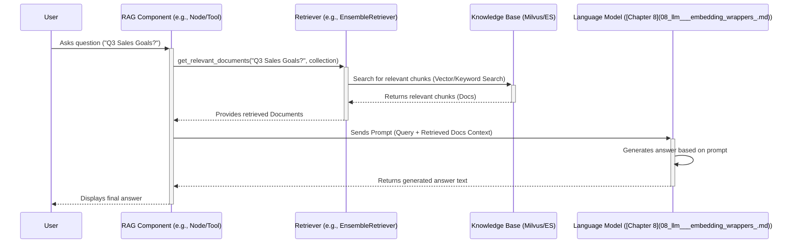

# Chapter 6: RAG Pipeline

Welcome back! In [Chapter 5: Graph Engine](05_graph_engine_.md), we saw how Bisheng takes a workflow blueprint and executes it step-by-step. Now, let's look at a very common and powerful pattern used within those workflows or in AI assistants: giving the AI access to specific knowledge.

Imagine you built a chatbot using a powerful Large Language Model (LLM). You ask it, "What were our company's main product updates in the last quarter?" The general LLM might not know this specific internal information. How can we make the AI knowledgeable about _your_ data (like company reports, product documentation, or meeting notes)?

This is where the **RAG Pipeline** comes in. RAG stands for **Retrieval-Augmented Generation**.

**What Problem Does This Solve?**

Standard LLMs are trained on vast amounts of public internet data. They are great at general conversation, writing, and reasoning, but they lack knowledge about specific, private, or very recent information.

The RAG Pipeline solves this by:

1.  **Retrieving** relevant information from a specific knowledge base (like your company documents) based on the user's query.
2.  **Augmenting** the LLM's input by providing this retrieved information as extra context.
3.  **Generating** an answer that considers both the original query and the retrieved context.

Essentially, it gives the LLM "open-book access" to your specific documents when answering questions.

**Analogy: The Research Assistant**

Think of the RAG Pipeline like a helpful research assistant:

1.  **You Ask a Question:** "What did our team decide about Project X in last week's meeting?"
2.  **Assistant Goes to the Library (Retrieval):** The assistant doesn't just guess. It goes to your company's knowledge base (like a digital library storing meeting notes, perhaps in a system like Milvus or Elasticsearch). It searches for notes specifically mentioning "Project X" from "last week's meeting".
3.  **Assistant Gathers Notes (Context):** It finds the relevant paragraphs or sections from the meeting notes.
4.  **Assistant Synthesizes an Answer (Generation):** The assistant reads your original question _and_ the notes it gathered. It then writes a concise answer based _specifically_ on that information: "According to last week's meeting notes, the team decided to proceed with Option A for Project X."

The RAG Pipeline automates this process for the AI.

**Key Concepts**

The RAG pattern mainly involves two stages:

1.  **Retrieval:** This is the "library lookup" stage.

    - **Knowledge Base:** Your collection of documents (PDFs, text files, web pages, etc.) that have been processed and stored in a searchable format. This often involves splitting documents into smaller chunks and storing them in a specialized database like a vector store (Milvus) or a keyword search index (Elasticsearch). ([Chapter 8: LLM & Embedding Wrappers](08_llm___embedding_wrappers_.md) covers embeddings used here).
    - **Retriever:** The component responsible for searching the knowledge base. Given a user query, it finds the most relevant document chunks. Bisheng might use different retrieval strategies:
      - **Vector Search:** Finds chunks that are semantically similar to the query (based on meaning).
      - **Keyword Search:** Finds chunks that contain specific keywords from the query.
      - **Hybrid Search:** Combines both vector and keyword search for better results (e.g., using `MixEsVectorRetriever` or `EnsembleRetriever`).

2.  **Generation:** This is the "answer synthesis" stage.
    - **Context:** The relevant document chunks retrieved in the previous step.
    - **Prompt:** A carefully crafted instruction for the LLM, telling it to answer the user's original query using the provided context.
    - **LLM:** The Large Language Model ([Chapter 8: LLM & Embedding Wrappers](08_llm___embedding_wrappers_.md)) that takes the prompt (containing the original query and the retrieved context) and generates the final answer.

**How It Works: Answering "Q3 Sales Goals?"**

Let's revisit the "Q3 sales goals" example:

1.  **Input:** User asks the AI, "What were our company's Q3 sales goals?"
2.  **Retrieval Stage:**
    - The **Retriever** takes the query ("What were our company's Q3 sales goals?").
    - It searches the company's **Knowledge Base** (containing sales reports).
    - It finds relevant chunks, perhaps like: "Q3 Sales Plan: Target $5M revenue, focusing on enterprise clients..." and "Executive Summary: Q3 goals include launching Product Y and achieving $5M sales..."
3.  **Generation Stage:**
    - A **Prompt** is constructed, maybe like:
      ```
      Use the following context to answer the user's question.
      Context:
      ---
      Q3 Sales Plan: Target $5M revenue, focusing on enterprise clients...
      Executive Summary: Q3 goals include launching Product Y and achieving $5M sales...
      ---
      Question: What were our company's Q3 sales goals?
      Answer:
      ```
    - This prompt is sent to the **LLM**.
    - The LLM reads the context and the question.
4.  **Output:** The LLM generates the answer based on the retrieved context: "Our company's Q3 sales goals were to achieve $5M in revenue, primarily by focusing on enterprise clients and launching Product Y."

**Looking at the Code (Simplified Concepts)**

In Bisheng, RAG functionality is often encapsulated within workflow nodes or tools used by assistants. Let's look at conceptual pieces.

**1. Using a Retriever**

The first step is getting relevant documents. This uses retriever components.

```python
# Simplified concept based on retriever usage
from bisheng_langchain.retrievers import EnsembleRetriever # Example retriever
# Assume 'retriever' is configured (e.g., connected to Milvus/Elasticsearch)
# In a workflow, this might be part of an 'RAG Node' or 'Retriever Node'

query = "What were our company's Q3 sales goals?"
collection_name = "company_sales_reports" # Specify which knowledge base to search

# Use the retriever to find relevant document chunks
# In Bisheng, retrievers might be composite (like EnsembleRetriever)
# combining results from different sources or strategies.
# (See src/bisheng-langchain/retrievers/ensemble.py)
# (See src/bisheng-langchain/retrievers/mix_es_vector.py)
retrieved_docs = retriever.get_relevant_documents(query, collection_name=collection_name)

# retrieved_docs is now a list of Document objects, e.g.:
# [ Document(page_content="Q3 Sales Plan: Target $5M...", metadata={...}),
#   Document(page_content="Executive Summary: Q3 goals include...", metadata={...}) ]

print(f"Retrieved {len(retrieved_docs)} relevant documents.")
```

- This code snippet shows calling the `get_relevant_documents` method of a configured `retriever` object.
- It passes the user's `query` and the target `collection_name`.
- The retriever handles the underlying search (vector, keyword, or hybrid) against the knowledge base (Milvus, Elasticsearch).
- It returns a list of `Document` objects containing the relevant text chunks.

**2. Using the LLM with Retrieved Context**

The next step is generating the answer using the retrieved documents.

```python
# Simplified concept using a Question-Answering chain
from langchain.chains.question_answering import load_qa_chain # Example chain
# Assume 'llm' is a configured Large Language Model instance
# Assume 'retrieved_docs' contains the documents from the previous step

# Load a pre-configured chain designed for QA with context
# This chain knows how to format the prompt correctly
# (See src/bisheng-langchain/rag/bisheng_rag_chain.py for Bisheng's implementation)
qa_chain = load_qa_chain(llm, chain_type="stuff") # "stuff" means put all context in prompt

# Run the chain with the retrieved documents and the original query
result = qa_chain(
    {"input_documents": retrieved_docs, "question": query},
    return_only_outputs=True
)

final_answer = result['output_text']
print("Final Answer:", final_answer)
# Output: Final Answer: Our company's Q3 sales goals were to achieve $5M...
```

- This code uses a pre-built LangChain `load_qa_chain` (Bisheng has its own wrappers like `BishengRetrievalQA` or `BishengRAGTool`).
- The chain takes the `retrieved_docs` and the original `query`.
- Internally, it constructs the prompt (like the example shown earlier) and calls the `llm`.
- It returns the final generated answer.

**Internal Implementation: The RAG Flow**

Let's trace the journey when a RAG component (like a node in a workflow or a tool used by an assistant) is invoked.



**Step-by-Step:**

1.  **Query Input:** The RAG component receives the user's query.
2.  **Retrieval:** It calls the configured `Retriever` with the query and target collection.
3.  **KB Search:** The `Retriever` interacts with the underlying Knowledge Base (e.g., queries Milvus for similar vectors or Elasticsearch for keywords).
4.  **Context Return:** The KB returns the most relevant document chunks.
5.  **Prompt Formatting:** The RAG component takes the original query and the retrieved document chunks and formats them into a specific prompt for the LLM.
6.  **LLM Generation:** The prompt is sent to the configured LLM.
7.  **Answer Return:** The LLM generates the answer based on the provided context and returns it.
8.  **Output:** The RAG component outputs the final answer.

**Deeper Code Dive:**

- **`BishengRAGTool` (`src/bisheng-langchain/bisheng_langchain/rag/bisheng_rag_tool.py`):** This class often acts as the main entry point for RAG when used as a "Tool" (e.g., by an Assistant).
  - `__init__`: Initializes the LLM, vector store (Milvus), keyword store (ES), configures the `EnsembleRetriever`, and sets up the QA chain (`create_stuff_documents_chain`).
  - `retrieval_and_rerank`: Performs the retrieval using the configured `EnsembleRetriever` and potentially applies reranking logic (using models like those in `rag/rerank/`).
  - `run`/`arun`: Orchestrates the process: calls `retrieval_and_rerank` to get documents, then invokes the `qa_chain` with the query and documents to get the final answer.
- **`EnsembleRetriever` (`src/bisheng-langchain/retrievers/ensemble.py`):** Combines results from multiple underlying retrievers (e.g., one for vector search, one for keyword). It uses techniques like Reciprocal Rank Fusion (RRF) to merge and rank the results.
- **`MixEsVectorRetriever` (`src/bisheng-langchain/retrievers/mix_es_vector.py`):** Another strategy for combining keyword (ES) and vector search results, offering different ways to interleave or prioritize results.
- **Specific Retrievers (`src/bisheng-langchain/rag/init_retrievers/`):** Classes like `BaselineVectorRetriever`, `KeywordRetriever`, `SmallerChunksVectorRetriever` define specific strategies for how documents are processed (split) and how the underlying vector/keyword stores are queried. They inherit from LangChain's `BaseRetriever`.
  - `add_documents`: Handles splitting input documents and adding them to the appropriate store (Milvus/ES).
  - `_get_relevant_documents`: Implements the core logic for querying the store based on the input query.
- **QA Chains (`src/bisheng-langchain/rag/bisheng_rag_chain.py`, LangChain Core):** Components like `BishengRetrievalQA` or standard LangChain functions (`load_qa_chain`, `create_stuff_documents_chain`) are responsible for taking the query and context documents and interacting with the LLM to generate the final answer, using specific prompts (like those in `rag/prompts/`).

**Connecting to Other Parts**

The RAG Pipeline connects several key components:

- It's often implemented as a node within a [Workflow Engine](04_workflow_engine_.md) or used as a tool by a [GPTS / Assistant Abstraction](03_gpts___assistant_abstraction_.md).
- The **Retrieval** step relies heavily on vector stores (Milvus) and keyword stores (Elasticsearch), which use embeddings generated via [LLM & Embedding Wrappers](08_llm___embedding_wrappers_.md). Document processing and storage might interact with [Database Models](09_database_models_.md) for metadata.
- The **Generation** step uses the LLM via [LLM & Embedding Wrappers](08_llm___embedding_wrappers_.md).
- The underlying execution might be managed by the [Graph Engine](05_graph_engine_.md) if RAG is part of a larger workflow.

**Conclusion**

You've now learned about the Retrieval-Augmented Generation (RAG) Pipeline, a fundamental technique for making LLMs knowledgeable about specific information. By first retrieving relevant context from a knowledge base (like your documents in Milvus or Elasticsearch) and then feeding that context along with the query to an LLM, RAG enables AI to answer questions accurately about data it wasn't originally trained on. We saw how Bisheng uses components like Retrievers and QA Chains to implement this powerful pattern.

Now that we understand the core backend components like APIs, WebSockets, Assistants, Workflows, Graph execution, and RAG, how do users actually interact with all this power? How is the visual interface built and connected to the backend?

Let's explore that in the next chapter: [Chapter 7: Interface Layer](07_interface_layer_.md).

---

Generated by [AI Codebase Knowledge Builder](https://github.com/The-Pocket/Tutorial-Codebase-Knowledge)
