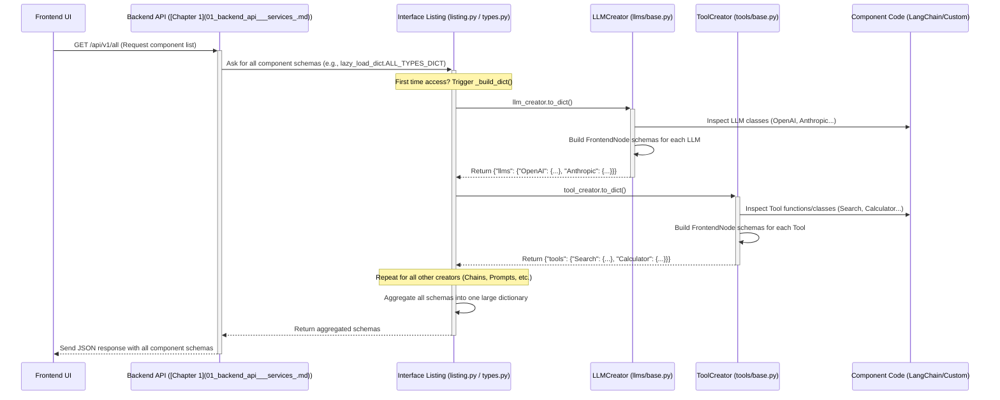

---
layout: default
title: "Interface Layer"
parent: "Bisheng"
nav_order: 7
---

# Chapter 7: Interface Layer

Welcome back! In [Chapter 6: RAG Pipeline](06_rag_pipeline_.md), we explored how Bisheng can retrieve information from your specific documents to provide context-aware answers. We've seen assistants, workflows, and RAG pipelines. But how does the visual builder in Bisheng know about all these different pieces – the LLMs, the tools, the chains, the RAG components? How does it know what options to show you in the menus and what settings each component needs?

That's the role of the **Interface Layer**.

**What Problem Does This Solve?**

Imagine you're using Bisheng's visual workflow editor. You want to add a new component, maybe an OpenAI LLM, to your workflow.

*   How does the editor know that "OpenAI" is an available LLM option?
*   When you drag the "OpenAI" node onto the canvas, how does the editor know it needs fields for "API Key," "Model Name," and "Temperature"?
*   How does it know that "Temperature" should be a number slider, while "Model Name" might be a dropdown menu?
*   Where does the helpful description or documentation link for the "OpenAI" node come from?

Trying to hardcode all this information for every possible component would be messy and impossible to maintain, especially as new components are added.

The **Interface Layer** solves this by acting as a central **registry** and **definition point** for all the building blocks available in Bisheng. It provides a standardized way to:

1.  **Discover:** Let the system (especially the frontend UI) find out which components (LLMs, tools, chains, prompts, vector stores, etc.) exist.
2.  **Configure:** Define the specific settings (parameters) each component requires (like API keys, model names, file paths, prompt text).
3.  **Represent:** Describe how these components and their settings should be presented in the user interface (e.g., as text boxes, sliders, dropdowns, file uploads).

Think of it as a meticulously organized catalog or a universal toolbox where every tool and part is clearly labeled with its specifications, making it easy for the UI (and developers) to find and use them correctly when building flows. It separates the underlying implementation (like LangChain components) from how Bisheng manages and displays them.

**Analogy: The Ultimate LEGO Catalog**

Imagine a massive LEGO catalog.

*   **Discovery:** The catalog lists all the available LEGO bricks and sets (LLMs, Tools, Chains). You can flip through sections like "Technic," "City," "Star Wars" (different component types).
*   **Configuration:** Each entry shows the specific brick (component). It details its properties: color, number of studs (parameters like `model_name`, `temperature`). It might say "Requires 2x AA batteries" (a required field like `api_key`).
*   **Representation:** The catalog shows a picture of the brick and maybe a little icon indicating its type. It presents the properties in a clear, understandable way.

The Interface Layer is Bisheng's "LEGO catalog," providing all the necessary information for the visual builder (and the rest of the system) to work with the available building blocks.

**Key Concepts**

1.  **Component Registration & Discovery:** The process by which components make themselves known to the system. The Interface Layer aggregates information about components from various sources (standard LangChain libraries, Bisheng's custom components). It allows the system to ask questions like, "List all available LLMs" or "List all available Tools."
2.  **Component Schema/Signature (`FrontendNode`, `Template`, `TemplateField`):** This is the standardized "catalog entry" for each component. It defines:
    *   **`name`**: The unique identifier (e.g., "OpenAI").
    *   **`description`**: A user-friendly explanation of what it does.
    *   **`base_classes`**: What kind of component it is (e.g., "LLM," "Tool," "Chain"). This helps categorize components.
    *   **`Template`**: Contains a list of `TemplateField` objects defining the configuration parameters.
    *   **`TemplateField`**: Describes a single parameter (e.g., "api_key," "temperature"). It specifies:
        *   `name`: Internal parameter name.
        *   `display_name`: How the parameter name looks in the UI.
        *   `field_type`: The data type (string, integer, boolean, LLM, Tool, file, password, code, etc.). This determines the UI element (text box, slider, dropdown, file picker).
        *   `required`: Whether the user must provide a value.
        *   `placeholder`: Hint text in the input field.
        *   `value`: A default value.
        *   `options`: A list of choices for dropdown menus.
        *   `fileTypes`: Allowed file extensions for file inputs.
        *   ...and other UI-related properties (multiline, show/hide, advanced).
3.  **Type Creators (`LangChainTypeCreator` subclasses):** Specialized classes responsible for finding and generating the schemas for a specific category of components. For example:
    *   `LLMCreator`: Finds all LLMs (OpenAI, Anthropic, Azure, custom) and generates their schemas.
    *   `ToolCreator`: Finds all tools (Search, Calculator, custom Python tools) and generates their schemas.
    *   `ChainCreator`: Finds all chains.
    *   ...and so on for prompts, embeddings, vector stores, etc.

**How It Works: Populating the Node Menu**

Let's trace how the Interface Layer helps populate the menu you see when adding a node in the Bisheng UI:

1.  **Frontend Request:** The Bisheng frontend UI needs to show the user a list of available nodes (e.g., in a sidebar menu categorized by type). It sends a request to the [Backend API & Services](01_backend_api___services_.md), typically asking for `/api/v1/all` or a similar endpoint that lists components.
2.  **Backend API Handling:** The API endpoint receives the request.
3.  **Interface Layer Query:** The endpoint calls a function within the Interface Layer, like `get_all_types_dict()` (from `src/backend/bisheng/interface/types.py`).
4.  **Gathering Schemas:**
    *   `get_all_types_dict()` iterates through all registered **Type Creators** (`LLMCreator`, `ToolCreator`, `ChainCreator`, etc.).
    *   It calls a method like `to_dict()` on each creator.
    *   `LLMCreator.to_dict()` finds all available LLM classes (e.g., `OpenAI`, `ChatAnthropic`).
    *   For each LLM class, it calls `get_signature()` or `frontend_node()` to generate its schema (`FrontendNode` containing a `Template` with `TemplateFields` for parameters like `openai_api_key`, `model_name`, `temperature`).
    *   This process repeats for `ToolCreator`, `ChainCreator`, and all other creators.
5.  **Aggregation:** The Interface Layer combines all the generated schemas from all creators into a single, large dictionary, categorized by type (LLMs, Tools, Chains, etc.).
6.  **API Response:** The Backend API sends this dictionary back to the frontend as a JSON response.
7.  **UI Display:** The frontend parses the JSON. It now knows all available components, their types, names, descriptions, and required parameters. It uses this information to:
    *   Populate the node selection menu, grouped by type.
    *   Display the correct configuration panel with the right input fields (text boxes, sliders, dropdowns) when a user selects a specific node (like "OpenAI").

**Looking at the Code (Simplified Concepts)**

Let's look at the key classes involved in defining these "catalog entries."

**1. `TemplateField` (`template/field/base.py`) - Defining a Single Setting**

This class defines one configuration parameter for a component.

```python
# Simplified from src/backend/bisheng/template/field/base.py
from pydantic import BaseModel
from typing import List, Optional, Any

class TemplateField(BaseModel):
    # Core properties defining the parameter
    name: str  # Internal name, e.g., "openai_api_key"
    field_type: str  # Data type, e.g., "str", "int", "bool", "password", "file", "LLM"
    required: bool = False
    value: Optional[Any] = None # Default value

    # UI-related properties
    display_name: Optional[str] = None # Name shown in UI, e.g., "OpenAI API Key"
    show: bool = True # Whether to show in UI
    placeholder: str = ""
    is_list: bool = False # If the parameter expects a list of values
    multiline: bool = False # For multi-line string inputs
    options: Optional[List[str]] = None # Dropdown options
    file_types: Optional[List[str]] = None # Allowed file extensions, e.g., ['.json', '.csv']
    advanced: bool = False # Hide under "Advanced" toggle?
    # ... other fields like suffixes, info ...

    def to_dict(self):
        # Returns a dictionary representation for the frontend
        # (Simplified logic)
        return self.dict(exclude_none=True)

# Example Usage (conceptual):
api_key_field = TemplateField(
    name="openai_api_key",
    display_name="OpenAI API Key",
    field_type="password", # Tells UI to use a password input field
    required=True,
    show=True,
    placeholder="Enter your OpenAI API key"
)

temperature_field = TemplateField(
    name="temperature",
    display_name="Temperature",
    field_type="float", # Could be mapped to a slider in UI
    required=False,
    show=True,
    value=0.7, # Default value
    advanced=False
)
```

*   `TemplateField` defines a single configuration option. Attributes like `name`, `field_type`, `required`, and `value` define the parameter itself, while others like `display_name`, `show`, `placeholder`, and `options` guide the UI representation.

**2. `Template` (`template/template/base.py`) - Grouping Settings for a Component**

This holds all the `TemplateField` objects for a single component.

```python
# Simplified from src/backend/bisheng/template/template/base.py
from pydantic import BaseModel
from typing import List, Dict
# from bisheng.template.field.base import TemplateField # Assuming import

class Template(BaseModel):
    type_name: str # The component's name, e.g., "OpenAI"
    fields: List[TemplateField] = [] # List of all parameters for this component

    def to_dict(self) -> Dict:
        # Returns a dictionary for the frontend
        return {field.name: field.to_dict() for field in self.fields}

    def add_field(self, field: TemplateField):
        self.fields.append(field)

# Example Usage (conceptual):
openai_template = Template(
    type_name="OpenAI",
    fields=[
        TemplateField(name="_type", field_type="str", value="llms", show=False), # Hidden type field
        TemplateField(name="model_name", display_name="Model Name", field_type="str", value="gpt-3.5-turbo"),
        TemplateField(name="temperature", display_name="Temperature", field_type="float", value=0.7),
        TemplateField(name="openai_api_key", display_name="API Key", field_type="password", required=True)
        # ... other fields like max_tokens, openai_api_base, etc.
    ]
)
```

*   A `Template` groups multiple `TemplateField`s for one component (like "OpenAI").

**3. `FrontendNode` (`template/frontend_node/base.py`) - The Full UI Definition**

This class bundles the `Template` with other UI-relevant information like description and base classes.

```python
# Simplified from src/backend/bisheng/template/frontend_node/base.py
from pydantic import BaseModel
from typing import List, Dict, Optional
# from bisheng.template.template.base import Template # Assuming import

class FrontendNode(BaseModel):
    template: Template # The fields/parameters defined above
    description: str = "" # User-friendly description
    base_classes: List[str] = [] # Component type, e.g., ["LLM", "BaseLanguageModel"]
    name: str = "" # Component name, often same as template.type_name
    display_name: Optional[str] = None # Optional different display name
    documentation: str = "" # Link to documentation page

    def to_dict(self) -> Dict:
        # Prepares the final dictionary for the frontend API response
        node_dict = {
            self.name: {
                "template": self.template.to_dict(),
                "description": self.description,
                "base_classes": self.base_classes,
                "display_name": self.display_name or self.name,
                "documentation": self.documentation,
                # ... potentially other metadata ...
            }
        }
        return node_dict

# Example Usage (conceptual):
openai_node = FrontendNode(
    template=openai_template, # The template with API key, temp, etc.
    description="Wrapper around OpenAI large language models.",
    base_classes=["LLM", "BaseLanguageModel"],
    name="OpenAI",
    documentation="https://platform.openai.com/docs/models"
)

# openai_node.to_dict() would produce the JSON structure the frontend expects for OpenAI.
```

*   `FrontendNode` is the complete package for the UI, combining the parameters (`Template`), description, type (`base_classes`), and documentation link.

**4. `LangChainTypeCreator` (`interface/base.py`) - The Abstract Catalog Builder**

This is the blueprint for specific creators (like `LLMCreator`, `ToolCreator`).

```python
# Simplified from src/backend/bisheng/interface/base.py
from abc import ABC, abstractmethod
from typing import Dict, List, Optional, Type, Union
# from bisheng.template.frontend_node.base import FrontendNode # Assuming import

class LangChainTypeCreator(BaseModel, ABC):
    type_name: str # e.g., "llms", "tools", "chains"

    @property
    @abstractmethod
    def type_to_loader_dict(self) -> Dict:
        # Must return a dictionary mapping component names to their actual classes/functions
        # Example for LLMs: {"OpenAI": OpenAI_Class, "ChatAnthropic": ChatAnthropic_Class}
        raise NotImplementedError

    @abstractmethod
    def get_signature(self, name: str) -> Union[Optional[Dict], FrontendNode]:
        # Must return the FrontendNode schema for a given component name
        # This often involves inspecting the class/function and building TemplateFields
        raise NotImplementedError

    @abstractmethod
    def to_list(self) -> List[str]:
        # Must return a list of names of all available components of this type
        # Example for LLMs: ["OpenAI", "ChatAnthropic", "AzureChatOpenAI"]
        raise NotImplementedError

    def to_dict(self) -> Dict:
        # Generates the dict of {component_name: schema} for all components of this type
        result: Dict = {self.type_name: {}}
        for name in self.to_list():
            node = self.frontend_node(name) # Calls get_signature internally
            if node is not None:
                result[self.type_name].update(node.to_dict())
        return result

    def frontend_node(self, name) -> Union[FrontendNode, None]:
        # Helper method to get or build the FrontendNode for a component name
        signature = self.get_signature(name)
        # ... (logic to build FrontendNode from signature if not already one) ...
        # ... (Adds extra fields like documentation link) ...
        return signature # Should return a FrontendNode instance or None
```

*   This abstract class defines the standard methods (`type_to_loader_dict`, `get_signature`, `to_list`, `to_dict`) that each specific creator (like `LLMCreator`) must implement.

**5. Specific Creators (e.g., `LLMCreator` in `interface/llms/base.py`)**

These implement `LangChainTypeCreator` for a specific component type.

```python
# Simplified from src/backend/bisheng/interface/llms/base.py
# from bisheng.interface.base import LangChainTypeCreator # Assuming import
# from bisheng.utils.util import build_template_from_class # Helper function
# from bisheng.interface.custom_lists import llm_type_to_cls_dict # Maps names to classes

class LLMCreator(LangChainTypeCreator):
    type_name: str = 'llms'

    @property
    def type_to_loader_dict(self) -> Dict:
        # Returns the mapping of LLM names to their classes
        # Example: {"OpenAI": <class 'langchain_community.llms.openai.OpenAI'>, ...}
        return llm_type_to_cls_dict # Predefined dictionary

    def get_signature(self, name: str) -> Optional[Dict]:
        # Uses a helper function to inspect the LLM class (e.g., OpenAI)
        # and automatically generate the TemplateFields for its parameters
        # (like api_key, model_name, temperature)
        try:
            # build_template_from_class introspects the class __init__ method
            return build_template_from_class(name, self.type_to_loader_dict)
        except Exception as exc:
            logger.error(f'Failed to get signature for LLM {name}: {exc}')
            return None

    def to_list(self) -> List[str]:
        # Returns a list of available LLM names based on type_to_loader_dict
        # and potentially filters based on settings
        # Example: ["OpenAI", "ChatAnthropic", "AzureChatOpenAI", ...]
        return list(self.type_to_loader_dict.keys())

# llm_creator = LLMCreator() # An instance is created for use
```

*   `LLMCreator` provides the specific implementation for LLMs, telling the system where to find LLM classes (`type_to_loader_dict`) and how to generate their schemas (`get_signature` using helpers like `build_template_from_class`). Similar creators exist for Tools, Chains, Embeddings, etc.

**6. Aggregation (`interface/types.py`, `interface/listing.py`)**

These files bring all the creators together.

```python
# Simplified from src/backend/bisheng/interface/types.py
# Import all specific creators
from bisheng.interface.agents.base import agent_creator
from bisheng.interface.chains.base import chain_creator
from bisheng.interface.llms.base import llm_creator
from bisheng.interface.tools.base import tool_creator
# ... import all other creators ...

# Cache the result for performance
@cached(LRUCache(maxsize=1))
def build_langchain_types_dict():
    """Builds a dictionary containing schemas for all component types."""
    all_types = {}
    # List all creator instances
    creators = [
        chain_creator, agent_creator, llm_creator, tool_creator,
        # ... add all other creator instances ...
    ]
    # Iterate and call to_dict() on each creator to get its components' schemas
    for creator in creators:
        # creator.to_dict() returns something like {"llms": {"OpenAI": {...}, "ChatAnthropic": {...}}}
        all_types.update(creator.to_dict())
    return all_types

def get_all_types_dict():
    """Get all types dictionary combining native and custom components."""
    native_components = build_langchain_types_dict()
    # ... (logic to load custom components might be here too) ...
    return native_components

# --- Simplified from src/backend/bisheng/interface/listing.py ---
# Uses the functions from types.py, often with lazy loading for efficiency

class AllTypesDict(LazyLoadDictBase):
    # ... (Lazy loading implementation) ...
    def _build_dict(self):
        from bisheng.interface.types import get_all_types_dict
        # Get the combined dictionary of all component schemas
        all_component_schemas = get_all_types_dict()
        # Add other types like 'Custom' if needed
        return {
            **all_component_schemas,
            'Custom': ['Custom Tool', 'Python Function'], # Example addition
        }

lazy_load_dict = AllTypesDict() # Global instance used by the API
```

*   `types.py` defines functions (`build_langchain_types_dict`, `get_all_types_dict`) that collect schemas from all individual creators (`llm_creator`, `tool_creator`, etc.).
*   `listing.py` often provides a lazy-loaded dictionary (`lazy_load_dict`) that uses these functions, so the schemas are only generated when first requested by the API.

**Internal Implementation Walkthrough**

Let's visualize the process when the frontend asks for the list of all available components.



**Step-by-Step:**

1.  **Request:** The Frontend requests the component catalog from the Backend API.
2.  **API Call:** The API endpoint accesses the `lazy_load_dict` from `listing.py`.
3.  **Lazy Load & Build:** If accessed for the first time, `lazy_load_dict` calls `get_all_types_dict()` from `types.py`.
4.  **Creator Iteration:** `get_all_types_dict()` iterates through registered creators (`llm_creator`, `tool_creator`, etc.).
5.  **Schema Generation:** It calls `to_dict()` on each creator. The creator inspects the actual component code (from LangChain or custom sources), builds the `FrontendNode` schema (with `Template` and `TemplateField`s) for each component it manages, and returns a dictionary like `{"llms": { ... }}`.
6.  **Aggregation:** `get_all_types_dict()` merges the dictionaries from all creators.
7.  **Response:** The aggregated dictionary is returned to the API, which sends it as JSON to the Frontend.
8.  **UI Population:** The Frontend uses this structured data to build its menus and configuration forms.

**Connecting to Other Parts**

The Interface Layer is the glue connecting the frontend to the backend building blocks:

*   It serves information to the [Backend API & Services](01_backend_api___services_.md) endpoint that the **Frontend UI** calls.
*   It defines the components that are available to be used within the [Workflow Engine](04_workflow_engine_.md) and configured visually.
*   It describes the configuration parameters needed to instantiate actual components like [LLM & Embedding Wrappers](08_llm___embedding_wrappers_.md), Tools, Chains, etc.
*   Its behavior (e.g., which components are listed) might be influenced by [Configuration Management](10_configuration_management_.md).
*   The schemas it generates are used by the [Graph Engine](05_graph_engine_.md)'s loading mechanism (`loading.py`) to know how to instantiate components during workflow execution.

**Conclusion**

You've now learned about the Interface Layer – Bisheng's essential "catalog" system. It defines a standardized way to register, describe, and configure all the building blocks (LLMs, Tools, Chains, etc.) available in the platform. Using concepts like `Type Creators`, `FrontendNode`, `Template`, and `TemplateField`, it provides the necessary information for the visual builder UI to display available nodes and their settings correctly. This layer is key to Bisheng's modularity and user-friendliness.

We've seen how the Interface Layer *defines* components like LLMs and Embeddings. But how does Bisheng actually *interact* with these AI models? How does it wrap different model providers (like OpenAI, Anthropic, or local models) into a consistent interface?

Let's explore the implementation details in the next chapter: [Chapter 8: LLM & Embedding Wrappers](08_llm___embedding_wrappers_.md).

---

Generated by [AI Codebase Knowledge Builder](https://github.com/The-Pocket/Tutorial-Codebase-Knowledge)