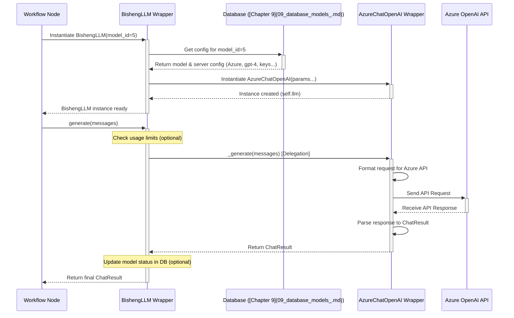

# Chapter 8: LLM & Embedding Wrappers

Welcome back! In [Chapter 7: Interface Layer](07_interface_layer_.md), we saw how Bisheng creates a "catalog" that defines all the available building blocks, like different Large Language Models (LLMs) and text embedding models. This catalog tells the UI what options exist and what settings they need.

But once you've chosen a specific LLM (like OpenAI's GPT-4) or an embedding model (like one hosted locally) in your workflow or assistant, how does Bisheng's core logic actually _talk_ to it? Different models have different ways of being called – some use specific web APIs, others might run on a local server with a unique protocol. How does Bisheng handle this variety without needing separate code for every single model type?

This is where **LLM & Embedding Wrappers** come into play.

**What Problem Do This Solve?**

Imagine you're building a Bisheng workflow. You might want to:

- Use OpenAI's `gpt-3.5-turbo` for a quick initial summary.
- Then use a powerful local model hosted via Bisheng RT for more complex reasoning.
- And use a specialized embedding model like `bge-large-zh` to understand Chinese text for a RAG step.

Each of these models requires different setup, different API calls or server interactions, and different ways to handle inputs and outputs. Writing code to handle each one individually within your workflow logic would be repetitive and complex.

**LLM & Embedding Wrappers** solve this by providing a consistent, simplified way for Bisheng to interact with any supported model. They act like adapters or universal remote controls.

**Analogy: The Universal Remote Control**

Think of different LLMs and embedding models as different electronic devices: an OpenAI TV, an Azure Blu-ray player, a locally hosted Bisheng RT Projector, a ZhipuAI Soundbar. Each has its own specific remote control with unique buttons and commands.

An **LLM or Embedding Wrapper** is like a **universal remote control**. It offers a standard set of buttons (methods) like `generate_response`, `stream_response`, `embed_text`, `embed_documents`. When you press a button on the universal remote:

- You (Bisheng's core logic) don't need to know the specific brand or model of the device.
- The universal remote (the wrapper) knows which device it's paired with.
- It translates your standard command (e.g., "generate response") into the specific sequence of signals required by that particular device (e.g., formatting the API request correctly for OpenAI, sending a request to the Bisheng RT server).

This makes it incredibly easy to switch devices (models) without changing how you use the remote (how Bisheng's core logic calls the model).

**Key Concepts**

1.  **Wrapper:** A piece of code (usually a Python class) that "wraps" around the specific logic needed to communicate with a particular type of LLM or embedding model provider (e.g., OpenAI API, a local HuggingFace model, Bisheng RT server).
2.  **Uniform Interface:** The most important aspect. All LLM wrappers expose the same core functions (methods) for Bisheng to use, such as `_generate` (for getting a response) or `_stream` (for getting a response piece by piece). Similarly, all Embedding wrappers expose methods like `embed_documents` (for a list of texts) and `embed_query` (for a single text). This consistency is achieved by having them inherit from common base classes (like LangChain's `BaseChatModel` or `Embeddings`).
3.  **Provider-Specific Logic:** _Inside_ each wrapper is the code that handles the unique details of a specific provider. For example:
    - An OpenAI wrapper knows how to format requests for the `api.openai.com` endpoint, handle API keys, and parse OpenAI's specific JSON response structure.
    - A Bisheng RT wrapper (like `HostChatGLM`) knows how to send requests to the correct local server URL (`host_base_url`), format the JSON payload expected by that server, and handle its response.
    - An Embedding wrapper knows whether the model expects text prefixed with "query: " or "passage: ".

**How It Works: Using a Wrapper**

When you configure a node in a Bisheng workflow (or configure an assistant) to use a specific model (e.g., "ZhipuAI GLM-4"), Bisheng doesn't directly embed ZhipuAI-specific code into the workflow logic. Instead:

1.  **Configuration:** You select "ZhipuAI GLM-4" and provide necessary details (like an API key) using the schema from the [Interface Layer](07_interface_layer_.md).
2.  **Loading:** When the workflow runs, Bisheng loads the corresponding **wrapper** class (e.g., `ChatZhipuAI` from `bisheng_langchain.chat_models`). It creates an instance of this wrapper, configured with your settings.
3.  **Interaction:** The workflow node (or assistant logic) interacts with the model _through the wrapper's standard interface_. For example, it calls `llm_wrapper.generate(messages)` or `llm_wrapper.stream(messages)`.
4.  **Execution:** The `ChatZhipuAI` wrapper instance receives this call. Internally, it performs the ZhipuAI-specific actions (authenticates, formats the request, calls the ZhipuAI API, parses the result).
5.  **Result:** The wrapper returns the result in a standard format (e.g., a `ChatResult` object) that the workflow node understands.

If you later decide to switch the model to OpenAI's GPT-4, you just change the configuration. Bisheng will load the `ChatOpenAI` wrapper instead. The workflow node's code _doesn't change_ because it still calls the same standard `llm_wrapper.generate(messages)` method.

**Looking at the Code (Simplified Wrappers)**

Let's look at simplified examples based on LangChain's structure, which Bisheng heavily utilizes.

**1. Base Classes (The Universal Remote Blueprint)**

These define the standard "buttons" all wrappers must have.

```python
# Conceptual Base Class for Chat Models (inspired by LangChain's BaseChatModel)
from abc import ABC, abstractmethod
from typing import List
# from langchain.schema.messages import BaseMessage # Assume import
# from langchain.schema import ChatResult # Assume import

class BaseChatModel(ABC):
    @abstractmethod
    def _generate(self, messages: List[BaseMessage], **kwargs) -> ChatResult:
        """Get a standard response for a list of messages."""
        pass

    # Other methods like _stream, _agenerate (async), etc.
```

```python
# Conceptual Base Class for Embeddings (inspired by LangChain's Embeddings)
from abc import ABC, abstractmethod
from typing import List

class Embeddings(ABC):
    @abstractmethod
    def embed_documents(self, texts: List[str]) -> List[List[float]]:
        """Embed a list of documents."""
        pass

    @abstractmethod
    def embed_query(self, text: str) -> List[float]:
        """Embed a single query text."""
        pass
```

- These base classes force all specific wrappers (like `ChatZhipuAI` or `HostEmbeddings`) to implement the core methods (`_generate`, `embed_documents`, `embed_query`), ensuring a consistent interface.

**2. Example: Chat LLM Wrappers**

Compare a wrapper for an API service (ZhipuAI) with one for a local server (HostChatGLM).

```python
# Simplified from src/bisheng-langchain/bisheng_langchain/chat_models/zhipuai.py
# import zhipuai # The actual ZhipuAI library
# from .base import BaseChatModel, _convert_message_to_dict, _convert_dict_to_message
# from langchain.schema import ChatResult, ChatGeneration

class ChatZhipuAI(BaseChatModel):
    model_name: str = 'chatglm_std'
    zhipuai_api_key: str
    # ... other parameters like temperature, top_p ...

    def _generate(self, messages: List[BaseMessage], **kwargs) -> ChatResult:
        message_dicts = [_convert_message_to_dict(m) for m in messages if m.type != 'system'] # Zhipu specific message handling
        params = {
            'prompt': message_dicts,
            'model': self.model_name,
            'temperature': self.temperature,
            # ... other ZhipuAI specific parameters ...
        }
        # === ZhipuAI Specific API Call ===
        # Uses the official zhipuai library client
        response = zhipuai.model_api.invoke(**params)
        # === End Specific Call ===

        # Convert ZhipuAI response back to standard ChatResult
        generations = []
        for choice in response['data']['choices']:
            message = _convert_dict_to_message(choice)
            generations.append(ChatGeneration(message=message))
        # ... create ChatResult object ...
        return ChatResult(generations=generations, llm_output={...})

    # ... other methods ...
```

```python
# Simplified from src/bisheng-langchain/bisheng_langchain/chat_models/host_llm.py
# import requests # Library to make HTTP requests
# from .base import BaseChatModel, _convert_message_to_dict, _convert_dict_to_message
# from langchain.schema import ChatResult, ChatGeneration

class HostChatGLM(BaseChatModel):
    model_name: str = 'chatglm2-6b'
    host_base_url: str # URL of the local inference server
    # ... other parameters like temperature, max_tokens ...

    def _generate(self, messages: List[BaseMessage], **kwargs) -> ChatResult:
        message_dicts = [_convert_message_to_dict(m) for m in messages]
        params = {
            'messages': message_dicts,
            'model': self.model_name,
            'temperature': self.temperature,
            'stream': False, # Not streaming for _generate
            # ... other parameters for the host server ...
        }
        # === Host Server Specific HTTP Call ===
        # Makes a direct HTTP POST request to the configured server URL
        full_url = f"{self.host_base_url}/{self.model_name}/infer" # Example URL structure
        response = requests.post(url=full_url, json=params, timeout=self.request_timeout)
        response_json = response.json()
        # === End Specific Call ===

        # Convert host server response back to standard ChatResult
        generations = []
        for choice in response_json['choices']:
             message = _convert_dict_to_message(choice['message'])
             generations.append(ChatGeneration(message=message))
        # ... create ChatResult object ...
        return ChatResult(generations=generations, llm_output={...})

    # ... other methods ...
```

- Notice both wrappers implement `_generate`.
- `ChatZhipuAI` uses the `zhipuai` library to make the API call.
- `HostChatGLM` uses the `requests` library to make a direct HTTP call to a specified URL (`host_base_url`).
- Both handle provider-specific message formatting and parameter names internally.
- Both convert the provider-specific response back into the standard `ChatResult` format.

**3. Example: Embedding Wrappers**

Compare an API-based embedding model (Wenxin) with a local/hosted one.

```python
# Simplified from src/bisheng-langchain/bisheng_langchain/embeddings/wenxin.py
# from .base import Embeddings
# from .interface import WenxinEmbeddingClient # Wenxin specific client

class WenxinEmbeddings(Embeddings):
    model: str = 'embedding-v1'
    wenxin_api_key: str
    wenxin_secret_key: str
    client: WenxinEmbeddingClient # Stores the initialized client

    def embed(self, texts: List[str]) -> List[List[float]]:
        inp = {'input': texts, 'model': self.model}
        # === Wenxin Specific API Call ===
        outp = self.client.create(**inp) # Uses the specific client
        # === End Specific Call ===
        if outp['status_code'] != 200:
            raise ValueError(f"Wenxin API error: {outp['status_message']}")
        return [e['embedding'] for e in outp['data']]

    def embed_documents(self, texts: List[str]) -> List[List[float]]:
        # (Simplified: directly calls embed, might add retry logic)
        return self.embed(texts)

    def embed_query(self, text: str) -> List[float]:
        # (Simplified: directly calls embed, might add retry logic)
        return self.embed([text])[0]
```

```python
# Simplified from src/bisheng-langchain/bisheng_langchain/embeddings/host_embedding.py
# import requests
# from .base import Embeddings

class HostEmbeddings(Embeddings):
    model: str = 'embedding-host'
    host_base_url: str # URL of the local embedding server
    url_ep: str # Constructed endpoint URL

    def embed(self, texts: List[str], emb_type='raw') -> List[List[float]]:
        inp = {'texts': texts, 'model': self.model, 'type': emb_type}
        # === Host Server Specific HTTP Call ===
        # Makes a direct HTTP POST request
        response = requests.post(url=self.url_ep, json=inp, timeout=self.request_timeout)
        outp = response.json()
        # === End Specific Call ===
        if outp['status_code'] != 200:
             raise ValueError(f"Host API error: {outp['status_message']}")
        return outp['embeddings']

    def embed_documents(self, texts: List[str]) -> List[List[float]]:
        if not texts: return []
        # Calls embed with type 'doc'
        return self.embed(texts, emb_type='doc')

    def embed_query(self, text: str) -> List[float]:
         # Calls embed with type 'query'
        return self.embed([text], emb_type='query')[0]
```

- Both implement `embed_documents` and `embed_query`.
- `WenxinEmbeddings` uses a dedicated `WenxinEmbeddingClient` for its API interaction.
- `HostEmbeddings` uses `requests.post` to call a generic local endpoint.
- They handle specific parameters (like `emb_type` for `HostEmbeddings`) internally.

**4. Bisheng's Own Wrappers (`BishengLLM`, `BishengEmbedding`)**

Bisheng adds another layer on top. When you select a model from the Model Management section, Bisheng uses wrappers like `BishengLLM` or `BishengEmbedding`. These act as _factories_ or _dispatchers_.

```python
# Simplified from src/backend/bisheng/interface/llms/custom.py
# from langchain_core.language_models import BaseChatModel
# from bisheng.database.models.llm_server import LLMDao, LLMModel, LLMServer
# from bisheng.interface.initialize.loading import instantiate_llm

class BishengLLM(BaseChatModel):
    model_id: int
    llm: BaseChatModel # Stores the actual underlying wrapper (e.g., ChatOpenAI)

    def __init__(self, model_id: int, **kwargs):
        super().__init__(**kwargs)
        self.model_id = model_id
        # 1. Load model and server info from Database using model_id
        model_info: LLMModel = LLMDao.get_model_by_id(self.model_id)
        server_info: LLMServer = LLMDao.get_server_by_id(model_info.server_id)
        # ... (Error checking) ...

        # 2. Determine the correct underlying wrapper class based on server_info.type
        # (Uses a mapping like llm_node_type shown in the code)
        wrapper_class_name = self.llm_node_type.get(server_info.type)
        # ... (Import the class) ...

        # 3. Prepare parameters based on server and model config from DB
        params = self._get_llm_params(server_info, model_info, **kwargs)

        # 4. Instantiate the actual wrapper (e.g., ChatOpenAI, HostChatGLM)
        self.llm = instantiate_llm(wrapper_class_name, class_object, params)

    def _generate(self, messages: List[BaseMessage], **kwargs) -> ChatResult:
        # Delegate the call to the underlying loaded wrapper
        # Add logic to check rate limits based on model_info/server_info
        # Add logic to update model status in DB (online/offline based on errors)
        try:
            # @wrapper_bisheng_model_limit_check # Decorator handles limit checks
            result = self.llm._generate(messages, **kwargs)
            # self._update_model_status(0) # Mark as success
            return result
        except Exception as e:
            # self._update_model_status(1, str(e)) # Mark as error
            raise e

    # ... Implement _stream, _agenerate etc. by delegating to self.llm ...
    # ... _get_llm_params prepares dict based on server/model config ...
```

- `BishengLLM` (and `BishengEmbedding`) takes a `model_id` (referencing a model configured in Bisheng's database).
- In its `__init__`, it looks up the model's configuration, determines the correct underlying wrapper class (like `ChatOpenAI`, `HostChatGLM`, `WenxinEmbeddings`), prepares the necessary parameters (API keys, base URLs from the database), and creates an instance of that specific wrapper, storing it in `self.llm` (or `self.embeddings`).
- Its core methods (`_generate`, `embed_documents`, etc.) simply _delegate_ the call to the underlying wrapper instance (`self.llm._generate(...)`).
- Crucially, `BishengLLM`/`BishengEmbedding` also add Bisheng-specific logic like checking rate limits and updating the model's online/offline status in the database based on success or failure.

**Internal Implementation Walkthrough**

Let's trace what happens when a component in Bisheng (like a workflow node) needs to use an LLM configured via the model management interface.

1.  **Request:** The node needs to use the LLM identified by `model_id=5`.
2.  **Instantiation:** Bisheng creates an instance: `llm_instance = BishengLLM(model_id=5, temperature=0.5)`.
3.  **`BishengLLM.__init__`:**
    - Loads configuration for `model_id=5` from the database ([Chapter 9: Database Models](09_database_models_.md)). Let's say this model is `gpt-4` hosted on an `Azure OpenAI` server.
    - Determines the underlying wrapper should be `AzureChatOpenAI`.
    - Extracts parameters like `azure_endpoint`, `openai_api_key`, `openai_api_version`, `azure_deployment` (which is `gpt-4` here) from the database config.
    - Adds the passed `temperature=0.5`.
    - Creates the actual instance: `self.llm = AzureChatOpenAI(azure_endpoint=..., openai_api_key=..., ..., temperature=0.5)`.
4.  **Usage:** The node calls the standard method: `result = llm_instance.generate(messages)`.
5.  **Delegation & Bisheng Logic:** `BishengLLM._generate` is called.
    - It might check if usage limits for this model/server are exceeded.
    - It calls `self.llm._generate(messages)` (which is the `AzureChatOpenAI` instance's method).
6.  **Wrapper Execution:** `AzureChatOpenAI._generate` runs. It formats the request according to Azure OpenAI specifications and makes the API call to the `azure_endpoint`.
7.  **Result Handling:** The Azure API response is received and parsed by `AzureChatOpenAI` into a standard `ChatResult`.
8.  **Return & Status Update:** The `ChatResult` is returned back up the chain. `BishengLLM` might update the model's status in the database (e.g., mark it as successfully used).
9.  **Node Receives Result:** The workflow node gets the `ChatResult`.

**Sequence Diagram:**



**Connecting to Other Parts**

LLM & Embedding Wrappers are fundamental and used by many other components:

- They are the concrete implementations chosen and configured via the [Interface Layer](07_interface_layer_.md).
- They are invoked by the [GPTS / Assistant Abstraction](03_gpts___assistant_abstraction_.md) to generate responses and use tools that might require embeddings.
- They are used within nodes of the [Workflow Engine](04_workflow_engine_.md) (e.g., `LLMNode`, `EmbeddingNode`).
- They are crucial for the [RAG Pipeline](06_rag_pipeline_.md) to embed documents/queries (using Embedding Wrappers) and generate answers from context (using LLM Wrappers).
- Their configuration (API keys, base URLs) often relies on settings managed by [Configuration Management](10_configuration_management_.md) and stored in [Database Models](09_database_models_.md).

**Conclusion**

You've now learned about LLM & Embedding Wrappers – Bisheng's "universal remote controls" for AI models. By providing a consistent interface (`_generate`, `embed_documents`, etc.) while hiding the provider-specific details (API calls, server interactions) inside, these wrappers allow Bisheng to easily support and integrate with a wide variety of models from different sources (APIs, local servers, Bisheng RT). The `BishengLLM` and `BishengEmbedding` classes add a further layer, loading the correct underlying wrapper based on database configurations and adding Bisheng-specific features like rate limiting and status tracking.

We've mentioned several times now that configurations for models, workflows, assistants, and chat history are stored and retrieved. How is all this data structured and managed persistently? That brings us to the database.

Let's explore how Bisheng organizes its data in the next chapter: [Chapter 9: Database Models](09_database_models_.md).

---

Generated by [AI Codebase Knowledge Builder](https://github.com/The-Pocket/Tutorial-Codebase-Knowledge)
