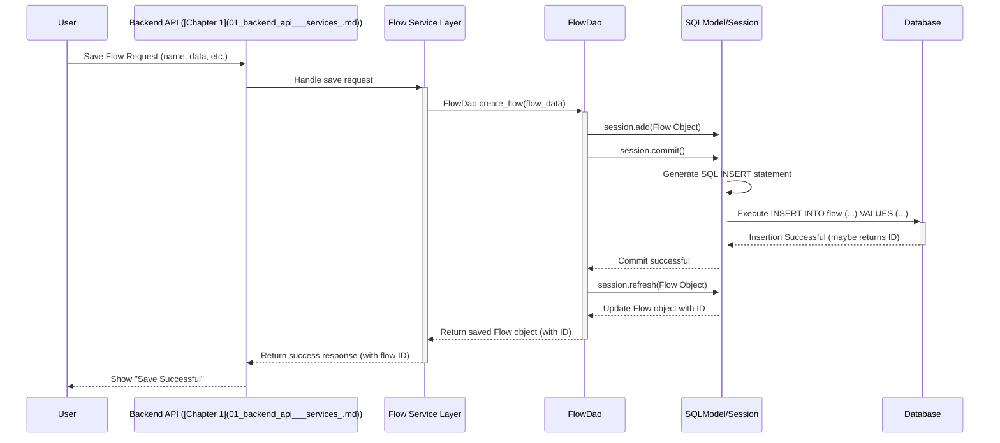

# Chapter 9: Database Models

Welcome back! In [Chapter 8: LLM & Embedding Wrappers](08_llm___embedding_wrappers_.md), we saw how Bisheng uses wrappers to interact consistently with different AI models. We learned that these wrappers often need configuration, like API keys or server addresses, which are loaded based on settings. But where are all these settings stored? And what about the workflows you build, the knowledge bases you create, the users who log in, or the chat history? Bisheng needs a reliable way to save and retrieve all this information.

This is the job of the **Database Models**.

**What Problem Does This Solve?**

Imagine you've spent hours carefully building a complex workflow in Bisheng. You save it, close your browser, and come back the next day. How does Bisheng remember your workflow? What about your user account, your saved API keys, or the documents you uploaded to a knowledge base?

If Bisheng only kept this information in its temporary memory while it was running, everything would be lost when the server restarts or you log out! We need a way to store data **persistently** (meaning it lasts even when the application stops and starts again).

The **Database Models** define the structure for storing all this crucial information permanently in a database. They act like blueprints specifying exactly how data like:

- User accounts (usernames, passwords (hashed!), roles)
- Saved workflows (Flows - the nodes, edges, and their configurations)
- Knowledge bases and the files within them
- API keys for external services (like OpenAI)
- User roles and permissions
- Chat session history
- System configurations

...is organized and saved.

**Analogy: The Restaurant's Storage Room & Filing Cabinets**

Think back to our restaurant analogy. The [Backend API & Services](01_backend_api___services_.md) is the kitchen. But a restaurant also needs:

- **A Storage Room:** To keep ingredients (Knowledge Base files), pre-made sauces (saved Components/Templates), etc.
- **Filing Cabinets:** To store customer information (Users), staff records (Roles), recipes (Flows), supplier contacts (API Keys), and accounting books (Configurations).

The **Database Models** are like the **blueprints and organizational system** for this storage room and these filing cabinets. They dictate:

- What kind of shelves are needed for ingredients (what fields are in the `KnowledgeFile` table).
- How recipe cards are formatted (what fields are in the `Flow` table - name, description, the actual node/edge data).
- How customer files are structured (what fields are in the `User` table - ID, name, email).

Without these blueprints, the storage would be a chaotic mess, and finding anything would be impossible. The Database Models ensure everything is stored neatly and can be easily retrieved when needed.

**Key Concepts**

1.  **Database:** A system designed for storing and retrieving data efficiently. Bisheng typically uses a relational database (like PostgreSQL or MySQL), which organizes data into tables.
2.  **SQLModel:** Bisheng uses a Python library called **SQLModel**. It makes working with SQL databases feel more natural in Python. You define your data structures as Python classes, and SQLModel cleverly handles the translation to database tables and SQL commands behind the scenes.
3.  **Model (Table):** A Python class defined using SQLModel that represents a table in the database. For instance, there's a `User` class that maps to the `user` table, a `Flow` class for the `flow` table, a `Knowledge` class for the `knowledge` table, etc. Each class defines the "columns" of its corresponding table.
4.  **Field (Column):** An attribute within a model class that represents a column in the database table. For example, the `User` model has fields like `user_id`, `user_name`, and `email`, which correspond to columns in the `user` table storing that specific piece of information for each user. SQLModel fields define the data type (string, integer, boolean, JSON, datetime).
5.  **Record (Row):** A single entry in a database table, represented as an instance of the model class. For example, one specific user's information (their ID, name, email) would be a single record (row) in the `user` table, and could be loaded into a `User` object in Python.
6.  **Relationships:** Models can be linked. For example, the `Flow` model might have a `user_id` field, linking a specific flow record back to the user record who created it in the `User` table. SQLModel helps manage these connections.
7.  **DAO (Data Access Object):** While not strictly part of the _models_ themselves, Bisheng often uses a pattern (like DAOs) where separate classes handle the logic for interacting with the database using the models. For example, a `FlowDao` class might contain methods like `get_flow_by_id(flow_id)` or `create_flow(flow_data)`, which use the `Flow` model to read from or write to the database. This keeps the database interaction logic organized.

**How It Works: Saving and Loading a Workflow**

Let's see how models are used in a common scenario:

- **Saving:**

  1.  You finish editing your workflow in the UI and click "Save".
  2.  The frontend sends the workflow data (nodes, edges, etc.) to the [Backend API & Services](01_backend_api___services_.md).
  3.  The API handler receives the data.
  4.  It uses the `FlowDao` (or similar logic) to create an instance of the `Flow` model, populating its fields (`name`, `description`, `data`, `user_id`).
  5.  The `FlowDao` tells SQLModel to save this `Flow` object to the database.
  6.  SQLModel generates the necessary SQL `INSERT` command and sends it to the database.
  7.  The database stores the new workflow as a row in the `flow` table.

- **Loading:**
  1.  You open Bisheng and click on a saved workflow.
  2.  The frontend asks the Backend API to load the workflow with a specific ID.
  3.  The API handler uses the `FlowDao` to fetch the workflow.
  4.  The `FlowDao` uses the `Flow` model and SQLModel to ask the database for the record with that ID.
  5.  SQLModel generates a SQL `SELECT` command.
  6.  The database finds the corresponding row and sends the data back.
  7.  SQLModel converts the database row back into a `Flow` object.
  8.  The API sends the workflow data from the `Flow` object back to the frontend to be displayed.

**Looking at the Code (Simplified Models)**

Let's look at simplified versions of some core SQLModel classes in Bisheng. These classes directly define the database tables.

**1. User Model (`user.py`)**

Defines the structure for storing user information.

```python
# Simplified from src/backend/bisheng/database/models/user.py
from sqlmodel import Field, SQLModel # Base class and Field definition
from typing import Optional
from datetime import datetime

# Base class with common fields
class UserBase(SQLModelSerializable): # Inherits from a base with helper methods
    user_name: str = Field(index=True, unique=True) # Required, indexed, must be unique
    email: Optional[str] = Field(index=True, default=None) # Optional string, indexed
    phone_number: Optional[str] = Field(index=True, default=None)
    remark: Optional[str] = Field(index=False, default=None)
    delete: int = Field(index=False, default=0) # Soft delete flag
    # ... timestamps ...

# The actual table model, inheriting UserBase and adding table-specific fields
class User(UserBase, table=True): # `table=True` makes this a database table model
    user_id: Optional[int] = Field(default=None, primary_key=True) # Auto-incrementing primary key
    password: str = Field(index=False) # Stores the hashed password (NOT plain text!)
    # ... password update time ...
```

- This defines a `User` class that maps to the `user` table.
- Fields like `user_name`, `email`, `password` become columns in the table.
- `Field(...)` is used to specify properties like `index=True` (faster lookups), `unique=True`, `primary_key=True`.
- `table=True` marks this class as a direct table definition.

**2. Flow Model (`flow.py`)**

Defines the structure for storing workflows.

```python
# Simplified from src/backend/bisheng/database/models/flow.py
from sqlmodel import Field, SQLModel, JSON, Column # JSON type for complex data
from typing import Optional, Dict
from bisheng.utils import generate_uuid # For unique IDs

class FlowBase(SQLModelSerializable):
    name: str = Field(index=True) # Workflow name
    user_id: Optional[int] = Field(index=True) # Link to the User who created it
    description: Optional[str] = Field(index=False, default=None)
    data: Optional[Dict] = Field(default=None) # Will store nodes/edges as JSON
    logo: Optional[str] = Field(index=False, default=None) # URL or path to logo
    status: Optional[int] = Field(index=False, default=1) # e.g., 1=Offline, 2=Online
    flow_type: Optional[int] = Field(index=False, default=1) # e.g., 1=Flow, 5=Assistant
    # ... timestamps ...

class Flow(FlowBase, table=True):
    # Generate a unique string ID automatically if not provided
    id: str = Field(default_factory=generate_uuid, primary_key=True, unique=True)
    # Store the complex workflow structure (nodes, edges) efficiently as JSON
    data: Optional[Dict] = Field(default=None, sa_column=Column(JSON))
```

- Defines the `Flow` model mapping to the `flow` table.
- Includes fields like `name`, `description`, `user_id` (linking to the `User` model).
- The crucial `data` field uses `sa_column=Column(JSON)` to store the entire workflow structure (nodes, edges, configurations) as a JSON object within a single database column.

**3. Knowledge Base Model (`knowledge.py`)**

Defines the structure for storing knowledge base metadata.

```python
# Simplified from src/backend/bisheng/database/models/knowledge.py
from sqlmodel import Field, SQLModel
from typing import Optional

class KnowledgeBase(SQLModelSerializable):
    user_id: Optional[int] = Field(index=True) # Link to User
    name: str = Field(index=True) # Name of the knowledge base
    type: int = Field(index=False, default=0) # 0=Normal, 1=QA, 2=Private
    description: Optional[str] = Field(index=True, default=None)
    model: Optional[str] = Field(index=False, default=None) # Associated embedding model?
    collection_name: Optional[str] = Field(index=False, default=None) # Name in vector store (e.g., Milvus)
    index_name: Optional[str] = Field(index=False, default=None) # Name in keyword store (e.g., ES)
    # ... state, timestamps ...

class Knowledge(KnowledgeBase, table=True):
    id: Optional[int] = Field(default=None, primary_key=True) # Primary key
```

- Defines the `Knowledge` model mapping to the `knowledge` table.
- Stores metadata about a knowledge base, like its `name`, `description`, and importantly, the `collection_name` which is the identifier used in the external vector database (like Milvus) where the actual document chunks are stored.

**Looking at the Code (Simplified Interaction - DAO)**

These models define the "what" (the structure). The "how" (how to interact with the database) is often handled by DAO classes.

```python
# Simplified concept from src/backend/bisheng/database/models/flow.py
from bisheng.database.base import session_getter # Gets a database session
from sqlmodel import select

class FlowDao(FlowBase): # Often inherits from the base model

    @classmethod
    def get_flow_by_id(cls, flow_id: str) -> Optional[Flow]:
        """Gets a specific flow by its ID."""
        with session_getter() as session: # Get a connection/session to the DB
            # Create a query statement: SELECT * FROM flow WHERE id = flow_id
            statement = select(Flow).where(Flow.id == flow_id)
            # Execute the query and return the first result (or None)
            return session.exec(statement).first()

    @classmethod
    def create_flow(cls, flow_info: Flow, flow_type: Optional[int]) -> Flow:
        """Creates a new flow record in the database."""
        # (Simplified - actual code also creates a FlowVersion)
        with session_getter() as session:
            session.add(flow_info) # Tell SQLModel to track this new Flow object
            session.commit() # Save the changes to the database (executes INSERT)
            session.refresh(flow_info) # Update flow_info with DB-generated values (like ID)
            return flow_info

    # ... other methods like update_flow, delete_flow, get_flows_by_user ...
```

- `session_getter()`: A helper to manage the database connection (session).
- `select(Flow).where(...)`: SQLModel provides a Pythonic way to build SELECT queries.
- `session.exec(...).first()`: Executes the query and gets the result.
- `session.add(...)`: Stages a new or updated object to be saved.
- `session.commit()`: Finalizes the changes in the database (INSERT, UPDATE, DELETE).
- `session.refresh(...)`: Updates the Python object with any changes from the database (like auto-generated IDs).

**Internal Implementation: Saving a Flow (Revisited)**

Let's trace the database interaction when saving a flow:



**Step-by-Step:**

1.  **Request:** The API receives the request to save a new flow.
2.  **Service Logic:** A service layer might handle validation or business logic.
3.  **DAO Call:** The service calls `FlowDao.create_flow`, passing the data.
4.  **Object Creation:** The DAO creates an instance of the `Flow` model class.
5.  **Session Add:** It adds the `Flow` object to the SQLModel session (`session.add`).
6.  **Commit:** It commits the session (`session.commit`).
7.  **SQL Generation:** SQLModel translates the addition into a SQL `INSERT` statement.
8.  **Database Execution:** The SQL statement is sent to and executed by the database.
9.  **Refresh (Optional):** `session.refresh` updates the Python `Flow` object with data generated by the database (like the new `id`).
10. **Return:** The saved `Flow` object (now with an ID) is returned up the call stack.

**Connecting to Other Parts**

Database Models are fundamental and underpin almost every other backend component:

- [Backend API & Services](01_backend_api___services_.md): Use DAOs and models to fulfill requests that involve storing or retrieving data (users, flows, knowledge, etc.).
- [WebSocket & Chat Management](02_websocket___chat_management_.md): Uses models like `ChatMessage` and `MessageSession` to store and retrieve conversation history.
- [GPTS / Assistant Abstraction](03_gpts___assistant_abstraction_.md): Uses `Assistant` and `AssistantLink` models to store assistant configurations and their links to tools/knowledge.
- [Workflow Engine](04_workflow_engine_.md): Uses `Flow` and `FlowVersion` models to save and load workflow definitions.
- [RAG Pipeline](06_rag_pipeline_.md): Uses `Knowledge` and `KnowledgeFile` models to store metadata about knowledge bases and the files within them.
- [LLM & Embedding Wrappers](08_llm___embedding_wrappers_.md): Configurations for models managed via the UI (like API keys, server details) are stored using models like `LLMServer` and `LLMModel`.
- [Configuration Management](10_configuration_management_.md): Stores system-wide settings using the `Config` model.

**Conclusion**

You've now learned about Database Models in Bisheng – the essential blueprints that define how all persistent data (users, flows, knowledge bases, chat history, configurations, etc.) is structured and stored. Using the SQLModel library, Bisheng defines Python classes (like `User`, `Flow`, `Knowledge`) that map directly to database tables, making it easier to save, retrieve, update, and delete information reliably. These models, often interacted with via DAO classes, form the persistent memory of the entire Bisheng platform.

Speaking of configurations, while some are stored directly in models like `LLMServer`, how does Bisheng manage other types of configuration, like application settings or default behaviors?

Let's explore this in the final chapter: [Chapter 10: Configuration Management](10_configuration_management_.md).

---

Generated by [AI Codebase Knowledge Builder](https://github.com/The-Pocket/Tutorial-Codebase-Knowledge)
