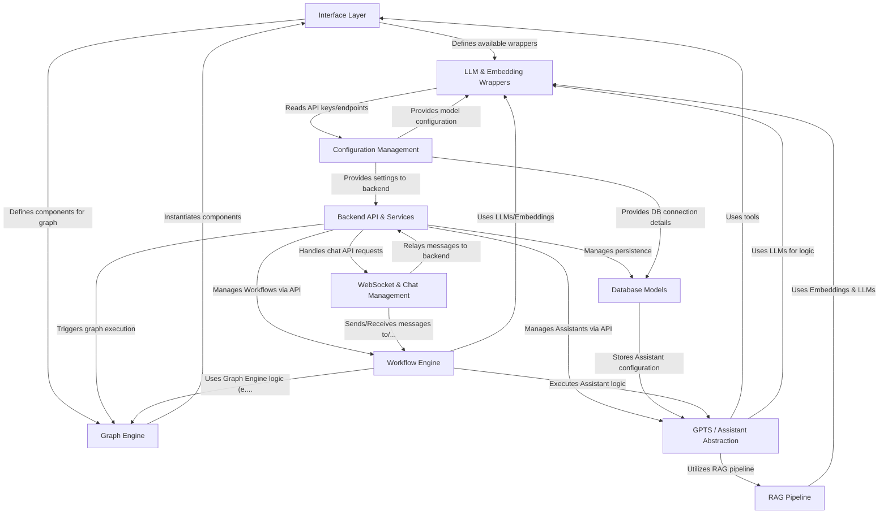

# Tutorial: bisheng

Bisheng is a platform designed for building and deploying AI applications, focusing heavily on _Large Language Models (LLMs)_. It enables the creation of complex processes as **graphs** or **workflows**, integrating components like LLMs, custom tools, and knowledge bases. Key features include **Retrieval-Augmented Generation (RAG)** pipelines for querying documents, building configurable _AI Assistants (GPTS)_, and managing real-time chat interactions via **WebSockets**. The system architecture separates the **component definitions (Interface Layer)** from the **execution engines (Graph/Workflow Engine)** and the main **Backend API/Services**, using a **database** for persistence and a **configuration management** system for settings.

**Source Repository:** [None](None)

## Chapters

1. [Backend API & Services
   ](01_backend_api___services_.md)
2. [WebSocket & Chat Management
   ](02_websocket___chat_management_.md)
3. [GPTS / Assistant Abstraction
   ](03_gpts___assistant_abstraction_.md)
4. [Workflow Engine
   ](04_workflow_engine_.md)
5. [Graph Engine
   ](05_graph_engine_.md)
6. [RAG Pipeline
   ](06_rag_pipeline_.md)
7. [Interface Layer
   ](07_interface_layer_.md)
8. [LLM & Embedding Wrappers
   ](08_llm___embedding_wrappers_.md)
9. [Database Models
   ](09_database_models_.md)
10. [Configuration Management
    ](10_configuration_management_.md)

---

Generated by [AI Codebase Knowledge Builder](https://github.com/The-Pocket/Tutorial-Codebase-Knowledge)
