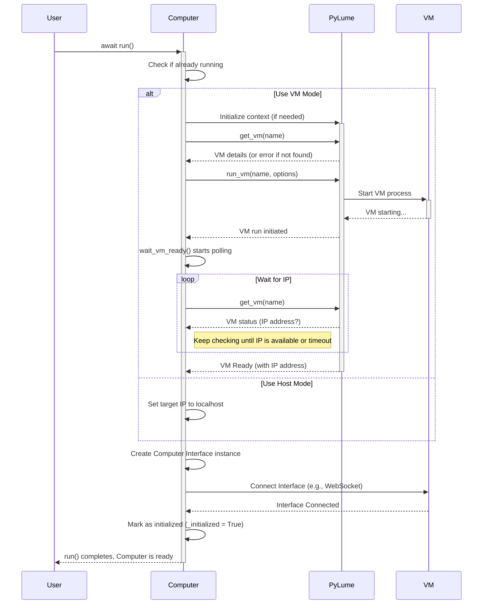

# Chapter 1: The Virtual Computer

Welcome to the `cua` tutorial! We're starting a journey to understand how AI agents can interact with computer environments just like humans do.

Imagine you want an AI assistant to perform tasks on a computer for you – like opening a web browser, searching for information, or maybe even editing a document. To do this safely and consistently, the AI needs its own controlled environment to work in. It needs a virtual computer!

This is exactly what the `Computer` abstraction in `cua` provides. It acts like a dedicated, simulated computer – a safe sandbox – where our AI agent can operate.

## What is a `Computer`?

Think of the `Computer` class as the **dashboard or control panel** for a specific _virtual machine_ (VM). A VM is essentially a computer running inside your actual computer, completely separate and isolated.

The `Computer` object holds all the important settings for this virtual machine, such as:

- Which Operating System (OS) it should run (e.g., macOS, Linux).
- How much memory (RAM) it gets (e.g., "8GB").
- How many CPU cores it can use (e.g., "4").
- The screen size or resolution (e.g., "1024x768").

It bundles all this configuration together. More importantly, it also gives us access to the tools needed to actually _interact_ with the screen, keyboard, and mouse inside that VM. This interaction part is handled by something called the [Computer Interface (BaseComputerInterface / MacOSComputerInterface)](02_computer_interface__basecomputerinterface___macoscomputerinterface__.md), which we'll explore in the next chapter.

Under the hood, the `Computer` uses another tool called [PyLume](07_pylume_.md) to manage the lifecycle of the VM – starting it up when needed and shutting it down cleanly afterwards.

## Creating Your First Virtual Computer

Let's see how easy it is to define a virtual computer environment.

```python
# Import the Computer class
from computer import Computer

# Define the settings for our virtual computer
computer = Computer(
    os_type="macos",          # We want a macOS environment
    display="1024x768",       # Set the screen resolution
    memory="8GB",             # Allocate 8GB of RAM
    cpu="4",                  # Allocate 4 CPU cores
    image="macos-sequoia-cua:latest" # Specify the VM image to use
)

print("Computer object created!")
# Expected Output:
# Computer object created!
```

In this snippet, we imported the `Computer` class from the `cua-computer` library. Then, we created an instance of it, telling it we want a macOS VM with specific hardware resources (`memory`, `cpu`, `display`) and which pre-built virtual machine "image" to use. An image is like a template or blueprint for the VM's hard drive, containing the OS and necessary software.

## Starting and Stopping the Virtual Computer

Creating the `Computer` object just defines its settings. It doesn't actually _start_ the virtual machine yet. To do that, we need to `run` it. Since starting a VM can take a moment, this is an `async` operation in Python.

```python
import asyncio

# (Previous code to create the 'computer' object)

async def main():
    print("Starting the virtual computer...")
    # The 'async with' block ensures the computer is properly managed
    async with computer:
        print("Virtual computer is running!")

        # We can now interact with it (more on this later)
        ip_address = await computer.get_ip()
        print(f"VM IP Address: {ip_address}")

        # ... interactions would happen here ...

        print("Computer was running. Exiting the block will stop it implicitly.")
        # When exiting the 'async with' block, computer.stop() is handled

    # If not using 'async with', you would manually start and stop:
    # await computer.run()
    # print("Virtual computer is running!")
    # # ... do stuff ...
    # print("Stopping the virtual computer...")
    # await computer.stop()
    # print("Computer stopped.")

# Run the async function
asyncio.run(main())

# Example Output (IP address will vary):
# Starting the virtual computer...
# Virtual computer is running!
# VM IP Address: 192.168.64.5
# Computer was running. Exiting the block will stop it implicitly.
```

Here, we use `async with computer:` which is the recommended way. It automatically calls `await computer.run()` when entering the block and handles cleanup (like stopping the VM if necessary) when exiting. Inside the block, the VM is active and ready. We also called `await computer.get_ip()` to see the internal network address assigned to our running VM.

Alternatively, you could explicitly call `await computer.run()` to start it and `await computer.stop()` when you're finished.

## Accessing the Controls: The Interface

Once the `Computer` is running, how do we actually _do_ things inside it, like clicking the mouse or typing? The `Computer` object holds a reference to its interaction toolkit, the [Computer Interface (BaseComputerInterface / MacOSComputerInterface)](02_computer_interface__basecomputerinterface___macoscomputerinterface__.md). You access it via the `.interface` property.

```python
import asyncio

# (Previous code to create the 'computer' object)

async def main():
    async with computer:
        print("Virtual computer is running!")

        # Access the interface
        interface = computer.interface
        print("Got the computer interface.")

        # Example: Take a screenshot
        print("Taking a screenshot...")
        screenshot_bytes = await interface.screenshot()

        # Save the screenshot to a file
        with open("my_vm_screenshot.png", "wb") as f:
            f.write(screenshot_bytes)

        print("Screenshot saved as my_vm_screenshot.png")

asyncio.run(main())

# Example Output:
# Virtual computer is running!
# Got the computer interface.
# Taking a screenshot...
# Screenshot saved as my_vm_screenshot.png
# (A file named my_vm_screenshot.png will appear in your project folder)
```

In this example, after the computer is running, we get the `interface` object using `computer.interface`. We then use one of its methods, `screenshot()`, to capture the current screen of the VM. The result (`screenshot_bytes`) contains the image data, which we save to a file. We'll learn much more about the `interface` in the next chapter!

## How Does `computer.run()` Work Internally?

When you call `await computer.run()`, several things happen behind the scenes, primarily involving [PyLume](07_pylume_.md):

1.  **Check Initialization:** It first checks if it's already running. If so, it does nothing.
2.  **Check Host Mode:** It checks if it's configured to use the _host_ computer directly (`use_host_computer_server=True`). If yes, it skips VM creation and prepares to connect to interaction services running on your main OS.
3.  **Initialize PyLume:** If using a VM, it makes sure [PyLume](07_pylume_.md) (the VM management tool) is ready.
4.  **Find VM:** It asks [PyLume](07_pylume_.md) if a VM with the configured name already exists. If not, it might stop with an error (you usually need to `pull` the VM image first using the `lume` command-line tool).
5.  **Start VM:** It tells [PyLume](07_pylume_.md) to start the VM, passing the configuration (memory, CPU, display, shared folders).
6.  **Wait for IP:** It waits patiently for the VM to fully boot up and get an IP address so we can communicate with it. This can sometimes take a minute or two.
7.  **Create Interface:** Once the VM is ready and has an IP address (or if using host mode), it creates the correct [Computer Interface (BaseComputerInterface / MacOSComputerInterface)](02_computer_interface__basecomputerinterface___macoscomputerinterface__.md) object (e.g., `MacOSComputerInterface` if `os_type="macos"`).
8.  **Connect Interface:** It connects the interface (usually via WebSocket) to the interaction service running inside the VM (or on the host).
9.  **Ready:** It marks itself as initialized and ready to use.

Here's a simplified diagram showing the VM startup flow:



Looking at the code in `libs/computer/computer/computer.py`, the `__init__` method sets up the configuration based on your inputs:

```python
# Simplified from libs/computer/computer/computer.py
class Computer:
    def __init__(
        self,
        display: Union[Display, Dict[str, int], str] = "1024x768",
        memory: str = "8GB",
        cpu: str = "4",
        os_type: OSType = "macos",
        name: str = "",
        image: str = "macos-sequoia-cua:latest",
        # ... other parameters like shared_directories, use_host_computer_server ...
    ):
        self.logger = Logger("cua.computer") # Setup logging
        self.image = image
        self.os_type = os_type
        self._initialized = False # Not running yet

        if not use_host_computer_server:
            # Parse image name and tag
            img_name, img_tag = image.split(":")
            # Generate VM name if not provided
            vm_name = name or image.replace(":", "_")
            # Parse display string (e.g., "1024x768") into width/height
            display_config = self._parse_display(display)

            # Store configuration in a data structure
            self.config = ComputerConfig(
                image=img_name,
                tag=img_tag,
                name=vm_name,
                display=display_config,
                memory=memory,
                cpu=cpu,
            )
            # Prepare PyLume instance (but don't start it yet)
            self.config.pylume = PyLume(...)

        # Interface will be created later in run()
        self._interface = None
        self.use_host_computer_server = use_host_computer_server
        # ... rest of initialization ...
```

And the `run` method orchestrates the startup process we described:

```python
# Simplified from libs/computer/computer/computer.py
    async def run(self) -> None:
        if self._initialized: # Check if already running
            return

        self.logger.info("Starting computer...")

        ip_address = None # Will store the VM or host IP

        if self.use_host_computer_server:
            self.logger.info("Using host computer server")
            ip_address = "localhost"
            # ... Interface creation happens later ...
        else:
            # Start or connect to VM using PyLume
            self.logger.info(f"Starting VM: {self.image}")

            # Ensure PyLume context is active
            if not self._pylume_context:
                 self._pylume_context = await self.config.pylume.__aenter__()

            # Check if VM exists
            vm_info = await self.config.pylume.get_vm(self.config.name)

            # Tell PyLume to run the VM
            await self.config.pylume.run_vm(self.config.name, ...)

            # Wait for the VM to get an IP address
            vm_ready_info = await self.wait_vm_ready()
            ip_address = vm_ready_info.ip_address

        # Now that we have an IP, create and connect the interface
        self.logger.info(f"Initializing interface for {self.os_type} at {ip_address}")
        self._interface = InterfaceFactory.create_interface_for_os(
            os=self.os_type, ip_address=ip_address
        )
        await self._interface.wait_for_ready() # Connect the interface

        self._initialized = True # Mark as ready!
        self.logger.info("Computer successfully initialized")
```

## Conclusion

You've learned about the foundational `Computer` object in `cua`. It represents the virtual environment where your AI agent will operate. You know how to configure it (OS, memory, display), how to start it using `await computer.run()` (or `async with computer:`), and how to stop it. You also saw that the actual _interaction_ tools are accessed via `computer.interface`.

In the next chapter, we'll dive deep into that `interface` and see how we can command the mouse, keyboard, and read the screen within our virtual computer.

Ready to learn how to click and type? Let's move on to [Chapter 2: Computer Interface (BaseComputerInterface / MacOSComputerInterface)](02_computer_interface__basecomputerinterface___macoscomputerinterface__.md)!

---

Generated by [AI Codebase Knowledge Builder](https://github.com/The-Pocket/Tutorial-Codebase-Knowledge)
