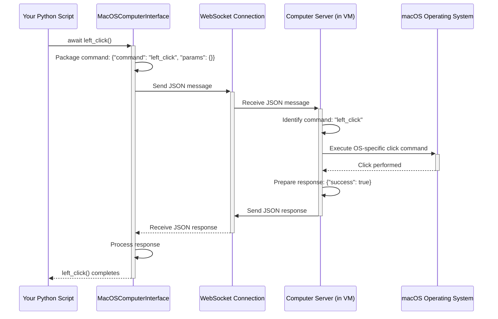

# Chapter 2: Computer Interface (BaseComputerInterface / MacOSComputerInterface)

In [Chapter 1: The Virtual Computer](01_computer_.md), we learned how to create and manage a virtual computer (VM) environment using the `Computer` object. We saw that the `Computer` acts like a dashboard for our VM. But how do we actually _interact_ with the screen, keyboard, and mouse inside that VM? If the `Computer` is the dashboard, what's the steering wheel and pedals?

That's where the **Computer Interface** comes in!

## What is the Computer Interface?

Imagine you have a brand new computer (our VM). You need a way to connect your keyboard, mouse, and monitor to it so you can actually use it. The Computer Interface in `cua` acts like those physical connections (USB for keyboard/mouse, HDMI for the screen) combined with the low-level drivers that let your operating system talk to that hardware.

It's the **low-level "remote control"** for the virtual machine. It defines a standard set of actions you can perform, like:

- Moving the mouse (`move_cursor`)
- Clicking the mouse buttons (`left_click`, `right_click`)
- Typing on the keyboard (`type_text`, `press_key`)
- Taking a picture of the screen (`screenshot`)
- Getting information about the screen (`get_screen_size`)

Think of it like a universal remote for TVs. The remote has standard buttons (power, volume up/down, channel change). The Computer Interface defines these standard "buttons" or actions for interacting with _any_ computer environment managed by `cua`.

## The Blueprint: `BaseComputerInterface`

Just like you can have different brands of TVs (Sony, Samsung, LG), you might want `cua` to control different operating systems (macOS, Linux, Windows). While the _basic actions_ (like clicking or typing) are similar, the _exact way_ to tell each OS to perform that action is different.

`BaseComputerInterface` is like the **blueprint** or design specification for our universal remote. It lists all the standard buttons (actions) that _any_ computer interface in `cua` **must** have. It's an "abstract" class, meaning it defines _what_ actions are possible, but not _how_ they are actually performed for a specific OS.

Looking at the code (`libs/computer/computer/interface/base.py`), you'll find definitions like these (simplified):

```python
# Simplified from libs/computer/computer/interface/base.py
from abc import ABC, abstractmethod
from typing import Optional, Dict

class BaseComputerInterface(ABC):
    """Base class for computer control interfaces."""

    # ... (initialization omitted) ...

    @abstractmethod
    async def left_click(self, x: Optional[int] = None, y: Optional[int] = None) -> None:
        """Perform a left click."""
        pass # No actual code here, just the definition!

    @abstractmethod
    async def type_text(self, text: str) -> None:
        """Type the specified text."""
        pass # No actual code here!

    @abstractmethod
    async def screenshot(self) -> bytes:
        """Take a screenshot."""
        pass # No actual code here!

    # ... and many other actions like right_click, press_key, etc.
```

This blueprint ensures that no matter which OS we're controlling, we can always expect these basic actions to be available.

## The Real Deal: `MacOSComputerInterface`

Now, let's say we want to control a macOS virtual machine. We need a specific implementation of the `BaseComputerInterface` blueprint that knows how to talk to macOS. That's what `MacOSComputerInterface` does.

It takes the standard actions defined in `BaseComputerInterface` (like `left_click`) and translates them into actual commands that the macOS operating system understands. It's like the specific remote control built for your Sony TV – it has the standard buttons, but the signals it sends are specific to Sony.

How does it send these commands? Often, it communicates over the network (using something called WebSockets) with a helper program called the [Computer Server](06_computer_server_.md). This server program runs _inside_ the virtual machine (or on the host machine if you're controlling it directly) and listens for commands from the `MacOSComputerInterface`. When it receives a command like "left_click", it uses macOS's own tools to perform the click.

## Using the Interface

In Chapter 1, we saw how to get the interface object from our running `Computer`:

```python
import asyncio
from computer import Computer

# Define our macOS computer
computer = Computer(os_type="macos", image="macos-sequoia-cua:latest")

async def main():
    print("Starting the virtual computer...")
    async with computer:
        print("Virtual computer is running!")

        # Access the interface (cua automatically gives us MacOSComputerInterface here)
        interface = computer.interface
        print(f"Got interface: {type(interface)}")

        # Now let's use some interface actions!

        # 1. Get screen size
        size = await interface.get_screen_size()
        print(f"Screen size: {size['width']}x{size['height']}")

        # 2. Move the cursor to the center of the screen
        center_x = size['width'] // 2
        center_y = size['height'] // 2
        print(f"Moving cursor to ({center_x}, {center_y})")
        await interface.move_cursor(center_x, center_y)

        # 3. Perform a left click at the current cursor position
        print("Performing a left click...")
        await interface.left_click()
        await asyncio.sleep(1) # Pause for a moment

        # 4. Type some text
        text_to_type = "Hello from cua! 👋"
        print(f"Typing: '{text_to_type}'")
        await interface.type_text(text_to_type)
        await asyncio.sleep(1) # Pause

        # 5. Take a screenshot
        print("Taking a screenshot...")
        screenshot_bytes = await interface.screenshot()
        with open("chapter2_screenshot.png", "wb") as f:
            f.write(screenshot_bytes)
        print("Screenshot saved as chapter2_screenshot.png")

asyncio.run(main())

# Example Output:
# Starting the virtual computer...
# Virtual computer is running!
# Got interface: <class 'computer.interface.macos.MacOSComputerInterface'>
# Screen size: 1024x768
# Moving cursor to (512, 384)
# Performing a left click...
# Typing: 'Hello from cua! 👋'
# Taking a screenshot...
# Screenshot saved as chapter2_screenshot.png
# (You'll see the text typed on the VM screen in the saved screenshot)
```

In this example, after getting the `interface` (which `cua` correctly identified as `MacOSComputerInterface` because we set `os_type="macos"`), we called several of its methods:

- `get_screen_size()`: Returns a dictionary with the width and height.
- `move_cursor(x, y)`: Moves the mouse pointer to the given pixel coordinates.
- `left_click()`: Performs a standard left mouse click at the cursor's current location.
- `type_text("...")`: Types the provided string as if using a keyboard.
- `screenshot()`: Captures the VM's screen and returns the image data as bytes.

These simple commands allow us to perform fundamental interactions within the virtual machine.

## How Does it Work Internally? (A Peek Under the Hood)

When you call a method like `await interface.left_click()`, what happens?

1.  **Your Code Calls the Method:** You execute `await interface.left_click()`. Since `interface` is an instance of `MacOSComputerInterface`, this calls the `left_click` method defined in that class.
2.  **Command Packaging:** The `MacOSComputerInterface` method (e.g., `left_click` in `libs/computer/computer/interface/macos.py`) takes the action ('left_click') and any parameters (like coordinates, if provided) and packages them into a standardized message (usually in JSON format).
3.  **Sending via WebSocket:** This message is sent over a network connection called a WebSocket to the [Computer Server](06_computer_server_.md) running inside the VM. The `MacOSComputerInterface` handles establishing and managing this WebSocket connection (using the `_send_command` helper method internally).
4.  **Server Receives Command:** The [Computer Server](06_computer_server_.md) receives the JSON message (e.g., `{"command": "left_click", "params": {}}`).
5.  **Server Executes Action:** The server looks at the `command`. It knows that "left_click" means it should perform a left mouse click. It uses macOS-specific automation tools (like `pyautogui` or AppleScript commands, handled by its internal "handlers") to actually perform the click on the VM's operating system.
6.  **Response Sent Back:** The [Computer Server](06_computer_server_.md) sends a response back over the WebSocket, indicating whether the action was successful (e.g., `{"success": true}`).
7.  **Your Code Gets Result:** The `MacOSComputerInterface` receives this response. If there was an error, it might raise an exception. Otherwise, your original `await interface.left_click()` call completes successfully.

Here's a simplified diagram of the flow for `left_click`:



Let's look at some relevant code snippets:

**1. Creating the Interface (in `Computer.run`)**

When you call `await computer.run()`, it figures out the OS type and uses a factory to create the correct interface instance.

```python
# Simplified from libs/computer/computer/computer.py in Computer.run()

# ... (after VM is started and IP address is known) ...

self.logger.info(f"Initializing interface for {self.os_type} at {ip_address}")

# Use a Factory to get the right interface class based on os_type
# InterfaceFactory is defined in libs/computer/computer/interface/factory.py
self._interface = InterfaceFactory.create_interface_for_os(
    os=self.os_type, # e.g., "macos"
    ip_address=ip_address
)

# Wait for the interface (e.g., MacOSComputerInterface) to connect
await self._interface.wait_for_ready()
```

**2. Sending a Command (in `MacOSComputerInterface`)**

Most action methods in `MacOSComputerInterface` rely on a helper `_send_command` method.

```python
# Simplified from libs/computer/computer/interface/macos.py

class MacOSComputerInterface(BaseComputerInterface):
    # ... (init, connection logic omitted) ...

    async def _send_command(self, command: str, params: Optional[Dict] = None) -> Dict[str, Any]:
        """Send command through WebSocket."""
        # 1. Make sure WebSocket connection is alive (details omitted)
        await self._ensure_connection()

        # 2. Create the message payload
        message = {"command": command, "params": params or {}}

        # 3. Send the message as JSON text
        await self._ws.send(json.dumps(message))

        # 4. Wait for and receive the response
        response_text = await self._ws.recv()

        # 5. Parse the JSON response and return it
        return json.loads(response_text)

    # --- Example Action Method ---
    async def left_click(self, x: Optional[int] = None, y: Optional[int] = None) -> None:
        # Just calls _send_command with the right command name and parameters
        await self._send_command("left_click", {"x": x, "y": y})

    async def type_text(self, text: str) -> None:
        await self._send_command("type_text", {"text": text})

    # ... other methods follow the same pattern ...
```

This shows how the interface methods simply package the command name and parameters and use the underlying `_send_command` function to handle the WebSocket communication with the [Computer Server](06_computer_server_.md).

## Conclusion

You've now learned about the **Computer Interface** – the essential component that acts as the low-level remote control for our virtual computer.

- It provides the basic actions needed to interact with the computer's input (keyboard, mouse) and output (screen).
- `BaseComputerInterface` defines the standard _set_ of actions (the blueprint).
- Specific implementations like `MacOSComputerInterface` provide the _how_ for a particular operating system, often by communicating with a [Computer Server](06_computer_server_.md) inside the VM via WebSockets.
- You can access the interface via `computer.interface` and use methods like `left_click()`, `type_text()`, and `screenshot()` to directly control the VM.

While the Interface gives us the _ability_ to click and type, it doesn't make any decisions. It just executes the specific commands we give it. How do we build something smarter that can look at the screen, decide _what_ to do, and then use the Interface to perform those actions? That's the job of the **Computer Agent**.

Ready to meet the brain behind the operation? Let's move on to [Chapter 3: Computer Agent (ComputerAgent)](03_computer_agent__computeragent__.md)!

---

Generated by [AI Codebase Knowledge Builder](https://github.com/The-Pocket/Tutorial-Codebase-Knowledge)
