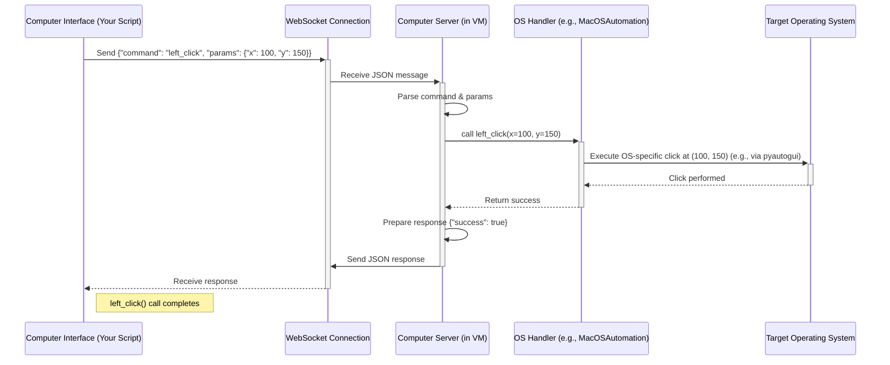

# Chapter 6: Computer Server

In the previous chapters, we saw how the [Computer Interface](02_computer_interface__basecomputerinterface___macoscomputerinterface__.md) lets us send commands like `left_click` or `screenshot`, and how the [Tools](05_tools__basetool___toolmanager___provider_tools__.md) allow the agent to request actions like running a `bash` command. But where do these commands actually _go_? How does a command sent from our Python script actually make the mouse click _inside_ the virtual machine (VM) or on our host computer?

That's where the **Computer Server** comes in!

## What is the Computer Server?

Imagine you're controlling a robot in another room using a remote control ([Computer Interface](02_computer_interface__basecomputerinterface___macoscomputerinterface__.md)). The Computer Server is like the **robot's local brain and body** in that other room. It's a separate program running _inside_ the target computer environment (either the VM, or your main computer if `use_host_computer_server` is set to `True`).

Think of it as a dedicated helper or agent sitting at the keyboard of the target machine, waiting for instructions.

Here's what it does:

1.  **Runs Inside:** It's a distinct software process that runs _within_ the environment being controlled.
2.  **Listens:** It starts up a web server (using technologies called FastAPI and WebSockets) and listens for incoming network connections and commands.
3.  **Receives Commands:** The [Computer Interface](02_computer_interface__basecomputerinterface___macoscomputerinterface__.md) from our main script connects to this server (over the network via WebSocket) and sends commands (like "left_click", "screenshot", "type_text").
4.  **Executes Locally:** When the Computer Server receives a command, it uses OS-specific tools (like `pyautogui` or AppleScript on macOS) to actually perform the action directly on the operating system it's running on. It has dedicated "handlers" (like `MacOSAutomationHandler`) for different operating systems.
5.  **Sends Back Results:** After executing the command, it sends a message back to the [Computer Interface](02_computer_interface__basecomputerinterface___macoscomputerinterface__.md) confirming if it succeeded and providing any requested data (like screenshot image data).

So, if your `ComputerAgent` decides to click, it tells the `Computer Interface`, which sends a "click" message over the network to the Computer Server inside the VM. The Computer Server receives the message and actually performs the click using the VM's operating system tools.

## How is the Computer Server Used? (Usually Automatically!)

The good news is, you typically don't need to interact with the Computer Server directly. When you set up your [Computer](01_computer_.md) object and the associated VM image, the `cua` framework usually ensures the Computer Server software is pre-installed inside the VM image.

When you run `await computer.run()`, the following happens (simplified):

1.  The VM starts up.
2.  A startup script inside the VM automatically launches the Computer Server process.
3.  The Computer Server starts listening on a specific network port (usually 8000).
4.  Back in your script, the `Computer` object creates the [Computer Interface (BaseComputerInterface / MacOSComputerInterface)](02_computer_interface__basecomputerinterface___macoscomputerinterface__.md).
5.  The Interface establishes a WebSocket connection to the Computer Server running inside the VM (using the VM's IP address).

From that point on, every command you send via `computer.interface.some_action()` goes through this established connection to the Computer Server.

**Manual Startup (For Debugging/Advanced Use)**

Although usually automatic, the Computer Server is part of the `cua-computer-server` Python package. If needed (e.g., for development or running on the host), you could potentially start it manually from the command line within the target environment:

```bash
# Inside the VM or on the host machine
python -m computer_server.cli --host 0.0.0.0 --port 8000
```

This command tells the Computer Server to start listening for connections from any IP address (`0.0.0.0`) on port `8000`. _Again, you typically won't need to do this yourself when using standard `cua` setups._

## How Does it Work Internally?

Let's trace the journey of a simple command like `await interface.left_click(100, 150)`:

1.  **Interface Packages:** Your `MacOSComputerInterface` (running in your main script) packages the command into a JSON message: `{"command": "left_click", "params": {"x": 100, "y": 150}}`.
2.  **Interface Sends:** It sends this JSON message over the established WebSocket connection to the Computer Server inside the VM.
3.  **Server Receives:** The Computer Server (specifically, the `websocket_endpoint` function in `computer_server/main.py`) receives the message.
4.  **Server Parses:** It parses the JSON and identifies the `command` ("left_click") and `params` (`{"x": 100, "y": 150}`).
5.  **Server Finds Handler:** It looks up the appropriate handler function for the "left_click" command. Using a [HandlerFactory](computer_server/handlers/factory.py), it knows that for macOS, this command belongs to the `MacOSAutomationHandler`.
6.  **Server Calls Handler:** It calls the `left_click` method on the `MacOSAutomationHandler` instance, passing the parameters `x=100, y=150`.
7.  **Handler Acts:** The `MacOSAutomationHandler.left_click` method (in `computer_server/handlers/macos.py`) uses a library like `pyautogui` to tell the macOS operating system to move the cursor to (100, 150) and perform a left click.
8.  **Handler Responds:** The handler method completes and returns a success indicator (e.g., `{"success": True}`) back to the main server code.
9.  **Server Sends Response:** The server packages this result into a JSON response: `{"success": True}`.
10. **Server Sends Back:** It sends this response message back over the WebSocket to your `MacOSComputerInterface`.
11. **Interface Receives:** Your `MacOSComputerInterface` receives the success message, and the original `await interface.left_click(100, 150)` call completes successfully.

Here's a simplified sequence diagram illustrating this flow:



## A Peek Inside the Code

Let's look at some key parts of the Computer Server code (`libs/computer-server/`).

**1. The Main WebSocket Endpoint (`computer_server/main.py`)**

This FastAPI endpoint is the heart of the server, handling incoming WebSocket connections.

```python
# Simplified from libs/computer-server/computer_server/main.py

# ... (imports and setup) ...

# Create a connection manager (holds handlers)
manager = ConnectionManager()

@app.websocket("/ws", name="websocket_endpoint")
async def websocket_endpoint(websocket: WebSocket):
    await manager.connect(websocket) # Accept connection

    # Map command names to handler methods (simplified example)
    handlers = {
        "screenshot": manager.automation_handler.screenshot,
        "left_click": manager.automation_handler.left_click,
        "type_text": manager.automation_handler.type_text,
        # ... many more commands ...
    }

    try:
        while True: # Loop to receive messages
            data = await websocket.receive_json() # Wait for a JSON message
            command = data.get("command")
            params = data.get("params", {})

            if command in handlers:
                try:
                    # Call the appropriate handler method
                    result = await handlers[command](**params)
                    # Send success response with result
                    await websocket.send_json({"success": True, **result})
                except Exception as cmd_error:
                    # Send error response
                    await websocket.send_json({"success": False, "error": str(cmd_error)})
            else:
                await websocket.send_json({"success": False, "error": f"Unknown command: {command}"})

    except WebSocketDisconnect:
        manager.disconnect(websocket) # Clean up on disconnect
    # ... (other error handling) ...
```

This code accepts a connection, then enters a loop listening for JSON messages. For each message, it extracts the command, finds the corresponding handler function, executes it, and sends the result back.

**2. The Handler Factory (`computer_server/handlers/factory.py`)**

This factory is responsible for figuring out which OS the server is running on and creating the correct set of handlers (Accessibility and Automation).

```python
# Simplified from libs/computer-server/computer_server/handlers/factory.py
import platform
import subprocess
from .base import BaseAccessibilityHandler, BaseAutomationHandler
from .macos import MacOSAccessibilityHandler, MacOSAutomationHandler
# from .linux import LinuxAccessibilityHandler, LinuxAutomationHandler # If Linux support exists

class HandlerFactory:
    @staticmethod
    def _get_current_os() -> str:
        # Uses 'uname -s' command to reliably detect OS inside container/VM
        result = subprocess.run(['uname', '-s'], capture_output=True, text=True)
        # Returns 'darwin' for macOS, 'linux' for Linux
        return result.stdout.strip().lower()

    @staticmethod
    def create_handlers() -> Tuple[BaseAccessibilityHandler, BaseAutomationHandler]:
        os_type = HandlerFactory._get_current_os()

        if os_type == 'darwin': # macOS detected
            return MacOSAccessibilityHandler(), MacOSAutomationHandler()
        # elif os_type == 'linux': # Linux detected
        #     return LinuxAccessibilityHandler(), LinuxAutomationHandler()
        else:
            raise NotImplementedError(f"OS '{os_type}' is not supported")
```

This ensures that the correct set of OS-specific tools are used to execute commands.

**3. An Example Handler Method (`computer_server/handlers/macos.py`)**

Here's how the `left_click` command might be implemented within the `MacOSAutomationHandler`, using the `pyautogui` library.

```python
# Simplified from libs/computer-server/computer_server/handlers/macos.py
import pyautogui # Library for GUI automation
from typing import Optional, Dict, Any
from .base import BaseAutomationHandler

class MacOSAutomationHandler(BaseAutomationHandler):
    # ... other methods ...

    async def left_click(self, x: Optional[int] = None, y: Optional[int] = None) -> Dict[str, Any]:
        """Perform a left click at the current or specified position."""
        try:
            if x is not None and y is not None:
                # Move mouse to coordinates if provided
                pyautogui.moveTo(x, y)
            # Perform the click
            pyautogui.click()
            return {"success": True} # Indicate success
        except Exception as e:
            # Report any errors
            return {"success": False, "error": str(e)}

    # ... other methods like screenshot, type_text, etc. ...
```

This handler method directly calls `pyautogui` functions to interact with the macOS GUI, translating the command received over the network into a real action on the target machine.

**4. Starting the Server (`computer_server/server.py` and `cli.py`)**

The `Server` class wraps the FastAPI/Uvicorn server setup, and `cli.py` provides the command-line interface we saw earlier (`python -m computer_server.cli`). These files handle the process of actually starting the web server that listens for WebSocket connections.

## Conclusion

You've now learned about the **Computer Server**, the crucial component that runs _inside_ the target environment (VM or host).

- It acts as a local agent, listening for commands sent by the [Computer Interface](02_computer_interface__basecomputerinterface___macoscomputerinterface__.md) over a WebSocket connection.
- It uses OS-specific handlers (like `MacOSAutomationHandler`) and automation libraries (like `pyautogui`) to execute commands like clicks, typing, and screenshots directly on the target OS.
- It's typically started automatically when the VM boots up, so you usually don't interact with it directly.
- It bridges the gap between the control signals sent from your script and the actual GUI interactions within the controlled environment.

But how is the VM environment itself, where the Computer Server runs, created and managed? How does `cua` start, stop, and configure these virtual machines? That's handled by a lower-level tool called **PyLume**.

Ready to learn about the virtual machine manager? Let's move on to [Chapter 7: PyLume](07_pylume_.md)!

---

Generated by [AI Codebase Knowledge Builder](https://github.com/The-Pocket/Tutorial-Codebase-Knowledge)
