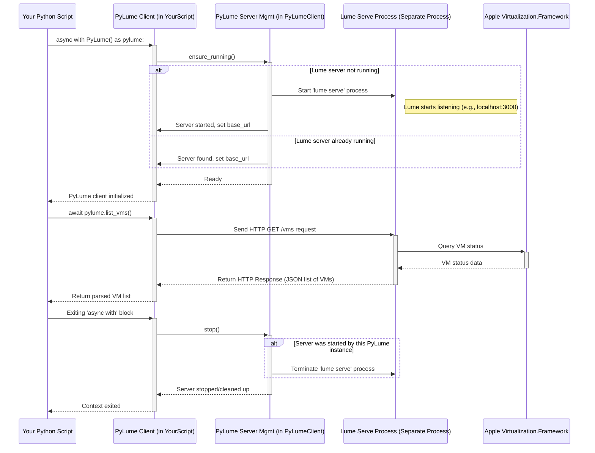

# Chapter 7: PyLume

In [Chapter 6: Computer Server](06_computer_server_.md), we learned about the helper program running *inside* our virtual machine (VM) or host computer, listening for commands like mouse clicks and keystrokes sent by the [Computer Interface](02_computer_interface__basecomputerinterface___macoscomputerinterface__.md).

But wait, how did that virtual machine get there in the first place? How do we start it, stop it, or even create it? We need a way to manage the lifecycle of the VM itself. That's where **Lume** and its Python remote control, **PyLume**, come in.

## What's the Problem? Managing Virtual Machines

Imagine you want to build a house (our software agent). You need a piece of land (the computer environment) to build it on. If you're building lots of houses, or want a clean, isolated piece of land for each one, you might use virtual land – virtual machines.

But creating, starting, and stopping these virtual plots of land requires special tools. On Apple Silicon Macs, Apple provides a powerful technology called the `Virtualization.Framework` for creating fast VMs. However, using this framework directly can be complicated. We need an easier way.

## Lume: The Skilled Stage Manager

Think of **Lume** as a skilled stage manager for a theatre. This stage manager is an expert at handling all the sets and props on stage. Lume is a command-line tool (`lume` in your terminal) specifically designed to manage macOS and Linux virtual machines on Apple Silicon Macs. It uses Apple's `Virtualization.Framework` behind the scenes, acting like the stage manager who knows exactly how to:

*   Build a new stage set (create a VM)
*   Bring a set onto the stage (start a VM)
*   Remove a set from the stage (stop a VM)
*   Check the status of all sets (list VMs)
*   Get blueprints for sets (pull pre-built VM images)

You can interact with Lume directly in your terminal, just like telling the stage manager what to do over a walkie-talkie.

*(Lume is developed as part of the CUA project - see `libs/lume`)*

## PyLume: The Python Remote Control

Now, imagine you want your Python script (like our [Computer](01_computer_.md) object) to tell the Lume stage manager what to do. You wouldn't want your script to manually type commands into the terminal. Instead, you'd want a remote control!

**PyLume** is exactly that: the **Python remote control for the Lume command-line tool**. It's a Python library (`libs/pylume`) that allows your Python code to send instructions to Lume.

*   **Bridge:** It acts as the bridge between your Python automation scripts and the Lume VM management tool.
*   **Remote:** It lets your script tell Lume to create, start, stop, list, and manage VMs without needing to run terminal commands manually.

## How the `Computer` Uses PyLume

Remember back in [Chapter 1: The Virtual Computer](01_computer_.md), we used `await computer.run()` or `async with computer:` to start our virtual computer? How did that actually happen?

The `Computer` object uses `PyLume` internally!

When you call `await computer.run()`:
1.  The `Computer` object checks its configuration (like the VM name, memory, CPU).
2.  It creates a `PyLume` instance (our remote control).
3.  It uses `PyLume` to tell Lume: "Hey, Stage Manager, is the VM named 'my-vm' ready?" (`pylume.get_vm(...)`)
4.  If it exists but isn't running, it tells Lume: "Bring the 'my-vm' set onto the stage!" (`pylume.run_vm(...)`)
5.  Lume uses the `Virtualization.Framework` to start the VM.
6.  The `Computer` (via `PyLume`) waits until Lume reports that the VM is running and has an IP address.
7.  Only then does the `Computer` proceed to connect its [Computer Interface](02_computer_interface__basecomputerinterface___macoscomputerinterface__.md) to the [Computer Server](06_computer_server_.md) inside the now-running VM.

Similarly, when the `async with computer:` block ends, or you call `await computer.stop()`, the `Computer` uses `PyLume` to tell Lume to stop the VM (`pylume.stop_vm(...)`).

Here's the diagram from Chapter 1 again, highlighting the `PyLume` interaction:

```mermaid
sequenceDiagram
    participant User
    participant Computer
    participant PyLume as PyLume (Remote)
    participant Lume as Lume (Stage Manager)
    participant VM

    User->>+Computer: await run() / async with computer:
    Computer->>+PyLume: Initialize PyLume client
    Computer->>PyLume: get_vm(name)
    PyLume->>+Lume: Send "get VM info" command
    Lume-->>-PyLume: Return VM details
    PyLume-->>Computer: VM details (or error)
    Computer->>PyLume: run_vm(name, options)
    PyLume->>+Lume: Send "run VM" command
    Lume->>+VM: Start VM process (using Virtualization.Framework)
    VM-->>-Lume: VM starting...
    Lume-->>-PyLume: VM run initiated
    PyLume-->>Computer: VM run initiated
    loop Wait for IP
        Computer->>PyLume: get_vm(name)
        PyLume->>+Lume: Send "get VM info" command
        Lume-->>-PyLume: Return VM status (IP address?)
        PyLume-->>Computer: VM status
        Note right of Computer: Keep checking...
    end
    Lume-->>-PyLume: VM Ready (with IP address)
    PyLume-->>-Computer: VM Ready (with IP address)
    Computer->>Computer: Create & Connect Interface...
    Computer-->>-User: run() completes / block entered
```
`PyLume` acts as the essential intermediary between the high-level `Computer` object and the low-level Lume tool.

## Using PyLume Directly (Simplified Example)

While the `Computer` object usually handles PyLume for you, let's see a quick, simplified example of how you *could* use PyLume directly if you needed finer control over VM management outside the `Computer` abstraction.

```python
import asyncio
# Import the main PyLume class and some data models
from pylume import PyLume, VMConfig, VMRunOpts

async def manage_vm_directly():
    # Create a PyLume client (the remote control)
    # Use 'async with' to ensure it starts and stops cleanly
    async with PyLume(debug=False) as pylume:
        print("PyLume client ready.")

        # --- List Existing VMs ---
        print("Listing all known VMs...")
        try:
            vm_list = await pylume.list_vms()
            if vm_list:
                for vm_status in vm_list:
                    print(f"- VM Name: {vm_status.name}, Status: {vm_status.status}")
            else:
                print("No VMs found.")
        except Exception as e:
            print(f"Error listing VMs: {e}")

        # --- Example: Get Status of a Specific VM ---
        vm_name_to_check = "macos-sequoia-cua_latest" # Example name
        print(f"\nGetting status for VM: {vm_name_to_check}")
        try:
            vm_info = await pylume.get_vm(vm_name_to_check)
            print(f"  Status: {vm_info.status}")
            print(f"  OS: {vm_info.os}")
            print(f"  CPU: {vm_info.cpu}")
            print(f"  Memory: {vm_info.memory}")
            if vm_info.ip_address:
                print(f"  IP Address: {vm_info.ip_address}")
        except Exception as e: # Handles cases where VM doesn't exist
            print(f"Could not get info for '{vm_name_to_check}': {e}")

        # --- Other actions you could take (usually done by Computer): ---
        # await pylume.create_vm(VMConfig(name="new-vm", ...))
        # await pylume.run_vm("new-vm")
        # await pylume.stop_vm("new-vm")
        # await pylume.delete_vm("new-vm")

# Run the async function
asyncio.run(manage_vm_directly())

# Example Output (will vary based on your VMs):
# PyLume client ready.
# Listing all known VMs...
# - VM Name: macos-sequoia-cua_latest, Status: stopped
# - VM Name: my-test-linux-vm, Status: stopped
#
# Getting status for VM: macos-sequoia-cua_latest
#   Status: stopped
#   OS: macOS
#   CPU: 4
#   Memory: 8GB
```

This example shows how to create a `PyLume` object and use its methods like `list_vms()` and `get_vm()`. **Remember, in the context of `cua`'s agent framework, you typically let the `Computer` object manage these PyLume interactions for you.**

## How Does PyLume Work Internally?

`PyLume` is quite clever. It doesn't reimplement all the VM logic itself. Instead, it uses the `lume` command-line tool. Here’s the typical flow when you use `PyLume`:

1.  **Find Lume:** The `PyLume` library locates the `lume` executable file that should have been installed on your system.
2.  **Start Lume Server:** If a `lume` server isn't already running (or if configured to start a new one), `PyLume` runs the command `lume serve` in the background. This starts the `lume` tool in a special mode where it acts as a local HTTP API server, listening for commands on a specific network port (like `http://localhost:3000/lume`). This is the "stage manager" listening on their walkie-talkie.
3.  **Create Client:** `PyLume` then creates an internal HTTP client (often using `curl` commands via Python's `subprocess`) configured to talk to that local `lume` server address.
4.  **Send Commands:** When you call a method like `await pylume.list_vms()`, the `PyLume` client sends an HTTP GET request to the `/vms` endpoint of the running `lume serve` process. For `await pylume.run_vm("my-vm")`, it sends an HTTP POST request to `/vms/my-vm/run`.
5.  **Lume Server Acts:** The `lume serve` process receives the HTTP request, performs the actual VM management action using Apple's `Virtualization.Framework`, and sends an HTTP response back.
6.  **PyLume Returns:** The `PyLume` client receives the HTTP response, parses it, and returns the result to your Python code.
7.  **Stop Server (Optional):** When the `PyLume` context manager exits (`async with pylume:` finishes), it can stop the `lume serve` process it started (if it wasn't using an existing one).

Here’s a simplified sequence diagram:



## A Peek Inside the Code (`libs/pylume`)

**1. Initializing PyLume (`pylume/pylume.py`)**

The `PyLume` class initializes the server management component.

```python
# Simplified from libs/pylume/pylume/pylume.py
class PyLume:
    def __init__(
        self,
        debug: bool = False,
        server_start_timeout: int = 60,
        port: Optional[int] = None,
        use_existing_server: bool = False,
        host: str = "localhost",
    ):
        # Stores settings like debug mode, timeout, etc.
        # Creates the LumeServer object responsible for managing
        # the 'lume serve' process.
        self.server = LumeServer(
            debug=debug,
            server_start_timeout=server_start_timeout,
            port=port,
            use_existing_server=use_existing_server,
            host=host,
        )
        # The actual client for sending HTTP requests is created later
        self.client = None

    async def __aenter__(self) -> "PyLume":
        """Async context manager entry."""
        # Ensure the Lume server process is running (starts it if needed)
        await self.server.ensure_running()
        # Initialize the HTTP client to talk to the server
        await self._init_client()
        return self

    async def __aexit__(self, exc_type, exc_val, exc_tb) -> None:
        """Async context manager exit."""
        # Close the HTTP client and stop the server if managed
        if self.client is not None:
            await self.client.close()
        await self.server.stop()

    async def _init_client(self) -> None:
        """Initialize the client if not already initialized."""
        if self.client is None:
            # Create the LumeClient using the server's base URL
            self.client = LumeClient(self.server.base_url, ...)
```

**2. Ensuring the Server is Running (`pylume/server.py`)**

The `LumeServer` class handles starting/connecting to the `lume serve` process.

```python
# Simplified from libs/pylume/pylume/server.py
class LumeServer:
    # ... (init stores config) ...

    async def ensure_running(self) -> None:
        """Ensure the server is running."""
        if self.use_existing_server:
            # If only using existing, try to connect and verify
            self.port = self.requested_port
            self.base_url = f"http://{self.host}:{self.port}/lume"
            await self._verify_server() # Sends a test request
        else:
            # Try connecting first, if fails, start a new one
            try:
                # Try default or requested port
                self.port = self.requested_port or 3000 # Example default
                self.base_url = f"http://{self.host}:{self.port}/lume"
                await self._verify_server()
                self.logger.debug("Connected to existing server")
                return
            except Exception:
                self.logger.debug("No existing server found, starting new one.")
                # Find the 'lume' executable, choose a port, start 'lume serve'
                await self._start_server()

    async def _start_server(self) -> None:
        """Start the lume server process."""
        lume_path = os.path.join(os.path.dirname(__file__), "lume")
        # ... (find available port logic) ...
        self.port = self._get_server_port()
        self.base_url = f"http://{self.host}:{self.port}/lume"
        # Run 'lume serve --port <port>' using subprocess.Popen
        self.server_process = subprocess.Popen(
            [lume_path, "serve", "--port", str(self.port)], ...
        )
        # Wait for the server to become responsive
        await self._wait_for_server()

    async def stop(self) -> None:
        """Stop the server if we started it."""
        if not self.use_existing_server and self.server_process:
            # Terminate the subprocess
            self.server_process.terminate()
            # ... (wait and cleanup) ...
```

**3. Making an API Call (`pylume/pylume.py` and `pylume/client.py`)**

Methods like `list_vms` in `PyLume` delegate to the `LumeClient`.

```python
# Simplified from libs/pylume/pylume/pylume.py
class PyLume:
    # ... (init, context managers) ...

    @ensure_server # Decorator ensures server is running and client is init'd
    async def list_vms(self) -> List[VMStatus]:
        """List all VMs."""
        # Delegate the HTTP GET request to the client
        data = await self.client.get("/vms")
        # Parse the JSON response data into VMStatus objects
        return [VMStatus.model_validate(vm) for vm in data]

# Simplified from libs/pylume/pylume/client.py
class LumeClient:
    # ... (init) ...

    async def get(self, path: str, ...) -> Any:
        """Make a GET request using curl."""
        # Construct the full URL
        url = f"{self.base_url}{path}"
        # Build the 'curl' command line arguments
        cmd = ["curl", "-X", "GET", "-s", ...]
        cmd.append(url)
        # Run 'curl' using asyncio.create_subprocess_exec
        process = await asyncio.create_subprocess_exec(*cmd, ...)
        stdout, stderr = await process.communicate()
        # ... (error handling and JSON parsing) ...
        return json.loads(response_body) if response_body.strip() else None
```
This shows how `PyLume` methods translate into HTTP requests (executed via `curl` in this implementation) sent to the `lume serve` process.

## Conclusion

You've now learned about **PyLume**, the Python remote control for the Lume command-line VM manager.

*   **Lume** is the tool that uses Apple's `Virtualization.Framework` to manage VMs on Apple Silicon.
*   **PyLume** is the Python library that lets code interact with Lume.
*   The [Computer](01_computer_.md) object uses PyLume behind the scenes to start, stop, and manage the VMs it controls.
*   PyLume works by starting a `lume serve` process (if needed) and sending HTTP commands to it.

PyLume ensures we have a virtual environment running. But once it *is* running, how does our [Computer Agent](03_computer_agent__computeragent__.md) make sense of what's displayed on the screen? Just getting a raw screenshot isn't always enough. The agent often needs to understand the *structure* of the screen – where are the buttons, text fields, and other interactive elements?

Ready to learn about the tool that helps the agent see and understand the screen content? Let's move on to [Chapter 8: SOM (OmniParser)](08_som__omniparser_.md)!

---

Generated by [AI Codebase Knowledge Builder](https://github.com/The-Pocket/Tutorial-Codebase-Knowledge)