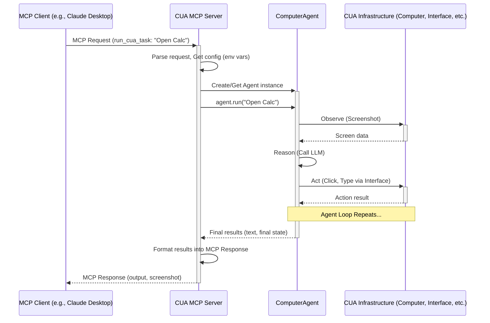

# Chapter 9: MCP Server

Welcome back! In [Chapter 8: SOM (OmniParser)](08_som__omniparser_.md), we discovered how the `SOM` system helps our agent understand the visual layout of the computer screen, identifying buttons and text. Now we have all these powerful components: a [Computer](01_computer_.md) environment, an [Interface](02_computer_interface__basecomputerinterface___macoscomputerinterface__.md) to control it, an intelligent [Agent](03_computer_agent__computeragent__.md) driven by a [Loop](04_agent_loop__baseloop___provider_loops__.md) and equipped with [Tools](05_tools__basetool___toolmanager___provider_tools__.md) and [SOM](08_som__omniparser_.md) vision.

But what if we want to use this amazing `cua` system from _another_ application? For example, imagine you're chatting with an AI assistant like Anthropic's Claude Desktop or using an AI-powered code editor like Cursor. Wouldn't it be great if you could just ask them, "Hey, using `cua`, please open Chrome and go to Google.com"?

How can these external applications talk to our `cua` agent? They don't necessarily know how to import and use Python classes like `ComputerAgent`. They need a standard way to communicate. This is where the **MCP Server** comes in.

## What's the Problem? Connecting Different Systems

Think about plugs and sockets. A device made in the UK has a different plug than one made in the US. You can't just plug a UK device into a US socket directly. You need an adapter!

Similarly, external AI applications like Claude Desktop or Cursor speak a particular language for interacting with tools and agents – this language is called the **Model Context Protocol (MCP)**. Our `cua` framework, on the other hand, understands Python classes and methods. They speak different "languages" or have different "plugs".

We need an adapter to bridge this gap.

## The MCP Server: Your Universal Adapter

The `cua` **MCP Server** is precisely this adapter. It's a specialized server program that sits between an external MCP-speaking application (like Claude Desktop) and our `cua` [Computer Agent](03_computer_agent__computeragent__.md).

- **It Speaks MCP:** It listens for requests coming from MCP clients using the standard MCP format.
- **It Speaks `cua`:** It knows how to take those MCP requests and translate them into actions for our `ComputerAgent`.
- **Translator:** It translates the MCP request (e.g., "run a task") into a call to `agent.run(task)`.
- **Result Relay:** It takes the results from the `ComputerAgent` and translates them back into the MCP format to send back to the original application.

Essentially, the MCP Server **wraps** the `ComputerAgent` and exposes its power through the standard MCP interface. This allows powerful external AI systems to leverage the entire `cua` framework for computer control without needing to know the internal Python details.

## How it Works: The Communication Flow

Let's imagine you're using Claude Desktop and you ask it: "Use `cua` to open the Calculator."

1.  **Claude Asks MCP Server:** Claude Desktop is configured to know about your running `cua` MCP Server. It sends a standard MCP message to the server, essentially saying: "Please execute the tool named `run_cua_task` with the instruction 'Open the Calculator app'."
2.  **MCP Server Receives:** The `cua` MCP Server (a running Python process) receives this message.
3.  **MCP Server Understands:** It sees the request is for the `run_cua_task` tool. It extracts the task: "Open the Calculator app."
4.  **MCP Server Prepares Agent:** It looks at its configuration (usually set via environment variables when the server was started) to know which AI model ([LLM](03_computer_agent__computeragent__.md)), which [Agent Loop](04_agent_loop__baseloop___provider_loops__.md) strategy, and which [Computer](01_computer_.md) environment to use. It then creates or accesses an instance of the `ComputerAgent` with this configuration.
5.  **MCP Server Runs Agent:** It calls `agent.run("Open the Calculator app")` on the `ComputerAgent`.
6.  **Agent Does the Work:** The `ComputerAgent` executes the task step-by-step (Observe-Reason-Act) using the [Computer Interface](02_computer_interface__basecomputerinterface___macoscomputerinterface__.md), [Tools](05_tools__basetool___toolmanager___provider_tools__.md), etc., as we learned in previous chapters. It collects the results (reasoning, actions, final message).
7.  **Agent Reports Back:** The `ComputerAgent` finishes and returns the final results (like "Okay, I have opened the Calculator app.") and potentially the final state of the screen.
8.  **MCP Server Packages Response:** The MCP Server takes these results and packages them into a standard MCP response format, including the text output and maybe a final screenshot.
9.  **MCP Server Replies:** It sends this MCP response back to Claude Desktop.
10. **Claude Shows Result:** Claude Desktop receives the response and displays the result to you, showing the agent's output and perhaps the final screenshot.

Here’s a diagram showing this flow:



## Setting Up and Running the MCP Server

Getting the MCP Server running involves two main steps:

1.  **Installation:** You install the server package, which also includes the core `cua` agent and computer libraries. Usually, this is done via pip:

    ```bash
    pip install cua-mcp-server
    ```

    An easy setup script is also available (see the `README.md` in `libs/mcp-server` for details). This command also makes a script `cua-mcp-server` available in your terminal.

2.  **Configuration:** You need to tell the MCP Server how to configure the underlying `ComputerAgent`. This is typically done through **environment variables** when you start the server, or within the configuration file of your MCP client (like Claude Desktop's `claude_desktop_config.json` or Cursor's `.cursor/mcp.json`).

    Key environment variables include:

    - `CUA_AGENT_LOOP`: Which agent strategy to use (e.g., `OMNI`, `ANTHROPIC`, `OPENAI`). Defaults to `OMNI`.
    - `CUA_MODEL_PROVIDER`: Which AI provider powers the agent's brain (e.g., `ANTHROPIC`, `OPENAI`, `OLLAMA`). Defaults to `ANTHROPIC`.
    - `CUA_MODEL_NAME`: The specific AI model name (e.g., `claude-3-haiku-20240307`). Defaults to the provider's default.
    - `CUA_PROVIDER_API_KEY`: Your API key for the chosen provider. **(Important!)**
    - `CUA_PROVIDER_BASE_URL`: Needed for some providers (like OpenAI-compatible endpoints).

    Here's how you might configure Claude Desktop in its JSON config file to start the `cua-mcp-server` using a specific script and set environment variables:

    ```json
    // In ~/.config/claude-desktop/claude_desktop_config.json (example)
    {
      "mcpServers": {
        "cua-agent": {
          // Command to start the server (using the setup script)
          "command": "/bin/bash",
          "args": ["~/.cua/start_mcp_server.sh"],
          // Environment variables passed to the server
          "env": {
            "CUA_AGENT_LOOP": "OMNI",
            "CUA_MODEL_PROVIDER": "ANTHROPIC",
            "CUA_MODEL_NAME": "claude-3-haiku-20240307",
            "CUA_PROVIDER_API_KEY": "YOUR_ANTHROPIC_API_KEY" // Replace!
          }
        }
      }
    }
    ```

    _(Refer to the `libs/mcp-server/README.md` for more detailed setup instructions and troubleshooting.)_

Once configured, the MCP client (Claude Desktop, Cursor) will automatically start the `cua-mcp-server` process when needed.

## A Peek Inside the Code (`libs/mcp-server`)

The MCP Server uses the `FastMCP` library to handle the MCP communication. The core logic resides in `mcp_server/server.py`.

**1. Defining the MCP Tool (`run_cua_task`)**

The server defines functions that are exposed as "tools" to the MCP client. The `@server.tool()` decorator marks a Python function as an MCP tool.

```python
# Simplified from libs/mcp-server/mcp_server/server.py

# Import necessary cua components
from computer import Computer
from agent import ComputerAgent, LLMProvider, LLM, AgentLoop
# Import MCP components
from mcp.server.fastmcp import Context, FastMCP, Image
import logging

logger = logging.getLogger("mcp-server")
server = FastMCP("cua-agent") # Initialize the MCP server object
global_computer = None # Cache the computer instance

# Decorator exposes this function as an MCP tool
@server.tool()
async def run_cua_task(ctx: Context, task: str) -> Tuple[str, Image]:
    """
    Run a Computer-Use Agent (CUA) task in a MacOS VM and return results.
    (Docstring is used as the tool description for the MCP client)

    Args:
        ctx: The MCP context (provides methods like ctx.info, ctx.error)
        task: The instruction from the MCP client

    Returns:
        A tuple: (text_result, final_screenshot_image)
    """
    global global_computer
    logger.info(f"Starting CUA task: {task}")
    full_result = ""

    try:
        # --- 1. Initialize Computer (if first time) ---
        if global_computer is None:
            # Creates the Computer object (which might start the VM via PyLume)
            global_computer = Computer(verbosity=logging.INFO)
            await global_computer.run()

        # --- 2. Read Configuration from Environment Variables ---
        loop_str = os.getenv("CUA_AGENT_LOOP", "OMNI")
        loop = getattr(AgentLoop, loop_str) # Convert string to Enum

        provider_str = os.getenv("CUA_MODEL_PROVIDER", "ANTHROPIC")
        provider = getattr(LLMProvider, provider_str) # Convert string to Enum

        model_name = os.getenv("CUA_MODEL_NAME", None)
        api_key = os.getenv("CUA_PROVIDER_API_KEY", None)
        # ... (get other env vars like base_url) ...

        # --- 3. Create the ComputerAgent ---
        agent = ComputerAgent(
            computer=global_computer,
            loop=loop,
            model=LLM(provider=provider, name=model_name, ...),
            api_key=api_key,
            # ... other agent settings ...
        )

        # --- 4. Run the Agent Task ---
        async for result in agent.run(task):
            # Collect text output from agent steps
            # (Simplified logic here, real code parses result dict)
            reasoning = result.get("reasoning", {}).get("text", "")
            message = result.get("text", {}).get("value", "")
            if reasoning: full_result += f"\nReasoning: {reasoning}"
            if message: full_result += f"\nMessage: {message}"
            # Report progress back to MCP client (optional)
            ctx.info(f"Agent step {result.get('id', '?')} done.")

        logger.info(f"CUA task completed successfully")

        # --- 5. Get Final Screenshot ---
        final_screenshot = await global_computer.interface.screenshot()

        # --- 6. Return Result in MCP Format ---
        return (
            full_result or "Task completed.", # Text part of the result
            Image(format="png", data=final_screenshot) # Image part
        )

    except Exception as e:
        # Handle errors and report back to MCP client
        error_msg = f"Error running CUA task: {str(e)}"
        logger.error(error_msg, exc_info=True)
        ctx.error(error_msg) # Report error via MCP context
        # Return an error message string (no image on error)
        return (f"Error during task execution: {str(e)}", None) # Adjust return type if needed

# ... (code to start the server) ...
```

This snippet shows the core logic:

1.  The function is triggered when the MCP client calls the `run_cua_task` tool.
2.  It ensures the [Computer](01_computer_.md) is running.
3.  It reads environment variables to determine the agent's configuration ([Loop](04_agent_loop__baseloop___provider_loops__.md) type, [LLM](03_computer_agent__computeragent__.md) provider/model, API key).
4.  It creates the [Computer Agent](03_computer_agent__computeragent__.md) instance.
5.  It runs the task using `agent.run()`.
6.  It collects the text output and takes a final screenshot using the [Computer Interface](02_computer_interface__basecomputerinterface___macoscomputerinterface__.md).
7.  It returns the results formatted as a tuple (string, MCP `Image` object), which `FastMCP` sends back to the client. Error handling is included to report issues back to the MCP client.

The rest of the server code (`server.py`, `__main__.py`) handles starting the `FastMCP` server process, which listens for incoming connections from MCP clients.

## Conclusion

You've now learned about the **MCP Server**, the crucial adapter that connects the `cua` framework to the wider world of AI applications that speak the Model Context Protocol (MCP).

- It acts as a **translator**, allowing MCP clients like Claude Desktop or Cursor to use the `cua` [Computer Agent](03_computer_agent__computeragent__.md).
- It receives MCP requests, translates them into `agent.run()` calls, and sends the results back in MCP format.
- It's configured primarily through environment variables set when the server is launched by the MCP client.
- It allows you to leverage `cua`'s computer control capabilities directly from within other AI tools using natural language.

Now that we have potentially complex interactions happening between different systems (MCP clients, MCP server, agent, computer, AI models), how do we keep track of what's going on? How do we monitor performance, log events, or debug issues? We need a way to gather information about the system's behavior.

Ready to learn about `cua`'s built-in system for logging and monitoring? Let's move on to the final chapter: [Chapter 10: Telemetry Client (UniversalTelemetryClient)](10_telemetry_client__universaltelemetryclient__.md)!

---

Generated by [AI Codebase Knowledge Builder](https://github.com/The-Pocket/Tutorial-Codebase-Knowledge)
