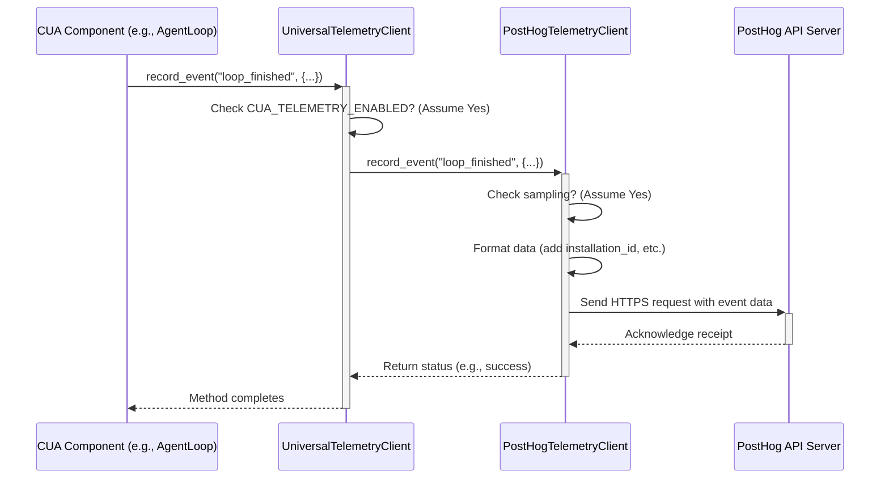

# Chapter 10: Telemetry Client (UniversalTelemetryClient)

Welcome to the final chapter! In [Chapter 9: MCP Server](09_mcp_server_.md), we saw how the `MCP Server` acts as an adapter, allowing external applications like Claude Desktop or Cursor to communicate with our `cua` [Computer Agent](03_computer_agent__computeragent__.md).

Now, think about building something complex like `cua`. How do the developers know which features are being used most often? Which parts might be causing errors? Or which agent loops are most popular? Without some feedback, improving the framework is like trying to fix a car without knowing what's wrong with it. This is where telemetry comes in.

## What Problem Does Telemetry Solve?

Imagine you're a game developer. You release a new game with lots of features. You want to know which levels players enjoy the most, where they get stuck, or if certain features are never used. This information helps you make the game better in future updates.

**Telemetry** in `cua` works similarly. It's a way for the framework to _optionally_ send **anonymous** feedback back to the developers. This feedback isn't about _you_ or _your data_, but about _how the `cua` framework itself is being used_.

For example, it might count:

- How many times the `OmniLoop` was used compared to the `OpenAILoop`.
- If a specific [Tool](05_tools__basetool___toolmanager___provider_tools__.md) (like `BashTool`) encounters frequent errors.
- How often a new feature (like a specific `Computer Interface` command) is called.

This anonymous usage data helps the `cua` developers understand how the framework is performing in the real world, identify bugs, and prioritize improvements.

## Key Concepts

### 1. Anonymous Usage Data

The core idea is collecting _usage statistics_, not personal information. The data sent does not identify the user or the specific tasks the agent is performing. It focuses on the framework's components and their usage patterns.

### 2. Opt-In and Easy Disabling

Telemetry in `cua` is designed with privacy first. **It is disabled by default.** You must explicitly enable it by setting an environment variable:

```bash
# Example: Enable telemetry in your terminal session
export CUA_TELEMETRY_ENABLED=true
```

If this variable is not set to `true` (or `1`, `yes`, `on`), no telemetry data will be collected or sent. You can disable it just as easily by unsetting the variable or setting it to `false`.

### 3. The `UniversalTelemetryClient`

This is the main component within `cua` that handles telemetry. Think of it as the central collection point. Other parts of the `cua` framework (like the [Agent Loop](04_agent_loop__baseloop___provider_loops__.md) or the [Computer](01_computer_.md)) report events or counts to this client.

The `UniversalTelemetryClient` checks two things:

- Is telemetry globally enabled (via `CUA_TELEMETRY_ENABLED`)?
- If yes, should this specific event be sent (based on sampling)?

### 4. PostHog Backend

If telemetry is enabled and an event is sampled, the `UniversalTelemetryClient` delegates the sending task to a backend client. Currently, `cua` uses **PostHog**, a popular open-source product analytics platform. The `PostHogTelemetryClient` handles the details of formatting the data and sending it securely to the PostHog server managed by the `cua` developers. The PostHog API key used is public and only allows sending anonymous data.

### 5. Privacy Focus

It's worth repeating:

- **Anonymous:** Data is tied to a random, unique installation ID, not a user account.
- **Non-Identifiable:** No details about the tasks (like "Open my bank website") or file contents are sent. Only metadata about framework usage (e.g., "`left_click` called", "agent loop `OMNI` started", "error in `BashTool`").
- **Optional:** Disabled by default, requires explicit opt-in.
- **Transparent:** The code for telemetry collection is open-source within the `cua-core` library (`libs/core/core/telemetry/`).

## How is Telemetry Used? (Mostly Automatic)

As a user of the `cua` framework, you generally don't interact directly with the telemetry client. It works behind the scenes _if you choose to enable it_.

Here's how it fits in:

1.  **Initialization:** When components like `ComputerAgent` or `Computer` are initialized, they might internally get an instance of the `UniversalTelemetryClient`.
2.  **Checking Status:** The client automatically checks the `CUA_TELEMETRY_ENABLED` environment variable to see if it should be active.
3.  **Internal Reporting:** As different parts of `cua` execute, they might make calls to the telemetry client.
    - Example: An `AgentLoop` starts -> `record_event("agent_loop_started", {"loop_type": "OMNI"})`
    - Example: A specific tool is used -> `increment("tool_usage_count", {"tool_name": "BashTool"})`
    - Example: An error occurs in the `Computer Interface` -> `record_event("interface_error", {"error_type": "WebSocketDisconnect"})`
4.  **Sending (if enabled & sampled):** The `UniversalTelemetryClient` handles the logic of whether to actually send this data to PostHog, based on the global setting and sampling rate.

**Checking if Telemetry is Enabled**

You can programmatically check if telemetry is currently active:

```python
# Import the function from the core library
from core.telemetry import is_telemetry_enabled

# Check the status
enabled = is_telemetry_enabled()

if enabled:
    print("Telemetry is currently enabled.")
else:
    print("Telemetry is currently disabled.")

# Possible Output (depending on your environment variable):
# Telemetry is currently disabled.
# --- OR ---
# Telemetry is currently enabled.
```

This function respects the `CUA_TELEMETRY_ENABLED` environment variable.

**Disabling Telemetry**

The easiest way is to simply not set `CUA_TELEMETRY_ENABLED=true`. If it was set previously, you can unset it or set it to `false`.

```bash
# Example: Ensure telemetry is disabled
export CUA_TELEMETRY_ENABLED=false
# Or simply unset it if it was previously set
# unset CUA_TELEMETRY_ENABLED
```

There's also a function to disable it programmatically for the current session, although managing it via the environment variable is more common:

```python
from core.telemetry import disable_telemetry, is_telemetry_enabled

# Disable telemetry for this script's execution
disable_telemetry()

print(f"Telemetry enabled now? {is_telemetry_enabled()}")

# Output:
# Telemetry enabled now? False
```

## How it Works Internally: The Reporting Flow

Let's trace what happens when a `cua` component tries to record an event, assuming telemetry _is_ enabled via the environment variable.

1.  **Component Calls:** A piece of `cua` code (e.g., inside an `AgentLoop`) calls `record_event("loop_finished", {"duration": 120.5})`.
2.  **Global Client:** This call goes to the shared `UniversalTelemetryClient` instance managed by `core.telemetry`.
3.  **Enabled Check:** The `UniversalTelemetryClient` first checks again if telemetry is globally enabled (it respects `CUA_TELEMETRY_ENABLED`). If not, it does nothing.
4.  **Delegate to Backend:** If enabled, it passes the event details (`"loop_finished"`, `{"duration": 120.5}`) to its internal backend client, which is the `PostHogTelemetryClient`.
5.  **PostHog Client Receives:** The `PostHogTelemetryClient` gets the event.
6.  **Sampling Check:** It might apply a sampling rule (though currently often set to 100%). If the event is "sampled out", it stops here.
7.  **Format Data:** It prepares the event data in the format PostHog expects, adding the unique anonymous `installation_id` and other standard properties like the `cua` version.
8.  **Send Data:** It sends the formatted event data over HTTPS to the public PostHog endpoint (`eu.i.posthog.com`).
9.  **PostHog Collects:** The PostHog server receives and stores the anonymous event data.

Here's a simplified sequence diagram:



## A Peek Inside the Code (`libs/core/core/telemetry/`)

**1. Checking the Global Disable Switch (`telemetry.py`)**

This function reads the environment variable to see if telemetry should be off globally.

```python
# Simplified from libs/core/core/telemetry/telemetry.py
import os

def is_telemetry_globally_disabled() -> bool:
    """Check CUA_TELEMETRY_ENABLED environment variable."""
    # Only enabled if explicitly set to a truthy value
    telemetry_enabled = os.environ.get("CUA_TELEMETRY_ENABLED", "false").lower()
    return telemetry_enabled not in ("1", "true", "yes", "on")

```

This check is the first gatekeeper for all telemetry operations.

**2. The Universal Client (`telemetry.py`)**

This client acts as the main entry point and delegates to the backend.

```python
# Simplified from libs/core/core/telemetry/telemetry.py
# (Assuming PostHog is available)
from .posthog_client import get_posthog_telemetry_client

class UniversalTelemetryClient:
    def __init__(self, backend: Optional[str] = None):
        # Check global disable first
        if is_telemetry_globally_disabled():
            self.backend_type = TelemetryBackend.NONE
            self._client = None
            self._enabled = False
            logger.info("Telemetry globally disabled")
        else:
            # Determine backend (Assume PostHog for simplicity)
            self.backend_type = TelemetryBackend.POSTHOG
            self._client = get_posthog_telemetry_client() # Get PostHog client
            self._enabled = True
            logger.info("Using PostHog telemetry backend")

    def record_event(self, event_name: str, properties: Optional[Dict] = None) -> None:
        # Check if enabled *now* and if client exists
        if self._client and self.is_enabled():
            # Delegate to the backend client (PostHog)
            self._client.record_event(event_name, properties)

    def is_enabled(self) -> bool:
        # Must be enabled AND not globally disabled
        return self._enabled and not is_telemetry_globally_disabled()

    # ... other methods like increment, flush, enable, disable ...
```

This shows how the universal client checks the global setting and passes calls along to the specific backend client (`PostHogTelemetryClient`).

**3. The PostHog Client (`posthog_client.py`)**

This client handles the specifics of interacting with PostHog.

```python
# Simplified from libs/core/core/telemetry/posthog_client.py
import posthog # The PostHog library
import random
import uuid

class PostHogTelemetryClient:
    def __init__(self):
        self.config = TelemetryConfig.from_env() # Reads CUA_TELEMETRY_DISABLED
        self.installation_id = self._get_or_create_installation_id()
        self.initialized = False
        # ... (queues, etc.) ...
        if self.config.enabled:
            self._initialize_posthog() # Setup connection if enabled

    def _initialize_posthog(self):
        # Configure the posthog library with public key/host
        posthog.api_key = PUBLIC_POSTHOG_API_KEY
        posthog.host = PUBLIC_POSTHOG_HOST
        posthog.disabled = not self.config.enabled
        # Identify this installation anonymously
        if not posthog.disabled:
             posthog.identify(self.installation_id, {"version": __version__})
        self.initialized = True
        # ... (error handling) ...

    def _get_or_create_installation_id(self) -> str:
        # Tries to read/write a unique ID from a file in the library folder
        # Falls back to a random UUID if needed
        # (Implementation details omitted)
        return str(uuid.uuid4()) # Simplified fallback

    def record_event(self, event_name: str, properties: Optional[Dict] = None):
        if not self.config.enabled or not self.initialized:
            return # Don't send if disabled or not set up

        # Apply sampling rate
        if random.random() * 100 > self.config.sample_rate:
             logger.debug(f"Event sampled out: {event_name}")
             return

        # Add standard info and send to PostHog
        event_properties = {"version": __version__, **(properties or {})}
        try:
            posthog.capture(
                distinct_id=self.installation_id,
                event=event_name,
                properties=event_properties
            )
            posthog.flush() # Send immediately
        except Exception as e:
            logger.debug(f"Failed sending event to PostHog: {e}")

    # ... other methods like increment, flush, enable, disable ...
```

This shows how the `PostHogTelemetryClient` uses the actual `posthog` library to send the anonymous `installation_id` and event data, respecting the enabled status and sampling rate.

## Conclusion

Congratulations on completing the `cua` tutorial!

In this final chapter, you learned about the **Telemetry Client (`UniversalTelemetryClient`)**:

- It provides an **optional** way for the `cua` framework to send **anonymous** usage data back to the developers.
- This data helps improve the framework by identifying popular features, common errors, and usage patterns.
- It's **disabled by default** and must be explicitly enabled via the `CUA_TELEMETRY_ENABLED=true` environment variable.
- It prioritizes **privacy** by not sending any personally identifiable information or task details.
- It uses **PostHog** as a backend to collect this anonymous data.
- It works automatically behind the scenes within `cua` components if enabled.

Understanding telemetry helps you know how feedback _might_ be collected (if you opt-in) and assures you of the privacy-focused design.

We've covered a lot of ground, from the basic [Computer](01_computer_.md) environment and its [Interface](02_computer_interface__basecomputerinterface___macoscomputerinterface__.md), through the intelligent [Agent](03_computer_agent__computeragent__.md) with its [Loop](04_agent_loop__baseloop___provider_loops__.md), [Tools](05_tools__basetool___toolmanager___provider_tools__.md), and [SOM](08_som__omniparser_.md) vision, to the supporting components like the [Computer Server](06_computer_server_.md), [PyLume](07_pylume_.md), [MCP Server](09_mcp_server_.md), and now Telemetry.

You now have a solid foundation for using and understanding the `cua` framework. Happy automating!

---

Generated by [AI Codebase Knowledge Builder](https://github.com/The-Pocket/Tutorial-Codebase-Knowledge)
