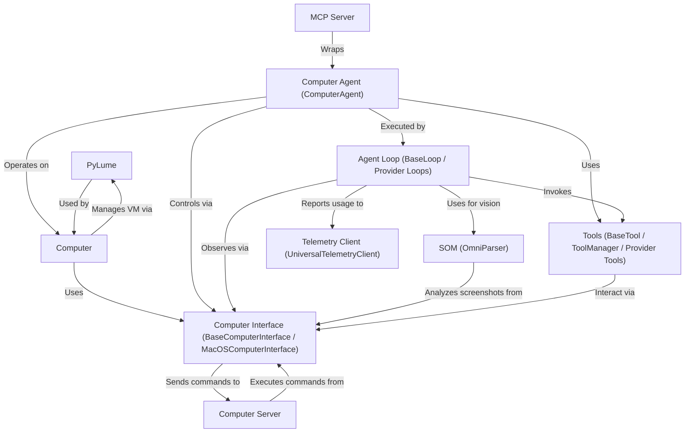

# Tutorial: cua

CUA (**C**omputer **U**se **A**gent) allows an _AI agent_ to interact with a computer's graphical interface, much like a human user would. It can control the mouse and keyboard within a virtual machine (_VM_) or the host macOS system. The system uses a _Computer Server_ to execute low-level actions (like clicks and typing) commanded by the _Computer Interface_. An _Agent Loop_ coordinates the AI's perception (seeing the screen, sometimes using _SOM_ vision), reasoning (deciding the next action), and execution (using _Tools_ and the _Computer Interface_). **PyLume** manages the VMs, and an optional _MCP Server_ allows other AI systems to use CUA's capabilities. _Telemetry_ helps improve the project by collecting anonymous usage data.

**Source Repository:** [None](None)

## Chapters

1. [Computer
   ](01_computer_.md)
2. [Computer Interface (BaseComputerInterface / MacOSComputerInterface)
   ](02_computer_interface__basecomputerinterface___macoscomputerinterface__.md)
3. [Computer Agent (ComputerAgent)
   ](03_computer_agent__computeragent__.md)
4. [Agent Loop (BaseLoop / Provider Loops)
   ](04_agent_loop__baseloop___provider_loops__.md)
5. [Tools (BaseTool / ToolManager / Provider Tools)
   ](05_tools__basetool___toolmanager___provider_tools__.md)
6. [Computer Server
   ](06_computer_server_.md)
7. [PyLume
   ](07_pylume_.md)
8. [SOM (OmniParser)
   ](08_som__omniparser__.md)
9. [MCP Server
   ](09_mcp_server_.md)
10. [Telemetry Client (UniversalTelemetryClient)
    ](10_telemetry_client__universaltelemetryclient__.md)

---

Generated by [AI Codebase Knowledge Builder](https://github.com/The-Pocket/Tutorial-Codebase-Knowledge)
