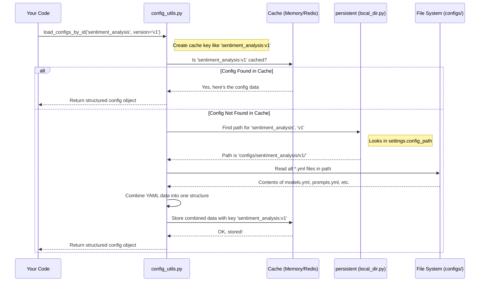

# Chapter 1: Configuration Management

Welcome to the `llm-analytics` tutorial! We're excited to guide you through the core concepts of this powerful framework. Let's start with the very foundation: how `llm-analytics` knows _what_ to do for each specific task.

## The Problem: One Tool, Many Jobs

Imagine you have a toolbox. You might use a hammer for nails, a screwdriver for screws, and a wrench for bolts. Each tool is right for a specific job.

`llm-analytics` is like a versatile toolbox for analyzing text using Large Language Models (LLMs). But how does it know whether you want to:

- Analyze customer reviews for sentiment using `GPT-4`?
- Summarize news articles using `Claude 3`?
- Extract specific information from legal documents using a different model and specific instructions (prompts)?

Each of these tasks requires different settings: different LLM models, different prompts (the instructions we give the LLM), maybe different steps in the process, or different places to get the data. We need a way to tell `llm-analytics` the _exact_ settings for the _specific_ job we want it to do.

## The Solution: Project-Specific Instruction Manuals (Configurations)

This is where **Configuration Management** comes in. Think of it as creating a specific instruction manual for each analysis project you undertake.

- **Project (`project_id`):** Each unique analysis task gets a name, like `customer_sentiment` or `news_summarizer`. This is its `project_id`.
- **Instruction Manual (YAML Files):** For each project, we write down all its specific settings (LLM model, prompts, workflow steps, data sources) in simple text files. We use a format called YAML (`.yml`), which is easy for both humans to read and write, and for computers to understand.
- **Filing Cabinet (`configs/` Directory):** All these project-specific instruction manuals (YAML files) are stored neatly in folders inside a main `configs/` directory. Each project gets its own folder named after its `project_id`.

This way, when you want to run the `customer_sentiment` analysis, `llm-analytics` just needs to open the `configs/customer_sentiment/` folder and read its instruction manual. If you want to run `news_summarizer`, it reads the manual from `configs/news_summarizer/`.

## How It Works: Loading the Instructions

So, you have your instruction manuals (YAML files) in the `configs/` directory. How does `llm-analytics` actually read and use them?

1.  **Identify the Project:** You tell `llm-analytics` which project you want to work with by providing its `project_id`.
2.  **Find the Manual:** The system looks inside the `configs/` directory for a folder matching that `project_id`. It might also look for a specific _version_ folder inside the project folder if you are using versioning (e.g., `configs/customer_sentiment/v1.2/`).
3.  **Read the Files:** It reads all the `.yml` files within that project (and version) folder.
4.  **Understand the Instructions:** The system combines the information from all these files and converts it into a structured format (like a Python object) that other parts of `llm-analytics` can easily understand and use.
5.  **Speed Boost (Caching):** To avoid reading the files from the disk every single time (which can be slow), `llm-analytics` often keeps a copy of recently used configurations in a faster storage place, like computer memory or a dedicated cache system like Redis. This is called _caching_. The next time you ask for the same configuration, it can grab the cached copy much faster.

### Example: Loading Configuration for `sentiment_analysis`

Let's say you have a project called `sentiment_analysis` with its configuration files in `configs/sentiment_analysis/v1/`.

Your `configs/` directory might look like this:

```
configs/
├── sentiment_analysis/
│   └── v1/
│       ├── models.yml
│       ├── prompts.yml
│       └── workflow.yml
└── news_summarizer/
    └── v1/
        ├── models.yml
        ├── prompts.yml
        └── workflow.yml
```

Inside `configs/sentiment_analysis/v1/models.yml`, you might have:

```yaml
# configs/sentiment_analysis/v1/models.yml
llm_provider: "openai"
llm_model: "gpt-3.5-turbo"
```

And `configs/sentiment_analysis/v1/prompts.yml`:

```yaml
# configs/sentiment_analysis/v1/prompts.yml
sentiment_prompt: "Analyze the sentiment of the following text: {review_text}"
```

When another part of the system needs the configuration for `sentiment_analysis` version `v1`, it essentially asks the Configuration Management system:

```python
# This is a conceptual example
project_id = "sentiment_analysis"
version = "v1"

# Ask the system to load the config
project_config = load_configs_by_id(project_id, version=version)

# Now project_config holds all settings from the YAML files
# We can access settings like:
# print(project_config.models.llm_model) # Output might be "gpt-3.5-turbo"
# print(project_config.prompts.sentiment_prompt) # Output might be "Analyze the sentiment..."
```

The `load_configs_by_id` function handles finding the right files, reading them, combining them, potentially caching them, and returning them as an easy-to-use object (`project_config`).

## Under the Hood: A Quick Peek

Let's trace what happens when `load_configs_by_id('sentiment_analysis', version='v1')` is called:



**Key Code Files Involved:**

1.  **`fala/utils/config_utils.py`:** Contains the main logic like `load_configs_by_id`. It coordinates checking the cache and loading from storage.

    ```python
    # Simplified from fala/utils/config_utils.py
    from fala.global_vars.contains import settings # Gets base config path
    from .persistent import get_persistent # Gets the storage handler
    from .api_server.cache_handler import get_cache_handler # Gets cache handler

    persistent = get_persistent() # Usually LocalDir
    cache_handler = get_cache_handler() # Memory or Redis

    def load_configs_by_id(project_id: str, version="latest", recreate: bool = False):
        # 1. Determine the correct version if 'latest' is requested
        # version = get_latest_project_version(project_id) if version == "latest" else version
        cache_key = f"{project_id}:{version}" # e.g., "sentiment_analysis:v1"

        # 2. Check cache first
        if not cache_handler.exit("project_id:" + cache_key) or recreate:
            # 3. If not in cache, load from persistent storage (files)
            # config_project_path = os.path.join(settings.config_path, project_id, version)
            # ... scan files in path ...
            config_data = persistent.load_project_config(project_id, version) # Simplified call
            # ... potentially add more info like task_names ...

            # 4. Store the loaded data in the cache
            cache_handler.set("project_id:" + cache_key, str(config_data))
        else:
            # 5. If in cache, retrieve it
            config_data = eval(cache_handler.get("project_id:" + cache_key))

        # 6. Return the data (often converted to a ConfigObject)
        return config_data # Typically returns a ConfigObject( **config_data)
    ```

    This function orchestrates the process: check cache, load from files if needed, store in cache, and return the result.

2.  **`fala/persistent/local_dir.py`:** Handles the actual reading from the local file system.

    ```python
    # Simplified from fala/persistent/local_dir.py
    import os
    from fala.utils.io_utils import scan_files, yaml_read # File system utilities
    from fala.global_vars.contains import settings # Gets base config path

    class LocalDir: # Implements how to interact with local files
        config_path: str = settings.config_path # e.g., "./configs"

        def load_project_config(self, project_id, version) -> dict:
            # Construct the full path to the specific project version's config files
            config_project_path = os.path.join(self.config_path, project_id, version)

            # Find all '.yml' files in that directory
            config_paths = scan_files(config_project_path, "*.yml")

            config_data = {}
            # Read each YAML file found
            for config_path in config_paths:
                _data = yaml_read(config_path) # Reads YAML content
                if _data:
                    # Add the content of the file to the main dictionary
                    config_data.update(_data)
            return config_data
    ```

    This class knows how to find the project's configuration directory and read all the YAML files inside it, merging their contents.

3.  **`fala/api_server/cache_handler/__init__.py`:** Decides _which_ caching mechanism to use (simple in-memory or more robust Redis).

    ```python
    # Simplified from fala/api_server/cache_handler/__init__.py
    from fala.global_vars.contains import redis_config # Checks Redis settings
    from .memory_store import MemoryStore
    from .redis_store import RedisStore

    def get_cache_handler():
        # If Redis is configured, use it
        if redis_config is not None:
            # return RedisStore(...) # Configure Redis connection
            pass # Simplified
        # Otherwise, use a simple dictionary in memory
        else:
            return MemoryStore()
    ```

4.  **`fala/global_vars/contains.py`:** Defines global settings, including the default path for the `configs/` directory (`settings.config_path`). It also defines the `ConfigObject` class used to provide easy dot-notation access to loaded configurations (e.g., `config.models.llm_model`).

## Conclusion

Configuration Management is the system's way of reading project-specific instruction manuals. By storing settings in YAML files within a structured `configs/` directory, `llm-analytics` can easily adapt to different analysis tasks. It loads these settings, converts them into usable objects, and uses caching for speed.

This flexibility allows you to define precisely how you want `llm-analytics` to behave for each unique project, whether it's choosing LLMs, defining prompts, or setting up complex workflows.

Now that we understand how `llm-analytics` gets its instructions, let's dive into one of the core components defined in these configurations: the [Workflow Graph](02_workflow_graph_.md), which defines the step-by-step process for your analysis.

---> [Next Chapter: Workflow Graph](02_workflow_graph_.md)

---

Generated by [AI Codebase Knowledge Builder](https://github.com/The-Pocket/Tutorial-Codebase-Knowledge)
