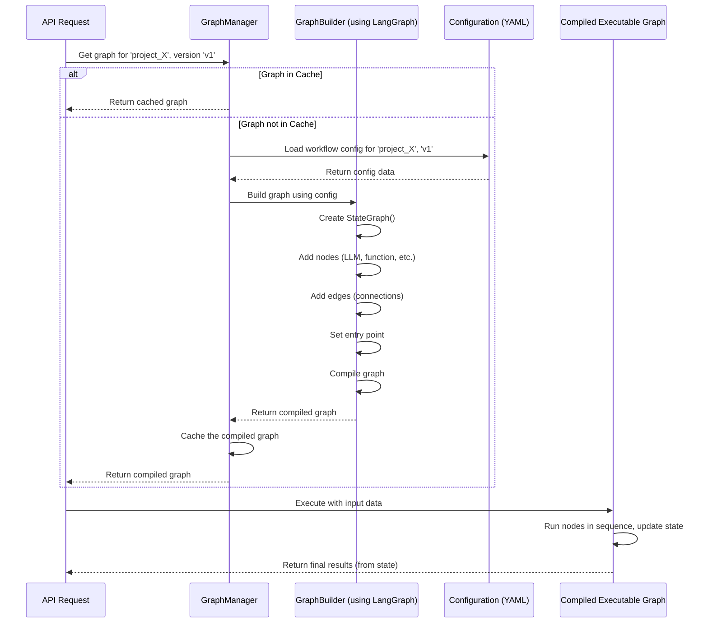

# Chapter 2: Workflow Graph

In the [previous chapter](01_configuration_management_.md), we learned how `llm-analytics` uses configuration files (like instruction manuals) to understand the specific settings for each analysis project. Now, let's look at one of the most important parts defined in those configurations: the **Workflow Graph**.

## The Problem: Analysis Isn't Always a Single Step

Imagine you need to analyze a customer support call transcript. You might want to:

1.  First, figure out the main *topics* discussed in the call.
2.  *Then*, based on the topics, determine the customer's *sentiment* (happy, angry, neutral).
3.  Maybe, *if* the sentiment is negative, figure out the *reason* for the complaint.
4.  Finally, *summarize* the entire interaction.

This isn't just one action; it's a series of steps, sometimes depending on the results of earlier steps. How do we tell `llm-analytics` the *order* of these steps and how they connect?

## The Solution: A Customizable Assembly Line (Workflow Graph)

The **Workflow Graph** is the core engine that orchestrates this multi-step analysis process. Think of it like a customizable assembly line for text analysis:

*   **Nodes (Assembly Stations):** Each step in your analysis process is represented as a "node" in the graph. A node could be:
    *   Calling an LLM to analyze text (like finding topics or sentiment).
    *   Running a specific piece of Python code (like cleaning up data).
    *   Retrieving information from a database or search engine.
    *   Making a decision based on previous results.
*   **Edges (Conveyor Belts):** These are the connections *between* the nodes. They define the path the data takes through the assembly line. An edge dictates which node runs after another.
*   **Data (The Product):** Your input data (like the call transcript) enters the graph and travels along the edges from node to node. Each node processes or adds to the data.

You define this assembly line – the nodes and their connections (edges) – in your project's configuration files (the YAML files we discussed in [Chapter 1](01_configuration_management_.md)).

### Analogy: Baking a Cake

Think of a recipe:

1.  Mix flour, sugar, eggs (Node 1: Mixing).
2.  Pour into pan (Node 2: Pouring).
3.  Bake at 180°C for 30 mins (Node 3: Baking).
4.  *If* it's baked through (Decision/Condition), then let cool (Node 4: Cooling). *Else*, bake 5 more mins (Back to Node 3).
5.  Decorate (Node 5: Decorating).

The Workflow Graph is like this recipe. It defines the steps (nodes), the order (edges), and even allows for decisions (conditional edges).

### Defined in Configuration

Remember the YAML configuration files from Chapter 1? A part of your configuration, often in a file named `workflow.yml`, defines this graph structure.

Here's a *very simplified* example of what that might look like:

```yaml
# configs/sentiment_analysis/v1/workflow.yml (Simplified Example)

workflow:
  nodes:
    - id: "extract_topics"    # Node 1: Find topics
      type: "llm"             # This node uses an LLM
      prompt: "topic_prompt"  # Instructions for the LLM

    - id: "analyze_sentiment" # Node 2: Analyze sentiment
      type: "llm"
      prompt: "sentiment_prompt"

    - id: "summarize_call"    # Node 3: Summarize
      type: "llm"
      prompt: "summary_prompt"

  edges:
    - src: "extract_topics"     # After 'extract_topics'...
      dst: "analyze_sentiment"  # ...go to 'analyze_sentiment'.

    - src: "analyze_sentiment"  # After 'analyze_sentiment'...
      dst: "summarize_call"     # ...go to 'summarize_call'.

  entry_points: ["extract_topics"] # Where the data first enters
```

This configuration tells `llm-analytics`:
*   There are three steps (nodes): `extract_topics`, `analyze_sentiment`, `summarize_call`.
*   The process starts at `extract_topics`.
*   After `extract_topics`, the data goes to `analyze_sentiment`.
*   After `analyze_sentiment`, the data goes to `summarize_call`.

*(Note: The actual configuration allows for much more complex setups, including branching, conditions, and different node types, defined in `fala/workflow/graph/graph_configs.py`)*

## How It Works: Data Flow and State

1.  **Entry:** Data (e.g., the call transcript) enters the graph at the specified `entry_point` node(s).
2.  **Execution:** The first node performs its task. This task is defined by what we call a [Runnable (Graph Node)](04_runnable__graph_node_.md), which we'll cover in Chapter 4.
3.  **State Management:** As data flows through the graph, the results from each node and the original input are stored in a central place called the [Graph State](05_graph_state_.md) (Chapter 5). Think of it as a shared notepad that every node can read from and write to.
4.  **Following Edges:** The graph looks at the defined `edges` to see where the data should go next.
5.  **Conditional Branching:** Some edges can have conditions. For example, an edge might say "Only go to the 'complaint_reason' node *if* the 'analyze_sentiment' node found negative sentiment." This allows the workflow to adapt based on intermediate results.
6.  **Iteration:** The process repeats – the next node executes, updates the state, and the graph follows the appropriate edge.
7.  **End:** The process continues until it reaches an endpoint, and the final results (usually collected in the [Graph State](05_graph_state_.md)) are returned.

Under the hood, `llm-analytics` uses a powerful library called **LangGraph**, specifically its `StateGraph` concept, to manage this flow, state, and execution. `StateGraph` is designed precisely for building these kinds of stateful, potentially cyclic graphs.

## Use Case: Call Transcript Analysis Revisited

Let's trace our example:

1.  **Input:** `{ "transcript": "User: My internet is down! Agent: Okay, let's check..." }`
2.  **Entry Point:** The data enters the `extract_topics` node.
3.  **Node `extract_topics`:** Calls an LLM with the transcript. Result might be `{"topics": ["internet outage"]}`. This is added to the [Graph State](05_graph_state_.md).
4.  **Edge:** The graph follows the edge from `extract_topics` to `analyze_sentiment`.
5.  **Node `analyze_sentiment`:** Calls an LLM, possibly using both the transcript *and* the extracted topics from the state. Result might be `{"sentiment": "negative"}`. This is added to the state.
6.  **Edge:** The graph follows the edge from `analyze_sentiment` to `summarize_call`.
7.  **Node `summarize_call`:** Calls an LLM using the transcript and maybe other info from the state. Result might be `{"summary": "Customer reported internet outage, seems frustrated."}`. Added to the state.
8.  **End:** No more edges from `summarize_call`. The graph finishes.
9.  **Output:** The final state contains all the results: `{"topics": [...], "sentiment": "...", "summary": "..."}`.

## Under the Hood: Building and Running the Graph

How does `llm-analytics` translate the YAML configuration into this working assembly line?

1.  **Request:** When you ask `llm-analytics` to analyze something for a specific `project_id` (e.g., via the [API Server & Routers](03_api_server___routers_.md)), it first loads the configuration for that project (as seen in [Chapter 1](01_configuration_management_.md)).
2.  **Graph Retrieval/Build:** It asks the `GraphManager` for the workflow graph associated with that project and version.
    *   If the graph has already been built and is cached, the `GraphManager` returns it quickly.
    *   If not, the `GraphManager` uses a `GraphBuilder`.
3.  **GraphBuilder:** The `GraphBuilder` reads the `workflow` section of the configuration (nodes, edges, entry points). It uses LangGraph's `StateGraph` to:
    *   Create an empty graph structure.
    *   Add each node defined in the config (using a `RunnableBuilder` to create the actual processing logic for each node type - LLM call, function, etc.).
    *   Add the edges connecting the nodes, including any conditional logic (defined in files like `fala/workflow/graph/graph_edges.py`).
    *   Set the entry point(s).
    *   Compile the graph into an executable object.
4.  **Caching:** The `GraphManager` caches this newly built, executable graph.
5.  **Execution:** The system takes the input data (like the transcript) and runs it through the compiled graph, managing the [Graph State](05_graph_state_.md) along the way.



### Key Code Files Involved

*   **`fala/tasks/graphs/build.py`:** Orchestrates loading the config and initiating the graph build process for a project.

    ```python
    # Simplified from fala/tasks/graphs/build.py
    from fala.utils.config_utils import load_configs_by_id
    from fala.global_vars import get_graph_manager # Gets the GraphManager instance

    async def build_project_graph(project_id, version="latest", recreate=False):
        # 1. Load the project's configuration files
        project_config = load_configs_by_id(project_id, version=version)
        # ... (other setup like models, search engines) ...

        # 2. Get the GraphManager
        graph_manager = get_graph_manager()

        # 3. Ask the manager to get (or build) the graph
        # This triggers the build process if the graph isn't cached
        graph = graph_manager.get_graph(project_id, project_config, version)
        logger.info(f"Built graph for {project_id} success!")
        return graph
    ```
    This function ties together loading configuration and asking the `GraphManager` to provide the executable graph.

*   **`fala/workflow/graph/graph_manager.py`:** Manages the lifecycle of graphs – caching, building, and retrieving them.

    ```python
    # Simplified from fala/workflow/graph/graph_manager.py
    from fala.workflow.graph.graph_builder import GraphBuilder

    class GraphManager:
        def __init__(self):
            self.graph_cache = {} # Simple dictionary for caching graphs
            # ... checkpointer setup ...

        def get_graph(self, project_id, project_configs, version):
            cache_key = f"{project_id}-{version}"
            # 1. Check if graph is already built and cached
            if cache_key in self.graph_cache:
                return self.graph_cache[cache_key]

            # 2. If not cached, build it
            graph_executable = self.build_graph(project_id, project_configs, version)

            # 3. Store the new graph in the cache
            self.graph_cache[cache_key] = graph_executable
            return graph_executable

        def build_graph(self, project_id, project_configs, version):
            # Creates a GraphBuilder instance
            graph_builder = GraphBuilder(project_id, project_configs, version, self.checkpointer)
            # Tells the builder to construct the workflow from the config
            return graph_builder.construct_workflow()
    ```
    The `GraphManager` acts as a central registry, ensuring we don't rebuild the same graph repeatedly.

*   **`fala/workflow/graph/graph_builder.py`:** Takes the configuration and uses LangGraph to actually construct the graph.

    ```python
    # Simplified from fala/workflow/graph/graph_builder.py
    from langgraph.graph import StateGraph, END
    from fala.workflow.graph.graph_states import InputState, OutputState # Defines the data 'state'
    from fala.workflow.runnables.runnable_builder import RunnableBuilder # Builds individual nodes

    class GraphBuilder:
        def __init__(self, project_id, project_configs, version, checkpointer):
            self.project_configs = project_configs
            self.runnable_builder = RunnableBuilder(...) # Helper to create node logic
            self.checkpointer = checkpointer # Handles saving state checkpoints

        def construct_workflow(self):
            workflow_config = self.project_configs.get("workflow")
            graph_config = workflow_config # Simplified
            # ... build subgraphs if needed ...
            compiled_graph = self._build_graph(graph_config)
            # ... create execution config ...
            return GraphExecutable(compiled_graph=compiled_graph, ...) # Package graph & config

        def _build_graph(self, graph_config):
            # 1. Initialize LangGraph's StateGraph with our input/output structure
            graph = StateGraph(input=InputState, output=OutputState)

            # 2. Add Nodes: Loop through node configs from YAML
            for node_cfg in graph_config.get("nodes", []):
                node_id = node_cfg['id']
                # Use RunnableBuilder to create the actual function/LLM call for the node
                runnable_node = self.runnable_builder.build_runnable(node_cfg)
                graph.add_node(node_id, runnable_node)

            # 3. Add Edges: Loop through edge configs from YAML
            edge_conditions = self._get_edge_conditions() # Load condition functions
            for edge_cfg in graph_config.get("edges", []):
                src = edge_cfg['src']
                dst = edge_cfg.get('dst')
                condition_name = edge_cfg.get('condition')

                if condition_name: # If it's a conditional edge
                    condition_func = edge_conditions[condition_name]
                    graph.add_conditional_edges(src, condition_func, ...) # Map condition results to destinations
                elif dst == "END":
                    graph.add_edge(src, END) # Connect node to the graph's end
                else:
                    graph.add_edge(src, dst) # Connect node 'src' to node 'dst'

            # 4. Set Entry Point(s)
            for entry_point in graph_config.get("entry_points", []):
                graph.set_entry_point(entry_point)

            # 5. Compile the graph into an executable object
            compiled_graph = graph.compile(checkpointer=self.checkpointer)
            return compiled_graph

        def _get_edge_conditions(self):
            # Loads functions used for conditional routing from files like:
            # - fala/workflow/graph/graph_edges.py (default conditions)
            # - configs/{project_id}/{version}/graph_edges.py (custom conditions)
            # ... implementation omitted ...
            return {} # Returns dict like {'condition_name': function_object}
    ```
    The `GraphBuilder` is where the YAML definition meets LangGraph's `StateGraph` to create the actual, runnable workflow.

*   **Supporting Files:**
    *   `fala/workflow/graph/graph_configs.py`: Defines *how* nodes and edges should be described in the YAML files (their structure).
    *   `fala/workflow/graph/graph_states.py`: Defines the structure of the data ([Graph State](05_graph_state_.md)) that is passed between nodes.
    *   `fala/workflow/graph/graph_edges.py`: Contains Python functions used for conditional edge routing (e.g., deciding which path to take based on sentiment).

## Conclusion

The **Workflow Graph** is the heart of `llm-analytics`, acting as a customizable assembly line for your analysis tasks. By defining **nodes** (steps) and **edges** (connections) in your configuration files, you precisely control the flow of data and the sequence of operations. This allows for building complex, multi-step analysis pipelines that can even branch based on intermediate results, all managed efficiently using LangGraph.

Now that we understand how configurations are loaded (Chapter 1) and how the core analysis flow is defined (Chapter 2), let's see how users and external systems interact with `llm-analytics` through its web interface.

---> [Next Chapter: API Server & Routers](03_api_server___routers_.md)

---

Generated by [AI Codebase Knowledge Builder](https://github.com/The-Pocket/Tutorial-Codebase-Knowledge)