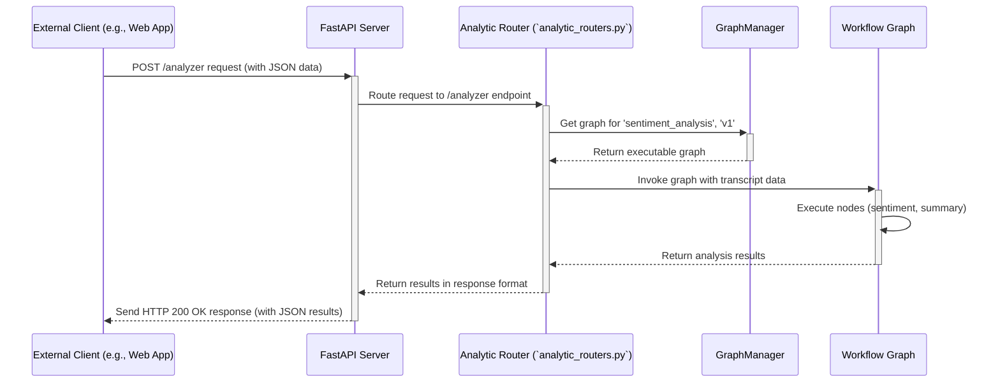

# Chapter 3: API Server & Routers

In the [previous chapter](02_workflow_graph_.md), we saw how the [Workflow Graph](02_workflow_graph_.md) defines the step-by-step process for analyzing data within `llm-analytics`. But how do we actually _tell_ `llm-analytics` to start an analysis? How do we send it the data (like a call transcript) and get the results back?

## The Problem: Knocking on the Door

Imagine `llm-analytics` is a smart analysis factory. We've designed the assembly line ([Workflow Graph](02_workflow_graph_.md)) and given it the instructions ([Configuration Management](01_configuration_management_.md)). Now, how do we:

1.  Send a package (our data, like a transcript) to the factory?
2.  Tell the factory which specific assembly line (which `project_id`) to use?
3.  Get the finished product (the analysis results) back?

We need a front door, a reception desk, or a main switchboard to handle these interactions with the outside world.

## The Solution: The Front Desk (API Server & Routers)

The **API Server** is the main entry point for `llm-analytics`. Think of it as the factory's front desk or main switchboard:

- **API (Application Programming Interface):** A set of rules and definitions that allow different software programs to communicate with each other. It's like a menu at a restaurant – it tells you what you can order (what functions are available) and how to order it (what information you need to provide).
- **Server:** The actual program that listens for incoming requests (phone calls or visitors to the front desk). In `llm-analytics`, we use a popular Python framework called **FastAPI** to build this server.
- **Endpoints (URLs):** Specific addresses or "phone extensions" for different tasks. For example, sending data for analysis might go to the `/analyzer` endpoint, while managing project settings might go to `/project`. These are like specific doors or counters at the front desk.
- **Requests (HTTP):** When an external system wants `llm-analytics` to do something, it sends a request, usually using the standard web protocol HTTP. This is like filling out a form or making a specific request at the front desk. Requests contain the data (e.g., the transcript) and specify which endpoint (e.g., `/analyzer`) they are for.
- **Responses (HTTP):** After processing the request, the API Server sends back a response, also using HTTP. This is the result of the task – the analysis, a confirmation message, or an error report. It's like the receptionist handing back the processed form or giving you an answer.
- **Routers:** Just like a large office building might group related departments together (Sales on Floor 1, Support on Floor 2), routers organize the endpoints into logical groups. We might have an `analytic_router` for all analysis tasks, a `project_router` for managing projects, etc. This keeps things organized.

So, the API Server listens for incoming HTTP requests at specific URLs (endpoints), figures out what needs to be done based on the URL and the data in the request, triggers the right internal process (like starting a [Workflow Graph](02_workflow_graph_.md) analysis), and sends back an HTTP response with the results.

### How It Solves the Use Case: Analyzing a Transcript

Let's say you have a web application that needs to analyze a call transcript using the `sentiment_analysis` project we defined earlier.

1.  **Send Request:** Your web application sends an HTTP POST request to the `llm-analytics` server, specifically to the `/analyzer` endpoint. The request includes the data in a structured format (like JSON):

    ```json
    // Input: Sent to POST /analyzer
    {
      "project_id": "sentiment_analysis",
      "version": "v1",
      "tasks": ["analyze_sentiment", "summarize_call"], // Which results we want
      "content": {
        "callName": "call_123",
        "transcript": [
          { "channel": 0, "text": "User: My internet is down!" },
          { "channel": 1, "text": "Agent: Okay, let's check..." }
        ],
        "metadata": {},
        "agentChannel": 1
      }
    }
    ```

2.  **API Server Receives:** The FastAPI server running `llm-analytics` receives this request.
3.  **Routing:** It sees the request is for `/analyzer`, so it directs it to the function handling that specific endpoint (likely defined in `analytic_routers.py`).
4.  **Processing:** The endpoint function extracts the `project_id`, `content`, etc. It then uses the [Workflow Graph](02_workflow_graph_.md) (via the `GraphManager`) for `sentiment_analysis v1` to process the transcript.
5.  **Send Response:** Once the analysis is complete, the API server sends an HTTP response back to your web application, containing the results:

    ```json
    // Output: Received from POST /analyzer
    {
      "request_id": "some_unique_id", // Added by the server
      "status_code": 200, // Means "OK"
      "data": {
        "callName": "call_123",
        "resultTasks": {
          "analyze_sentiment": { "sentiment": "negative" }, // Result from graph
          "summarize_call": {
            "summary": "Customer reported internet outage..."
          } // Result from graph
        },
        "version": "v1"
      }
    }
    ```

Your web application receives this JSON response and can display the sentiment and summary to the user.

## Under the Hood: A Request's Journey

Let's trace the path of that `/analyzer` request:



1.  The **Client** sends the request.
2.  The **FastAPI Server** receives it.
3.  The server uses its routing rules to find the specific code (`Analytic Router`) responsible for the `/analyzer` path.
4.  The router code calls the **GraphManager** to get the correct [Workflow Graph](02_workflow_graph_.md).
5.  The router code tells the **Workflow Graph** to run with the input data.
6.  The graph executes its steps.
7.  The results are returned to the router code.
8.  The router code formats the results into the standard response structure.
9.  The **FastAPI Server** sends the final HTTP response back to the **Client**.

## Code Dive: Setting Up the Server and Routes

Let's look at some key files involved (simplified for clarity).

**1. Starting the Server (`fala/__main__.py` & `fala/api_server/server.py`)**

This is the entry point that starts the web server.

```python
# fala/__main__.py (Simplified)
from fala.api_server.server import run

if __name__ == "__main__":
    run() # Calls the run function in server.py
```

```python
# fala/api_server/server.py (Simplified)
import uvicorn
from fastapi import FastAPI
from fala.api_server.routers import add_router # Imports function to add routers
from fala.global_vars.contains import settings # Gets settings like hostname, port

# Create the main FastAPI application instance
app = FastAPI()

# Add all the different routers (like analytic, project, etc.)
app = add_router(app)

# Basic endpoint for checking if the server is running
@app.get("/")
def index():
    return "[index] FPT.AI LLM Analytic is working.\n"

def run():
    logger.info("Starting FALA endpoint server...")
    # Use uvicorn (a web server) to run the FastAPI app
    uvicorn.run(
        "fala.api_server.server:app", # Points to our 'app' object
        host=settings.service_hostname,
        port=int(settings.service_port),
        # ... other settings ...
    )
```

- `FastAPI()` creates the main application object.
- `add_router(app)` plugs in all the different sets of endpoints.
- `@app.get("/")` defines a simple endpoint for the root URL.
- `uvicorn.run(...)` actually starts the server, making it listen for requests.

**2. Organizing Endpoints (`fala/api_server/routers/__init__.py`)**

This file imports the different router files and adds them to the main FastAPI application.

```python
# fala/api_server/routers/__init__.py (Simplified)
from fastapi import FastAPI

# Import the routers defined in other files
from . import (
    analytic_routers,
    build_routers,
    project_routers,
    # ... other routers ...
)

def add_router(app: FastAPI):
    # Include each router, giving them a prefix and tags for documentation
    app.include_router(analytic_routers.router, prefix="/analyzer", tags=["analytic"])
    app.include_router(project_routers.router, prefix="/project", tags=["project"])
    app.include_router(build_routers.router, prefix="/build", tags=["build"])
    # ... include other routers ...
    return app
```

- This acts like a central hub, making sure all the "departments" (routers) are connected to the main "reception desk" (the `app`).
- `prefix="/analyzer"` means all endpoints in `analytic_routers.py` will start with `/analyzer`.

**3. Defining an Endpoint (`fala/api_server/routers/analytic_routers.py`)**

This is where the logic for a specific task, like `/analyzer`, lives.

```python
# fala/api_server/routers/analytic_routers.py (Simplified)
from fastapi import APIRouter, Body
from typing import Annotated # Used for clearer type hints with Body()

from fala.api_server.model_class import ContentAnalytic # Defines input structure
from fala.global_vars import get_graph_manager # Access graph manager
from fala.utils.response_utils import response_success, response_error # Helpers for responses

# Create a router for analytic endpoints
router = APIRouter()

# Define the POST endpoint at the root of this router's prefix ("/analyzer")
@router.post("/")
async def analyzer(
    project_id: Annotated[str, Body()], # Get project_id from request body
    content: ContentAnalytic,          # Get content (validated) from body
    version: Annotated[str, Body()] = "latest", # Get version (optional)
    # ... other parameters omitted for simplicity ...
):
    try:
        # 1. Get the Graph Manager instance
        graph_manager = get_graph_manager()

        # 2. Ask Graph Manager for the executable graph for this project/version
        #    (This might load config and build the graph if not cached)
        graph_executable = graph_manager.get_graph(
            project_id=project_id, version=version #, project_configs=...
        )

        # 3. Prepare the input data for the graph
        input_data = content.to_dict() # Convert input object to dictionary

        # 4. Run the graph with the input data
        #    This executes the steps defined in the Workflow Graph
        results = graph_executable.compiled_graph.invoke(
            input_data, config=graph_executable.execution_config
        )

        # 5. Format the successful response
        final_results = results.get("task_results", {}) # Extract relevant part
        response_data = {"callName": content.callName, "resultTasks": final_results, "version": version}
        return response_success(data=response_data)

    except Exception as e:
        # Handle potential errors during processing
        return response_error(msg=str(e))
```

- `APIRouter()` creates a new router instance.
- `@router.post("/")` tells FastAPI that the function `analyzer` should handle HTTP POST requests sent to the path defined by the router's prefix (which was `/analyzer` in `__init__.py`).
- `Annotated[str, Body()]` tells FastAPI to expect `project_id` inside the JSON body of the request. `ContentAnalytic` does the same, but FastAPI also validates the incoming data against the structure defined in the `ContentAnalytic` class (from `fala/api_server/model_class.py`).
- The function then interacts with the `GraphManager` to get and run the appropriate [Workflow Graph](02_workflow_graph_.md).
- Finally, it uses helper functions (`response_success`, `response_error`) to create the standard HTTP JSON response.

**4. Defining Data Structures (`fala/api_server/model_class.py` or `interface.py`)**

These files often use Pydantic or Dataclasses to define the expected structure of request and response data. FastAPI uses these definitions to automatically validate incoming data and serialize outgoing data.

```python
# fala/api_server/model_class.py (Simplified Example)
from dataclasses import dataclass, field
from typing import List, Dict, Any
from dataclasses_json import dataclass_json # Helper for JSON conversion

@dataclass_json # Allows easy conversion to/from dictionary/JSON
@dataclass     # Creates a class primarily for holding data
class Utterance:
    channel: int
    text: str

@dataclass_json
@dataclass
class ContentAnalytic: # Defines the expected structure for 'content' input
    callName: str
    transcript: List[Utterance]
    metadata: dict
    agentChannel: int = 1
```

- This defines that `ContentAnalytic` should have a `callName` (string), a `transcript` (list of `Utterance` objects), etc. FastAPI uses this to ensure the data sent to `/analyzer` matches this format.

## Conclusion

The **API Server**, built with FastAPI, acts as the crucial front door for `llm-analytics`. It listens for requests from the outside world. **Routers** help organize the different "services" offered, directing requests like `/analyzer` or `/project` to the correct handling code. These endpoint functions then parse the incoming data, trigger the necessary internal logic (often involving the [Configuration Management](01_configuration_management_.md) and [Workflow Graph](02_workflow_graph_.md)), and package the results into a response.

This structure provides a clean, standard way for other applications or users to interact with the powerful analysis capabilities of `llm-analytics`.

Now that we know how requests come in and trigger workflows, let's look closer at the individual processing steps within those workflows: the [Runnable (Graph Node)](04_runnable__graph_node_.md).

---> [Next Chapter: Runnable (Graph Node)](04_runnable__graph_node_.md)

---

Generated by [AI Codebase Knowledge Builder](https://github.com/The-Pocket/Tutorial-Codebase-Knowledge)
