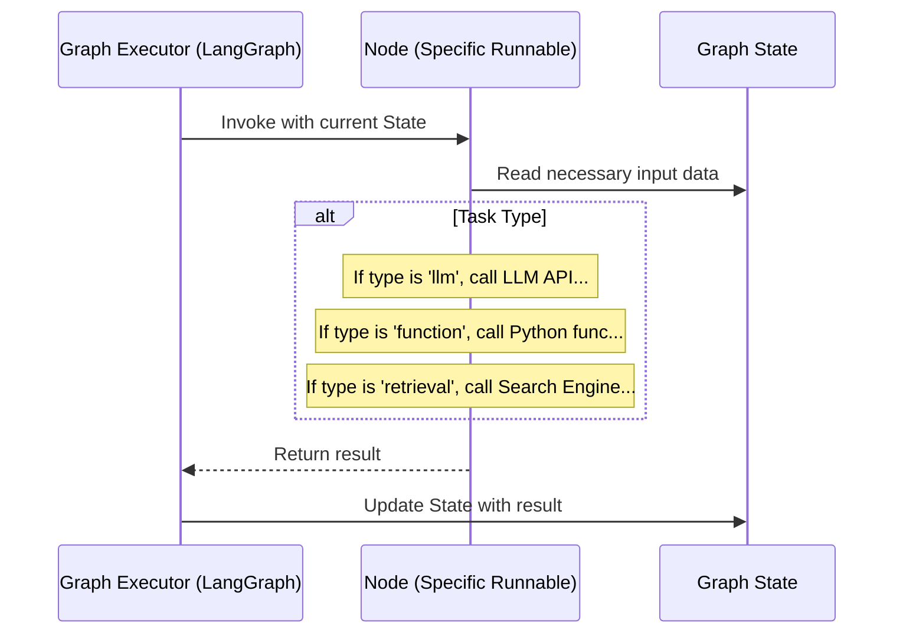

# Chapter 4: Runnable (Graph Node)

In the [previous chapter](03_api_server___routers_.md), we learned how the [API Server & Routers](03_api_server___routers_.md) act as the front door, receiving requests and triggering analysis tasks. We also know from [Chapter 2](02_workflow_graph_.md) that these tasks are defined as a [Workflow Graph](02_workflow_graph_.md) – a kind of assembly line.

But what are the individual _stations_ on that assembly line? How does each step in the workflow actually _do_ its specific job?

## The Problem: Defining the Work at Each Station

Imagine our text analysis assembly line ([Workflow Graph](02_workflow_graph_.md)). One station needs to figure out the sentiment of a customer review, the next needs to extract product names mentioned, and maybe another needs to clean up the text before analysis.

Each station performs a different kind of work:

- One station needs to talk to a powerful AI (an LLM).
- Another needs to run some standard data cleanup code written in Python.
- Yet another might need to look up similar examples from a database.

How do we define _what kind_ of work happens at each specific node (station) in our graph? How does the system know whether to call an LLM or run a simple Python function for a particular step?

## The Solution: Runnables - The Workstations

This is where the **Runnable** comes in. Think of a **Runnable** as the definition and the engine for a _single workstation_ on the [Workflow Graph](02_workflow_graph_.md)'s assembly line.

- **A Single Job:** Each Runnable represents one specific unit of work.
- **Variety of Tools:** Just like a real workstation might have different tools, a Runnable can represent different kinds of operations:
  - Calling an LLM (e.g., asking GPT-4 for sentiment).
  - Running a Python function (e.g., removing punctuation, formatting data).
  - Retrieving information (e.g., finding relevant past examples using [Search Engine / Vector Store Integration](07_search_engine___vector_store_integration_.md)).
  - Combining retrieval and LLM calls (Retrieval-Augmented Generation or RAG).

Essentially, the nodes we defined in the [Workflow Graph](02_workflow_graph_.md) configuration are implemented as Runnables.

### The Factory Foreman: `RunnableBuilder`

How does the system know which type of Runnable to create for each node? That's the job of the **`RunnableBuilder`**.

Think of the `RunnableBuilder` as the factory foreman. When setting up the assembly line ([Workflow Graph](02_workflow_graph_.md)), the foreman reads the blueprint (your project's configuration file, e.g., `workflow.yml`).

The blueprint specifies what _type_ of workstation is needed at each point. For example:

```yaml
# configs/sentiment_analysis/v1/workflow.yml (Simplified Snippet)
# ... (other parts of the file) ...
workflow:
  nodes:
    - id: "clean_text"
      type: "function" # Foreman, build a Function Runnable here!
      function: "remove_pii" # Use the 'remove_pii' Python function

    - id: "analyze_sentiment"
      type: "llm" # Foreman, build an LLM Runnable here!
      prompt: "sentiment_prompt" # Use this prompt for the LLM

    - id: "find_examples"
      type: "retrieval" # Foreman, build a Retrieval Runnable here!
      search_key: "customer_content"
# ... (other nodes and edges) ...
```

Based on the `type` field (and other related details) for each node in the configuration, the `RunnableBuilder` constructs the correct type of Runnable object (the actual code that will execute the task) and places it at that position in the graph.

## Types of Runnables

Let's look at the main types of workstations the `RunnableBuilder` can create:

1.  **LLM Runnable:**

    - **Job:** Interacts with a Large Language Model (like GPT, Claude, etc.).
    - **How:** Takes input data (often text and a prompt from [Prompt Management](06_prompt_management_.md)), sends it to the configured LLM, and gets the model's response (e.g., sentiment classification, summary).
    - **Config Key:** `type: "llm"`

2.  **Function Runnable:**

    - **Job:** Executes a specific Python function you've defined.
    - **How:** Takes data from the [Graph State](05_graph_state_.md), runs your Python code on it (e.g., cleaning data, formatting text, performing calculations), and returns the modified data. These functions are often related to [Data Processing Functions](08_data_processing_functions_.md).
    - **Config Key:** `type: "function"`

3.  **Retrieval Runnable:**

    - **Job:** Fetches relevant information from a data source, typically a vector database via [Search Engine / Vector Store Integration](07_search_engine___vector_store_integration_.md).
    - **How:** Takes some input query (like the customer's issue), searches the database for similar past examples or relevant documents, and returns the found information.
    - **Config Key:** `type: "retrieval"`

4.  **RAG (Retrieval-Augmented Generation) Runnable:**

    - **Job:** Combines retrieval _and_ LLM generation.
    - **How:** First, it retrieves relevant information (like the Retrieval Runnable), then it feeds that information along with the original input and a prompt to an LLM to generate a more informed response.
    - **Config Key:** `type: "rag"` (Often uses LLM config fields too).

5.  **Prompt Runnable:**
    - **Job:** Formats a prompt string using data from the state.
    - **How:** Takes a prompt template and fills in the blanks using current data in the [Graph State](05_graph_state_.md). Useful for preparing complex inputs for other nodes.
    - **Config Key:** `type: "prompt"`

## Under the Hood: How a Runnable Executes

When the [Workflow Graph](02_workflow_graph_.md) reaches a specific node during execution:

1.  **Invoke:** The graph execution engine (LangGraph) calls the `Runnable` object associated with that node.
2.  **Input (State):** The Runnable automatically receives the current [Graph State](05_graph_state_.md) as its input. This state contains all the data produced by previous nodes.
3.  **Execute:** The Runnable performs its specific task based on its type:
    - An LLM Runnable constructs the prompt using data from the state and calls the LLM API.
    - A Function Runnable calls the designated Python function, passing relevant data from the state.
    - A Retrieval Runnable queries the search engine using data from the state.
4.  **Output (Update State):** The Runnable returns its result. This result is then used to update the [Graph State](05_graph_state_.md), making the new information available to subsequent nodes in the graph.



### Code Dive: The `RunnableBuilder`

The `RunnableBuilder` is the key component that translates the configuration into executable Runnables. Its main job happens in the `build_runnable` method.

**File:** `fala/workflow/runnables/runnable_builder.py`

```python
# Simplified from fala/workflow/runnables/runnable_builder.py
from typing import Callable, Dict, Optional, Union
from langchain_core.runnables import Runnable
# ... other imports ...
from fala.workflow.graph.graph_configs import ( # Defines Node Config structures
    FunctionNodeConfig, LLMNodeConfig, RetrievalNodeConfig, RAGNodeConfig, # ... etc
)
from fala.workflow.prompt.prompt_loader import PromptLoader

class RunnableBuilder:
    def __init__(self, project_id: str, version: str, project_config: Optional[dict]):
        self.project_id = project_id
        self.version = version
        # Load available Python functions (from function_runnables modules)
        self.function_mappings = self._load_function_mappings(version)
        # Initialize prompt loader
        self.prompt_loader = PromptLoader(project_id, project_config)
        # ...

    def build_runnable(
        self,
        runnable_config: dict, # Config for one node from workflow.yml
        search_engine: Optional[BaseSearch], # Search engine instance if needed
        collection_name: Optional[str],     # Collection name if needed
        subgraphs: Optional[Dict[str, CompiledGraph]], # For subgraph nodes
    ) -> Union[Runnable, Callable]:

        runnable_type = runnable_config.get("type") # Get the node type (e.g., "llm")

        # Foreman checks the blueprint (config) and builds the right workstation
        if runnable_type == "function":
            # Config says "function", use FunctionNodeConfig structure
            config = FunctionNodeConfig(**runnable_config)
            # Build a function runnable using the specified function name
            runnable = self._build_function_runnable(config.function)

        elif runnable_type == "llm":
            config = LLMNodeConfig(**runnable_config)
            # Build an LLM runnable using prompt, output type etc.
            runnable = self._build_llm_runnable(config)

        elif runnable_type == "retrieval":
            assert search_engine and collection_name
            config = RetrievalNodeConfig(**runnable_config)
            # Build a retrieval runnable using search details
            runnable = self._build_retrieval_runnable(config, search_engine, collection_name)

        elif runnable_type == "rag":
            assert search_engine and collection_name
            config = RAGNodeConfig(**runnable_config)
            # Build a RAG runnable
            runnable = self._build_rag_runnable(config, search_engine, collection_name)

        # ... (handle other types like "prompt", "vision_llm", "subgraph") ...

        else:
            raise ValueError(f"Unrecognized node type: {runnable_type}")

        return runnable # Return the created Runnable object/function

    def _build_function_runnable(self, function_name: str) -> Callable:
        # Look up the function name in the loaded mappings
        if function_name not in self.function_mappings:
            raise NotImplementedError(f"Function {function_name} not found!")
        # Return the actual Python function object
        return self.function_mappings[function_name]

    def _build_llm_runnable(self, config: LLMNodeConfig) -> Callable:
        # 1. Load the specific prompt details (using PromptLoader)
        prompt_item = self.prompt_loader.get_prompt_item(
            config.prompt, config.prompt_version, config.prompt_label
        )
        # 2. Build the LLM chain (Prompt + LLM + Output Parser)
        llm_chain, _ = self._build_llm_chain(
            prompt_item, config.output_type, config.output_confidence
        )
        # 3. Define the function that will be called by the graph
        def llm_runnable_func(state: InputState):
            # Get needed variables from state
            inputs = get_prompt_variable_dict_from_state(state, prompt_item.variables)
            # Execute the chain
            output = llm_chain.invoke(inputs)
            # Prepare the state update
            # ... (logic to format output and decide where it goes in the state) ...
            state_update = {"processed_data": {config.id: output}} # Simplified
            if config.task:
                 state_update.update({"task_results": {config.task: output}})
            return state_update

        return llm_runnable_func # Return the function that LangGraph will call

    # ... other _build methods (_build_retrieval_runnable, _build_rag_runnable, etc.) ...

    # Helper to load Python functions from specific project/default locations
    def _load_function_mappings(self, version: str) -> Dict[str, Callable]:
        function_mappings = {}
        # Try loading default functions (e.g., from fala/workflow/runnables/function_runnables/)
        try:
            function_mappings.update(create_function_mappings("fala.workflow.runnables.function_runnables"))
        except Exception as e: logger.exception(e)
        # Try loading project-specific functions (e.g., from configs/{proj}/{ver}/function_runnables/)
        try:
            function_mappings.update(create_function_mappings(f"configs.{self.project_id}.{version}.function_runnables"))
        except Exception as e: logger.exception(e)
        return function_mappings

    # Helper to create the LangChain chain (Prompt -> LLM -> Parser)
    def _build_llm_chain(self, prompt_item, output_type, output_confidence):
        # ... (Code to get LLM instance, create PromptTemplate, choose OutputParser) ...
        # Example: chain = prompt_template | llm | output_parser
        # ... Implementation omitted for brevity ...
        chain = None # Placeholder
        variables = [] # Placeholder
        return chain, variables
```

- **`build_runnable`:** This is the core method. It checks the `type` in the `runnable_config` (which comes from your `workflow.yml`) and calls the appropriate internal `_build_...` method.
- **`_build_function_runnable`:** This is simple. It just looks up the requested function name (e.g., `"remove_pii"`) in a dictionary (`self.function_mappings`) that was populated by `_load_function_mappings` and returns the corresponding Python function object.
- **`_build_llm_runnable`:** This is more involved. It loads the prompt, sets up the LLM call (potentially creating a LangChain "chain"), and defines a small wrapper function (`llm_runnable_func`) that knows how to extract necessary data from the [Graph State](05_graph_state_.md), run the LLM chain, and format the output to update the state. This wrapper function is what the graph actually executes.
- **`_load_function_mappings`:** This helper function looks for Python files (like `pre_processors.py`, `post_processors.py`) in standard locations (`fala/workflow/runnables/function_runnables/`) and project-specific locations (`configs/your_project/v1/function_runnables/`) to find the Python functions you can use in your `function` type nodes.
- **Node Configs:** The structures like `LLMNodeConfig`, `FunctionNodeConfig` (imported from `fala/workflow/graph/graph_configs.py`) define exactly _which_ configuration keys are expected for each node type in your `workflow.yml`.

## Conclusion

**Runnables** are the fundamental units of work in your `llm-analytics` [Workflow Graph](02_workflow_graph_.md). They represent the individual workstations on the assembly line, each performing a specific task like calling an LLM, executing a Python function, or retrieving data.

The **`RunnableBuilder`** acts as the crucial foreman, reading your project's configuration and constructing the correct type of Runnable for each node defined in the graph. This allows you to easily define complex workflows by combining these different building blocks.

Now that we understand the workstations (Runnables), let's look at the container that carries the product (data) between these stations: the [Graph State](05_graph_state_.md).

---> [Next Chapter: Graph State](05_graph_state_.md)

---

Generated by [AI Codebase Knowledge Builder](https://github.com/The-Pocket/Tutorial-Codebase-Knowledge)
