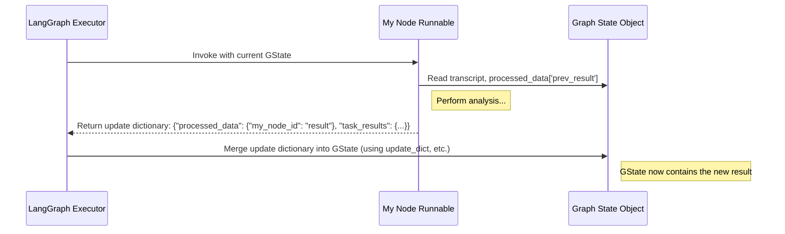

# Chapter 5: Graph State

In the [previous chapter](04_runnable__graph_node_.md), we learned about [Runnables (Graph Nodes)](04_runnable__graph_node_.md), which are like the individual workstations on our text analysis assembly line ([Workflow Graph](02_workflow_graph_.md)). Each Runnable performs a specific task, like analyzing sentiment or extracting information.

But how does the data – the thing being worked on – move from one workstation to the next? How does the "sentiment analysis" workstation know the "main topics" that the previous workstation found?

## The Problem: Passing the Baton

Imagine our assembly line for analyzing a customer support call transcript:

1.  **Station 1 (Extract Topics):** Reads the transcript and figures out the main topics.
2.  **Station 2 (Analyze Sentiment):** Needs the *original transcript* AND the *topics* from Station 1 to determine the customer's sentiment.
3.  **Station 3 (Summarize):** Needs the *original transcript*, maybe the *topics*, and possibly the *sentiment* to write a good summary.

Each station needs access not only to the original data but also potentially to the results produced by earlier stations. How do we manage this flow of information? We need a way to pass the baton (the data) smoothly between runners (the stations/nodes).

## The Solution: The Shared Conveyor Belt (Graph State)

This is where the **Graph State** comes in. Think of it as the **shared conveyor belt** or a **central clipboard** that travels along the assembly line with the product.

*   **Shared Memory:** The Graph State holds all the important information related to a specific run of the workflow.
*   **Carries Everything:** It starts with the initial input (like the call transcript) and, as it moves through the [Workflow Graph](02_workflow_graph_.md), it collects results from each [Runnable (Graph Node)](04_runnable__graph_node_.md) that runs.
*   **Read and Write Access:** Every node on the graph can:
    *   **Read** from the Graph State to get the data it needs (e.g., the original transcript or results from a previous node).
    *   **Write** its own results back to the Graph State, making them available for the next nodes in line.

This ensures that data flows continuously and is accessible wherever it's needed in the workflow.

### What's Inside the Graph State?

The Graph State isn't just a jumble of data. It's typically organized into specific sections (often represented as fields in a Python object):

1.  **Initial Input:** Contains the raw data you first provided to the workflow (e.g., the `transcript`, `callName`, `agentChannel`).
2.  **`processed_data`:** A dictionary that acts like a scratchpad. Nodes write their intermediate findings here. For example, the 'extract_topics' node might write `{"topics": ["internet outage", "billing"]}` into `processed_data`. Subsequent nodes can then read this.
3.  **`task_results`:** A dictionary specifically for collecting the *final* outputs you care about. When a node produces a result that should be part of the final answer (like the overall sentiment or the final summary), it writes that result here. This dictionary is usually returned at the very end of the workflow.
4.  **(Optional) `sampling_outputs`:** Sometimes, you might run a node multiple times with slight variations (sampling). This area can hold results from such sampling operations.
5.  **(Optional) Other Execution Details:** Might hold configuration details or metadata about the current run.

### Analogy: Group Project Whiteboard

Imagine a group working on a project using a shared whiteboard:

1.  **Initial Problem:** Written at the top (Initial Input).
2.  **Brainstorming Area:** Team members jot down ideas, calculations, intermediate findings (like `processed_data`). Anyone can read what others wrote.
3.  **Final Conclusions Area:** Key findings and final answers are summarized here (like `task_results`).
4.  **The Whiteboard Itself:** Represents the Graph State, holding everything in one accessible place.

## How It Solves the Use Case: Call Transcript Analysis

Let's trace the Graph State through our call transcript analysis:

1.  **Start:** The Graph State is created with the initial input:
    ```json
    // Initial State
    {
      "transcript": [{"channel": 0, "text": "User: ..."}, {"channel": 1, "text": "Agent: ..."}],
      "agentChannel": 1,
      "processed_data": {}, // Empty initially
      "task_results": {}    // Empty initially
    }
    ```

2.  **Node `extract_topics` Runs:**
    *   *Reads:* The `transcript` from the state.
    *   *Writes:* Its result (`{"topics": ["internet outage"]}`) into `processed_data`.
    *   *State Update:*
        ```json
        {
          // ... transcript, agentChannel ...
          "processed_data": {
            "extract_topics": {"topics": ["internet outage"]} // Result added
          },
          "task_results": {}
        }
        ```
    *(Note: By default, results in `processed_data` are often stored under a key matching the node's ID, like `"extract_topics"`).*

3.  **Node `analyze_sentiment` Runs:**
    *   *Reads:* The `transcript` and the `extract_topics` result from `processed_data`.
    *   *Writes:* Its result (`{"sentiment": "negative"}`) into `processed_data`. *And* because sentiment is a desired final output, it also writes it to `task_results`.
    *   *State Update:*
        ```json
        {
          // ... transcript, agentChannel ...
          "processed_data": {
            "extract_topics": {"topics": ["internet outage"]},
            "analyze_sentiment": {"sentiment": "negative"} // Result added
          },
          "task_results": {
            "sentiment_analysis_task": {"sentiment": "negative"} // Marked as final result
          }
        }
        ```
    *(Note: The key in `task_results` might be different, often defined in the node's config).*

4.  **Node `summarize_call` Runs:**
    *   *Reads:* `transcript` and maybe other data from `processed_data`.
    *   *Writes:* Its result (`{"summary": "..."}`) to both `processed_data` and `task_results`.
    *   *State Update:*
        ```json
        {
          // ... transcript, agentChannel ...
          "processed_data": {
            "extract_topics": {"topics": ["internet outage"]},
            "analyze_sentiment": {"sentiment": "negative"},
            "summarize_call": {"summary": "..."} // Result added
          },
          "task_results": {
            "sentiment_analysis_task": {"sentiment": "negative"},
            "summary_task": {"summary": "..."} // Marked as final result
          }
        }
        ```

5.  **End:** The workflow finishes. The system typically returns the content of `task_results` as the final output.

The Graph State acts as the central hub, allowing each node to build upon the work of previous nodes.

## Under the Hood: LangGraph State and Updates

`llm-analytics` uses the **LangGraph** library, which is built around this concept of state.

1.  **State Definition:** The structure of the Graph State is explicitly defined using Python classes, often leveraging Pydantic or dataclasses. This ensures the state always has the expected fields (`transcript`, `processed_data`, `task_results`, etc.).

    **File:** `fala/workflow/graph/graph_states.py`

    ```python
    # Simplified from fala/workflow/graph/graph_states.py
    from typing import Annotated, List, Optional
    from pydantic import BaseModel # Or use dataclasses

    # Helper function to merge dictionaries
    def update_dict(existing_dict: dict, new_dict: dict):
        combined_dict = existing_dict.copy()
        combined_dict.update(new_dict)
        return combined_dict

    # Defines the structure of the data flowing *into* most nodes
    class InputState(BaseModel):
        # Initial inputs (examples)
        agentChannel: Optional[int]
        transcript: List[dict]

        # Intermediate results - uses update_dict to merge
        processed_data: Annotated[dict, update_dict]
        # ... other fields like sampling_outputs ...

    # Defines the structure expected for the *final* output
    class OutputState(BaseModel):
        # Final results - uses update_dict to merge
        task_results: Annotated[dict, update_dict]
    ```

    *   `BaseModel` (from Pydantic) helps define the structure and types of data.
    *   `Annotated[dict, update_dict]` is a clever trick. It tells LangGraph that `processed_data` is a dictionary, and whenever a node returns a dictionary meant for `processed_data`, LangGraph should use the `update_dict` function to *merge* the new dictionary with the existing one, rather than replacing it. This is how results accumulate.

2.  **Node Execution & State Update:** When a [Runnable (Graph Node)](04_runnable__graph_node_.md) executes, it receives the *current* state object as input. After doing its work, it returns a dictionary containing the data it wants to add or update in the state.

    ```python
    # Simplified concept from a node's execution function
    # (like llm_runnable_func in RunnableBuilder)
    def my_node_function(current_state: InputState):
        # 1. Read needed data from current_state
        input_text = current_state.transcript[0]['text'] # Example read
        previous_result = current_state.processed_data.get("previous_node_id")

        # 2. Perform the node's task (e.g., call LLM, run function)
        node_result = f"Processed: {input_text}" # Example result

        # 3. Prepare the update dictionary
        state_update = {
            "processed_data": {"my_node_id": node_result} # Add result to processed_data
        }

        # Optionally, add to final results if configured
        # if node_is_final_task:
        #    state_update["task_results"] = {"my_task_name": node_result}

        # 4. Return the update dictionary
        return state_update
    ```

3.  **LangGraph Merging:** LangGraph automatically takes the dictionary returned by the node (`state_update`) and merges it into the main Graph State object according to the rules defined in the state class (like using `update_dict` for the `processed_data` field).



This mechanism ensures that the state is consistently updated as data flows through the graph, making the process robust and easy to manage.

## Conclusion

The **Graph State** is the lifeblood of the [Workflow Graph](02_workflow_graph_.md) in `llm-analytics`. It acts as the shared memory, the conveyor belt, or the central clipboard that carries data from the initial input through each processing step ([Runnable (Graph Node)](04_runnable__graph_node_.md)).

By providing organized storage for initial inputs (`transcript`), intermediate results (`processed_data`), and final outputs (`task_results`), and by allowing nodes to easily read from and write to it, the Graph State enables complex, multi-step analyses where data flows seamlessly between components. LangGraph manages these state updates automatically based on the defined state structure.

Many of the nodes we've discussed rely on Large Language Models (LLMs). How do we tell these LLMs what to do? That involves crafting instructions, or "prompts". Let's explore how `llm-analytics` manages these vital instructions in the next chapter.

---> [Next Chapter: Prompt Management](06_prompt_management_.md)

---

Generated by [AI Codebase Knowledge Builder](https://github.com/The-Pocket/Tutorial-Codebase-Knowledge)