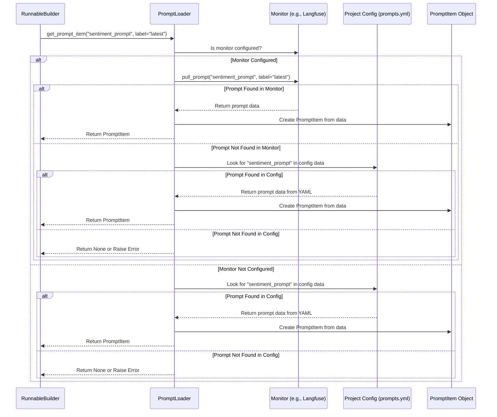

# Chapter 6: Prompt Management

In the [previous chapter](05_graph_state_.md), we explored the [Graph State](05_graph_state_.md), which acts as the shared memory carrying data through our analysis workflows. Many steps in these workflows, implemented as [Runnables (Graph Nodes)](04_runnable__graph_node_.md), involve asking Large Language Models (LLMs) to perform tasks like summarizing text or analyzing sentiment.

But how do we tell the LLM *exactly* what we want it to do? How do we give it clear instructions? And how can we easily update these instructions later?

## The Problem: Giving Clear and Consistent Instructions to Your AI Helper

Imagine you have a very capable AI helper (an LLM). You want it to analyze customer reviews and tell you if the customer is happy, unhappy, or neutral.

*   **Initial Instruction:** You might tell it: "Analyze the sentiment of this review: {review_text}"
*   **Need for Improvement:** Later, you realize this instruction isn't specific enough. You want the LLM to *only* output "positive", "negative", or "neutral". So, you need to update the instruction: "Analyze the sentiment of the following review and respond ONLY with 'positive', 'negative', or 'neutral'. Review: {review_text}"
*   **Consistency:** You might have *several* different analysis workflows that all need to perform sentiment analysis. You want to make sure they all use the *exact same, improved instruction* without having to update it in many different places.
*   **Experimentation:** Maybe you want to try out *another* version of the instruction to see if it works better (A/B testing). How can you easily switch between different instruction versions?

We need a way to manage these LLM instructions (called **prompts**) systematically.

## The Solution: A Library for LLM Instructions (Prompt Management)

**Prompt Management** in `llm-analytics` acts like a central library or catalog for all the prompts used in your analysis workflows.

Think of it like a cookbook:

*   **Recipes (Prompts):** Each specific instruction you give to an LLM is like a recipe. It tells the LLM what ingredients (input data) to use and what steps to follow to produce the desired output (the analysis).
*   **Cookbook (Storage):** You store these recipes (prompts) in a central place. This can be:
    *   A simple text file in your project's configuration folder, typically named `prompts.yml`.
    *   A dedicated online tool like **Langfuse**, which is specifically designed for monitoring and managing LLM applications, including prompts.
*   **Recipe Versions (Versioning):** Just like recipes get updated, your prompts can have different versions. You might have `sentiment_prompt v1`, `sentiment_prompt v2`, etc. Langfuse is particularly good at tracking these versions automatically.
*   **Recipe Labels (Labels):** You can put labels on specific versions, like "latest" (the newest stable version), "beta" (a version you're testing), or "production".
*   **Librarian (`PromptLoader`):** When a part of your workflow needs to use a prompt (e.g., the sentiment analysis node), it doesn't contain the whole prompt text itself. Instead, it just asks the "librarian" – the `PromptLoader` – for the prompt recipe by its name (e.g., "sentiment_prompt") and maybe a specific version or label (e.g., "latest").

This system ensures that:

1.  **Prompts are Centralized:** Easy to find, update, and manage.
2.  **Consistency is Maintained:** All parts of the system asking for the "latest" sentiment prompt will get the same one.
3.  **Updates are Simple:** Change the prompt in the central location (`prompts.yml` or Langfuse), and all workflows using it will automatically pick up the change the next time they run (or after a cache refresh).
4.  **A/B Testing is Possible:** You can easily configure a workflow node to use `sentiment_prompt` with the label "beta" while another uses "latest" to compare results.

## How It Solves the Use Case: Updating the Sentiment Prompt

Let's revisit our sentiment analysis example.

1.  **Initial Setup (`workflow.yml`):** Your workflow configuration for the sentiment analysis node might look like this:

    ```yaml
    # configs/sentiment_analysis/v1/workflow.yml (Node definition)
    # ... other nodes ...
    - id: "analyze_sentiment"
      type: "llm"
      prompt: "sentiment_prompt" # Ask PromptLoader for this prompt name
      prompt_label: "latest"     # Specifically ask for the 'latest' version/label
      task: "sentiment_result" # Where to store the final result in Graph State
    # ... other nodes ...
    ```
    Notice it only refers to the prompt by name (`sentiment_prompt`) and label (`latest`).

2.  **Initial Prompt Storage (`prompts.yml` or Langfuse):**
    *   **If using `prompts.yml`:**

        ```yaml
        # configs/sentiment_analysis/v1/prompts.yml
        sentiment_prompt:
          prompt: "Analyze the sentiment of this review: {{review_text}}"
          variables: ["review_text"]
          version: 1 # Your own version tracking
          # config: { model_name: "gpt-3.5-turbo", ... } # LLM settings can also be stored here
        ```
    *   **If using Langfuse:** You would create a prompt named `sentiment_prompt` in the Langfuse UI with the same content and assign it the label "latest".

3.  **Running the Workflow:** When the `analyze_sentiment` node runs, the `RunnableBuilder` (from the [Runnable chapter](04_runnable__graph_node_.md)) uses the `PromptLoader`. The `PromptLoader` sees it needs `sentiment_prompt` with label `latest`. It checks Langfuse (if configured) first, then the `prompts.yml` file, finds the version labeled "latest" (or version 1 in the YAML example), and provides that prompt text and its details (like required variables) to the LLM Runnable.

4.  **Updating the Prompt:** You realize you need a more specific instruction.
    *   **If using `prompts.yml`:** You edit the file:

        ```yaml
        # configs/sentiment_analysis/v1/prompts.yml (Updated)
        sentiment_prompt:
          prompt: "Analyze the sentiment of the following review and respond ONLY with 'positive', 'negative', or 'neutral'. Review: {{review_text}}" # Updated text
          variables: ["review_text"]
          version: 2 # Updated version
          # config: { ... }
        # You might mark this as the new 'latest' implicitly or via comments/structure
        ```
    *   **If using Langfuse:** You go to the Langfuse UI, create a *new version* of the `sentiment_prompt` with the updated text, and move the "latest" label to this new version.

5.  **Running the Workflow Again:** The next time the `analyze_sentiment` node runs, the `PromptLoader` again asks for `sentiment_prompt` labeled `latest`. It now finds the *new* version (version 2 in YAML, or the newly labeled one in Langfuse) and provides *that* improved instruction to the LLM Runnable.

You successfully changed the LLM's instructions without touching the `workflow.yml` or any Python code!

## Under the Hood: Finding the Right Prompt

When a [Runnable (Graph Node)](04_runnable__graph_node_.md) needs a prompt (like our `analyze_sentiment` node), here's the typical sequence:

1.  **Request:** The `RunnableBuilder` identifies that the node needs a prompt (e.g., `sentiment_prompt`, label `latest`).
2.  **PromptLoader:** The `RunnableBuilder` calls the `PromptLoader`'s `get_prompt_item` method with the name, version, and/or label.
3.  **Check Monitor First (e.g., Langfuse):** The `PromptLoader` checks if a monitoring tool (like Langfuse) is configured. If yes, it asks the monitor (`LangfuseMonitor.pull_prompt`) to retrieve the specified prompt version/label from the online service.
4.  **Check Config File Second (`prompts.yml`):**
    *   If the monitor isn't configured, *or* if the monitor couldn't find the requested prompt, the `PromptLoader` then looks inside the project's configuration, specifically for a `prompts` section (usually loaded from `prompts.yml`).
    *   It searches for the prompt by name within this configuration data.
5.  **Return PromptItem:** If the prompt is found (either via monitor or config file), the `PromptLoader` packages its details (name, actual prompt text, required variables, version number, associated config) into a `PromptItem` object and returns it.
6.  **Error:** If the prompt cannot be found in either location, an error might occur.



## Code Dive: Configuration and Loading

Let's see how this looks in the files.

**1. Defining Prompts in Configuration (`prompts.yml`)**

This file acts as your local prompt library if you're not using a monitor like Langfuse, or as a fallback.

```yaml
# configs/your_project/v1/prompts.yml

sentiment_prompt: # The unique name for this prompt
  prompt: | # The actual instruction template for the LLM
    Analyze the sentiment of the following review and respond ONLY
    with 'positive', 'negative', or 'neutral'.
    Review: {{review_text}}
  variables: # List of inputs the prompt expects (placeholders)
    - review_text
  version: 2 # Your manual version number
  labels: ["latest", "stable"] # Optional labels
  config: # Optional: LLM settings tied to this prompt
    model_name: "gpt-4-turbo"
    temperature: 0.1

summary_prompt:
  prompt: "Summarize this text concisely: {{text_to_summarize}}"
  variables: ["text_to_summarize"]
  version: 1
  labels: ["latest"]
  config:
    model_name: "claude-3-sonnet"
    max_tokens: 100
```

*   Each top-level key (`sentiment_prompt`, `summary_prompt`) is a prompt name.
*   `prompt`: Contains the template text. `{{variable}}` indicates where input data will be inserted.
*   `variables`: Lists the expected input variable names.
*   `version`, `labels`, `config`: Provide metadata and LLM parameters.

**2. Referring to Prompts in Workflow (`workflow.yml`)**

Your workflow nodes just need the prompt's name.

```yaml
# configs/your_project/v1/workflow.yml (Snippet)
workflow:
  nodes:
    # ... other nodes ...
    - id: "analyze_sentiment"
      type: "llm" # This node uses an LLM
      prompt: "sentiment_prompt" # USE THIS PROMPT (by name)
      # Optional: Specify version or label if needed
      # prompt_version: 2
      prompt_label: "latest"
      task: "sentiment_analysis"
    # ... other nodes ...
```

*   The `prompt` field tells the system which prompt recipe to fetch from the library.

**3. The Prompt Loader (`PromptLoader`)**

This class is responsible for fetching the prompt based on the request.

**File:** `fala/workflow/prompt/prompt_loader.py`

```python
# Simplified from fala/workflow/prompt/prompt_loader.py
from typing import Optional
from loguru import logger
from fala.workflow.prompt.prompt_item import PromptItem # Data structure for prompts
from fala.monitors.base import BaseMonitor

class PromptLoader:
    def __init__(self, project_id: str, project_config: Optional[dict] = None):
        # Get the configured monitor (if any)
        from fala.global_vars import get_monitor_manager
        self.monitor: Optional[BaseMonitor] = get_monitor_manager().get_monitor(project_id)
        # Store the 'prompts' section from the loaded project config
        self.prompt_config = project_config.get("prompts") if project_config else None

    def get_prompt_item(
        self,
        prompt_name: str,
        prompt_version: Optional[int] = None,
        prompt_label: str = "latest",
    ) -> Optional[PromptItem]:
        """ Tries monitor first, then config file. """

        # 1. Try getting from monitor (e.g., Langfuse)
        if self.monitor:
            prompt = self.get_prompt_from_monitor(
                self.monitor, prompt_name, prompt_version, prompt_label
            )
            if prompt:
                logger.info(f"Loaded prompt '{prompt_name}' from monitor.")
                return prompt # Found in monitor!

        # 2. If not in monitor (or no monitor), try config file
        prompt = self.get_prompt_from_config(prompt_name)
        if prompt:
            logger.info(f"Loaded prompt '{prompt_name}' from config file.")
            return prompt # Found in config!

        logger.warning(f"Prompt '{prompt_name}' not found.")
        return None # Not found anywhere

    def get_prompt_from_monitor(self, monitor, name, version, label):
        try:
            # Ask the monitor object to pull the prompt
            return monitor.pull_prompt(name, version, label)
        except Exception as e:
            logger.debug(f"Monitor failed to get prompt '{name}': {e}")
            return None

    def get_prompt_from_config(self, prompt_name: str) -> Optional[PromptItem]:
        """ Retrieves a prompt item from the local prompts.yml config. """
        if not self.prompt_config or prompt_name not in self.prompt_config:
            return None

        prompt_data = self.prompt_config[prompt_name]
        # Create a PromptItem object from the config data
        return PromptItem(
            name=prompt_name,
            prompt=prompt_data.get("prompt", ""),
            variables=prompt_data.get("variables", []),
            version=prompt_data.get("version"),
            labels=prompt_data.get("labels", []),
            config=prompt_data.get("config", {}),
        )

```

*   The `get_prompt_item` method orchestrates the lookup: monitor first, then config.
*   `get_prompt_from_monitor` calls the specific monitor's `pull_prompt` method (we'll see Langfuse's version next).
*   `get_prompt_from_config` looks up the `prompt_name` in the dictionary loaded from `prompts.yml` and packs the details into a `PromptItem`.

**4. Fetching from Langfuse (`LangfuseMonitor`)**

If Langfuse is configured, this method is called by the `PromptLoader`.

**File:** `fala/monitors/langfuse.py`

```python
# Simplified from fala/monitors/langfuse.py
from langfuse import Langfuse
from fala.workflow.prompt.prompt_item import PromptItem
# ... other imports ...

class LangfuseMonitor: # Inherits from BaseMonitor
    def __init__(self, project_id, settings):
        # Initialize Langfuse client connection
        self.client = Langfuse(
            public_key=settings.monitor_public_key, # API keys from settings
            secret_key=settings.monitor_secret_key,
            host=settings.monitor_host,
        )
        # ...

    def pull_prompt(self, name, version=None, label="latest") -> Optional[PromptItem]:
        """ Pulls prompt from langfuse service. """
        try:
            # Use the Langfuse client library to get the prompt
            if version:
                lf_prompt = self.client.get_prompt(name, version=version)
            else:
                lf_prompt = self.client.get_prompt(name, label=label)

            # Extract variables and preprocess content if needed
            variables = get_prompt_variables(lf_prompt.prompt)
            content = preprocess_prompt_content(lf_prompt.get_langchain_prompt(), variables)

            # Package into our standard PromptItem format
            return PromptItem(
                name=name,
                prompt=content,
                variables=variables,
                version=lf_prompt.version,
                labels=lf_prompt.labels,
                config=lf_prompt.config, # Config stored in Langfuse
            )
        except Exception as e:
            logger.debug(f"Langfuse get_prompt failed for '{name}': {e}")
            return None # Return None if Langfuse doesn't have it or fails
```

*   This uses the `langfuse` Python library to make an API call to the Langfuse service.
*   It asks for the prompt by name and either version or label.
*   If successful, it converts the result from Langfuse into the standard `PromptItem` object used by the rest of `llm-analytics`.

## Conclusion

Prompt Management is essential for working effectively with LLMs. By treating prompts as managed assets, storing them centrally (in `prompts.yml` or a tool like Langfuse), and using versioning/labeling, `llm-analytics` makes it easy to:

*   Keep LLM instructions consistent across different workflows.
*   Update prompts without changing code.
*   Experiment with different prompt versions (A/B testing).

The `PromptLoader` acts as the librarian, fetching the correct prompt recipe on demand based on name, version, or label specified in the workflow configuration. This separation of concerns makes your LLM workflows more robust, maintainable, and adaptable.

Often, the best prompts require the LLM to have specific context or examples. Sometimes, this context comes from searching through large amounts of data. In the next chapter, we'll explore how `llm-analytics` integrates with search tools.

---> [Next Chapter: Search Engine / Vector Store Integration](07_search_engine___vector_store_integration_.md)

---

Generated by [AI Codebase Knowledge Builder](https://github.com/The-Pocket/Tutorial-Codebase-Knowledge)