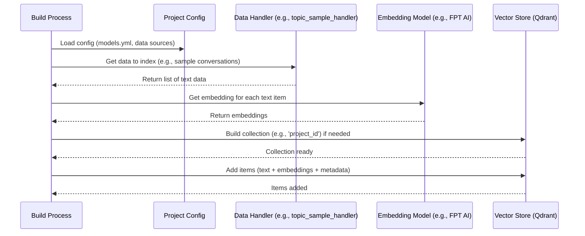
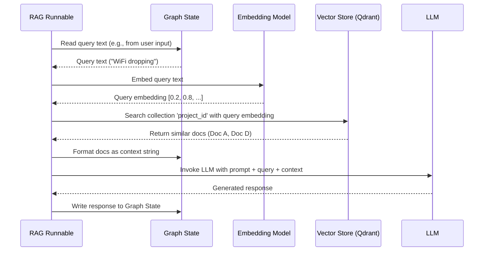

# Chapter 7: Search Engine / Vector Store Integration

Welcome to Chapter 7! In the [previous chapter](06_prompt_management_.md), we learned how `llm-analytics` manages the instructions (prompts) we give to Large Language Models (LLMs). But sometimes, for an LLM to give a truly helpful answer, it needs more than just instructions – it needs relevant background information or examples.

## The Problem: Giving Your AI Helper a Memory

Imagine you're building a chatbot to help customers troubleshoot internet problems. A customer says, "My WiFi keeps dropping."

How does the chatbot know the best suggestions? Simply telling an LLM "Answer the customer about WiFi drops" might give generic advice. What if you want the chatbot to recall *similar* past issues and their solutions from your company's support logs? How can the LLM access this vast knowledge base?

LLMs don't inherently have memory of *your specific data* (like past support tickets or project documents). We need a way to quickly find relevant information from our own knowledge pool and give it to the LLM *just in time* when it's answering a question.

## The Solution: A Smart Index (Vector Store)

This is where **Search Engine / Vector Store Integration** comes in. Think of it as building a specialized, super-fast index for your knowledge base – the system's long-term memory.

Here's the core idea:

1.  **Knowledge Base:** You have a collection of text data (like past support tickets, product manuals, meeting notes, sample conversations).
2.  **Meaningful Numbers (Embeddings):** We use special AI models (called embedding models, like those from FPT AI or OpenAI) to convert each piece of text into a list of numbers (a "vector" or "embedding"). These numbers capture the *semantic meaning* of the text. Texts with similar meanings will have similar lists of numbers.
3.  **Special Database (Vector Store):** We store these numerical embeddings (along with the original text) in a special kind of database called a **Vector Store** (like Qdrant). These databases are designed to very quickly find embeddings that are *numerically similar* to a given query embedding.
4.  **Smart Search (Semantic Search):** When a new question comes in (like "My WiFi keeps dropping"), we convert *that* question into an embedding too. We then ask the Vector Store: "Find the stored texts whose embeddings are most similar to this new query embedding."
5.  **Context for LLM:** The Vector Store returns the most relevant pieces of text from our knowledge base (e.g., past tickets about WiFi drops). We can then give these relevant texts to the LLM, along with the original question and instructions ([Prompt Management](06_prompt_management_.md)), so it can generate a much more informed and helpful answer.

This whole process of finding relevant information and giving it to the LLM to improve its answer is called **Retrieval-Augmented Generation (RAG)**. The Search Engine / Vector Store integration is the crucial "Retrieval" part.

### Analogy: A Super-Librarian

Imagine a library where books aren't organized alphabetically, but by *meaning*.

*   **Books:** Your knowledge documents (tickets, manuals).
*   **Magic Summaries:** The numerical embeddings, capturing the essence of each book.
*   **Magic Card Catalog:** The Vector Store, storing these summaries.
*   **Your Question:** You ask the Super-Librarian (the search system) about "internet connection issues".
*   **Librarian's Work:** The Librarian instantly finds the summaries (embeddings) most related to your question's essence and pulls out those specific books (documents).
*   **Your Answer:** You read those relevant books (context) to get the specific information you need. RAG is like giving these relevant books to your AI assistant to help them answer your question.

## How It Solves the Use Case: The WiFi Problem

Let's trace how this helps our chatbot:

1.  **Setup (Indexing):** Beforehand, we take all our past support tickets (or summaries of them).
    *   *Ticket 1:* "User WiFi drops every hour. Resolved by changing WiFi channel." -> Convert to Embedding A -> Store in Vector Store (e.g., collection `support_knowledge`) with original text.
    *   *Ticket 2:* "Slow internet speeds reported. Router firmware outdated." -> Convert to Embedding B -> Store.
    *   *Ticket 3:* "Cannot connect to WiFi. Password incorrect." -> Convert to Embedding C -> Store.
    *   ... and so on for thousands of tickets.

2.  **Runtime (Querying):** A customer sends the message: "My WiFi keeps dropping."
    *   The system converts this query to Embedding Q.

3.  **Search:** The system asks the Vector Store (Qdrant): "Find documents in `support_knowledge` whose embeddings are closest to Embedding Q."

4.  **Retrieval:** The Vector Store quickly finds that Embedding A ("User WiFi drops every hour...") is very similar to Embedding Q. It might also find a few other related ones. It returns the original text for these matches.

5.  **Augmented Generation (RAG):** Now, the system uses a [Runnable (Graph Node)](04_runnable__graph_node_.md) (likely a `rag` type) that combines:
    *   The original question: "My WiFi keeps dropping."
    *   The retrieved context: "Context: User WiFi drops every hour. Resolved by changing WiFi channel."
    *   A prompt: "Based on the context, suggest troubleshooting steps for the user's issue."
    *   This combined input is sent to the LLM.

6.  **Informed Response:** The LLM, now equipped with relevant context, generates a much better response, like: "Okay, I see you're having issues with WiFi dropping. Sometimes this can be caused by interference. Have you tried changing the WiFi channel on your router?"

This integration provides the LLM with targeted knowledge, making it much more effective than relying on its general training alone.

## Under the Hood: Building and Searching the Index

How does `llm-analytics` manage this process?

**1. Setup/Build Time (Indexing):**

This usually happens when a project is built or updated (triggered via the `/build` endpoint mentioned in [API Server & Routers](03_api_server___routers_.md)).



*   The build process reads configuration to know which embedding model and vector store to use.
*   It gets the data (e.g., from configuration files or other sources).
*   It uses the selected embedding model to turn text into vectors.
*   It ensures the collection exists in the Vector Store (like creating a table in a normal database).
*   It sends the original text, its embedding, and any metadata (like ticket ID, category) to the Vector Store for indexing.

**2. Runtime (Querying in a RAG Node):**

This happens inside a `retrieval` or `rag` type [Runnable (Graph Node)](04_runnable__graph_node_.md) within a [Workflow Graph](02_workflow_graph_.md).



*   The Runnable gets the text to search for (the query) from the [Graph State](05_graph_state_.md).
*   It uses the *same* embedding model used during indexing to convert the query text into an embedding.
*   It sends this query embedding to the Vector Store's search function for the relevant collection.
*   It receives the most similar documents back.
*   It formats these documents (often just taking the text) to be used as context.
*   (For a RAG node) It prepares a prompt incorporating the original query and the retrieved context, then calls the LLM.
*   The result is written back to the [Graph State](05_graph_state_.md).

## Code Dive: Configuration and Usage

Let's look at the key pieces of code involved.

**1. Configuration (`models.yml`)**

You define which embedding models and search engines (vector stores) your project uses in your configuration files, loaded via [Configuration Management](01_configuration_management_.md).

```yaml
# configs/your_project/v1/models.yml (Simplified Example)

provider:
  models:
    # Define embedding models to use
    embeddings:
      - engine: "fptai"         # Which provider (e.g., FPT AI)
        model: "embedding-gte-base" # Specific model name
        parameters: {}          # Optional parameters

    # Define search engine/vector store integrations
    search:
      - engine: "qdrant"            # Vector store type (e.g., Qdrant)
        embedding_model: "fptai-embedding-gte-base" # Link to embedding model defined above
        parameters: {}              # Qdrant connection details (often global)

    # Define LLMs (as seen in previous chapters)
    llms:
      - engine: "fptai"
        model: "llama-3..."
        # ...
```

*   The `embeddings` section lists the models available for converting text to vectors.
*   The `search` section defines the vector store setup, linking it to a specific embedding model (so indexing and querying use the same one) and specifying the store type (`qdrant`).

**2. Initialization (`fala/llm_handler/embeddings/search_engines/__init__.py`)**

When the application starts or a project is built, helper functions initialize the required search engine clients based on the configuration.

```python
# Simplified from fala/llm_handler/embeddings/search_engines/__init__.py

# Global caches store initialized clients to avoid reconnecting
from fala.global_vars.cache import embedding_model_cache, search_engine_cache

def init_search_engine(
    search_engine: str, # e.g., "qdrant"
    search_model: str, # e.g., "fptai-embedding-gte-base" (key for embedding model)
    search_parameters: dict = {} # e.g., Qdrant URL/API key (often global)
):
    """Initializes and caches a search engine client."""
    model_key = f"{search_engine}-{search_model}"

    if model_key not in search_engine_cache:
        # --- Initialize Embedding Model First (Covered Separately) ---
        # (Ensures the embedding model needed by the store is ready)
        # from .embedding_providers import init_embedding_model
        # init_embedding_model(...)
        if search_model not in embedding_model_cache:
             raise ValueError(f"Embedding model '{search_model}' not initialized first!")
        embedding_instance = embedding_model_cache[search_model]
        # -------------------------------------------------------------

        if search_engine == "qdrant":
            from .qdrant_engine import LCQdrantEmbeddingsIndex
            # Pass the actual embedding model instance to the Qdrant client
            search_parameters.update({"embedding": embedding_instance})
            engine_instance = LCQdrantEmbeddingsIndex(**search_parameters)
        # elif search_engine == "other_vector_store":
            # from .other_store import OtherClient
            # engine_instance = OtherClient(...)
        else:
            raise ValueError(f"Invalid search engine: {search_engine}")

        # Store the initialized client in the cache
        search_engine_cache[model_key] = engine_instance
        logger.info(f"Initialized search engine: {model_key}")

    return search_engine_cache[model_key]

# Similarly, init_embedding_model initializes embedding models
# from fala.llm_handler.embeddings.embedding_providers import init_embedding_model
```

*   This function takes the configuration details (engine type, embedding model key).
*   It checks if a client for this combination is already cached.
*   If not, it ensures the required embedding model is initialized and gets its instance.
*   It then creates the specific client instance (e.g., `LCQdrantEmbeddingsIndex` for Qdrant), passing the embedding model instance and connection parameters.
*   The client is stored in a cache (`search_engine_cache`) for reuse.

**3. Qdrant Engine (`fala/llm_handler/embeddings/search_engines/qdrant_engine.py`)**

This class handles the specific interactions with the Qdrant vector store.

```python
# Simplified from fala/llm_handler/embeddings/search_engines/qdrant_engine.py
from qdrant_client import QdrantClient, models
from langchain_qdrant import Qdrant
from langchain_core.embeddings import Embeddings
from .base_engine import BaseSearch # Base class definition

class LCQdrantEmbeddingsIndex(BaseSearch):
    def __init__(
        self,
        embedding: Embeddings, # Receives the initialized embedding model instance
        qdrant_url: Optional[str] = None, # Connection details
        # ... other Qdrant parameters ...
    ):
        # Store embedding model and determine vector size
        self.embedding = embedding
        self.embedding_size = get_embedding_size(embedding.model) # Helper func

        # Initialize Qdrant client library
        self.client = QdrantClient(host=qdrant_url, ...)

    def build_collection(self, collection_name: str, recreate: bool = False):
        """Creates or recreates a collection in Qdrant."""
        if not self.client.collection_exists(collection_name) or recreate:
            self.client.recreate_collection(
                collection_name=collection_name,
                vectors_config=models.VectorParams(
                    size=self.embedding_size, distance=models.Distance.COSINE
                ),
            )
            logger.info(f"Collection '{collection_name}' created/recreated.")
            return "create" # Indicate collection was created
        return "pass" # Indicate collection already existed

    async def add_items(self, items: list, collection_name: str, ...):
        """Adds documents (text + metadata) to the collection. Langchain handles embedding."""
        search_engine = Qdrant( # Use Langchain's Qdrant wrapper
            client=self.client,
            embeddings=self.embedding, # Pass our embedding model
            collection_name=collection_name,
        )
        # Prepare texts and metadata from input 'items' list
        texts = [item['page_content'] for item in items]
        metadatas = [item.get('metadata', {}) for item in items]
        # Langchain's 'afrom_texts' handles embedding and uploading
        await search_engine.afrom_texts(texts=texts, metadatas=metadatas, ...)
        logger.info(f"Added {len(texts)} items to '{collection_name}'.")

    def search(
        self, text: str, collection_name: str, max_results: int = 5, threshold: float = 0.5, ...
    ) -> List[Tuple[Document, float]]:
        """Searches the collection for text similar to the query."""
        search_engine = Qdrant( # Use Langchain's Qdrant wrapper
            client=self.client,
            embeddings=self.embedding,
            collection_name=collection_name,
        )
        # Langchain handles embedding the query and performing the search
        found_docs = search_engine.similarity_search_with_score(
            query=text, k=max_results, # ... add filters if needed ...
        )
        # Filter results by similarity score threshold
        output_docs = [doc for doc in found_docs if doc[1] >= threshold]
        return output_docs
```

*   The `__init__` method stores the embedding model instance and connects to Qdrant.
*   `build_collection` ensures the place to store vectors (the "collection") exists.
*   `add_items` takes your data (text + metadata), uses Langchain's Qdrant integration which automatically calls the `self.embedding` model to get vectors, and uploads everything.
*   `search` takes the query text, uses Langchain to embed it and search Qdrant, returning the documents (text + metadata) and their similarity scores.

**4. Using in a Workflow (`workflow.yml` & `RunnableBuilder`)**

A node in your `workflow.yml` specifies it needs retrieval:

```yaml
# configs/your_project/v1/workflow.yml (Snippet)
workflow:
  nodes:
    # ... maybe a node to get the user query into state.processed_data['user_query'] ...
    - id: "find_relevant_tickets"
      type: "retrieval"        # This node performs vector search
      search_key: "user_query" # Find this key in Graph State for the search text
      retrieved_field: "context" # Store results under this key in Graph State
      max_results: 3
      # collection_name is often implicit (project_id) or globally configured
    - id: "generate_response"
      type: "llm"              # Or could be 'rag' type combining retrieval+LLM
      prompt: "chatbot_prompt_with_context" # Prompt uses 'context' from state
      task: "final_answer"
  edges:
    # ... connect nodes ...
```

The `RunnableBuilder` (from [Chapter 4](04_runnable__graph_node_.md)) gets the initialized `search_engine` instance (from the cache) and passes it when creating the `retrieval` runnable. The runnable function then calls `search_engine.search(...)`.

```python
# Simplified concept from RunnableBuilder._build_retrieval_runnable
def _build_retrieval_runnable(
    self,
    config: RetrievalNodeConfig,
    search_engine: BaseSearch, # The initialized Qdrant client instance
    collection_name: str,     # Usually the project_id
) -> Callable:

    def retrieval_runnable_func(state: InputState):
        query_text = state.processed_data[config.search_key] # Get text from state
        # Call the search method on the passed-in search engine instance
        retrieved_documents = search_engine.search(
            text=query_text,
            collection_name=collection_name,
            max_results=config.max_results,
            threshold=config.threshold,
            # key=config.retrieved_field # Optional filtering
        )
        # Format results (e.g., extract text content)
        context_list = [doc[0].page_content for doc in retrieved_documents]
        context_string = "\n".join(context_list)
        # Update the Graph State with the retrieved context
        state_update = {"processed_data": {config.retrieved_field: context_string}}
        return state_update

    return retrieval_runnable_func
```

## Conclusion

Integrating with Search Engines and Vector Stores like Qdrant gives `llm-analytics` a powerful **long-term memory** or **knowledge indexing** capability. By converting text into meaningful numerical embeddings and storing them, the system can perform **semantic search** – finding information based on meaning, not just keywords.

This is the foundation for **Retrieval-Augmented Generation (RAG)**, where relevant information is retrieved from the vector store and provided to an LLM as context, dramatically improving the quality and relevance of its generated responses. This allows you to build applications like knowledgeable chatbots, document question-answering systems, and more, grounded in your specific data.

Before data gets embedded or processed by LLMs, it often needs some cleaning or transformation. In the next chapter, we'll look at the tools `llm-analytics` provides for this.

---> [Next Chapter: Data Processing Functions](08_data_processing_functions_.md)

---

Generated by [AI Codebase Knowledge Builder](https://github.com/The-Pocket/Tutorial-Codebase-Knowledge)