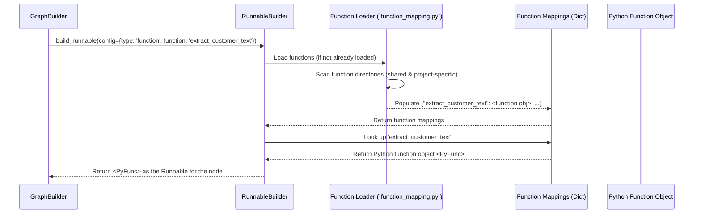

# Chapter 8: Data Processing Functions

Welcome to Chapter 8! In the [previous chapter](07_search_engine___vector_store_integration_.md), we saw how `llm-analytics` can connect to search engines and vector stores to retrieve relevant information, giving our AI workflows a powerful memory.

But data, whether it's the initial input or the output from an LLM or search engine, isn't always in the perfect format. Sometimes we need to clean it up, extract specific parts, or transform it before the next step in our analysis.

## The Problem: Tidying Up Before and After

Imagine our text analysis assembly line ([Workflow Graph](02_workflow_graph_.md)) again:

- **Scenario 1 (Input Mess):** We receive a full customer service call transcript with both the agent's and the customer's lines mixed together. However, for sentiment analysis, we only care about what the _customer_ said. How do we filter out just the customer's speech _before_ sending it to the sentiment analysis LLM?
- **Scenario 2 (Output Needs Polish):** An LLM is asked to classify a support ticket into one of three categories: "Technical Issue", "Billing Question", or "General Inquiry". Sometimes, the LLM might respond with slight variations like "technical problem" or "question about billing". How do we ensure this output always matches one of our official categories _after_ the LLM runs?

We need tools to perform these specific preparation and cleanup tasks at different points in the workflow.

## The Solution: Specialized Tools (Data Processing Functions)

**Data Processing Functions** are exactly these specialized tools. They are reusable Python functions designed to perform specific data transformations within your workflow.

Think of them like specialized utensils in a kitchen:

- **Strainer (Pre-processor):** Used _before_ cooking to remove unwanted parts (like filtering customer lines from a transcript).
- **Formatter/Mould (Post-processor):** Used _after_ cooking to shape or clean up the final dish (like ensuring an LLM's classification matches a predefined list).

Key characteristics:

1.  **Reusable:** Write a function once (e.g., to extract customer text) and use it in multiple workflows or at different steps.
2.  **Python Code:** They are standard Python functions, giving you full flexibility for data manipulation.
3.  **Pre-processors:** Functions designed to run _before_ a complex node (like an LLM or search call) to prepare its input data.
4.  **Post-processors:** Functions designed to run _after_ a node to clean, format, or validate its output.
5.  **Location:** These Python functions live in specific directories:
    - `fala/tasks/` (for general-purpose functions included with `llm-analytics`).
    - `configs/{your_project_id}/{version}/function_runnables/` (for functions specific to your project).
6.  **Dynamic Mapping:** The system automatically finds these functions based on their location and makes them available to be used in your workflows. You refer to them by their function name in the configuration.

## Using Data Processing Functions

These functions are used within your [Workflow Graph](02_workflow_graph_.md) by defining a node with `type: "function"` in your `workflow.yml`.

Let's see how we can solve our two scenarios:

**Scenario 1: Extracting Customer Text (Pre-processor)**

1.  **Define the Function:** You (or the framework) would provide a Python function, perhaps in `configs/my_sentiment_project/v1/function_runnables/pre_processors.py`:

    ```python
    # configs/my_sentiment_project/v1/function_runnables/pre_processors.py

    def extract_customer_text(state):
        """Extracts only customer utterances from the transcript in the state."""
        transcript = state.transcript # Get transcript from Graph State
        agent_channel = state.agentChannel # Get agent channel ID
        customer_lines = []
        for message in transcript:
            # Assuming customer channel is not the agent channel
            if message.get("channel") != agent_channel:
                customer_lines.append(message.get("text", ""))

        # Return the update for the Graph State's 'processed_data'
        return {"processed_data": {"customer_only_text": ". ".join(customer_lines)}}
    ```

    - This simple function takes the current [Graph State](05_graph_state_.md) as input.
    - It reads the `transcript` and `agentChannel`.
    - It loops through the messages and collects text from the customer channel.
    - It returns a dictionary indicating how to update the `processed_data` section of the state. The key `customer_only_text` now holds the filtered text.

2.  **Use it in the Workflow:** In your `workflow.yml`, you add a node _before_ the LLM call:

    ```yaml
    # configs/my_sentiment_project/v1/workflow.yml (Snippet)
    workflow:
      nodes:
        - id: "get_customer_lines"
          type: "function" # Use a Python function
          function: "extract_customer_text" # Name of the function to run

        - id: "analyze_sentiment"
          type: "llm"
          prompt: "sentiment_prompt" # This prompt will use 'customer_only_text'
          prompt_variables: ["customer_only_text"] # Explicitly state the variable needed

      edges:
        - src: "__START__" # Start node
          dst: "get_customer_lines" # Run the function first
        - src: "get_customer_lines"
          dst: "analyze_sentiment" # Then run the LLM

      entry_points: ["__START__"] # Define the entry point
    ```

    - The `get_customer_lines` node is of `type: "function"` and references the `extract_customer_text` function by its name.
    - The workflow ensures this function runs first, adding `customer_only_text` to the [Graph State](05_graph_state_.md).
    - The subsequent `analyze_sentiment` LLM node can now use this prepared `customer_only_text` as input (assuming the `sentiment_prompt` is designed to use it).

**Scenario 2: Cleaning LLM Category Output (Post-processor)**

1.  **Define the Function:** In `configs/my_classification_project/v1/function_runnables/post_processors.py`:

    ```python
    # configs/my_classification_project/v1/function_runnables/post_processors.py
    import difflib # Python's library for comparing sequences

    def match_official_category(state):
        """Matches LLM output category to the closest official category."""
        # Assume LLM output is in processed_data under the LLM node's ID
        llm_node_id = "classify_ticket_llm" # ID of the preceding LLM node
        llm_output = state.processed_data.get(llm_node_id, {}).get("category", "")

        official_categories = ["Technical Issue", "Billing Question", "General Inquiry"]

        # Find the best match (simple example)
        matches = difflib.get_close_matches(llm_output, official_categories, n=1, cutoff=0.6)
        final_category = matches[0] if matches else "Unknown Category"

        # Update the final 'task_results' in the Graph State
        task_name = "final_classification" # Name for the final result field
        return {"task_results": {task_name: final_category}}
    ```

    - This function reads the presumed LLM output from the `processed_data` section of the [Graph State](05_graph_state_.md).
    - It compares the LLM's output to a predefined list of `official_categories`.
    - It uses `difflib` to find the closest match.
    - It returns an update for the `task_results` section of the state, ensuring the final output uses the official category name.

2.  **Use it in the Workflow:** Add a node _after_ the LLM classification node:

    ```yaml
    # configs/my_classification_project/v1/workflow.yml (Snippet)
    workflow:
      nodes:
        - id: "classify_ticket_llm"
          type: "llm"
          prompt: "classify_prompt"
          # Output expected in state.processed_data["classify_ticket_llm"]

        - id: "cleanup_category"
          type: "function"
          function: "match_official_category" # Run our cleanup function
          task: "final_classification" # Associate with this final task name

      edges:
        - src: "__START__"
          dst: "classify_ticket_llm"
        - src: "classify_ticket_llm"
          dst: "cleanup_category" # Run cleanup after LLM
        - src: "cleanup_category"
          dst: "END" # End the workflow

      entry_points: ["__START__"]
    ```

    - The `cleanup_category` node runs _after_ `classify_ticket_llm`.
    - It executes the `match_official_category` function.
    - The result of this function (the cleaned category) is placed directly into the `task_results` under the key `final_classification`, ready to be returned as the final workflow output.

## Under the Hood: Finding and Running Functions

How does `llm-analytics` know where to find `extract_customer_text` or `match_official_category` and how to run them?

1.  **Discovery:** When `llm-analytics` loads a project or builds its graph, helper functions (like `create_function_mappings`) scan predefined directories:
    - The shared `fala/workflow/runnables/function_runnables/` directory.
    - The project-specific `configs/{project_id}/{version}/function_runnables/` directory.
    - It imports any Python files found there (like `pre_processors.py`, `post_processors.py`) and creates a dictionary mapping function names (e.g., `"extract_customer_text"`) to the actual Python function objects.
2.  **Runnable Building:** When the `GraphBuilder` (from [Chapter 2: Workflow Graph](02_workflow_graph_.md)) encounters a node definition like `type: "function", function: "extract_customer_text"` in `workflow.yml`, it asks the `RunnableBuilder` (from [Chapter 4: Runnable (Graph Node)](04_runnable__graph_node_.md)) to create the appropriate Runnable.
3.  **Function Lookup:** The `RunnableBuilder` looks up the requested function name (`"extract_customer_text"`) in the dictionary of discovered functions created in step 1.
4.  **Runnable Creation:** It finds the corresponding Python function object. This function object _is_ the Runnable for this node.
5.  **Execution:** During workflow execution, when LangGraph reaches this node, it simply calls the Python function object, passing the current [Graph State](05_graph_state_.md) as the argument. The dictionary returned by the function is used to update the state for the next node.



## Code Dive: Finding and Building

Let's look at the key code pieces (simplified).

**1. Discovering Functions (`fala/tasks/function_mapping.py`)**

This utility scans a Python module path and maps function names to functions.

```python
# Simplified from fala/tasks/function_mapping.py
import importlib
import inspect # Library to inspect live objects like functions

def create_function_mappings(module_path):
    """Creates a dictionary mapping function names to function objects
       found within the Python files at the given module path.
    """
    try:
        # Dynamically load the Python code found at the path
        module = importlib.import_module(module_path)
        # Find all functions defined directly within that module
        functions = inspect.getmembers(module, inspect.isfunction)
        # Create a dictionary: { 'function_name': function_object, ... }
        return {name: func for name, func in functions}
    except ModuleNotFoundError:
        # It's okay if a project doesn't have custom functions
        return {}
    except Exception as e:
        print(f"Error loading functions from {module_path}: {e}")
        return {}
```

- `importlib.import_module` dynamically loads Python code.
- `inspect.getmembers` finds all functions within the loaded code.
- It returns a dictionary mapping the function names to the callable function objects.

**2. Loading Mappings in `RunnableBuilder` (`fala/workflow/runnables/runnable_builder.py`)**

The `RunnableBuilder` uses `create_function_mappings` to build its internal dictionary of available functions.

```python
# Simplified from fala/workflow/runnables/runnable_builder.py
from typing import Callable, Dict
from fala.tasks.function_mapping import create_function_mappings # Import the utility

class RunnableBuilder:
    def __init__(self, project_id: str, version: str, project_config: Optional[dict]):
        self.project_id = project_id
        self.version = version
        # Load available Python functions when the builder is created
        self.function_mappings = self._load_function_mappings(version)
        # ... other initializations ...

    # Helper to load functions from standard and project-specific locations
    def _load_function_mappings(self, version: str) -> Dict[str, Callable]:
        function_mappings = {}
        # Try loading default functions
        try:
            # Path to shared functions within the 'fala' library
            shared_path = "fala.workflow.runnables.function_runnables"
            function_mappings.update(create_function_mappings(shared_path))
        except Exception as e: logger.debug(f"No shared functions found? {e}")

        # Try loading project-specific functions
        try:
            # Path to project's custom functions inside the 'configs' dir
            project_path = f"configs.{self.project_id}.{version}.function_runnables"
            function_mappings.update(create_function_mappings(project_path))
        except Exception as e: logger.debug(f"No project functions for {self.project_id}/{version}? {e}")

        logger.info(f"Loaded function mappings: {list(function_mappings.keys())}")
        return function_mappings

    # ... build_runnable method ...
```

- The `_load_function_mappings` method calls `create_function_mappings` for both the standard path (`fala...`) and the project-specific path (`configs...`).
- It merges the results into `self.function_mappings`, which holds all available functions for this project.

**3. Building the Function Runnable (`fala/workflow/runnables/runnable_builder.py`)**

When `build_runnable` is called for a `function` type node, it looks up the function in the loaded mappings.

```python
# Simplified from fala/workflow/runnables/runnable_builder.py
# (Inside the RunnableBuilder class)

    def build_runnable(
        self,
        runnable_config: dict, # Config for one node from workflow.yml
        # ... other args ...
    ) -> Union[Runnable, Callable]:

        runnable_type = runnable_config.get("type")

        if runnable_type == "function":
            function_name = runnable_config.get("function")
            # Call the internal helper to get the function object
            runnable = self._build_function_runnable(function_name)
        # ... elif for other types like "llm", "retrieval" ...
        else:
            raise ValueError(f"Unrecognized node type: {runnable_type}")

        return runnable

    def _build_function_runnable(self, function_name: str) -> Callable:
        """Looks up the function name in the loaded mappings."""
        if function_name not in self.function_mappings:
            # Raise error if the function specified in workflow.yml wasn't found
            raise NotImplementedError(
                f"Function '{function_name}' not found in "
                f"{list(self.function_mappings.keys())}"
            )
        # Return the actual Python function object found in the mappings
        return self.function_mappings[function_name]
```

- The `_build_function_runnable` helper method takes the function name from the `workflow.yml` configuration.
- It looks this name up as a key in the `self.function_mappings` dictionary.
- It returns the associated value, which is the actual Python function object (e.g., the `extract_customer_text` function itself). This function object is then used directly as the node's executor in the LangGraph workflow.

## Conclusion

**Data Processing Functions** are the reusable Python tools you use to manipulate data within your `llm-analytics` workflows. They act as specialized workstations on your analysis assembly line.

- **Pre-processors** prepare data _before_ it enters a node (like an LLM or search engine).
- **Post-processors** clean up or format the data _after_ a node completes its task.

By defining nodes with `type: "function"` in your `workflow.yml` and referencing Python functions located in standard (`fala/tasks/`) or project-specific (`configs/.../function_runnables/`) directories, you can easily integrate custom data transformations. This promotes code reuse and separates the core logic of your LLM calls or searches from the surrounding data preparation and cleanup steps, making your workflows cleaner and more maintainable.

Now that we understand how to build, configure, and process data within our workflows, how do we keep an eye on how they are performing? The next chapter explores how `llm-analytics` handles observation and tracking.

---> [Next Chapter: Monitoring](09_monitoring_.md)

---

Generated by [AI Codebase Knowledge Builder](https://github.com/The-Pocket/Tutorial-Codebase-Knowledge)
