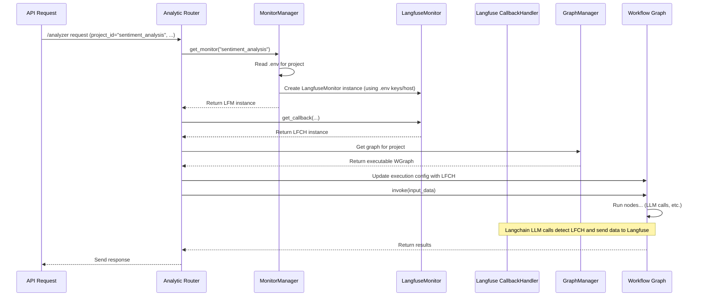

# Chapter 9: Monitoring

Welcome to the final chapter of our core concepts tutorial! In [Chapter 8: Data Processing Functions](08_data_processing_functions_.md), we saw how to use Python functions to clean and transform data within our workflows. Now, let's look at how we can keep an eye on everything that's happening inside `llm-analytics` – how do we observe and understand the performance, cost, and behaviour of our analysis pipelines?

## The Problem: Understanding the Black Box

Imagine our text analysis assembly line ([Workflow Graph](02_workflow_graph_.md)) is running. Maybe one day, you notice:

- The analysis for a specific project seems much slower than usual.
- Your bill for using the LLM service suddenly jumps up.
- The LLM in one of your workflows starts giving strange or inconsistent answers.
- You've tried updating a prompt ([Prompt Management](06_prompt_management_.md)), but you're not sure if it's actually improving the results or making them worse.

How do you diagnose these problems? Your workflow might involve multiple steps, several LLM calls, and maybe even data retrieval ([Search Engine / Vector Store Integration](07_search_engine___vector_store_integration_.md)). It can feel like a black box – data goes in, results come out, but what happens in between? We need a way to see inside.

## The Solution: Quality Control Inspectors (Monitoring)

This is where **Monitoring** comes in. Think of it as adding **observability** to your system – like having quality control inspectors watching every step of your analysis assembly line.

`llm-analytics` integrates with specialized monitoring tools, with **Langfuse** being a primary example. These tools help you:

1.  **Trace Execution:** See the exact sequence of steps ([Runnables (Graph Nodes)](04_runnable__graph_node_.md)) that were executed for a given input.
2.  **Log Details:** Record the specific inputs and outputs for each step, especially for LLM calls (What prompt was used? What was the exact response?).
3.  **Measure Performance:** Track how long each step took (latency) and how many resources (like LLM tokens, which relate to cost) were consumed.
4.  **Manage Prompts:** Tools like Langfuse often double as a central hub for managing your prompts, allowing you to track versions, compare performance, and push updates (as we touched on in [Chapter 6: Prompt Management](06_prompt_management_.md)).

This visibility is crucial for:

- **Debugging:** Pinpointing exactly where an error occurred or why an unexpected result was generated.
- **Cost Analysis:** Understanding which parts of your workflow are most expensive.
- **Performance Tuning:** Identifying bottlenecks and optimizing slow steps.
- **Evaluating Changes:** Comparing different prompt versions or workflow structures objectively.

## How It Works: The `MonitorManager` and Callbacks

So, how does `llm-analytics` enable this observation?

1.  **Configuration (`.env` file):** Monitoring is typically configured _per project_. Inside your project's configuration folder (e.g., `configs/my_project/v1/`), you can create a `.env` file. This file holds settings specific to monitoring, like:

    - `MONITOR_ENABLE=True` (Turn monitoring on or off)
    - `MONITOR_TYPE="langfuse"` (Specify which tool to use)
    - `MONITOR_PUBLIC_KEY=pk-lf-...` (Your Langfuse public API key)
    - `MONITOR_SECRET_KEY=sk-lf-...` (Your Langfuse secret API key)
    - `MONITOR_HOST="https://cloud.langfuse.com"` (The Langfuse server address)

2.  **The `MonitorManager`:** This is like the central switchboard for monitoring. When a request for a project comes in, the `MonitorManager` is consulted.

    - It looks for the project's `.env` file.
    - It reads the `MONITOR_...` settings.
    - If `MONITOR_ENABLE` is `True` and the type is supported (like `langfuse`), it creates and configures an instance of the appropriate monitor client (e.g., a `LangfuseMonitor` object).

3.  **Callbacks:** This is the magic ingredient. Monitoring tools like Langfuse provide "callback handlers". Think of these as tiny agents that you can attach to specific operations (especially LLM calls).
    - When the `MonitorManager` provides an active monitor (like `LangfuseMonitor`), the system retrieves a specific callback handler from it (e.g., `LangfuseMonitor.get_callback()`).
    - This handler is then _attached_ to the execution configuration of the [Workflow Graph](02_workflow_graph_.md) just before it runs.
    - As the graph executes, whenever it performs an operation that the callback understands (like calling an LLM via Langchain), the callback automatically wakes up.
    - It records details about the operation (input prompt, output response, time taken, tokens used) and sends this information securely to the monitoring service (e.g., the Langfuse dashboard).

## Solving the Use Case: Diagnosing a Slow Workflow

Let's say your `sentiment_analysis` project is running slowly.

1.  **Enable Monitoring:** You add/edit the `.env` file in `configs/sentiment_analysis/v1/`:

    ```dotenv
    # configs/sentiment_analysis/v1/.env
    MONITOR_ENABLE=True
    MONITOR_TYPE="langfuse"
    MONITOR_PUBLIC_KEY="pk-lf-your-key"
    MONITOR_SECRET_KEY="sk-lf-your-key"
    MONITOR_HOST="https://cloud.langfuse.com"
    ```

2.  **Run the Workflow:** You send an analysis request through the [API Server & Routers](03_api_server___routers_.md) as usual.

3.  **Behind the Scenes:**

    - The `MonitorManager` reads the `.env` file and creates a `LangfuseMonitor` instance.
    - The API router gets a `CallbackHandler` from the `LangfuseMonitor`.
    - This handler is added to the graph execution config.
    - As the graph runs (extracts topics, analyzes sentiment, summarizes), the `CallbackHandler` intercepts the LLM calls.
    - It sends trace data, input/output details, latency, and token counts to your Langfuse account.

4.  **Analyze in Langfuse:** You log in to the Langfuse web UI. You can now see:
    - A visual trace of your workflow run.
    - How long each node (especially the LLM calls) took. You quickly spot that the `summarize_call` node is taking 10 seconds, while others take less than 1 second.
    - The exact prompt used for summarization and the response received.
    - The number of tokens used for each call, helping you understand cost drivers.

With this information, you can now focus your optimization efforts on the `summarize_call` node, perhaps by trying a different prompt, a faster LLM model, or adjusting parameters like `max_tokens`.

## Under the Hood: Activating the Inspectors

Let's trace how monitoring gets activated for a request.

1.  **Request In:** An analysis request for `project_id="sentiment_analysis"` hits the API router (`analytic_routers.py`).
2.  **Get Monitor:** The router code calls `get_monitor_manager().get_monitor("sentiment_analysis")`.
3.  **MonitorManager Checks:** The `MonitorManager` checks its cache. If no monitor for this project is cached, it calls `_get_monitor_settings("sentiment_analysis")` which reads `configs/sentiment_analysis/v1/.env`.
4.  **Build Monitor:** Since `MONITOR_ENABLE=True` and `MONITOR_TYPE="langfuse"`, the `MonitorManager` calls `_build_monitor` which creates a `LangfuseMonitor` instance, configured with the API keys and host from the `.env` file. This instance is cached.
5.  **Get Callback:** The router code receives the `LangfuseMonitor` instance and calls `monitor.get_callback(...)` to get a `CallbackHandler`.
6.  **Attach Callback:** The router gets the executable [Workflow Graph](02_workflow_graph_.md) from the `GraphManager`. Before running the graph, it updates the execution configuration to include the obtained `CallbackHandler`.
7.  **Execute & Trace:** The graph runs (`invoke`). As Langchain components (like LLM callers) inside the graph execute, they notice the attached `CallbackHandler` and automatically send their execution details to Langfuse via the handler.



## Code Dive: Key Components

Let's look at the main files involved in setting up monitoring.

**1. Reading Settings (`fala/global_vars/contains.py`)**

Pydantic `BaseSettings` makes reading from `.env` easy.

```python
# Simplified from fala/global_vars/contains.py

from pydantic_settings import BaseSettings
# ... other imports ...

# Defines the structure for monitor settings read from .env
class MonitorSettings(BaseSettings):
    # Prefix 'MONITOR_' is implicitly understood by Pydantic for env vars
    monitor_enable: bool = False # Default is off

    monitor_public_key: Union[str, None] = None
    monitor_secret_key: Union[str, None] = None
    monitor_host: Union[str, None] = None
    monitor_type: str = "langfuse" # Default type

    # Tells Pydantic how to find the .env file
    class Config:
        env_file = '.env' # Looks for a file named .env
        extra = 'ignore' # Ignore extra variables in .env

    # Optional: Advanced customization for finding .env
    @classmethod
    def settings_customise_sources(cls, ...):
        # Logic to potentially specify a dynamic .env path
        # (In fala, this helps load project-specific .env files)
        return init_settings, dotenv_settings, env_settings
```

- This class defines the expected variables (like `monitor_enable`, `monitor_public_key`). Pydantic automatically tries to load them from environment variables or a specified `.env` file.

**2. Managing Monitors (`fala/monitors/monitor_manager.py`)**

This class decides which monitor to use based on the settings.

```python
# Simplified from fala/monitors/monitor_manager.py
import os
from typing import Dict, Optional
from loguru import logger

from fala.global_vars.contains import MonitorSettings, settings # Import settings base path
from fala.monitors.base import BaseMonitor
from fala.monitors.langfuse import LangfuseMonitor

class MonitorManager:
    monitor_cache: Dict[str, BaseMonitor] = {} # Cache initialized monitors

    def get_monitor(self, project_id: str) -> Optional[BaseMonitor]:
        """Retrieve or build a monitor for the given project ID."""
        if project_id in self.monitor_cache:
            return self.monitor_cache[project_id] # Return cached monitor

        try:
            # Load settings specifically for this project's .env
            monitor_settings = self._get_monitor_settings(project_id)
            if monitor_settings.monitor_enable: # Check if enabled in .env
                # Build the monitor if enabled
                monitor = self._build_monitor(project_id, monitor_settings)
                if monitor:
                    self.monitor_cache[project_id] = monitor # Cache it
                    return monitor
        except Exception as e:
            logger.debug(f"Monitor setup failed for {project_id}: {e}")
            # Proceed without monitoring if setup fails

    def _build_monitor(
        self, project_id: str, monitor_settings: MonitorSettings
    ) -> Optional[BaseMonitor]:
        """Builds the specific monitor instance."""
        monitor_type = monitor_settings.monitor_type
        if monitor_type == "langfuse":
            # Create LangfuseMonitor with settings from .env
            monitor = LangfuseMonitor(project_id=project_id, settings=monitor_settings)
            logger.info(f"Langfuse monitor created for {project_id}.")
            return monitor
        else:
            # Add other monitor types here if needed
            logger.warning(f"Unrecognized monitor type: {monitor_type}")
            return None

    def _get_monitor_settings(self, project_id: str) -> MonitorSettings:
        """Reads the .env file for a specific project."""
        # Construct path like './configs/my_project/v1/.env'
        env_config_path = os.path.join(settings.config_path, project_id, ".env")
        # Use Pydantic's ability to load from a specific file path
        monitor_settings = MonitorSettings(_env_file=env_config_path)
        return monitor_settings

```

- `get_monitor` orchestrates the process: check cache, load settings, build if needed, cache result.
- `_get_monitor_settings` uses the `MonitorSettings` class (from `contains.py`) to load variables from the project's specific `.env` file.
- `_build_monitor` creates the actual `LangfuseMonitor` object if the type matches.

**3. Langfuse Monitor Implementation (`fala/monitors/langfuse.py`)**

This class handles the specifics of interacting with Langfuse.

```python
# Simplified from fala/monitors/langfuse.py
from typing import List, Optional
from langfuse import Langfuse # Import the Langfuse library
from langfuse.callback import CallbackHandler # The callback handler type
from loguru import logger

from fala.global_vars.contains import MonitorSettings
from fala.monitors.base import BaseMonitor
from fala.workflow.prompt.prompt_item import PromptItem
# ... other imports ...

class LangfuseMonitor(BaseMonitor):
    def __init__(self, project_id: str, settings: MonitorSettings):
        self.project_id = project_id
        self.settings = settings
        # Initialize the Langfuse client with keys/host from settings
        self.client = Langfuse(
            public_key=settings.monitor_public_key,
            secret_key=settings.monitor_secret_key,
            host=settings.monitor_host,
        )
        # Optionally configure Langfuse logging level
        # logging.getLogger("langfuse").setLevel(logging.CRITICAL)

    def get_callback(
        self, name: str = "", user_id: str = "", tags: List[str] = [], **kwargs
    ) -> CallbackHandler:
        """Creates a Langfuse callback handler for tracing."""
        # Use the settings stored during __init__ to configure the handler
        callback_handler = CallbackHandler(
            public_key=self.settings.monitor_public_key,
            secret_key=self.settings.monitor_secret_key,
            host=self.settings.monitor_host,
            # Other trace details like user_id, trace name, tags
            user_id=user_id or self.project_id,
            trace_name=name, # Often set to something unique per request
            tags=tags,
            **kwargs,
        )
        return callback_handler

    # pull_prompt method (covered in Chapter 6) also uses self.client
    def pull_prompt(...) -> Optional[PromptItem]:
        # ... implementation using self.client.get_prompt ...
        pass # See Chapter 6 for details
```

- `__init__` connects to the Langfuse service using the credentials loaded by the `MonitorManager`.
- `get_callback` creates the `CallbackHandler` object that will be attached to the workflow execution. This handler is pre-configured with the necessary credentials to send data back to Langfuse.

**4. Attaching the Callback (`fala/api_server/routers/analytic_routers.py`)**

The API router brings it all together.

```python
# Simplified from fala/api_server/routers/analytic_routers.py
# ... other imports ...
from fala.global_vars import get_graph_manager, get_monitor_manager

@router.post("/analyzer")
async def analyzer(project_id: ..., content: ..., version: ...):
    # ... initial checks ...
    try:
        # ... load project_configs, get graph_manager ...
        graph_executable = graph_manager.get_graph(...)
        # ... other graph setup ...

        # --- Monitoring Integration ---
        monitor_manager = get_monitor_manager()
        monitor = monitor_manager.get_monitor(project_id) # Get monitor if enabled
        callbacks = [] # Start with empty list of callbacks
        if monitor:
            # If monitor active, get its callback handler
            # Use callName or another unique ID for the trace name
            callback = monitor.get_callback(name=content.callName, user_id=project_id)
            callbacks.append(callback) # Add it to the list

        # Update the graph's execution configuration to include the callbacks
        execution_config = graph_executable.execution_config or {}
        execution_config.update({"callbacks": callbacks})
        # -----------------------------

        # Invoke the graph WITH the potentially updated config
        results = graph_executable.compiled_graph.invoke(
            input_data, config=execution_config
        )
        # ... process results, format response ...

    except Exception as e:
        # ... error handling ...

    # ... cache results, return response ...
```

- It calls `get_monitor` to see if monitoring is active for the project.
- If a monitor is returned, it calls `get_callback` to get the handler.
- Crucially, it adds this handler to a list under the key `"callbacks"` within the `config` dictionary passed to the graph's `invoke` method. Langchain/LangGraph knows to look for this key and use any provided handlers during execution.

## Conclusion

Monitoring is your window into the inner workings of `llm-analytics`. By enabling tools like Langfuse through simple `.env` configuration, you gain powerful observability features:

- **Traceability:** Follow requests step-by-step.
- **Debugging:** See exact inputs/outputs.
- **Performance Analysis:** Measure latency and token usage.
- **Cost Tracking:** Understand resource consumption.
- **Prompt Evaluation:** Compare different versions in action.

The `MonitorManager` handles selecting and configuring the right monitor based on your project's settings, and integration happens seamlessly via callback handlers attached to the workflow execution. This allows you to build, iterate, and maintain robust and efficient LLM-powered applications with confidence.

This concludes our tour of the core concepts in `llm-analytics`. We hope this journey through configuration, workflows, runnables, state management, prompts, search, data processing, and monitoring has given you a solid foundation for using this powerful framework!

---

Generated by [AI Codebase Knowledge Builder](https://github.com/The-Pocket/Tutorial-Codebase-Knowledge)
