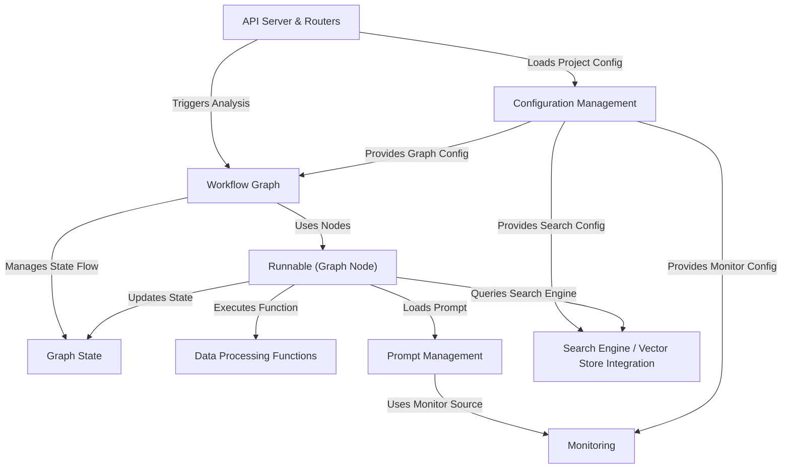

# Tutorial: llm-analytics

`llm-analytics` is a system designed to analyze content, like call transcripts, using **Large Language Models (LLMs)**.
It allows users to define _custom analysis workflows_ using a configuration file. Data flows through a series of steps (nodes) in a graph, where each step might involve calling an LLM, running specific Python code for data cleaning, or searching a knowledge base. The system provides an API for easy integration and includes features for monitoring LLM performance and managing prompts.

**Source Repository:** [None](None)

## Chapters

1. [Configuration Management
   ](01_configuration_management_.md)
2. [Workflow Graph
   ](02_workflow_graph_.md)
3. [API Server & Routers
   ](03_api_server___routers_.md)
4. [Runnable (Graph Node)
   ](04_runnable__graph_node__.md)
5. [Graph State
   ](05_graph_state_.md)
6. [Prompt Management
   ](06_prompt_management_.md)
7. [Search Engine / Vector Store Integration
   ](07_search_engine___vector_store_integration_.md)
8. [Data Processing Functions
   ](08_data_processing_functions_.md)
9. [Monitoring
   ](09_monitoring_.md)

---

Generated by [AI Codebase Knowledge Builder](https://github.com/The-Pocket/Tutorial-Codebase-Knowledge)
